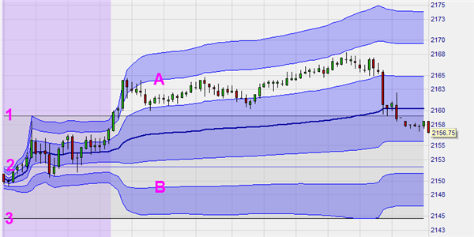

Algorithmic trading has fundamentally transformed financial markets by introducing advanced methods for trade execution. Among the most prominent techniques within algorithmic trading are the Volume Weighted Average Price (VWAP) and Time Weighted Average Price (TWAP) algorithms. These algorithms are critical for institutional traders and hedge funds because they minimize the market impact often associated with large orders and enhance trade execution efficiency.

VWAP and TWAP algorithms offer structured approaches to executing transactions that can benefit traders by helping them avoid significant price disruptions. VWAP focuses on executing trades in alignment with market volume over a designated timeframe, while TWAP schedules orders evenly across a specified period without regard to volume fluctuations. Such strategies are pivotal in accomplishing optimal execution, particularly for large trading orders, which could otherwise destabilize the market price if executed traditionally.

This article aims to provide an in-depth examination of VWAP and TWAP strategies, examining their applications, benefits, and potential limitations within the framework of algorithmic trading. Understanding these strategies can significantly enhance a trader's ability to execute orders with greater efficiency and yield more favorable outcomes. Before delving deeper into these specific strategies, it is important to first explore what algorithmic trading entails and why it holds such significance in contemporary trading environments.

## Table of Contents

## Understanding Algorithmic Trading

Algorithmic trading is the practice of leveraging algorithmic programs to execute trades according to predefined criteria. This approach allows traders to efficiently handle large volumes of orders, utilizing computer programs that analyze market data, execute trades, and make rapid decisions—often at speeds that surpass human capability. A key characteristic of algorithmic trading is its capability to automate the complex decision-making process involved in trade execution, thereby reducing the likelihood of human error and ensuring consistent execution.

The importance of algorithmic trading is highlighted by its widespread adoption in financial markets. It is estimated that over 80% of stock trades in the United States are executed algorithmically. This widespread use can be attributed to the many advantages algorithmic trading offers, such as reduced transaction costs and enhanced execution speed and precision. By automating the trading process, these algorithms minimize the market impact of large orders and enable more precise timing in trade execution.

Execution algorithms like Volume Weighted Average Price (VWAP) and Time Weighted Average Price (TWAP) play a crucial role in the algorithmic trading strategy. These algorithms are particularly beneficial when executing large orders as they help mitigate significant price disruptions. VWAP focuses on executing trades in line with market volume, targeting average execution prices close to daily market activity. On the other hand, TWAP aims to distribute trades evenly over time, ensuring consistent exposure throughout the trading day, regardless of market volume fluctuations.

These algorithms enable traders to execute large trades with minimal market disruption, offering a strategic advantage in maintaining optimal trading performance. As [algorithmic trading](/wiki/algorithmic-trading) continues to evolve, it remains an integral component of modern trading environments, driving efficiency and precision in trade execution.

## Volume Weighted Average Price (VWAP)

The Volume Weighted Average Price (VWAP) is a pivotal algorithmic trading strategy designed to execute trades in harmony with the market's [volume](/wiki/volume-trading-strategy) distribution over a designated time frame. This execution method is calculated by taking the total dollar value of all executed trades and dividing it by the total number of shares traded during the same period. The formula can be expressed as:

$$
\text{VWAP} = \frac{\sum (Price_i \times Volume_i)}{\sum Volume_i}
$$

where $Price_i$ and $Volume_i$ represent the price and traded volume of the ith transaction, respectively. This calculation provides a benchmark price reflecting the average price a security has traded at throughout the day, based on both price and volume.

VWAP is particularly advantageous for institutional trading desks and mutual funds, as it seeks to minimize market impact by synchronizing trades with the market's inherent volume patterns. By executing orders in line with these patterns, large trades can be distributed more effectively across the market to avoid significant price deviations, which can be detrimental when handling substantial trading volumes.

The primary strength of the VWAP strategy lies in its focus on volume, which aligns trades with periods of higher [liquidity](/wiki/liquidity-risk-premium). This is beneficial when executing large orders, as it reduces the likelihood of influencing the security's price unfavorably due to the sheer volume of the transaction.

Despite its benefits, VWAP's reliance on historical volume data can pose a limitation. The algorithm does not account for real-time market fluctuations that may occur due to unexpected news or events, potentially leading to execution that is misaligned with current market conditions. Traders should be aware of this limitation and consider complementing VWAP with other strategies or real-time data analyses to ensure more adaptive trade execution.

## Time Weighted Average Price (TWAP)

Time Weighted Average Price (TWAP) is a fundamental strategy in algorithmic trading, designed to execute orders evenly across a specified period without taking market volume into account. This systematic approach divides a large order into smaller, equally distributed trades that are executed throughout the trading session. The core objective of TWAP is to achieve an average execution price over time, offering a predictable and reliable method for order execution.

The TWAP strategy is particularly advantageous for scenarios where predictable price movements are desired. By distributing trades evenly over time, TWAP minimizes the risk of significant market impact and avoids drastic price deviations that can occur when large orders are executed all at once. This makes TWAP an attractive choice for traders looking to maintain a consistent market presence without exerting undue influence on the market price.

TWAP is implemented through simple algorithms that split the total order quantity evenly across the pre-defined period. The formula for TWAP can be expressed as:

$$
\text{TWAP} = \frac{1}{T} \sum_{t=1}^{T} P_t
$$

where $T$ represents the total number of time intervals over which the order is executed, and $P_t$ is the price at each interval $t$. The algorithm calculates the average of these prices to determine the TWAP.

This strategy's simplicity, however, comes with limitations. While TWAP is effective in reducing market impact during execution, it may not be as adaptable to sudden market changes compared to volume-based strategies like VWAP. TWAP's reliance on time intervals does not account for fluctuations in market volume, potentially leading to less optimal execution if significant volume spikes or drops occur during the execution period.

Despite these limitations, TWAP remains a robust tool in the arsenal of algorithmic trading, particularly in stable markets where market volume is less volatile and time precision in trade execution is prioritized. Traders often strategically choose between TWAP and other algorithms like VWAP based on the specific goals and conditions of their trading strategies.

## Comparison and Use Cases of VWAP and TWAP

VWAP and TWAP are two execution algorithms integral to algorithmic trading, each offering distinct advantages tailored to specific trading scenarios. VWAP, or Volume Weighted Average Price, accentuates the role of trading volume in its calculations. It aims to execute trades in proportion to the market's volume distribution across a trading session, thereby aligning execution with liquidity availability. This makes it particularly advantageous in markets with predictable volume patterns, where achieving a better average price by adhering to volume trends is crucial. For large institutional orders, VWAP can minimize market impact by dispersing trades in line with existing market activity, aiding in maintaining price stability.

On the other hand, the Time Weighted Average Price (TWAP) strategy operates independently of market volume, focusing instead on the time component. Its straightforward approach entails dividing a large order into smaller, consistent trades executed evenly across a specified period. This temporal distribution ensures that trades are executed systematically, thus maintaining an average price over the given timeframe. TWAP becomes notably effective in stable market conditions where [volatility](/wiki/volatility-trading-strategies) is low, and precise timing is essential for order fulfillment. Its reliance on time rather than volume makes it less reactive to sudden market fluctuations but provides a predictable framework for execution.

Choosing between VWAP and TWAP depends on various factors such as order size, market characteristics, and the specific objectives of the trade. VWAP is suitable when the priority is to maintain equilibrium with market liquidity, especially in environments where trading volumes are reliable. Conversely, TWAP is preferable when the goal is to have consistent exposure over time, regardless of market volume dynamics. Traders must assess market conditions and their trading goals when selecting between these algorithms, ensuring alignment between strategy characteristics and execution requirements.

## Challenges and Future Trends

Challenges faced in the implementation of Volume Weighted Average Price (VWAP) and Time Weighted Average Price (TWAP) algorithms predominantly stem from their reliance on historical data and their limited flexibility in adapting to real-time market changes. VWAP, by design, is dependent on historical volume patterns to execute trades effectively, while TWAP operates by uniformly distributing trades over a specified time period, often ignoring immediate market shifts. Such dependency means that these strategies may underperform in volatile markets where conditions can change rapidly.

To enhance the adaptability of these algorithms, there is a significant trend towards integrating [artificial intelligence](/wiki/ai-artificial-intelligence) (AI) and [machine learning](/wiki/machine-learning) (ML) in algorithmic trading. These technologies enable the development of adaptive algorithms capable of learning from real-time data and optimizing trade execution dynamically. By utilizing AI and ML, execution algorithms can potentially fine-tune their parameters in response to live market conditions, thereby reducing susceptibility to static historical trends.

Quantum computing represents another potential breakthrough for the future of algorithmic trading. Its capability to perform complex computations at unprecedented speeds could revolutionize the algorithm design landscape. Quantum algorithms might provide solutions to optimization problems currently deemed infeasible for classical computing, facilitating the rapid processing of immense data volumes and the recalibration of execution strategies that align more closely with real-time market dynamics.

Regulatory changes are also anticipated to play a pivotal role in shaping the future of execution algorithms. Increasing scrutiny over trading practices underscores the need for compliance with new standards that prioritize market stability and robust risk management. Furthermore, there is an emerging focus on sustainable trading practices, urging the development of algorithms that align with ethical and environmentally conscious guidelines.

Technological advancement will continuously enhance the precision and effectiveness of execution algorithms like VWAP and TWAP. As computational power grows and analytics tools become more sophisticated, traders expect greater accuracy in prediction models and execution efficiency. Embracing these innovations, execution algorithms may transform into more resilient systems that merge traditional financial theories with cutting-edge technology.

## Conclusion

Volume Weighted Average Price (VWAP) and Time Weighted Average Price (TWAP) represent fundamental strategies in algorithmic trading, designed to facilitate the efficient execution of large orders. Both algorithms address the need for tactful trading by optimizing order execution and minimizing market impact.

VWAP operates by aligning trade execution with prevailing market volume patterns. By calculating the total dollar value of trades during a specific period and dividing it by the total volume of shares traded, VWAP provides a benchmark for assessing trade quality. This characteristic is particularly advantageous to institutional traders who aim to execute large trades without significantly altering market prices. However, a reliance on historical data means that VWAP may not always reflect real-time market conditions, posing a limitation in rapidly changing environments.

On the other hand, TWAP emphasizes the temporal distribution of trades by executing smaller, consistent trades throughout a specified time frame. This predictability allows traders to maintain market stability and avoid significant price disturbances – a crucial feature when market volumes are uncertain. Nevertheless, TWAP's inflexibility in adapting to market fluctuations can be seen as a disadvantage when immediate responsiveness is required.

The understanding of both VWAP and TWAP, including their operational mechanisms and inherent limitations, empowers traders to tailor their strategies effectively. As technology progresses, these algorithms are increasingly integrating advancements in artificial intelligence and machine learning. Such innovations promise greater adaptability and optimization, ensuring these tools remain relevant despite evolving market conditions.

For traders and financial institutions, staying informed about trends and advancements in execution algorithms is critical. Incorporating VWAP and TWAP into trading strategies not only optimizes performance but also mitigates risks associated with large-order executions. In conclusion, leveraging these algorithms can enhance traditional trading methods and reinforce competitive advantage in the dynamic landscape of algorithmic trading.

## References & Further Reading

[1]: Johnson, B., & Hsu, C. (2013). ["Algorithmic Trading and DMA: An Introduction to Direct Access Trading Strategies"](https://www.semanticscholar.org/paper/Algorithmic-trading-%26-DMA-%3A-an-introduction-to-Johnson/aa5de1ab883d5e23b6651faa7c1807586d688e4b). 4Myeloma Press.

[2]: Kissell, R. (2013). ["The Science of Algorithmic Trading and Portfolio Management"](https://www.sciencedirect.com/book/9780124016897/the-science-of-algorithmic-trading-and-portfolio-management). Academic Press.

[3]: ["VWAP Strategies: A Compilation of Strategies and Algorithms"](https://guides.pm-research.com/content/iijtrading/2002/1/32) by A. Sotiropoulos.

[4]: Aldridge, I. (2013). ["High-Frequency Trading: A Practical Guide to Algorithmic Strategies and Trading Systems"](https://www.ahmetbeyefendi.com/wp-content/uploads/2020/07/High-Frequency-Trading-Irene-Aldridge.pdf). Wiley.

[5]: Gomber, P., Arndt, B., Lutat, M., & Uhle, T. (2011). ["High-Frequency Trading"](https://papers.ssrn.com/sol3/papers.cfm?abstract_id=1858626) in IT - Information Technology: Methoden und innovative Anwendungen der Informatik und Informationstechnik, 53(1).