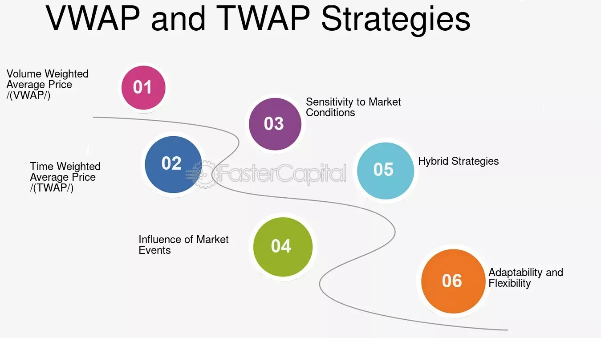

## Table of Contents

## What does VWAP stand for and how is it calculated?

VWAP stands for Volume Weighted Average Price. It's a way to measure the average price of a stock, but it takes into account how many shares were traded at each price. This makes it different from a simple average price because it gives more weight to prices where more shares were traded.

To calculate VWAP, you start by multiplying the price of the stock at each trade by the number of shares traded at that price. You do this for every trade during the day. Then, you add up all these numbers. After that, you add up the total number of shares traded during the day. Finally, you divide the first total by the second total. This gives you the VWAP, which traders use to see if they are getting a good price for a stock.

## What does TWAP stand for and how is it calculated?

TWAP stands for Time Weighted Average Price. It's a way to find out the average price of a stock over a certain time, but it doesn't care about how many shares were traded at each price. It's simpler than VWAP because it treats every price the same, no matter how many shares were bought or sold at that price.

To calculate TWAP, you add up all the prices of the stock at set times during the day. Then, you divide this total by the number of times you checked the price. For example, if you checked the price every hour and added up all those prices, you would divide by the number of hours to get the TWAP. This helps traders see the average price over time, which can be useful for making trading decisions.

## How do VWAP and TWAP differ from each other?

VWAP and TWAP are both used to figure out the average price of a stock, but they do it in different ways. VWAP, or Volume Weighted Average Price, takes into account how many shares were traded at each price. This means that if a lot of shares were traded at a certain price, that price has a bigger impact on the VWAP. It's like saying, "This price matters more because more people bought or sold at this price." So, VWAP gives a better idea of the average price when you care about how many shares were traded.

On the other hand, TWAP, or Time Weighted Average Price, doesn't care about how many shares were traded. It just looks at the price of the stock at different times during the day. If you check the price every hour, TWAP adds up all those prices and then divides by the number of times you checked. This gives you an average price over time, but it treats every price the same, no matter how many shares were bought or sold at that time. TWAP is simpler and is useful when you just want to know the average price over a certain period without worrying about trading volume.

## In what scenarios would a trader use a VWAP strategy?

A trader might use a VWAP strategy when they want to buy or sell a lot of shares without making the stock price move too much. They can use VWAP to figure out if they are getting a good price compared to what most other people are paying. If the current price is below the VWAP, it might be a good time to buy because they could be getting a better deal than the average. If the price is above the VWAP, it might be a good time to sell because they could be selling at a higher price than the average.

Another time a trader might use VWAP is when they are trying to understand the market's overall direction. If the price of the stock stays above the VWAP for a long time, it might mean that the stock is in a strong upward trend. If the price stays below the VWAP, it might mean the stock is in a downward trend. This can help the trader make decisions about whether to buy or sell based on how the market is moving.

## In what scenarios would a trader use a TWAP strategy?

A trader might use a TWAP strategy when they want to buy or sell a stock over a certain time without making the price move too much. TWAP helps them do this by spreading out their trades evenly over time. For example, if a trader wants to buy a lot of shares, they can use TWAP to buy a little bit every hour. This way, they don't buy all at once and cause the price to go up a lot.

TWAP is also good when a trader just wants to know the average price of a stock over a certain time. They might not care about how many shares were traded at each price. For example, if a trader wants to see how the price of a stock changes throughout the day, they can check the price every hour and use TWAP to find the average. This can help them make decisions about when to buy or sell based on the average price over time.

## How can VWAP be used to assess the quality of a trade execution?

VWAP can help traders figure out if they got a good price when they bought or sold a stock. If a trader buys a stock at a price that is lower than the VWAP, it means they got a better deal than the average price that day. This is good because it shows they bought the stock for less than what most other people paid. On the other hand, if a trader sells a stock at a price that is higher than the VWAP, it means they sold it for more than the average price. This is also good because it shows they got more money for their stock than most other people did.

Traders can also use VWAP to see how well they did compared to the market. If a trader's average price for buying or selling a stock is close to the VWAP, it means their trade was executed well. They didn't pay much more or get much less than the average price, which is a sign of good trading. If their price is far away from the VWAP, it might mean they could have done better. By comparing their trade price to the VWAP, traders can learn how to make their trades more effective in the future.

## What are the limitations of using VWAP and TWAP strategies?

One limitation of using VWAP and TWAP strategies is that they both rely on historical data. They look at what happened in the past to figure out the average price. But, the stock market can change quickly. What was true a few hours ago might not be true now. So, using VWAP or TWAP might not always give you the best information about what is happening right now. Also, these strategies don't take into account big news or events that can suddenly change the price of a stock.

Another limitation is that VWAP and TWAP can be affected by big trades. If someone buys or sells a lot of shares all at once, it can change the VWAP a lot because it weighs the price by the volume. This means the VWAP might not show the true average price that most people are paying. TWAP can also be affected if the price changes a lot between the times you check it. If you check the price every hour and it goes up or down a lot in between, your TWAP might not be a good measure of the average price over time.

## How can a trader implement a VWAP strategy in their trading?

A trader can implement a VWAP strategy by using it as a benchmark for their trades. They can calculate the VWAP for a stock over a certain time, like a day, and then compare the current price of the stock to this VWAP. If the current price is below the VWAP, the trader might decide to buy the stock because they are getting a better price than the average. If the price is above the VWAP, they might decide to sell because they can get a higher price than the average. This helps them make sure they are getting a good deal on their trades.

Another way to use VWAP is to spread out trades over time to avoid moving the market too much. For example, if a trader wants to buy a lot of shares, they can use VWAP to guide when to buy. They might buy a little bit of the stock whenever the price is below the VWAP, so they don't buy all at once and cause the price to go up. This way, they can buy the stock at a better average price. By using VWAP, traders can make smarter decisions about when to buy or sell and how to do it without affecting the market too much.

## How can a trader implement a TWAP strategy in their trading?

A trader can use a TWAP strategy to buy or sell a stock over a certain time without making the price move too much. They can do this by breaking up their trades into smaller parts and spreading them out evenly over time. For example, if a trader wants to buy a lot of shares, they can use TWAP to buy a little bit every hour. This way, they don't buy all at once and cause the price to go up a lot. By using TWAP, the trader can make sure they get a good average price for their trades without affecting the market too much.

TWAP is also helpful when a trader just wants to know the average price of a stock over a certain time. They might not care about how many shares were traded at each price. To use TWAP, the trader can check the price of the stock at set times during the day, like every hour. They add up all these prices and then divide by the number of times they checked. This gives them the TWAP, which helps them see the average price over time. By using this average price, the trader can make better decisions about when to buy or sell the stock.

## What advanced techniques can be used to optimize VWAP strategies?

One way to make VWAP strategies better is by using different time frames. Instead of just looking at the VWAP for the whole day, a trader can look at the VWAP for smaller parts of the day, like every hour or every few minutes. This can help them see short-term trends and make better decisions about when to buy or sell. For example, if the price of the stock is below the hourly VWAP, the trader might decide to buy because they could be getting a better price than the average for that hour.

Another way to improve VWAP strategies is by using other indicators along with VWAP. Traders can use things like moving averages or the Relative Strength Index (RSI) to get more information about the stock. If the VWAP shows the stock is a good buy, but the RSI says the stock might be overbought, the trader can make a smarter decision. By combining VWAP with other tools, traders can get a fuller picture of the market and make their trades more effective.

## What advanced techniques can be used to optimize TWAP strategies?

One way to make TWAP strategies better is by changing the time intervals used to check the stock price. Instead of checking the price every hour, a trader can check it more often, like every 15 minutes or every few minutes. This can help them get a more accurate TWAP because they are looking at the price more often. By doing this, they can see smaller changes in the stock price and make better decisions about when to buy or sell. For example, if the price is lower than the TWAP during a short time period, the trader might decide to buy because they could be getting a better price than the average for that time.

Another way to improve TWAP strategies is by using them along with other trading tools. Traders can use things like moving averages or the Relative Strength Index (RSI) to get more information about the stock. If the TWAP shows the stock is a good buy, but the RSI says the stock might be overbought, the trader can make a smarter decision. By combining TWAP with other indicators, traders can get a fuller picture of the market and make their trades more effective. This way, they can use TWAP as a guide but also consider other factors that might affect the stock price.

## How do institutional traders use VWAP and TWAP in large volume trades?

Institutional traders use VWAP and TWAP to manage their large volume trades without causing big changes in the stock price. When they want to buy or sell a lot of shares, they can use VWAP to spread out their trades over the day. They look at the VWAP and try to buy or sell when the price is better than the average. This way, they can get a good price for their trades without making the stock price move too much. For example, if the price is below the VWAP, they might buy a little bit at a time to keep the price from going up too fast.

They also use TWAP to make sure their trades are spread out evenly over time. By checking the stock price at regular intervals, like every hour, they can use TWAP to guide when to trade. This helps them buy or sell a lot of shares without affecting the market too much. If they want to buy a lot of shares, they can buy a little bit every hour so the price doesn't go up all at once. Using TWAP helps them get a good average price for their large trades and keeps the market stable.

## What is Volume Weighted Average Price (VWAP)?

The Volume Weighted Average Price (VWAP) is a pivotal algorithmic trading strategy designed to execute trades in harmony with the market's [volume](/wiki/volume-trading-strategy) distribution over a designated time frame. This execution method is calculated by taking the total dollar value of all executed trades and dividing it by the total number of shares traded during the same period. The formula can be expressed as:

$$
\text{VWAP} = \frac{\sum (Price_i \times Volume_i)}{\sum Volume_i}
$$

where $Price_i$ and $Volume_i$ represent the price and traded volume of the ith transaction, respectively. This calculation provides a benchmark price reflecting the average price a security has traded at throughout the day, based on both price and volume.

VWAP is particularly advantageous for institutional trading desks and mutual funds, as it seeks to minimize market impact by synchronizing trades with the market's inherent volume patterns. By executing orders in line with these patterns, large trades can be distributed more effectively across the market to avoid significant price deviations, which can be detrimental when handling substantial trading volumes.

The primary strength of the VWAP strategy lies in its focus on volume, which aligns trades with periods of higher [liquidity](/wiki/liquidity-risk-premium). This is beneficial when executing large orders, as it reduces the likelihood of influencing the security's price unfavorably due to the sheer volume of the transaction.

Despite its benefits, VWAP's reliance on historical volume data can pose a limitation. The algorithm does not account for real-time market fluctuations that may occur due to unexpected news or events, potentially leading to execution that is misaligned with current market conditions. Traders should be aware of this limitation and consider complementing VWAP with other strategies or real-time data analyses to ensure more adaptive trade execution.

## What is Time Weighted Average Price (TWAP)?

Time Weighted Average Price (TWAP) is a fundamental strategy in algorithmic trading, designed to execute orders evenly across a specified period without taking market volume into account. This systematic approach divides a large order into smaller, equally distributed trades that are executed throughout the trading session. The core objective of TWAP is to achieve an average execution price over time, offering a predictable and reliable method for order execution.

The TWAP strategy is particularly advantageous for scenarios where predictable price movements are desired. By distributing trades evenly over time, TWAP minimizes the risk of significant market impact and avoids drastic price deviations that can occur when large orders are executed all at once. This makes TWAP an attractive choice for traders looking to maintain a consistent market presence without exerting undue influence on the market price.

TWAP is implemented through simple algorithms that split the total order quantity evenly across the pre-defined period. The formula for TWAP can be expressed as:

$$
\text{TWAP} = \frac{1}{T} \sum_{t=1}^{T} P_t
$$

where $T$ represents the total number of time intervals over which the order is executed, and $P_t$ is the price at each interval $t$. The algorithm calculates the average of these prices to determine the TWAP.

This strategy's simplicity, however, comes with limitations. While TWAP is effective in reducing market impact during execution, it may not be as adaptable to sudden market changes compared to volume-based strategies like VWAP. TWAP's reliance on time intervals does not account for fluctuations in market volume, potentially leading to less optimal execution if significant volume spikes or drops occur during the execution period.

Despite these limitations, TWAP remains a robust tool in the arsenal of algorithmic trading, particularly in stable markets where market volume is less volatile and time precision in trade execution is prioritized. Traders often strategically choose between TWAP and other algorithms like VWAP based on the specific goals and conditions of their trading strategies.

## References & Further Reading

[1]: Johnson, B., & Hsu, C. (2013). ["Algorithmic Trading and DMA: An Introduction to Direct Access Trading Strategies"](https://www.semanticscholar.org/paper/Algorithmic-trading-%26-DMA-%3A-an-introduction-to-Johnson/aa5de1ab883d5e23b6651faa7c1807586d688e4b). 4Myeloma Press.

[2]: Kissell, R. (2013). ["The Science of Algorithmic Trading and Portfolio Management"](https://www.sciencedirect.com/book/9780124016897/the-science-of-algorithmic-trading-and-portfolio-management). Academic Press.

[3]: ["VWAP Strategies: A Compilation of Strategies and Algorithms"](https://guides.pm-research.com/content/iijtrading/2002/1/32) by A. Sotiropoulos.

[4]: Aldridge, I. (2013). ["High-Frequency Trading: A Practical Guide to Algorithmic Strategies and Trading Systems"](https://www.ahmetbeyefendi.com/wp-content/uploads/2020/07/High-Frequency-Trading-Irene-Aldridge.pdf). Wiley.

[5]: Gomber, P., Arndt, B., Lutat, M., & Uhle, T. (2011). ["High-Frequency Trading"](https://papers.ssrn.com/sol3/papers.cfm?abstract_id=1858626) in IT - Information Technology: Methoden und innovative Anwendungen der Informatik und Informationstechnik, 53(1).