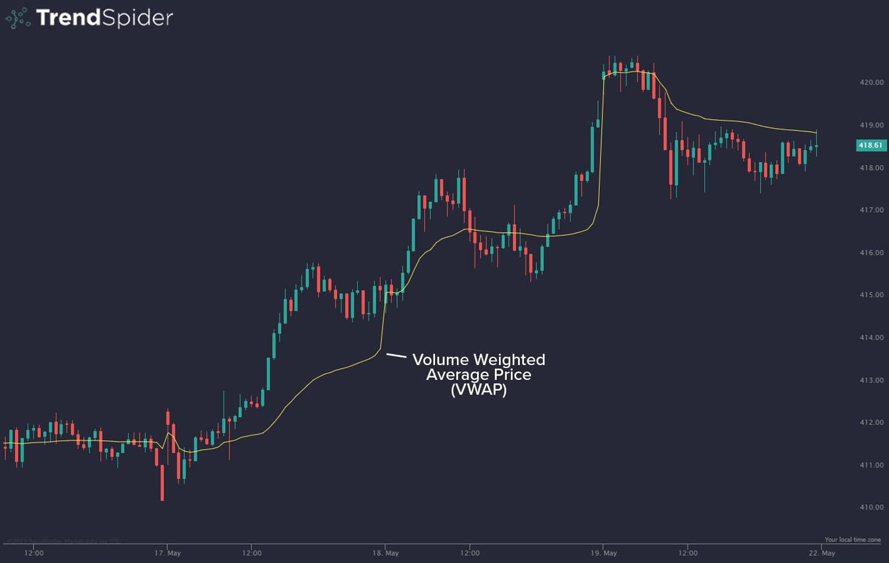

In algorithmic trading, the Volume Weighted Average Price (VWAP) serves as an essential instrument for traders seeking to execute large orders with precision. VWAP provides a benchmark by calculating the average price at which a security trades throughout a specific period, adjusted for the trading volumes involved. This measurement is crucial as it accommodates the dynamic nature of market prices and the influence of traded volumes.

Both retail and institutional traders utilize VWAP extensively for benchmarking trade executions. Retail traders may rely on it to ensure trades are made at advantageous price levels, while institutional traders leverage it to minimize the market impact of large order executions. By comparing trade execution against VWAP, traders can evaluate whether their transactions occur at favorable prices or adjust strategies to improve outcomes.



The understanding and application of VWAP extend beyond simple benchmark utility. It offers insights into optimal trade timing, allowing traders to detect market trends. Prices trading above the VWAP often indicate a bullish trend, while prices below suggest a bearish trend. These insights enable traders to enhance trade execution strategies by aligning orders with observed market conditions.

This article explores VWAP's detailed aspects, its role in algorithmic trading, and how it can be effectively combined with news trading strategies. Through a comprehensive understanding of VWAP, traders can better interpret market conditions, aid in the timing of their trades, and refine their overall trading strategies.

## Table of Contents

## What is VWAP?

VWAP, or Volume Weighted Average Price, is a prominent trading algorithm employed to calculate the mean price of a security by incorporating both the price and the volume over a specified time period. The primary objective of VWAP is to offer a reliable benchmark for traders, facilitating the assessment of whether securities are being bought or sold at favorable prices relative to the average trading day.

The calculation of VWAP is relatively straightforward. The formula involves two main components: the sum of the dollar traded for each transaction and the total volume traded. Mathematically, VWAP is expressed as follows:

$$
\text{VWAP} = \frac{\sum{(P_i \times V_i)}}{\sum{V_i}}
$$

where $P_i$ represents the price of each transaction, and $V_i$ denotes the volume of each transaction. By multiplying each transaction price by its corresponding volume and accumulating these products, and then dividing by the cumulative volume, traders obtain the VWAP value.

This resultant VWAP serves as a critical reference point for traders, enabling them to benchmark their execution prices against the average market price throughout the trading period. A VWAP reading that is higher than the execution price suggests a beneficial buying opportunity, while an execution price above the VWAP indicates advantageous selling conditions.

VWAP is frequently likened to a moving average due to its trend-identification capabilities. When the current price of a security is above the VWAP, it typically signals an uptrend, indicating a period where buyers dominate. Conversely, when the price is below the VWAP, it often points to a downtrend, suggesting selling pressure in the market. Thus, VWAP not only acts as a benchmark for price execution but also assists in discerning prevailing market trends.

## Historical Context and Development

Volume Weighted Average Price (VWAP) emerged in the 1980s as a response to the need for a reliable benchmark in trade execution, primarily catering to institutional investors. These investors required a method to evaluate the effectiveness of their transactions, particularly when handling large orders that could significantly sway market prices. The simplicity and effectiveness of VWAP calculations contributed to its rapid adoption among investment professionals.

The calculation of VWAP involves a straightforward yet insightful formula: it multiplies each trade's price by the total number of shares traded for that transaction. This product is summed for all trades during a given period and then divided by the total [volume](/wiki/volume-trading-strategy) traded in that time. Mathematically, VWAP is expressed as:

$$
\text{VWAP} = \frac{\sum (P_i \times Q_i)}{\sum Q_i}
$$

where $P_i$ is the price of trade $i$ and $Q_i$ is the quantity of shares traded in trade $i$.

This method offers a clear and intuitive measure of average pricing that reflects actual trading conditions. As VWAP provides a view of the average price weighted by volume, it helps traders understand where their executions fall relative to the daily trading activity. 

The adoption of VWAP solidified its reputation as a market standard because it efficiently minimizes the market impact costs associated with executing large orders. By referencing VWAP, traders can align their trading strategies more closely with prevailing market conditions, reducing slippage and optimizing execution prices. Over time, VWAP has evolved beyond its initial use as a measure for institutional trading efficiency. Its application broadened as a benchmark for trading strategies that aim to improve price execution, reducing the potential adverse effects of large trades on security prices. 

Overall, the development of VWAP represents a pivotal enhancement in trading metrics, marking a shift towards more analytical and data-driven approaches in securities trading.

## How Traders Use VWAP

Traders use the Volume Weighted Average Price (VWAP) as a critical tool for benchmarking trade executions and confirming market trends. VWAP serves as a reference point, allowing traders to assess whether their trading performance aligns favorably with the average market price. It is particularly beneficial for optimizing trade timing and improving the overall execution strategy.

One common strategy involves using VWAP as a threshold for trade timing. Traders often purchase securities when their prices fall below the VWAP and sell when prices rise above it. This approach leverages the concept of mean reversion, where prices are expected to return to the average value over time. By buying below the VWAP and selling above it, traders aim to capitalize on short-term price deviations, potentially profiting from the closing gap between market prices and the VWAP benchmark.

In addition to timing trades, VWAP is instrumental in minimizing market impact when executing large orders. Large transactions tend to affect the market prices due to increased demand or supply. VWAP helps mitigate this impact by distributing large orders over time, aligning with periods when market conditions are favorable. Traders monitor VWAP readings to identify these optimal execution windows, ensuring that large trades are completed without significantly influencing market prices. By spreading the execution throughout the trading day, traders aim to achieve a price close to the VWAP, thus ensuring cost efficiency and reducing slippage.

VWAP's utility in these strategies underscores its importance for traders seeking to refine their executions and improve profitability. However, it is essential to consider VWAP in conjunction with other market indicators and factors to enhance decision-making and adapt to varying market conditions.

## Limitations of VWAP

VWAP, or Volume Weighted Average Price, is a popular trading tool that can provide valuable insights into a security's price movement throughout a trading day. Despite its widespread use, VWAP has several limitations that traders should consider.

Firstly, VWAP is a lagging indicator, relying on historical data to determine its value. This characteristic means it may not respond adequately to rapid market changes. In fast-paced environments, significant price shifts can occur quickly, rendering VWAP less effective in capturing the current market sentiment. Traders relying exclusively on VWAP might find themselves reacting to outdated information, leading to potentially suboptimal decision-making.

Additionally, VWAP's reliability diminishes in low volume markets. In such contexts, a few sizable transactions can disproportionately influence the average, resulting in distorted VWAP values. This distortion may mislead traders about the true market trend, causing them to enter or [exit](/wiki/exit-strategy) positions based on unreliable data. For instance, a single large trade in an illiquid stock might skew the VWAP, suggesting a price level that does not accurately reflect the market.

Moreover, depending solely on VWAP without incorporating other market factors or indicators can lead to incomplete analyses. Markets are influenced by a myriad of factors, including macroeconomic data, geopolitical events, and market sentiment. These elements can cause significant price movements that VWAP alone might not adequately account for. Thus, while VWAP can serve as a useful benchmark for trade execution, it should be complemented with additional analysis tools, such as moving averages, relative strength index (RSI), or price action patterns to formulate a more robust trading strategy.

In conclusion, while VWAP is advantageous for understanding average prices and guiding trade executions, traders should be aware of its limitations. By considering additional market indicators and conditions, traders can achieve a more comprehensive market understanding and improve their trading outcomes.

## Enhancing VWAP with News Trading Strategies

To overcome the inherent limitations of the Volume Weighted Average Price (VWAP) as a lagging indicator, traders can enhance their trading strategies by integrating news trading techniques. These methods leverage the timely release of economic data and news events to identify immediate trading opportunities. News trading strategies focus on reacting swiftly to significant market developments that can induce [volatility](/wiki/volatility-trading-strategies), allowing traders to capitalize on swift price movements.

News trading takes advantage of information such as central bank announcements, geopolitical events, earnings reports, and other high-impact data releases. These events often lead to sharp price fluctuations that can open up temporary [arbitrage](/wiki/arbitrage) opportunities or signal shifts in market sentiment. By combining news trading with VWAP, traders can develop a more nuanced view of the market, leveraging both the technical insight provided by VWAP and the real-time dynamism introduced by news events.

The synergy between VWAP and news trading is particularly beneficial in aligning trades with both technical benchmarks and prevailing market dynamics. For instance, traders can use VWAP to determine whether the current market price offers a beneficial trading entry or exit point compared to the day’s average price, while news events can provide the catalyst for breaking these levels. This dual approach enables traders to make more informed decisions, potentially increasing the probability of successful trades.

To implement a combined strategy, traders may design an [algorithmic trading](/wiki/algorithmic-trading) system that monitors VWAP levels alongside real-time news feeds. A simple implementation can use Python libraries like `pandas` and `requests` for data handling and news API integration, respectively. For example:

```python
import pandas as pd
import requests

# Function to fetch VWAP data
def calculate_vwap(prices, volumes):
    return (prices * volumes).sum() / volumes.sum()

# Fetch real-time news data (this is a generic example, adjust according to specific API)
def fetch_news(api_url):
    response = requests.get(api_url)
    news_data = response.json()
    return news_data

# Example usage
prices = pd.Series([100, 102, 101, 103])
volumes = pd.Series([10, 15, 20, 25])
vwap = calculate_vwap(prices, volumes)
news_api_url = 'https://newsapi.org/v1/articles?source=financial-times'
news = fetch_news(news_api_url)

print(f"VWAP: {vwap}")
print("Recent News Headlines:", news['articles'])
```

This strategy effectively integrates VWAP's price benchmarking ability with the insights gained from immediate news reactions, enabling traders to respond adeptly in fluctuating market conditions. By adopting such a comprehensive approach, traders can refine their methodologies to include both technical and fundamental analyses, potentially leading to improved trade outcomes and risk management.

## Conclusion

Volume Weighted Average Price (VWAP) is recognized as an essential analytical tool for traders aiming to benchmark prices and improve trade execution efficiency. However, its utility is limited when used in isolation as traders must consider broader market strategies to fully capitalize on trading opportunities. By integrating strategies such as news-based trading alongside VWAP, traders can enhance their approach and potentially boost profitability. For instance, news-based trading, which leverages economic announcements and significant market-moving events, can offer real-time insights that, when combined with the technical insights gained from VWAP, form a more comprehensive trading plan.

Understanding the inherent strengths and limitations of VWAP is vital for traders aiming to navigate dynamic market conditions effectively. VWAP is beneficial in identifying average trading price points and market trends, yet it is inherently lagging and solely reflects past data. Consequently, relying entirely on VWAP without acknowledging real-time market fluctuations and other influential economic factors can lead to misguided trading choices. By also considering news-based strategies, traders can respond more agilely to market volatility induced by external events.

Strategically combining VWAP with a broader analytical framework allows traders to execute trades that align not only with technical benchmarks but also with fundamental market analysis. This dual approach ensures that trades are executed with a thorough understanding of both historical data trends and immediate market movements, optimizing both trade timing and execution in continually evolving market landscapes.

## References & Further Reading

[1]: Chan, E. (2008). ["Quantitative Trading: How to Build Your Own Algorithmic Trading Business."](https://github.com/ftvision/quant_trading_echan_book) John Wiley & Sons.

[2]: Arnuk, S., & Saluzzi, J. (2012). ["Broken Markets: How High Frequency Trading and Predatory Practices on Wall Street are Destroying Investor Confidence and Your Portfolio."](https://ptgmedia.pearsoncmg.com/images/9780132875240/samplepages/0132875241.pdf) FT Press.

[3]: Lopez de Prado, M. (2018). ["Advances in Financial Machine Learning."](https://www.amazon.com/Advances-Financial-Machine-Learning-Marcos/dp/1119482089) Wiley.

[4]: Jiminy, J. (2017). ["Algorithmic and High-Frequency Trading."](https://api.pageplace.de/preview/DT0400.9781316455579_A25606943/preview-9781316455579_A25606943.pdf) Cambridge University Press.

[5]: Jansen, S. (2020). ["Machine Learning for Algorithmic Trading: Predictive models to extract signals from market and alternative data for systematic trading strategies with Python."](https://github.com/stefan-jansen/machine-learning-for-trading) Packt Publishing.