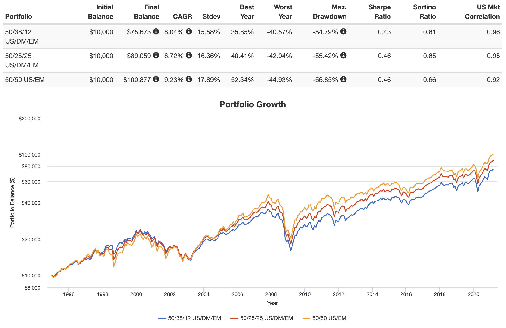

## Table of Contents

## What is the Vanguard International Stock ETF (VXUS)?

The Vanguard International Stock ETF (VXUS) is a type of investment fund that allows you to own a small piece of many different companies from around the world, except for those in the United States. It's like buying a basket of international stocks all at once. This ETF is managed by Vanguard, a well-known company that helps people invest their money. By investing in VXUS, you get to spread your money across thousands of companies in different countries, which can help reduce the risk compared to putting all your money into just one or a few stocks.

VXUS is popular because it's a simple and cost-effective way to invest in international markets. It tracks a broad index, which means it tries to match the performance of a large group of international stocks. This approach can help your investment grow over time as these companies grow. Plus, the fees for owning VXUS are very low, which means more of your money stays invested and working for you. So, if you want to diversify your investments beyond the U.S. and keep costs down, VXUS could be a good choice for you.

## What are the main investment objectives of VXUS?

The main goal of the Vanguard International Stock ETF (VXUS) is to give you a way to invest in many different companies from all over the world, except for those in the United States. By doing this, VXUS helps you spread your money across a lot of different places and types of businesses. This spreading out, or diversification, can help make your investment less risky because it's not all tied to the success of just one company or country.

Another important objective of VXUS is to keep the costs of investing low. Vanguard makes sure that the fees you pay for owning VXUS are very small. This means more of your money can stay invested and work to grow over time. By keeping costs down and focusing on a broad range of international stocks, VXUS aims to help your investment grow steadily in the long run.

## How does VXUS differ from other international ETFs?

VXUS is different from other international ETFs mainly because it covers a very wide range of companies from all over the world, except the U.S. It includes stocks from both developed markets like Europe and Japan, and emerging markets like China and Brazil. This broad coverage means you get a lot of diversification, which can help reduce risk. Other international ETFs might focus only on certain regions or types of companies, so they might not give you as much spread.

Another way VXUS stands out is its low cost. Vanguard is known for keeping fees low, and VXUS is no exception. The expense ratio, which is the yearly fee you pay to own the [ETF](/wiki/etf-trading-strategies), is very small compared to many other international ETFs. This means more of your money stays invested and can grow over time. Some other international ETFs might have higher fees, which can eat into your returns.

Lastly, VXUS tracks a broad market index, which means it tries to match the performance of a large group of international stocks. This approach is often called passive investing, and it's different from ETFs that might try to beat the market by [picking](/wiki/asset-class-picking) specific stocks or using other strategies. This passive approach can be simpler and more predictable, which many investors like. Other international ETFs might use different strategies, like focusing on [growth stocks](/wiki/growth-stocks) or value stocks, which can lead to different results and risks.

## What types of stocks are included in the VXUS portfolio?

The Vanguard International Stock ETF (VXUS) includes a wide variety of stocks from companies all over the world, except for those in the United States. This means you'll find stocks from big, well-known companies in places like Europe and Japan, as well as from smaller, growing companies in emerging markets like China and Brazil. The ETF covers many different industries, so you get a mix of companies that make things like cars, technology, and consumer goods, as well as companies in healthcare, finance, and more.

VXUS is designed to give you a broad view of the international stock market. It includes stocks from both developed countries, which are places with strong economies and stable governments, and emerging markets, which are countries that are still growing and developing. This mix helps spread out your investment across different types of economies and companies, which can make your investment less risky. By owning a piece of so many different companies, you get to benefit from their growth and success over time.

## What are the geographical allocations of VXUS?

The Vanguard International Stock ETF (VXUS) spreads its investments across many different countries around the world, except for the United States. A big part of VXUS is invested in developed countries like Japan, the United Kingdom, Canada, and countries in Europe. These places have strong economies and stable governments, so they make up a large portion of the ETF.

VXUS also includes investments in emerging markets, which are countries that are still growing and developing. This includes places like China, India, Brazil, and South Korea. These countries might not be as stable as developed markets, but they have a lot of potential for growth. By including both developed and emerging markets, VXUS helps spread out the risk and gives you a chance to benefit from growth in different parts of the world.

## How has VXUS performed historically compared to similar ETFs?

The Vanguard International Stock ETF (VXUS) has done well over time, but how it stacks up against other similar ETFs can change from year to year. Over the long run, VXUS has given investors good returns, growing their money steadily. It's a bit like a slow and steady racehorse that keeps moving forward. When you compare it to other international ETFs, like the iShares MSCI ACWI ex U.S. ETF (ACWX) or the Schwab International Equity ETF (SCHF), you'll see that VXUS often has similar returns. But because VXUS has very low fees, more of your money stays invested and can grow over time.

In some years, VXUS might do better than other ETFs, and in other years, it might not do as well. This is because it covers a very wide range of companies from all over the world, which can help smooth out the ups and downs. For example, if one part of the world is having a tough time, other parts might be doing better, and VXUS can benefit from that. Other ETFs might focus more on certain regions or types of companies, so their performance can be more up and down. Overall, VXUS is a good choice if you want a broad, low-cost way to invest in international stocks and are looking for steady growth over the long term.

## What are the expense ratios and fees associated with VXUS?

The expense ratio for the Vanguard International Stock ETF (VXUS) is very low. It's only 0.07% per year. This means if you have $10,000 invested in VXUS, you'll pay just $7 in fees each year. This low cost is one of the reasons why many people choose VXUS. It helps your money grow more because you're not losing much to fees.

There are no other fees for owning VXUS, like sales loads or redemption fees. You only need to think about the expense ratio. This makes it simple and easy to understand how much it costs to invest in VXUS. Keeping costs low is important because it means more of your money stays invested and can work to grow over time.

## What are the potential risks of investing in VXUS?

Investing in VXUS comes with some risks you should know about. One big risk is that the value of the stocks in VXUS can go up and down a lot. This is because it includes stocks from all over the world, and different countries can have different problems. For example, if a country's economy is doing badly, the stocks from that country might lose value. This can affect the overall value of VXUS.

Another risk is that changes in currency values can impact your investment. Since VXUS invests in companies outside the U.S., the value of your investment can change if the U.S. dollar gets stronger or weaker compared to other currencies. If the dollar gets stronger, it might make your investment worth less when you convert it back to dollars. Also, even though VXUS spreads your money across many different companies and countries, there's still a chance that many of them could do badly at the same time, which could hurt your investment.

## How does currency risk affect investments in VXUS?

Currency risk can affect your investment in VXUS because the ETF holds stocks from companies all over the world, except the U.S. When you invest in VXUS, you're buying stocks in different currencies. If the U.S. dollar gets stronger compared to those other currencies, the value of your investment might go down when you convert it back to dollars. This means even if the stocks in VXUS are doing well, you might still lose money because of changes in currency values.

On the other hand, if the U.S. dollar gets weaker compared to other currencies, it can help your investment in VXUS. When you convert the value of those foreign stocks back to dollars, they might be worth more. So, currency risk can make your investment go up or down, depending on how the U.S. dollar is doing compared to other currencies. It's something to think about when you're investing in international stocks like those in VXUS.

## What is the impact of market volatility on VXUS?

Market [volatility](/wiki/volatility-trading-strategies) can make the value of VXUS go up and down a lot. This happens because VXUS includes stocks from many different countries around the world. When the stock markets in these countries are going through ups and downs, it can affect the overall value of VXUS. For example, if there's a big drop in the stock market in Europe or Asia, it can pull down the value of VXUS, even if other parts of the world are doing okay.

Even though VXUS is spread out across many different companies and countries, it can still be affected by big events that shake the whole world's stock markets. Things like economic crises, political changes, or global events like pandemics can cause a lot of volatility. This means the value of your investment in VXUS can change a lot in a short time. But over the long run, this kind of ups and downs can smooth out, and VXUS can still help your money grow steadily.

## How can VXUS be used in a diversified investment portfolio?

VXUS can be a great part of a diversified investment portfolio because it lets you spread your money across many different companies and countries all over the world, except the U.S. By including VXUS in your portfolio, you're not putting all your eggs in one basket. If something goes wrong in one country or industry, your investment in VXUS might still be okay because it's spread out. This can help reduce the risk of losing a lot of money if one part of the market does badly.

Adding VXUS to your portfolio also helps you balance out your investments. If you already have a lot of money in U.S. stocks, adding VXUS can give you exposure to international markets. This way, if the U.S. market is having a tough time, the international stocks in VXUS might do better, and vice versa. Over time, this mix can help your overall investment grow more steadily and safely.

## What advanced strategies can be employed with VXUS for expert investors?

Expert investors can use VXUS in a few smart ways to make their investments work better. One way is to use it for tactical asset allocation. This means they might change how much of their money is in VXUS based on what's happening in the world. If they think international markets are going to do well, they might put more money into VXUS. If they think the U.S. market will do better, they might take some money out of VXUS and put it into U.S. stocks. This can help them take advantage of different market conditions and possibly make more money.

Another strategy is to use VXUS for hedging. This means they might use VXUS to protect their investments from big drops in the U.S. market. If they think the U.S. market might go down, they could put more money into VXUS. This way, if the U.S. market does go down, the international stocks in VXUS might not go down as much, or might even go up, helping to balance out their losses. This can make their overall investment less risky.

## References & Further Reading

[1]: FTSE Russell. (n.d.). ["FTSE Global All Cap ex US Index."](https://research.ftserussell.com/Analytics/Factsheets/Home/DownloadSingleIssue?issueName=GXUSS&IsManual=false) FTSE Russell.

[2]: Lopez de Prado, M. (2018). ["Advances in Financial Machine Learning."](https://www.amazon.com/Advances-Financial-Machine-Learning-Marcos/dp/1119482089) Wiley.

[3]: Chan, E. (2008). ["Quantitative Trading: How to Build Your Own Algorithmic Trading Business."](https://github.com/ftvision/quant_trading_echan_book) Wiley.

[4]: Jansen, S. (2020). ["Machine Learning for Algorithmic Trading: Predictive Models to Extract Signals from Market and Alternative Data for Systematic Trading Strategies with Python."](https://www.amazon.com/Machine-Learning-Algorithmic-Trading-alternative/dp/1839217715) Packt Publishing.

[5]: Aronson, D. R. (2007). ["Evidence-Based Technical Analysis: Applying the Scientific Method and Statistical Inference to Trading Signals."](https://www.amazon.com/Evidence-Based-Technical-Analysis-Scientific-Statistical/dp/0470008741) Wiley.