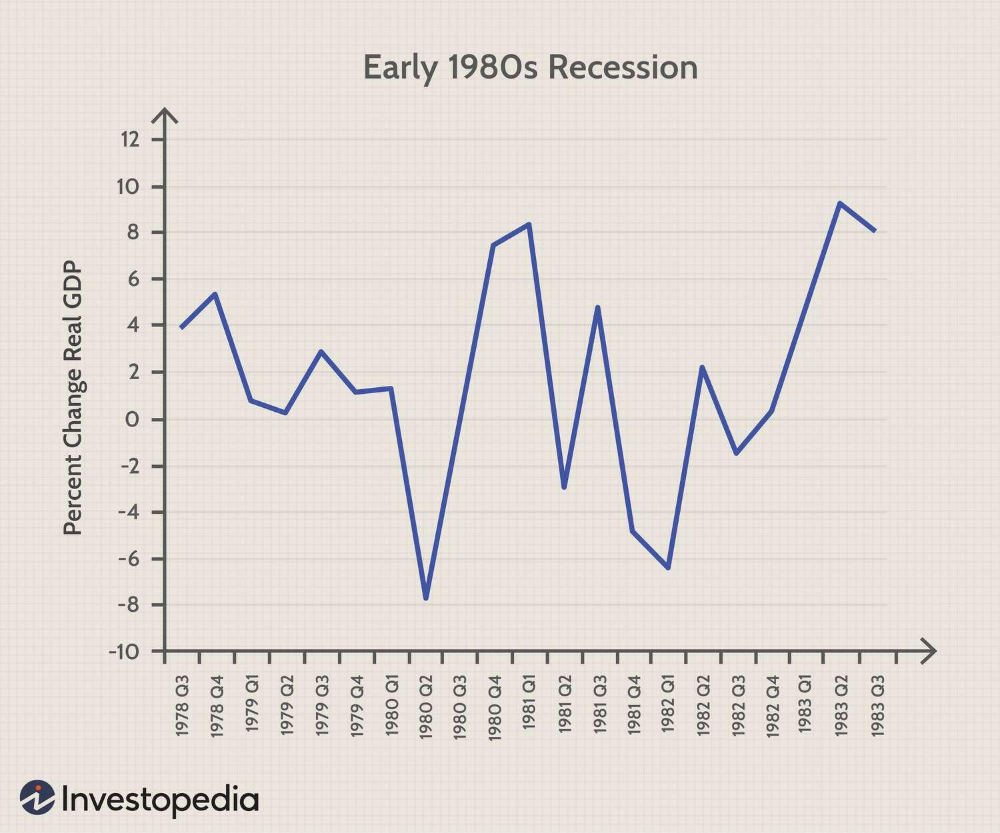

## Table of Contents

## What is a W-shaped economic recovery?

A W-shaped economic recovery is a type of economic recovery that looks like the letter W on a graph. It happens when the economy goes down, then goes up a bit, then goes down again, and finally goes up again. This pattern shows that the economy is not getting better in a smooth way. Instead, it has a second dip after the first recovery, which can be tough for people and businesses.

This kind of recovery can happen because of many reasons. For example, after the first dip, people might start spending money again, making the economy go up. But then, if something bad happens, like a new problem or a policy change, the economy can go down again. This second dip can be scary because it makes people lose trust in the recovery. But if things get better after the second dip, the economy can finally start to grow again, finishing the W shape.

## How does a W-shaped recovery differ from other types of economic recoveries?

A W-shaped recovery is different from other types of economic recoveries because it has two dips instead of just one. In a normal recovery, like a V-shaped or U-shaped recovery, the economy goes down and then comes back up without any more big drops. But in a W-shaped recovery, the economy goes down, starts to come back up, then goes down again before finally going up for good. This makes it harder for people and businesses because they might think things are getting better, but then they get worse again.

Other types of recoveries, like an L-shaped recovery, are different because the economy stays down for a long time after it falls. In an L-shaped recovery, there's no quick bounce back like in a V-shaped recovery, and no second dip like in a W-shaped recovery. A K-shaped recovery is also different because it shows that some parts of the economy are doing well while other parts are doing badly. So, each type of recovery has its own pattern and challenges, but a W-shaped recovery is unique because of its double dip.

## What are the key characteristics of a W-shaped economic recovery?

A W-shaped economic recovery is when the economy goes down, then up a bit, then down again, and finally up again. It looks like the letter W on a graph. This type of recovery is tricky because it makes people think the economy is getting better after the first dip, but then it goes down again. This second dip can make people lose trust and feel unsure about the future.

The key thing about a W-shaped recovery is that it has two dips. The first dip happens because of a big problem, like a financial crisis or a global health issue. After the first dip, the economy starts to recover, and people might start spending money again. But then, something else bad happens, causing the second dip. This could be a new problem or a policy change that makes things worse again. After the second dip, if things get better, the economy can finally start to grow again, finishing the W shape.

## Can you provide historical examples of W-shaped economic recoveries?

One example of a W-shaped economic recovery happened in the United States during the early 1980s. The economy first went down in 1980 because of high inflation and high interest rates. The government tried to fix this by changing policies, and the economy started to get better. But then, in 1981, the economy went down again because the Federal Reserve kept interest rates high to fight inflation. This second dip made things tough for a while. Finally, in 1982, the economy started to grow again, finishing the W shape.

Another example is the economic recovery after the 2008 financial crisis. The economy crashed in 2008 because of problems with banks and housing. Governments around the world stepped in with money to help, and the economy started to recover in 2009. But then, in 2011, the economy went down again because of problems in Europe and worries about government debt. This second dip made people nervous. Eventually, the economy started to grow again, completing the W shape.

## What economic indicators signal the onset of a W-shaped recovery?

When the economy starts to show signs of a W-shaped recovery, you might see a few key things happening. First, after the economy goes down, it starts to get better. You can see this in things like more people getting jobs, companies making more money, and people spending more. But these good signs can be a bit tricky because they might not last long. If you see the economy starting to grow after a big drop, that could be the first part of the W.

Then, something bad happens again, and the economy goes down for the second time. This second dip can be seen in things like people losing jobs again, companies making less money, and people spending less. If you see these bad signs after the economy had started to get better, that could mean the second part of the W is happening. The key is to watch for these ups and downs in the economy to know if it's a W-shaped recovery.

## What are the typical causes of a W-shaped economic recovery?

A W-shaped economic recovery happens when the economy goes down, starts to get better, then goes down again before finally getting better for good. The first dip usually comes from a big problem like a financial crisis or a global health issue. When this happens, people lose jobs, companies make less money, and everyone spends less. Governments and central banks might step in with money and new rules to help fix things. This can make the economy start to grow again, which is the first part of the W.

But then, something else bad happens, causing the second dip. This could be a new problem or a change in policy that makes things worse again. For example, if the government raises taxes or if there's another big problem like a natural disaster, the economy can go down again. This second dip makes people lose trust in the recovery because they thought things were getting better but then they got worse. After this second dip, if the economy starts to grow again, it finishes the W shape.

## How do policymakers respond to a W-shaped economic recovery?

When policymakers see a W-shaped economic recovery happening, they try to help the economy get better after both dips. After the first dip, they might give money to people and businesses, lower interest rates, or change rules to make it easier for the economy to grow again. They want to make sure people can keep their jobs and that companies can keep making money. This can help the economy start to get better and move up the first part of the W.

But then, if the economy goes down again for the second dip, policymakers have to act fast. They might need to give more money or change rules again to stop the economy from getting worse. They also need to make sure people don't lose trust in the recovery. After the second dip, if the economy starts to grow again, policymakers keep helping to make sure the recovery keeps going strong and finishes the W shape.

## What are the potential impacts of a W-shaped recovery on different sectors of the economy?

A W-shaped recovery can hit different parts of the economy in different ways. After the first dip, some sectors like technology and healthcare might start to do better because people still need their services. But sectors like travel and hospitality might stay down because people are scared to spend money on trips and eating out. When the economy starts to get better after the first dip, these sectors might see a little bit of growth, but it can be hard for them to fully recover if people are still worried about money.

Then, when the second dip happens, it can be really tough for all sectors. Even the ones that were doing okay after the first dip might start to struggle again. For example, if people lose their jobs again, they might stop buying new phones or going to the doctor as much. Sectors like manufacturing and construction might see big drops because people and businesses stop spending on big projects. But if the economy starts to grow again after the second dip, all sectors can start to get better, though it might take longer for some to fully recover.

## How can businesses prepare for and navigate through a W-shaped economic recovery?

Businesses can prepare for a W-shaped economic recovery by saving money and being ready for ups and downs. They should keep some money saved up so they can keep going even if the economy goes down again after starting to get better. It's also a good idea for businesses to have different ways to make money. If one part of their business is doing badly, another part might still be doing okay. Businesses should also keep an eye on what's happening in the economy and be ready to change their plans if things get worse again.

When the second dip happens, businesses need to be smart about how they spend money. They might need to cut back on some things to save money, like not hiring new people or not spending on big projects. But they should also keep taking care of their customers and employees because they are important for the business to keep going. As the economy starts to get better after the second dip, businesses can start to grow again. They should be ready to take advantage of new opportunities and keep an eye on the economy to make sure they don't get caught off guard by any more dips.

## What are the long-term effects of a W-shaped recovery on economic growth and stability?

A W-shaped recovery can make it hard for the economy to grow and stay stable in the long run. When the economy goes down, then up a bit, then down again, it can make people and businesses feel unsure about the future. This can make them spend less money and be more careful about starting new projects or hiring new people. If people and businesses are scared to spend money, it can slow down the economy's growth. It can also make it harder for the economy to get back to how it was before the first dip because people might still be worried about another dip happening.

Over time, a W-shaped recovery can also make it harder for the economy to be stable. If the economy keeps going up and down, it can be tough for policymakers to make good plans to help the economy grow. They might have to keep changing their plans to deal with the new problems that come up. This can make it hard for the economy to stay on a steady path. But if policymakers can help the economy get through the second dip and start growing again, it can help the economy become more stable in the long run.

## How do global economic conditions influence the likelihood of a W-shaped recovery?

Global economic conditions can make a W-shaped recovery more likely. If the world economy is doing badly, it can cause problems for a country's economy. For example, if other countries are not buying as much stuff, it can hurt businesses that sell things to other countries. This can make the economy go down. If the world economy starts to get better, it might help the country's economy start to grow again. But if something bad happens in the world economy again, like a new crisis or a big problem, it can cause the country's economy to go down for a second time, making a W-shaped recovery more likely.

Also, global economic conditions can affect how well a country can deal with a W-shaped recovery. If other countries are doing well, they might be able to help by buying more stuff or giving money to help the country's economy. But if the world economy is struggling, it can be harder for a country to get help from other countries. This can make it harder for the country to get through the second dip and start growing again. So, what's happening in the world economy can play a big role in whether a country has a W-shaped recovery and how it deals with it.

## What advanced economic models are used to predict and analyze W-shaped recoveries?

Economists use different models to predict and understand W-shaped recoveries. One common model is the Dynamic Stochastic General Equilibrium (DSGE) model. This model looks at how different parts of the economy, like people spending money, companies making things, and the government's actions, all work together. It can help economists see how a big problem might cause the economy to go down, then start to get better, and then go down again. By putting in different information about what's happening in the economy, the DSGE model can help predict if a W-shaped recovery might happen.

Another model that economists use is the Vector Autoregression (VAR) model. This model looks at how different economic numbers, like how many people have jobs or how much money people are spending, change over time. It can help economists see patterns in the economy and predict what might happen next. If the VAR model shows that the economy is going up and down in a way that looks like a W, it can help economists understand that a W-shaped recovery might be happening. Both of these models help economists make better guesses about the future of the economy and plan for what might happen next.

## References & Further Reading

[1]: Reinhart, C. M., & Rogoff, K. S. (2009). ["This Time is Different: Eight Centuries of Financial Folly"](https://www.nber.org/system/files/working_papers/w13882/w13882.pdf). Princeton University Press.

[2]: Mulligan, C. B. (2011). ["The Economic Fluctuations of The Great Recession"](https://www.nber.org/system/files/working_papers/w17584/w17584.pdf). National Bureau of Economic Research Working Paper No. 17394.

[3]: Lopez de Prado, M. (2018). ["Advances in Financial Machine Learning"](https://www.amazon.com/Advances-Financial-Machine-Learning-Marcos/dp/1119482089). John Wiley & Sons.

[4]: Chan, E. P. (2008). ["Quantitative Trading: How to Build Your Own Algorithmic Trading Business"](https://github.com/ftvision/quant_trading_echan_book). John Wiley & Sons.

[5]: Jansen, S. (2020). ["Machine Learning for Algorithmic Trading"](https://github.com/stefan-jansen/machine-learning-for-trading). Packt Publishing.

[6]: Shiller, R. J. (2000). ["Irrational Exuberance"](https://press.princeton.edu/books/paperback/9780691173122/irrational-exuberance). Princeton University Press.

[7]: Engle, R. F. (1982). ["Autoregressive Conditional Heteroscedasticity with Estimates of the Variance of United Kingdom Inflation."](https://www.semanticscholar.org/paper/Autoregressive-conditional-heteroscedasticity-with-Engle/2ee6cb87fc81ecd78d161c4a92c9dfce00c8961c) Econometrica, 50(4), 987–1007.

[8]: Lütkepohl, H. (2005). ["New Introduction to Multiple Time Series Analysis"](https://link.springer.com/book/10.1007/978-3-540-27752-1). Springer.