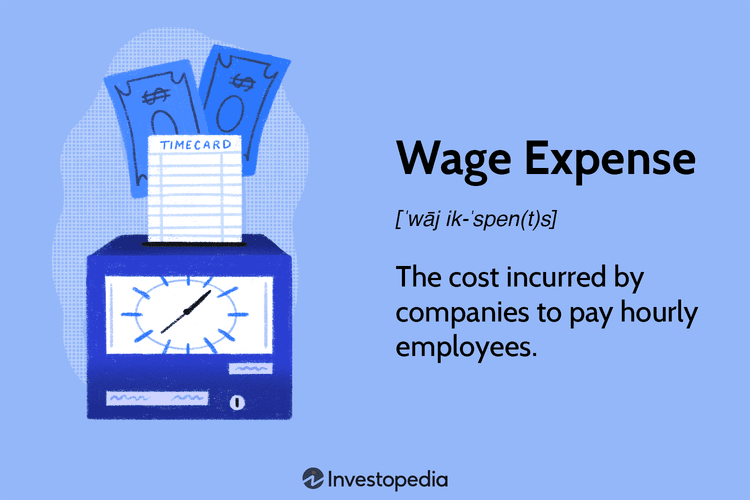

In today's fast-paced financial world, the intersection of employee compensation and algorithmic trading is becoming increasingly significant. As algorithmic trading constitutes a substantial portion of market transactions, understanding the dynamics of wage expenses for hourly employees within this sector becomes crucial for both employers and employees. The rapid pace of technological advancements and market fluctuations demands a reevaluation of traditional compensation structures, particularly when considering the high stakes involved in financial trading environments.

Employee compensation, especially for hourly employees, comprises a complex array of elements, including base wages, performance-related bonuses, and other benefits. In the context of algorithmic trading, these compensation components must be carefully aligned with the evolving demands of the industry. Firms increasingly face the challenge of attracting and retaining talent with the necessary skills in finance and technology. This situation calls for creative compensation strategies that not only address the financial objectives of the firm but also ensure job satisfaction and motivation among employees.



Several challenges and opportunities present themselves in the management of wage expenses. Employers must balance the dual goals of optimizing costs and sustaining a productive workforce. The fluctuations in trading volumes and market demands can cause significant variability in wage expenses for hourly employees. Consequently, firms require sophisticated management strategies to cope with these variances, leveraging analytics and forecasting to anticipate changes effectively.

Moreover, technological advancements in algorithmic trading have profound impacts on employee compensation strategies. The integration of advanced algorithms and data-driven approaches provides firms the opportunity to develop more dynamic and responsive compensation models. Such models can foster a high level of alignment between employee performance and business outcomes, ultimately driving both individual and organizational success.

This article explores these key components of employee compensation, focusing on the challenges and opportunities presented by algorithmic trading. By delving into effective management of wage expenses and leveraging technological advancements, firms can maintain a productive workforce while navigating the complexities of the fast-evolving financial landscape. A strategic approach to compensation, underpinned by insights and adaptability, can provide a competitive edge in this demanding sector.

## Table of Contents

## Understanding Employee Compensation in the Financial Sector

Employee compensation in the financial sector encompasses various elements, primarily including salaries, bonuses, and benefits. This multifaceted approach to compensation is designed to attract and retain employees in a competitive environment that demands high levels of expertise and performance. 

For hourly employees working within trading firms, the structure of wage compensation is crucial. These employees often find that their job satisfaction and productivity are directly influenced by how their compensation packages are structured. An attractive wage system can serve as a significant motivator, enhancing both the efficiency and dedication of the workforce. It is also vital for firms to align their compensation strategies with business outcomes to ensure that employee incentives are properly targeted. A performance-oriented compensation model can drive employees to focus their efforts on activities that are most beneficial to the firm's objectives.

In the fast-paced financial sector, maintaining a competitive edge requires ongoing reassessment of compensation packages. The dynamic nature of trading firms means that compensation structures need to be frequently adjusted to align with market standards and competitor offerings. By keeping compensation packages competitive, firms can ensure they are able to attract top talent who can contribute to their success.

Understanding and managing these variables is essential for effective human capital management. By optimizing compensation strategies, firms can manage their human resources more cost-effectively. This involves a careful balance between offering competitive compensation and controlling costs, ensuring that the compensation structure meets the needs of both employees and the firm.

Overall, a well-structured employee compensation system is critical for trading firms in the financial sector. It not only influences job satisfaction and productivity but also plays a key role in attracting and retaining top talent, thereby supporting the firm's overall success.

## Wage Expenses for Hourly Employees

Wage expenses represent a critical component of a company's financial management strategy, particularly in sectors involving hourly employees. These expenses encompass the total financial output dedicated to employee wages, which can significantly impact a company's profitability and sustainability. Various factors can influence the wage expenses for hourly employees, necessitating a dynamic and responsive wage management strategy.

Market demand, trading volumes, and seasonal variations are key drivers of fluctuations in wage expenses for hourly employees. For instance, during periods of high trading volumes, companies may require additional manpower, resulting in increased wage expenses. Conversely, lower trading activity can lead to reduced wage costs. This variability underscores the importance of adaptive wage management practices that can address both peaks and troughs in labor demand.

Balancing the need for skilled labor with these fluctuating wage expenses presents a significant challenge for firms. Companies must ensure that they retain a workforce capable of meeting operational demands without incurring unsustainable wage expenses. One strategy is implementing a flexible workforce model that allows for adjustments in labor hours in response to current market conditions. 

Effective management of wage expenses demands comprehensive planning and forecasting. Companies should employ robust forecasting models to anticipate labor needs and associated costs accurately. This requires an integration of various data inputs, such as historical trading volumes, market trends, and economic indicators, into forecasting models. 

Leveraging analytics is crucial in enabling firms to predict changes in wage expenses with greater accuracy. Advanced data analytics techniques can be used to identify patterns and trends in wage data, allowing companies to optimize their wage structures proactively. For example, [machine learning](/wiki/machine-learning) algorithms can analyze historical wage data to predict future expenses based on projected trading volumes and market scenarios.

In Python, a simple linear regression model can be used for forecasting wage expenses based on historical data:

```python
import numpy as np
import pandas as pd
from sklearn.linear_model import LinearRegression

# Sample historical data
data = {
    'trading_volume': [1000, 1500, 2000, 2500, 3000],
    'wage_expense': [20000, 25000, 30000, 35000, 40000]
}

# Convert data into a DataFrame
df = pd.DataFrame(data)

# Define feature and target variable
X = df[['trading_volume']]
y = df['wage_expense']

# Create and train the model
model = LinearRegression()
model.fit(X, y)

# Make predictions
future_trading_volume = np.array([[3500], [4000]])
predicted_wage_expenses = model.predict(future_trading_volume)

print(predicted_wage_expenses)
```

In summary, the effective management of wage expenses for hourly employees requires an understanding of market conditions, strategic workforce planning, and the integration of advanced analytics for accurate forecasting. Such measures ensure that firms can maintain operational efficiency while managing financial outputs associated with wages effectively.

## The Role of Algorithmic Trading in Employee Compensation

Algorithmic trading represents a transformative force in the financial industry, automating trade execution through sophisticated algorithms that consider a set of predefined variables such as price, timing, and [volume](/wiki/volume-trading-strategy). This technological evolution has introduced new workforce dynamics, fundamentally altering the type of skills that are in demand and, consequently, impacting employee compensation structures.

The burgeoning prevalence of [algorithmic trading](/wiki/algorithmic-trading) has necessitated a workforce proficient in both financial acumen and technical expertise. Employees in this sector are increasingly required to possess competencies in programming languages like Python and R, as well as a strong understanding of data analysis and machine learning concepts. These skills are crucial for developing and optimizing trading algorithms that can efficiently navigate volatile markets. As such, financial firms are compelled to devise competitive compensation packages to attract and retain talent equipped with this dual expertise. Compensation strategies often extend beyond base salaries to include performance-based incentives, aligning employee rewards with the successful execution and profitability of trading strategies.

Traditional compensation models, typically relying heavily on fixed salaries and periodic bonuses, are increasingly being supplemented or even replaced by performance-oriented frameworks. In algorithmic trading, where the rapid execution of trades can significantly influence profitability, compensatory mechanisms are often designed to reflect both individual and team contributions to trading success. Metrics such as alpha generation—the extent to which a trader's performance exceeds a market benchmark—can play a pivotal role in determining bonus structures. This shift emphasizes the need for adaptability in compensation strategies to not only attract top-tier talent but also to motivate employees whose work directly impacts financial outcomes.

Understanding and leveraging these shifting dynamics provides companies with the ability to tailor their compensation strategies to align with technological progressions within the industry. By integrating performance metrics and technological competencies into compensation models, firms can foster an adaptive workforce prepared to capitalize on emerging trading technologies. Such strategies not only enhance employee motivation and retention but also ensure that the workforce remains attuned to the latest developments in trading technology. 

In summary, algorithmic trading is reshaping employee compensation in the financial sector by emphasizing the importance of finance-technology hybrid skills and performance-based rewards. Companies that strategically adapt their compensation models to these changes are likely to gain a competitive advantage, ensuring they attract and retain the talent necessary to thrive in a technology-driven trading environment.

## Challenges and Opportunities in Compensation Management

Managing compensation for hourly employees in the financial sector presents both challenges and opportunities, especially within the context of algorithmic trading. One of the primary challenges is ensuring compliance with labor laws, which can vary significantly across jurisdictions. Companies must navigate these regulations while simultaneously controlling costs to maintain profitability. Failure to comply with labor laws can result in substantial legal penalties and damage to the firm's reputation.

Algorithmic trading presents a unique opportunity to implement dynamic compensation models that are aligned more closely with business results. As algorithmic trading relies heavily on performance metrics, it allows firms to design incentive structures that reward employees based on measurable outcomes, such as trading volumes or accuracy of predictive models. This can align employee interests with company goals, driving higher efficiency and productivity. For instance, performance-based bonuses could be calculated using a formula such as:

$$
\text{Bonus} = \text{Base Salary} + (\text{Performance Metric} \times \text{Multiplier})
$$

where the Performance Metric could be tied to specific trading success indicators, and the Multiplier adjusts the weight of performance in the bonus calculation.

Moreover, companies must consider the broader impact of regulatory changes and global economic shifts on their compensation strategies. Globalization and technological advancements have made financial markets more interconnected, increasing [volatility](/wiki/volatility-trading-strategies) and unpredictability in trading outcomes. This requires companies to adopt flexible compensation strategies that can adapt to fluctuating market conditions.

Embracing new compensation technologies offers firms the ability to increase transparency and trust with employees. Tools such as blockchain for salary disbursement or [artificial intelligence](/wiki/ai-artificial-intelligence) for performance assessments can provide employees with a clear and verifiable record of compensation calculations, thus enhancing fairness and transparency. Additionally, these technologies can reduce administrative overhead, providing cost savings that can be redirected towards more competitive salary offerings.

Ultimately, a strategic approach to compensation management that incorporates regulatory compliance, dynamic performance-based models, and new technologies can lead to greater employee motivation and retention. By aligning compensation with both individual and company performance, firms can foster a dedicated and highly skilled workforce, crucial for maintaining competitiveness in the algorithmic trading arena. A well-devised compensation strategy serves not only as a tool for talent retention but also as a mechanism to drive long-term business success through the alignment of employee objectives with organizational goals.

## Conclusion

The intersection of employee compensation and algorithmic trading presents a multifaceted landscape, characterized by both challenges and opportunities that companies in the financial sector must navigate strategically. An effective compensation strategy is crucial in this dynamic environment, as it can offer a significant competitive advantage. By ensuring alignment with evolving market conditions and technological innovations, firms can optimize their compensation frameworks to attract and retain top talent. This involves not only staying agile and responsive to changes but also incorporating performance-based incentives that reflect the outcomes of algorithmic trading activities.

To remain competitive, firms must adopt comprehensive compensation strategies that consider the nuanced requirements of both financial acumen and technological proficiency. Such strategies should focus on effectively managing wage expenses while fostering a workforce proficient in navigating the complexities of algorithmic trading. This is crucial, given the need for a versatile skill set that includes expertise in both finance and data analysis.

The future trajectory of employee compensation in the financial sector is expected to evolve continuously, propelled by technological advancements and shifting market dynamics. As algorithmic trading becomes increasingly sophisticated, firms must continually adapt their compensation models to align with these changes. By doing so, they can not only ensure cost-effectiveness in their compensation expenditures but also promote an environment that nurtures a skilled and motivated workforce, ready to meet the challenges and capitalize on the opportunities presented by ongoing innovations in algorithmic trading.

## References & Further Reading

[1]: Bergstra, J., Bardenet, R., Bengio, Y., & Kégl, B. (2011). ["Algorithms for Hyper-Parameter Optimization."](https://dl.acm.org/doi/10.5555/2986459.2986743) Advances in Neural Information Processing Systems 24.

[2]: ["Advances in Financial Machine Learning"](https://www.amazon.com/Advances-Financial-Machine-Learning-Marcos/dp/1119482089) by Marcos Lopez de Prado

[3]: ["Evidence-Based Technical Analysis: Applying the Scientific Method and Statistical Inference to Trading Signals"](https://www.amazon.com/Evidence-Based-Technical-Analysis-Scientific-Statistical/dp/0470008741) by David Aronson

[4]: ["Machine Learning for Algorithmic Trading"](https://github.com/stefan-jansen/machine-learning-for-trading) by Stefan Jansen

[5]: ["Quantitative Trading: How to Build Your Own Algorithmic Trading Business"](https://www.amazon.com/Quantitative-Trading-Build-Algorithmic-Business/dp/1119800064) by Ernest P. Chan