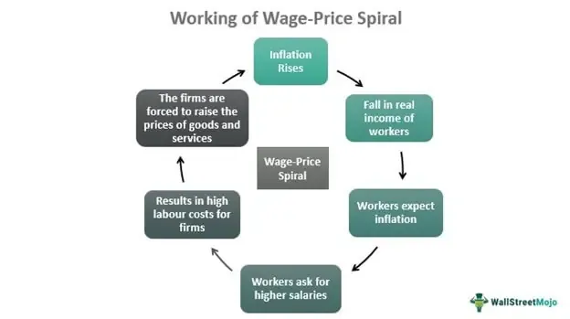

Economic regulation, inflation control, wage-price spirals, and algorithmic trading are fundamental components that intertwine to shape a stable economy. Economic regulation encompasses a set of policies and laws implemented by governments or regulatory bodies to maintain order in markets, promote fair competition, and prevent economic instability. Among its various objectives, controlling inflation is paramount. Inflation, the general increase in prices and fall in the purchasing value of money, can erode savings, disrupt business planning, and impede long-term growth if left unchecked. Central banks and governments employ monetary and fiscal policies as primary tools in this battle against inflation. Through interest rate adjustments, open market operations, and government spending policies, these entities strive to manage inflationary pressures, thereby fostering a predictable economic environment.

A crucial aspect of inflation control is addressing wage-price spirals. This phenomenon occurs when rising wages lead to higher production costs, which businesses pass on to consumers in the form of higher prices. In turn, the increased cost of living prompts workers to demand even higher wages, potentially creating a self-reinforcing cycle. Historically, wage-price spirals have posed significant challenges to economies, especially during periods of rapid economic change or labor market disruptions. Therefore, understanding and mitigating these spirals is vital for preventing runaway inflation.



Algorithmic trading, a relatively recent development, also plays a noteworthy role in today’s economic landscape. It refers to the use of computer algorithms to execute trading strategies at speeds and volumes impossible for human traders. Algorithmic trading can enhance market efficiency and liquidity, but it also introduces challenges in terms of market volatility and regulatory oversight. The speed and complexity of algorithmic trades can sometimes lead to unintended consequences, such as flash crashes, which necessitate careful regulatory frameworks to ensure that financial markets remain robust and resilient.

Together, economic regulation, inflation control, wage-price spirals, and algorithmic trading illustrate the complexity and interconnectedness of modern economic systems. Policymakers must continuously adapt and innovate their strategies to maintain economic stability while navigating the dynamic interplay of these factors. This ongoing evolution in economic policy and regulation underscores the critical need for comprehensive and forward-thinking approaches to sustainable economic management.

## Table of Contents

## Understanding Economic Regulation and its Role in Inflation Control

Economic regulation plays a crucial role in maintaining market stability, offering a framework for economic growth and stability. It aims to mitigate market failures, enhance consumer protection, and promote fair competition. Regulation's role in inflation control is significant, impacting not only individual markets but also the broader economy.

Regulations can affect inflation in several ways. Price controls, for example, directly limit the prices that can be charged for goods and services. Such controls, while effective in the short-term, may lead to market distortions, shortages, and reduced investment in the long term. Another regulatory measure is the imposition of tariffs, which can affect inflation by increasing the cost of imported goods, thus potentially leading to price hikes.

One prominent example of regulatory measures used to combat inflation is [interest rate](/wiki/interest-rate-trading-strategies) policy, under the purview of central banks. Adjusting interest rates can influence economic activity by controlling borrowing costs. A rise in interest rates often cools down an overheated economy by making loans more expensive, thus reducing consumer spending and investment. Conversely, reducing interest rates can stimulate economic activity by making borrowing cheaper.

Fiscal policy, another critical element in economic regulation, involves government spending and taxation decisions. By adjusting these levers, governments can influence economic growth and inflation. For instance, reducing taxes may increase disposable income and consumption, even though it might also risk higher inflation if the economy is near capacity. On the other hand, increased government spending can inject [liquidity](/wiki/liquidity-risk-premium) into the economy, potentially leading to inflation if not offset by commensurate productivity gains.

Monetary policy, including measures like quantitative easing, seeks to control money supply and demand, thereby impacting inflation. Quantitative easing involves central banks purchasing government securities or other securities from the market, increasing the money supply and lowering interest rates. This can encourage more lending and investment, with the potential side effect of increased inflation if the money supply grows faster than economic output.

To summarize, economic regulations, particularly through fiscal and monetary policies, play a central role in controlling inflation and ensuring market stability. These policies must be carefully administered, as over-regulation or inappropriate policy measures can lead to inefficiencies and unintended economic consequences.

## The Wage-Price Spiral and Its Challenges

The wage-price spiral is a macroeconomic theory illustrating the cyclical relationship between wages and prices. It describes a scenario where rising wages lead to increased consumer spending and demand for goods. This heightened demand causes businesses to raise prices to maintain profit margins, consequently increasing the cost of living. In response, workers demand higher wages to maintain their purchasing power, creating a continuous loop of wage and price increases.

Historically, wage-price spirals have been pivotal in understanding periods of rampant inflation. In the 1970s, the United States experienced significant wage-price spirals, partially driven by oil price shocks and expansive fiscal policies. The interaction between inflation and wage expectations resulted in sustained periods of economic instability. Central banks, limited in their ability to curtail inflation rapidly, faced challenges as both businesses and labor unions escalated demands in reaction to price indices, further accentuating the spirals.

Recent examples highlight the complexities in the post-pandemic economic environment. The COVID-19 pandemic disrupted global supply chains, decreasing the supply of various goods and services, while stimulus measures increased demand. As economies reopened, shortages in labor and goods led to upward pressure on wages and prices. For instance, sectors such as hospitality and logistics saw significant wage increases as businesses attempted to attract workers. This surge prompted notable price increases, reminiscent of wage-price spiral characteristics.

To combat these spirals, several policy interventions are recommended. Historically, a coordinated approach involving both fiscal and monetary policies has proven effective. Central banks can implement inflation targeting, a strategy that uses interest rate adjustments to stabilize price levels and anchoring inflationary expectations. Similarly, fiscal measures, such as controlled spending and targeted taxation, can dampen excessive demand-side pressures.

Another strategy involves direct government intervention to negotiate and set guidelines for wage increases, ensuring they align with productivity gains rather than anticipated inflation. This can involve collaboration with labor unions and industry leaders to foster a sustainable economic environment. Innovation in price control, such as subsidies or price caps on essential goods, can also mitigate the immediate impact of price surges on living costs, although they should be used judiciously to avoid long-term market distortions.

In conclusion, addressing wage-price spirals demands a multifaceted strategy encompassing monetary policy, fiscal discipline, and societal cooperation. Policymakers must remain vigilant to prevent these spirals from entrenching inflation expectations and destabilizing economies.

## The Interplay Between Inflation and Wage Increases

Inflation and wage increases are two of the most crucial components in understanding economic dynamics. Inflation influences wage demands as workers seek salary adjustments to maintain their purchasing power in response to rising prices. Conversely, wage increases can contribute to inflation, particularly through cost-push and demand-pull factors.

**Cost-Push and Demand-Pull Factors**

Cost-push inflation occurs when the rising costs of production lead producers to increase prices to maintain profit margins. When wages rise, production costs increase, potentially causing a broad rise in prices. An example can be found in industries where labor is a significant component of costs. If workers' wages rise, businesses may increase product prices, contributing to overall inflation.

Demand-pull inflation, on the other hand, arises when increased wages lead to higher disposable incomes, boosting consumer spending. This surge in demand can result in higher prices if supply does not keep pace with demand, further driving inflation. For instance, if a large section of the workforce receives a substantial wage increase, consumer demand across various goods and services might outpace production, pushing prices upward.

```python
# Example: Calculating the impact of wage increase on production costs
def new_price(initial_price, wage_increase_ratio, labor_cost_ratio):
    labor_cost_increase = initial_price * labor_cost_ratio * wage_increase_ratio
    return initial_price + labor_cost_increase

# Initial parameters
initial_price = 100  # initial cost of product
wage_increase_ratio = 0.05  # 5% wage increase
labor_cost_ratio = 0.3  # 30% of product cost is labor-related

# Calculate new price
new_price_value = new_price(initial_price, wage_increase_ratio, labor_cost_ratio)
new_price_value
```

**Importance of Controlling Inflation**

Controlling inflation is critical for economic stability because unchecked inflation can erode purchasing power, distort spending patterns, and lead to uncertainty in investments. A stable inflation rate often leads to predictable business environments, fostering economic growth and stability. High or accelerating inflation can trigger a wage-price spiral, where wage and price hikes continuously feed into each other, creating economic instability.

**Inflation Targeting**

Inflation targeting is a monetary policy strategy used by central banks to stabilize economies by keeping inflation within a predetermined range, often around 2%. By controlling money supply and interest rates, central banks can influence economic activity and inflationary pressures. This approach has been effective in several economies, providing clear expectations for businesses and consumers, which helps in planning and investment.

The relation between inflation and wage increases is complex and requires effective policy measures to maintain a healthy economic equilibrium. Through strategies like inflation targeting, economies aim to foster stability, encouraging sustainable growth and preventing the adverse effects of substantial price and wage [volatility](/wiki/volatility-trading-strategies).

## Algorithmic Trading: Influence on Economic Regulation and Inflation

Algorithmic trading, often referred to as automated trading, leverages advanced mathematical models and complex algorithms to execute transactions at speeds and frequencies that are impossible for human traders. Over the past few decades, it has gained prominence in financial markets due to its ability to process vast amounts of data rapidly and execute trades with minimal human intervention.

The rise of [algorithmic trading](/wiki/algorithmic-trading) is closely tied to technological advancements and increased computational power, which have collectively transformed market dynamics. This type of trading accounts for a significant portion of the trading [volume](/wiki/volume-trading-strategy) on major exchanges, influencing the liquidity and volatility of financial markets.

### Impact on Market Volatility and Liquidity

Algorithmic trading has a dual impact on market liquidity and volatility. On one hand, it enhances liquidity by enabling quick matching of buy and sell orders, thus tightening bid-ask spreads and making markets more efficient. This increased liquidity can make it easier for investors to enter and [exit](/wiki/exit-strategy) positions without significantly affecting market prices.

On the other hand, algorithmic trading can exacerbate market volatility. High-frequency trading ([HFT](/wiki/high-frequency-trading-strategies)), a subset of algorithmic trading, can lead to rapid price swings and flash crashes due to its speed and volume. For example, the "Flash Crash" of May 6, 2010, was partly attributed to algorithmic trading practices that caused the Dow Jones Industrial Average to plummet and then rebound within minutes. Such events underscore the potential for algorithmic trading to trigger unintended market turbulence.

### Regulatory Challenges

The prevalence of algorithmic trading presents significant regulatory challenges. Regulators are tasked with ensuring market stability while promoting innovation and efficiency. One challenge is monitoring and managing the complex and fast-paced nature of algorithmic trades to prevent market manipulation and reduce systemic risk.

Regulatory bodies, such as the U.S. Securities and Exchange Commission (SEC) and the Commodities Futures Trading Commission (CFTC), have introduced measures like circuit breakers and order-to-trade ratios to mitigate risks. These tools are designed to pause trading in instances of extreme volatility and to limit the frequency of orders relative to trades, aiming to maintain fair and orderly markets.

Moreover, ensuring the transparency and accountability of algorithmic trading activities is crucial. Regulatory frameworks often require trading firms to maintain detailed audit trails of their algorithmic processes to aid in post-trade analysis and compliance checks.

### Benefits and Risks in Inflation Control

Algorithmic trading can play a role in the broader economic landscape, including aspects of inflation control. By increasing market efficiency, it can aid in accurate price discovery, which is critical in forming inflation expectations. Well-functioning markets help central banks and policymakers gauge the economic environment and make informed decisions.

However, the rapid decision-making and execution inherent in algorithmic trading can introduce systemic risks, especially if market conditions change rapidly or models are based on flawed assumptions. This could potentially disrupt interest rates and currency markets, complicating inflation management efforts.

In conclusion, while algorithmic trading presents opportunities for enhancing market liquidity and efficiency, it also poses challenges that require vigilant regulatory oversight to manage its impact on market stability and economic factors such as inflation. As technology evolves, ongoing collaboration between regulators, market participants, and technologists will be essential to balance innovation with the imperative of maintaining a stable economic environment.

## Solutions and Future Outlook

Emerging trends and technologies are shaping the landscape of economic regulation and inflation control. These developments play a crucial role in responding to dynamic market conditions, ensuring economic stability, and mitigating inflationary pressures.

Modern technology is facilitating more sophisticated monetary policy tools, allowing central banks to implement real-time data analytics and predictive algorithms. This enhances their ability to forecast economic trends and adjust interest rates or monetary supply preemptively. Blockchain technology and cryptocurrencies introduce novel considerations in regulating money supply and controlling inflation, although still in their nascent stages.

Wage policy is under scrutiny as economies grapple with inflationary threats and labor market shifts. Future wage policies must balance between supporting living standards and avoiding the entrenchment of wage-price spirals, which can exacerbate inflation. This could involve innovative compensation structures tied to productivity gains, cost-of-living adjustments synchronized with inflation targets, and collaborative employer-employee discussions on wage setting.

Algorithmic trading, which employs complex algorithms to automate trading processes, poses both challenges and opportunities for economic regulation. It can increase market liquidity and efficiency, but also heighten volatility, necessitating robust regulatory frameworks. Developing these frameworks involves international cooperation to enforce transparency in trading algorithms and establishing circuit breakers to prevent market crashes.

In conclusion, a balanced approach to policy-making is essential to ensure economic stability. Policymakers need to embrace new technologies and evolve regulatory strategies that consider interconnected economic factors. Well-crafted wage policies, effective use of technology in inflation control, and comprehensive regulation of algorithmic trading will be fundamental to achieving sustained economic growth and stability. Ongoing research and innovative policy-making will be pivotal in navigating these complex economic dynamics.

## FAQs

What is a wage-price spiral, and why is it significant?

A wage-price spiral occurs when escalating wages lead to increased costs for businesses, which in turn pass these costs onto consumers in the form of higher prices. This situation compels workers to demand even higher wages to keep up with inflation, creating a feedback loop that sustains inflation. The significance of a wage-price spiral lies in its potential to destabilize an economy. By fueling persistent inflation, it complicates the task of monetary authorities aiming to achieve price stability, as traditional measures may be less effective in breaking the cycle without causing significant economic contraction or unemployment.

How do central banks control inflation?

Central banks control inflation primarily through monetary policy tools, such as setting interest rates and regulating the money supply. By adjusting the benchmark interest rate, central banks influence borrowing and spending behaviors. A higher interest rate tends to cool economic activity and suppress inflation, while a lower rate can stimulate growth but may risk higher inflation. Additionally, central banks may engage in open market operations, buying or selling government securities to influence the money supply. Quantitative easing is another tool, involving the purchase of long-term securities to inject liquidity into the economy. Central banks also set inflation targets, providing a framework that shapes expectations and supports economic stability.

What role does algorithmic trading play in the economy?

Algorithmic trading involves using computer algorithms to automatically execute a large volume of trades at high speed, capitalizing on minute price differences in financial markets. This type of trading plays a significant role in enhancing market efficiency and liquidity, enabling quicker price discovery and minimizing transaction costs. However, it also introduces challenges, such as increased market volatility and the potential for flash crashes, where abrupt price swings occur in a short timeframe. Regulators face the task of overseeing these activities to mitigate risks, ensuring that the benefits of algorithmic trading are not outweighed by its destabilizing effects on financial markets.

Can regulation effectively prevent economic downturns caused by inflation?

While regulation alone may not entirely prevent economic downturns caused by inflation, it can significantly mitigate the risks. Effective regulation involves a combination of fiscal and monetary policies, transparency, and robust institutional frameworks. By maintaining stable inflation rates and preventing speculative bubbles, regulations contribute to overall economic stability. Measures such as inflation targeting, macroprudential regulations to address systemic risks, and fiscal policies supporting balanced economic growth are crucial. However, unforeseen global events or supply shocks can undermine regulatory efforts, highlighting the need for adaptive policies and international cooperation in addressing inflationary challenges.

## The Bottom Line

Economic regulation, inflation control, and wage-price spirals are critical components in maintaining a stable and thriving economy. Economic regulation serves as a mechanism to ensure market stability by implementing rules that mitigate excessive risks and prevent market failures. Through the strategic application of monetary and fiscal policies, regulation aims to control inflation levels, which can otherwise erode purchasing power and destabilize economies.

Inflation, when left unchecked, can lead to a wage-price spiral, a phenomenon where rising wages increase production costs, leading to higher prices, which in turn prompts demands for further wage increases. This cycle poses a significant threat to economic equilibrium, making its prevention and management essential for sustainable growth. Central banks and policymakers strive to maintain a delicate balance using tools like interest rate adjustments and inflation targeting. These strategies aim to keep inflation within acceptable bounds, ultimately protecting the economy from overheating or slipping into recession.

Algorithmic trading introduces additional complexity to economic regulation and inflation control due to its capacity to influence market liquidity and volatility. While it offers efficiencies and opportunities, it also presents challenges for regulators striving to keep pace with technological advancements. Balancing innovation with regulation is critical to harnessing the benefits of algorithmic trading while minimizing potential risks to financial markets.

Sustainable economic growth hinges on the careful orchestration of these factors. Inflation control, economic regulation, and wage management are intertwined, each playing a vital role in fostering an environment conducive to long-term prosperity. To achieve this, ongoing research and innovative policy-making are paramount. Policymakers must remain vigilant and adaptive, integrating new insights and technologies to effectively address the complexities of modern economies. This forward-thinking approach is essential to ensuring that economic policies continuously evolve to meet emerging challenges and support sustainable development.

## References & Further Reading

[1]: Blanchard, O., & Katz, L. (1997). ["What We Know and Do Not Know About the Natural Rate of Unemployment."](https://www.aeaweb.org/articles?id=10.1257/jep.11.1.51) Journal of Economic Perspectives, 11(1), 51-72.

[2]: Shiller, R. J. (2015). ["Irrational Exuberance"](https://press.princeton.edu/books/paperback/9780691173122/irrational-exuberance) (3rd ed.). Princeton University Press.

[3]: Goolsbee, A., & Krueger, A. B. (2015). ["A Retrospective Look at Rescuing and Restructuring General Motors and Chrysler."](https://www.nber.org/system/files/working_papers/w21000/w21000.pdf) Journal of Economic Perspectives, 29(2), 3-24.

[4]: Perez, C. (2002). ["Technological Revolutions and Financial Capital: The Dynamics of Bubbles and Golden Ages."](https://archive.org/details/technologicalrev00carl) Edward Elgar Publishing.

[5]: Geanakoplos, J. (2010). ["The Leverage Cycle."](https://www.semanticscholar.org/paper/The-Leverage-Cycle-Geanakoplos/e837a1876c8405032fc40b5c495d38a047c59095) In D. Acemoglu, K. Rogoff & M. Woodford (Eds.), NBER Macroeconomics Annual 2009, Volume 24.

[6]: Govindaraj, A. (2018). ["The Role of Algorithmic Trading in Financial Markets."](https://ieeexplore.ieee.org/document/10379947) ResearchGate.

[7]: Goodhart, C. A. E. (1989). ["The Evolution of Central Banks."](https://archive.org/details/evolutionofcentr0000good) MIT Press.

[8]: Friedman, M. (1968). ["The Role of Monetary Policy."](https://www.aeaweb.org/aer/top20/58.1.1-17.pdf) American Economic Review, 58(1), 1-17.