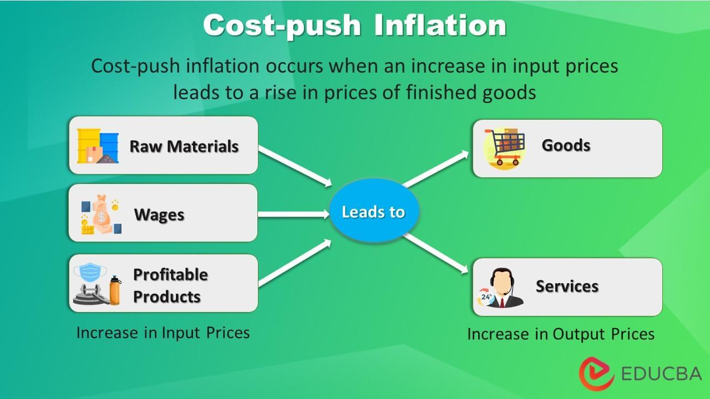

Wage-push inflation is a specific type of inflation that occurs when rising wages lead to increased production costs, prompting businesses to raise prices in order to maintain profit margins. It is one component of overall economic inflation, which also includes demand-pull inflation and cost-push inflation. While demand-pull inflation arises due to an excess demand over supply, and cost-push inflation results from an increase in the price of production inputs, wage-push inflation is intrinsically linked to changes in wage dynamics within an economy.

Understanding the causes of inflation is crucial in today's economic climate as inflation affects purchasing power, savings, and overall economic stability. Inflation can erode consumer purchasing power, leading to decreased consumer confidence and potentially slowing economic growth. Moreover, central banks monitor inflation closely when making monetary policy decisions, such as setting interest rates. By comprehending the causes of inflation, policymakers can devise strategies to mitigate its negative impacts.

Algorithmic trading, which uses computer algorithms to execute trades at high speed and volume based on pre-set criteria, presents a modern approach to navigating economic fluctuations, such as those caused by inflation. By analyzing large datasets and detecting patterns more efficiently than traditional methods, algorithmic trading can offer a competitive edge in predicting and responding to market changes, including those induced by wage-push factors.

This article aims to provide a comprehensive understanding of wage-push inflation within the broader scope of economic inflation. It will explore historical instances and mechanisms of wage-push inflation, discuss the economic causes and scenarios where it is likely to occur, and provide case examples to illustrate its impact. Additionally, the article will examine how algorithmic trading can be utilized in inflationary times. Finally, it will look towards future trends in managing inflation through technological advancements, balancing human insight with machines' computational prowess.

## Table of Contents

## Understanding Wage-Push Inflation

Wage-push inflation is a specific form of inflation driven primarily by increases in wages. This inflationary pressure occurs when employers raise wages to maintain or attract workers, subsequently increasing production costs. To sustain profitability, businesses often transfer these higher expenses to consumers through increased product and service prices, thereby contributing to inflation.

Wage-push inflation is distinct from demand-pull inflation, which arises from an overall increase in demand across the economy, and cost-push inflation, which occurs when the costs of key goods (like oil) rise, impacting prices broadly. Whereas both demand-pull and cost-push inflation can arise from a variety of external economic pressures, wage-push inflation specifically originates from changes in labor market dynamics.

Historically, wage-push inflation has been evident during periods of strong economic growth, where labor demand exceeds supply. For example, during the 1970s, many Western economies experienced wage-push inflation as unions wielded considerable negotiating power, securing substantial wage hikes. Such conditions can foster an environment where wage-push inflation manifests, especially when labor markets tighten and unemployment rates are low.

The mechanics of wage-push inflation unfold as follows: when wages increase without a corresponding rise in productivity, it leads to higher unit labor costs. With fixed output, the formula for unit labor cost is:

$$
\text{Unit Labor Cost} = \frac{\text{Total Wages}}{\text{Total Output}}
$$

As unit labor costs rise, businesses might increase prices to cover the additional wage expenses, thereby leading to inflation if these price hikes are widespread across the economy.

Wage-push inflation is more likely to occur under several scenarios. These include situations where labor markets are tight, giving workers greater leverage to negotiate higher wages, and in environments where large labor unions are prevalent, often leading to collective bargaining agreements that include significant wage increases. Another scenario might involve policy changes, such as a significant rise in the minimum wage, that lead to wage hikes across various sectors. Furthermore, economies with low unemployment rates might face heightened risks of wage-push inflation as competition for a limited labor pool drives up wages.

In summary, understanding wage-push inflation involves recognizing how wage increases, driven by labor market conditions and bargaining power, can contribute to cost increases and subsequent inflation. This type of inflation underscores the interconnectedness of wage dynamics and overall price stability within an economy.

## The Economic Causes of Wage-Push Inflation

Wage-push inflation is predominantly influenced by several economic indicators, which signal increased demand for higher wages. One primary indicator is low unemployment rates. When unemployment is low, labor becomes scarce, and workers are in a better position to demand higher wages due to increased competition among employers to attract talent. Another crucial indicator is rising productivity which can lead to expectations of higher wages. As the productivity of labor increases, workers often expect their compensation to reflect their enhanced output. 

Inflation expectations also play a significant role. If workers and employers anticipate higher overall price levels in the future, they may push for higher wages as a pre-emptive measure. This expectation can itself become a self-fulfilling prophecy, where anticipated inflation leads to actual inflation through wage increases.

Labor unions and negotiations are fundamental in elevating wage levels. Unions have traditionally been pivotal in advocating for workers' rights and better wages. Through collective bargaining, unions negotiate with employers on behalf of workers, aiming for increased wages and improved working conditions. This negotiation process can lead to wage increases, particularly in industries with strong union presence, thus triggering wage-push inflation. For instance, industries like manufacturing and public services, where union membership is historically high, tend to experience significant wage negotiations leading to potential inflationary pressures.

Government policies can either contribute to or mitigate wage-push inflation. Minimum wage laws are a direct tool that can lead to wage-push inflation. When the government increases the minimum wage, it directly raises the wage floor, leading to increased wage levels across various sectors. Additionally, fiscal policies aimed at stimulating economic growth, such as tax cuts or increased public spending, can lead to higher demand for labor and subsequent wage increases, creating inflationary conditions. Conversely, monetary policies targeted at controlling inflation can dampen wage-push inflation. For example, increasing interest rates can reduce economic activity, thereby lessening the demand for labor and moderating wage pressures.

Globally, economies handle wage-push inflation differently, influenced by their specific economic structures and policies. In developed countries with strong institutional frameworks and central bank autonomy, wage-push inflation is often controlled through a combination of monetary policies and labor regulations. For instance, central banks might raise interest rates to curb inflationary expectations and wage pressures. In contrast, developing economies might experience more pronounced wage-push inflation due to less flexible labor markets and higher levels of informality. These countries might rely more on fiscal interventions or subsidies to mitigate the impact of wage-driven inflationary pressures.

In summary, wage-push inflation is a complex phenomenon, triggered by a mix of economic indicators, labor negotiations, and policy measures. It varies across different economic landscapes, requiring tailored solutions to manage its effects effectively.

## Case Examples of Wage-Push Inflation

Historical examples of wage-push inflation provide valuable insights into how increases in wages can directly contribute to overall inflationary pressures. The phenomenon occurs when rising wages lead businesses to increase prices to maintain profit margins, creating a feedback loop that can perpetuate further wage demands. This scenario has been observed in various countries across different periods.

A notable example occurred in the United States during the 1970s. The combination of strong labor unions, escalating wage demands, and supply shocks, particularly the oil crisis, fueled inflationary pressures. In the short term, this resulted in higher consumer prices and eroded purchasing power. Over the long term, these pressures contributed to the stagflation of the decade—a period characterized by stagnant economic growth combined with high inflation. To counteract these effects, the Federal Reserve implemented stringent monetary policies under Chairman Paul Volcker in the late 1970s and early 1980s. Interest rates were raised significantly to curb inflation, which initially led to a recession but eventually stabilized prices by the mid-1980s.

In the United Kingdom, the mid-1970s was also a period marked by wage-push inflation. Amidst a backdrop of labor strikes and political unrest, wage increases significantly outpaced productivity gains. The British government initially responded with policies such as wage and price controls, but these were largely unsuccessful in the long term and were met with resistance from both businesses and workers. The eventual adoption of monetarist policies in the 1980s aimed to control inflation through monetary supply manipulation, gradually reducing inflation rates but not without economic and social costs, including higher unemployment.

During the early 1990s, Brazil experienced wage-push inflation as part of a broader hyperinflationary crisis. Frequent wage indexation, where wages were periodically adjusted for past inflation, created a persistent cycle of wage and price increases. The short-term impact was a loss of currency value and severe erosion of living standards. The Brazilian government's response, which ultimately proved successful, was the implementation of the Real Plan in 1994. This strategy introduced a new currency and set stringent fiscal and monetary targets, effectively breaking the cycle of expectations that fueled wage-push inflation.

Each of these examples demonstrates the complex interplay between wage dynamics and inflationary pressures, as well as the varied strategies employed by governments and businesses in response. Successful approaches often involve a combination of monetary policy, fiscal discipline, and structural economic adjustments to address the root causes of inflation. However, these responses can entail significant social and economic costs, highlighting the challenges inherent in managing wage-push inflation effectively.

## Algorithmic Trading in Inflationary Economies

Algorithmic trading, a method of executing orders using automated pre-programmed trading instructions, has become an essential tool in addressing economic challenges. It leverages computational algorithms to predict market trends and execute trades at optimal prices and speeds, which is particularly beneficial during inflationary periods.

In the context of wage-push inflation, [algorithmic trading](/wiki/algorithmic-trading) can provide predictive insights and responsive actions. By analyzing vast datasets, including labor market [statistics](/wiki/bayesian-statistics), consumer price indices, and economic indicators, algorithms can detect early signals of wage-push inflation. For example, significant wage increases in a key industry might signal potential inflation, prompting algorithmic models to adjust accordingly. This proactive approach allows traders to hedge against inflation risks by reallocating assets or adjusting positions, thereby minimizing potential losses.

The use of algorithms in trading during inflationary times offers several benefits, such as enhanced speed, accuracy, and data processing capabilities. For instance, algorithms can process both structured data, like financial statements, and unstructured data, such as news reports or social media sentiment, to make informed trading decisions. Additionally, algorithmic trading reduces emotional biases, ensuring that decisions are based solely on data and not on speculative reasoning.

Despite these advantages, there are limitations to consider. Algorithms rely heavily on historical data; thus, unexpected disruptions or unprecedented economic scenarios may not be accurately anticipated. Market [volatility](/wiki/volatility-trading-strategies) during inflation can lead to rapid changes, posing challenges for algorithms that might not be recalibrated quickly enough. Moreover, over-reliance on technology can diminish human oversight, potentially resulting in significant market disruptions when algorithms malfunction.

Several studies have examined the effectiveness of algorithmic trading in inflationary conditions. Research from institutions such as the University of California, Berkeley, indicates that algorithmic trading improves market efficiency by tightening spreads and increasing [liquidity](/wiki/liquidity-risk-premium), even during inflationary periods. However, experts also warn about the systemic risks posed by high-frequency trading, which can exacerbate market swings if left unchecked.

In conclusion, while algorithmic trading provides a powerful mechanism for navigating inflationary economies, it is essential to balance technological reliance with human oversight and adapt algorithms to evolving economic conditions. As technology continues to advance, so will the sophistication and efficacy of algorithmic trading in managing inflationary challenges.

## The Future of Inflation Management with Technology

As technology continues to evolve, its role in managing inflation is becoming increasingly prominent. The integration of advanced data analytics and algorithmic techniques offers promising avenues for enhancing economic forecasting and implementing effective strategies to counteract inflationary pressures, such as wage-push inflation.

Data analytics serves as the backbone of modern economic forecasting by allowing analysts to process and interpret large volumes of economic data efficiently. This capability enables the identification of trends and patterns that might not be evident through traditional analysis. In particular, [machine learning](/wiki/machine-learning) algorithms can be trained on historical economic data to predict future inflation trends. For example, regression models and neural networks can be employed to establish relationships between wage dynamics, consumer prices, and other macroeconomic indicators. Python libraries such as pandas, scikit-learn, and TensorFlow provide robust tools for building such predictive models.

The evolution of algorithms and [artificial intelligence](/wiki/ai-artificial-intelligence) (AI) is poised to revolutionize economic strategy development. Future algorithms could enhance their predictive accuracy by incorporating non-traditional data sources, such as sentiment analysis from social media or supply chain data analytics. Furthermore, AI-driven strategies can provide decision-makers with real-time insights, allowing for a more dynamic response to economic changes. However, the reliance on these technologies comes with ethical and practical challenges. One major concern is the transparency of AI decision-making processes, as complex models often act as "black boxes" where the rationale behind predictions is not easily interpretable.

Additionally, there is a risk of algorithmic bias, which occurs when models unintentionally perpetuate existing economic inequalities or reinforce specific trends that may not align with broader societal goals. Ensuring that algorithms are unbiased and align with ethical standards is critical but difficult, necessitating ongoing oversight and adjustments.

Another practical challenge is the technological infrastructure required to support advanced AI systems. Significant investments are needed in both hardware and human capital to develop, maintain, and interpret AI models effectively. Moreover, the dependency on these systems raises concerns regarding vulnerability to cyber threats, necessitating robust cybersecurity measures to protect sensitive economic data and models.

In balancing the benefits of technological advancement with its potential risks, it is crucial to integrate human insight into technological applications. While AI and algorithms can process data at a scale and speed beyond human capability, economic decision-making often necessitates considering qualitative factors, historical context, and ethical implications that machines may not fully grasp. Thus, a collaborative approach that leverages technology to augment human decision-making rather than replace it will be essential in effectively managing inflation.

In conclusion, technology and its applications in data analytics and AI are set to play an increasingly vital role in inflation management. By using these tools to enhance economic forecasting and strategy, stakeholders can better anticipate and mitigate the effects of inflation. However, it is imperative to address the ethical and practical challenges that accompany technological reliance to ensure a balanced approach that respects both efficiency and ethical standards in economic decision-making.

## Conclusion

In this article, we have explored the multifaceted aspects of wage-push inflation, a phenomenon that significantly affects economies by contributing to overall inflation. Understanding wage-push inflation's dynamics is crucial for policymakers, economists, and market participants. It arises when rising wages lead to increased production costs, which in turn elevate prices, creating an upward pressure on inflation. This type of inflation distinguishes itself by its direct link to wage increases rather than demand-pull factors.

The economic landscape today is further complicated by the emergence of algorithmic trading, which plays an increasingly vital role in financial markets. Algorithmic trading uses complex algorithms and vast data analysis to make substantial and rapid trading decisions, offering potential solutions to navigate inflationary periods. While algorithmic trading holds promise in predicting and responding to fluctuations such as those caused by wage-push inflation, it also presents certain limitations, including vulnerabilities to market manipulation and over-reliance on technology.

As the financial world continues to evolve, continuous learning and adaptation are imperative. Embracing technological advancements like AI and data analytics while maintaining a balance with human insight can pave the way for more effective inflation management strategies. By acknowledging the role of both human decision-making and algorithmic precision, stakeholders can better prepare for and adapt to ever-changing economic conditions.

## References & Further Reading

[1]: Blinder, A. S. (1979). ["The Anatomy of Double-Digit Inflation in the 1970s."](https://www.nber.org/system/files/chapters/c11462/c11462.pdf) In The Economics of Inflation: A Study of Currency Depreciation in Post-War Germany (pp. 261-282). Brookings Papers on Economic Activity.

[2]: Gordon, R. J. (1980). ["Postwar Macroeconomics: The Evolution of Events and Ideas."](https://www.researchgate.net/publication/5184048_Postwar_Macroeconomics_The_Evolution_of_Events_and_Ideas) NBER Working Paper No. 1099.

[3]: Volcker, P. A., & Gyohten, T. (1992). ["Changing Fortunes: The World's Money and the Threat to American Leadership."](https://archive.org/details/changingfortunes00paul) Times Books.

[4]: Jansen, S. (2020). ["Machine Learning for Algorithmic Trading: Predictive models to extract signals from market and alternative data for systematic trading strategies with Python."](https://github.com/stefan-jansen/machine-learning-for-trading) Packt Publishing.

[5]: Chan, E. (2009). ["Quantitative Trading: How to Build Your Own Algorithmic Trading Business."](https://github.com/ftvision/quant_trading_echan_book) John Wiley & Sons.

[6]: Krugman, P. (1991). ["Has the Adjustment Process Worked?"](https://archive.org/details/hasadjustmentpro00krug) Economic Policy, 6(13), 65-103.

[7]: Lopez de Prado, M. (2018). ["Advances in Financial Machine Learning."](https://www.amazon.com/Advances-Financial-Machine-Learning-Marcos/dp/1119482089) John Wiley & Sons.