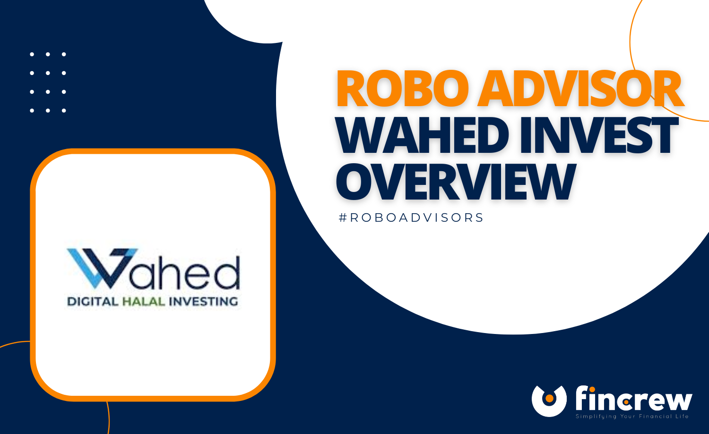

## Table of Contents

## What is Wahed Invest and how does it work?

Wahed Invest is a company that helps Muslims invest their money in a way that follows Islamic rules, called Shariah. It's like a bank but focuses on making sure the investments are halal, which means allowed by Islamic law. People can use Wahed Invest to grow their money over time by investing in things like stocks and bonds that meet these religious guidelines.

When you start with Wahed Invest, you tell them how much risk you're okay with and how long you want to invest. They then pick a mix of investments for you that match your goals and follow Shariah rules. They keep an eye on your investments and make changes if needed to keep everything in line with Islamic finance principles. It's a simple way to invest without worrying about whether your money is being used in ways that go against your beliefs.

## How does Wahed Invest comply with Islamic finance principles?

Wahed Invest follows Islamic finance rules by carefully choosing investments that are allowed under Shariah law. This means they avoid businesses that deal with things like alcohol, gambling, or pork, which are not allowed in Islam. They also make sure not to invest in companies that have too much debt, because charging or paying interest is against Islamic principles. Instead, Wahed Invest focuses on companies that make money in ways that are okay according to Islam, like selling useful products or providing services.

To keep everything in line with Shariah, Wahed Invest works with a board of Islamic scholars who check and approve their investment choices. These scholars make sure that all the investments follow the rules of Islamic finance. Wahed Invest also regularly reviews its portfolio to make sure it stays compliant, and if a company they've invested in starts doing something that's not allowed, they'll sell those investments to keep everything halal. This way, people who use Wahed Invest can feel confident that their money is being used in a way that respects their faith.

## What are the key features of Wahed Invest's platform?

Wahed Invest's platform is easy to use and helps Muslims invest their money in a way that follows Islamic rules. When you sign up, you tell them how much risk you're okay with and how long you want to invest. They then pick a mix of investments for you that match your goals and follow Shariah law. You can check your investments anytime on their website or app, which makes it simple to see how your money is doing.

The platform also has tools to help you learn more about investing. They have articles and videos that explain things in a way that's easy to understand. Plus, Wahed Invest works with a board of Islamic scholars to make sure all their investment choices are okay according to Islam. This means you can feel good about where your money is going, knowing it's following your beliefs.

## Who can use Wahed Invest and in which countries is it available?

Wahed Invest is for Muslims who want to invest their money in a way that follows Islamic rules. It's for people who care about making sure their investments are halal, which means allowed by Islam. Anyone who wants to grow their money over time and follow Shariah law can use Wahed Invest.

Wahed Invest is available in many countries around the world. You can use it in places like the United States, the United Kingdom, Malaysia, the United Arab Emirates, and Canada. They are always working to offer their services in more countries, so more people can invest in a way that fits with their faith.

## What types of investment portfolios does Wahed Invest offer?

Wahed Invest offers different kinds of investment portfolios to fit what people want and how much risk they're okay with. They have portfolios for people who want to be safe and not take big risks, and others for people who are okay with more risk and want to grow their money faster. These portfolios are made to follow Islamic rules, so they only include companies that do things allowed by Shariah law.

They also have portfolios for people who want to invest for the long term, like saving for retirement, and others for people who want to invest for a shorter time. No matter which portfolio you choose, Wahed Invest makes sure it's filled with investments that are halal, meaning they follow Islamic finance principles. They work with Islamic scholars to check and make sure everything is okay.

## How does Wahed Invest select and manage its investments?

Wahed Invest picks and manages investments by following Islamic rules, called Shariah. They look at companies to see if they do things that are okay according to Islam. They avoid businesses that deal with stuff like alcohol, gambling, or pork, which are not allowed. They also make sure not to invest in companies that have too much debt because charging or paying interest is against Islamic principles. Instead, they choose companies that make money in ways that are allowed, like selling useful products or providing services that follow Islamic guidelines.

To keep everything in line with Shariah, Wahed Invest works with a group of Islamic scholars. These scholars check and approve the investments to make sure they follow Islamic finance rules. Wahed Invest also keeps an eye on their investments all the time. If a company they've invested in starts doing something that's not allowed, they will sell those investments to keep everything halal. This way, people using Wahed Invest can feel good about where their money is going, knowing it's following their beliefs.

## What are the fees associated with using Wahed Invest?

Wahed Invest charges fees for managing your money and making sure your investments follow Islamic rules. They have a management fee, which is a small percentage of the money you invest. This fee helps them pay for things like picking the right investments for you and keeping everything in line with Shariah law. The exact percentage can change depending on how much money you have invested, but it's usually around 0.99% per year.

There might also be other small fees that come from buying and selling the investments in your portfolio. These are called transaction fees, and they're pretty normal when you're investing. Wahed Invest tries to keep these fees as low as possible so more of your money can grow over time. It's a good idea to check their website or ask them directly to understand all the fees you might have to pay.

## How does Wahed Invest ensure the ethical screening of its investments?

Wahed Invest makes sure its investments are ethical by following Islamic rules, called Shariah. They look at companies to see if they do things that are okay according to Islam. They avoid businesses that deal with stuff like alcohol, gambling, or pork, which are not allowed. They also make sure not to invest in companies that have too much debt because charging or paying interest is against Islamic principles. Instead, they choose companies that make money in ways that are allowed, like selling useful products or providing services that follow Islamic guidelines.

To keep everything in line with Shariah, Wahed Invest works with a group of Islamic scholars. These scholars check and approve the investments to make sure they follow Islamic finance rules. Wahed Invest also keeps an eye on their investments all the time. If a company they've invested in starts doing something that's not allowed, they will sell those investments to keep everything halal. This way, people using Wahed Invest can feel good about where their money is going, knowing it's following their beliefs.

## Can you explain the performance metrics and historical returns of Wahed Invest?

Wahed Invest keeps track of how well its investments are doing by looking at things like how much money they make over time and how much risk they take. They share this information with people who invest with them so everyone can see how their money is growing. The performance of Wahed Invest can change because of things like what's happening in the stock market or the economy. But overall, they try to pick investments that will do well in the long run while following Islamic rules.

When you look at the past, Wahed Invest has had different returns depending on the time you look at. For example, if you invested with them a few years ago, you might have seen your money grow by a certain percentage each year. But remember, past results don't promise what will happen in the future. Wahed Invest always tries to balance making money with staying true to Shariah, which means they might not always pick the investments that grow the fastest but they make sure they're doing things the right way according to Islamic law.

## What are the risks involved in investing with Wahed Invest?

Investing with Wahed Invest, like any investing, comes with risks. The value of your investments can go up and down because of things happening in the stock market or the economy. This means you might not make as much money as you hoped, or you could even lose some of your money. Wahed Invest tries to pick good investments that follow Islamic rules, but they can't control everything that happens in the market.

Another risk is that Wahed Invest's focus on Shariah compliance might mean they miss out on some investments that could grow faster but don't follow Islamic rules. This means their returns might be different from other investment companies that don't have these rules. It's important to remember that all investing has risks, and Wahed Invest does its best to manage these risks while staying true to Islamic principles.

## How does Wahed Invest's robo-advisor technology compare to traditional financial advisors?

Wahed Invest's robo-advisor technology is different from traditional financial advisors because it uses computers to pick and manage investments. With Wahed Invest, you answer some questions about how much risk you're okay with and how long you want to invest. Then, their computer system creates a plan for you that follows Islamic rules. This makes it easy and fast, and you don't have to pay as much as you would for a human advisor. Traditional financial advisors, on the other hand, are people who sit down with you, talk about your goals, and give you personal advice. They might know you better and can change your investments more often based on what's happening in your life or the market.

Even though robo-advisors like Wahed Invest are cheaper and easy to use, they might not give you the personal touch that a human advisor can. A traditional advisor can explain things in a way that's easy to understand and help you feel more comfortable with your choices. They can also meet with you regularly to make sure your investments are still a good fit for you. But with Wahed Invest, you get the benefit of knowing your money is being handled in a way that follows your Islamic beliefs, and you can check on your investments anytime using their website or app. So, it really depends on what you're looking for - the personal service of a human advisor or the easy, low-cost way of a robo-advisor that stays true to your faith.

## What future developments or expansions are planned for Wahed Invest?

Wahed Invest is always looking to grow and help more people invest in a way that follows Islamic rules. They want to offer their services in more countries around the world. Right now, they are working on getting the right permissions to start in new places. This means more Muslims can use Wahed Invest to grow their money while staying true to their faith.

They are also thinking about adding new types of investments to their platform. This could include things like real estate or other ways to invest that still follow Shariah law. By doing this, Wahed Invest hopes to give people more choices and help them reach their money goals in different ways. They want to keep making their service better and easier to use, so more people can feel good about where their money is going.

## What is a Robo-Advisor?

Robo-advisors are technological platforms that utilize advanced algorithms to deliver financial advice and manage investment portfolios with minimal human intervention. These platforms have rapidly gained popularity due to their ability to provide cost-effective, automated investing solutions typically accessible through user-friendly mobile applications. The increasing demand for robo-advisors can be attributed to their efficiency in managing portfolios, significantly reducing the overhead that is typically associated with traditional financial advisory services.

One of the fundamental principles employed by robo-advisors is modern portfolio theory (MPT), which aims to optimize diversification and manage risk. MPT suggests that it is possible to construct an 'efficient frontier' of optimal portfolios offering the maximum possible expected return for a given level of risk. This is mathematically represented by the equation:

$$
E(R_p) = \sum_{i=1}^n w_i E(R_i)
$$

where $E(R_p)$ is the expected return of the portfolio, $w_i$ are the weights of each individual asset, and $E(R_i)$ is the expected return of asset $i$.

By leveraging such theories, robo-advisors are capable of providing bespoke investment solutions tailored to an individual's specific risk tolerance, investment goals, and time horizons. This customization ensures that each user receives a personalized and strategically optimized portfolio.

Wahed Invest differentiates itself from conventional robo-advisors by embedding Islamic Sharia-compliant principles within its investment strategy. This integration ensures that all financial activities adhere to the ethical guidelines dictated by Islamic finance, which prohibits investments in certain sectors such as alcohol, gambling, and interest-based financial services. By doing so, Wahed Invest caters to the unique needs of Muslim investors, as well as those who are interested in ethical and socially responsible investing practices, setting it apart in the robo-advisory landscape.

## What are the mechanics of Wahed Invest's algorithmic trading model?

Wahed Invest employs a sophisticated [algorithmic trading](/wiki/algorithmic-trading) model designed to automatically rebalance investor portfolios at regular intervals. This process is pivotal for maintaining an optimal balance of assets that align with the investor's predefined risk tolerance. The algorithm evaluates current market conditions and makes adjustments to the portfolio to reflect an ideal asset distribution.

The core of Wahed Invest's strategy involves leveraging technology to manage risk dynamically. Algorithms continually assess the market and, when necessary, execute trades to keep portfolios within set risk parameters. This approach allows for rapid responses to market [volatility](/wiki/volatility-trading-strategies), thereby protecting investors from excessive exposure to riskier assets. By doing so, the platform aims to optimize performance and ensure that portfolios remain diversified according to each investor's specific goals.

Algorithmic rebalancing at Wahed Invest involves mathematical models that can be expressed using formulas such as:

$$
\text{New Portfolio Weight} = \frac{\text{Current Asset Value}}{\text{Total Portfolio Value}}
$$

This formula ensures that each asset in the portfolio is held in proportion to its market value, enabling proportional adjustments based on market shifts.

Despite the automation benefits, Wahed Invest's rebalancing practices came under scrutiny by the U.S. Securities and Exchange Commission (SEC) in 2022. The SEC's concerns were likely tied to transparency and adherence to stated investment strategies. However, Wahed is committed to improving its systems through ongoing technological advances and enhanced financial strategies.

The company remains dedicated to refining its platform to better serve its clients, balancing the efficiency of automated trading with the need for transparency and regulatory compliance. This commitment underscores Wahed Invest's focus on creating a robust, ethical investment experience while responding proactively to regulatory feedback and technological innovations.

## References & Further Reading

[1]: Markowitz, H. (1952). ["Portfolio Selection."](https://onlinelibrary.wiley.com/doi/abs/10.1111/j.1540-6261.1952.tb01525.x) The Journal of Finance, 7(1), 77-91.

[2]: Siddiqi, M. F. (2008). ["Islamic Banking and Finance in Theory and Practice: A Survey of State of the Art."](http://iesjournal.org/english/Docs/090.pdf) Islamic Economic Studies, 14(2), 1-48.

[3]: Kahf, M. (2003). ["Islamic Economics: Notes on Definition and Methodology."](https://monzer.kahf.com/papers/english/paper_of_methdology.pdf) Review of Islamic Economics, 13, 23-47.

[4]: Gomber, P., Koch, J. A., & Siering, M. (2017). ["Digital Finance and Fintech: Current Research and Future Research Directions."](https://link.springer.com/article/10.1007/s11573-017-0852-x) Journal of Business Economics, 87(5), 537-580.

[5]: El-Gamal, M. A. (2006). ["Islamic Finance: Law, Economics, and Practice"](https://iefpedia.com/english/wp-content/uploads/2009/12/Islamin-Finance-Low-Economics-practice.pdf) Cambridge University Press.

[6]: Statman, M. (2000). ["Socially Responsible Mutual Funds."](https://www.researchgate.net/publication/240311517_Socially_Responsible_Mutual_Funds) Financial Analysts Journal, 56(3), 30-39.