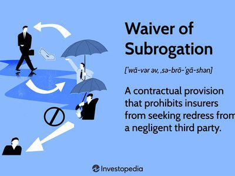

Algorithmic trading, or algo trading, has significantly impacted the financial markets by streamlining trade executions through automated systems that operate based on pre-defined criteria. This innovative approach utilizes complex algorithms for decision-making, allowing for rapid and precise market transactions that would be beyond the capability of human traders. The evolution of algorithmic trading has not only increased efficiency but has also brought about unprecedented challenges and opportunities within the trading ecosystem.

As technologies and strategies evolve, legal considerations have become increasingly integral to safeguarding both traders and financial service providers. Legal documents, contracts, and waivers are essential components that define the operational framework and risk management practices in algorithmic trading. These legal instruments ensure that all parties involved understand their rights and obligations, particularly in a landscape where trades occur at lightning-fast speeds and are executed by machines rather than individuals. The interplay between technology and legal structures is crucial for maintaining market integrity and protecting the interests of all stakeholders.

This article explores how algorithmic trading intersects with legal frameworks, including the critical role of waivers and contracts. These elements not only help in outlining the operational parameters but also in mitigating legal risks associated with automated trading practices. Understanding these legal complexities is essential for traders and firms looking to navigate and thrive in the competitive world of algorithmic trading.

## Table of Contents

## Understanding Waivers in Legal Contracts

A waiver is a notable component of legal contracts, particularly in complex domains like finance and trading. Fundamentally, a waiver constitutes a legal document where one party consciously and voluntarily surrenders a recognized right or claim within a contractual framework. The essence of a waiver lies in its capacity to adjust the legal rights and responsibilities of the involved parties, often serving as a pivotal element in risk management strategies.

In the context of finance and trading, waivers are instrumental in articulating and managing associated risks. They serve to delineate the boundaries of liability and responsibility, thereby ensuring clarity and precision in contractual obligations. For instance, a commonly encountered scenario is the waiver of liability in high-risk trading activities. This waiver permits parties, such as traders or brokers, to limit their legal exposure to potential financial losses that may arise from volatile market conditions or unforeseen trading anomalies. By acknowledging the inherent risks, parties can safeguard themselves from extensive legal repercussions and maintain a more predictable risk environment.

Another common application of waivers in financial contracts involves loan agreements, where waivers of demand or notice might be utilized. In such instances, a borrower might waive the right to formal demand notice from the lender, which can expedite legal proceedings and streamline the enforcement of the agreement terms. This is particularly beneficial in maintaining the efficiency of financial operations, allowing for swift action in the event of default or contractual breaches.

The strategic use of waivers ensures that parties are not inadvertently burdened with obligations that they are either unable or unwilling to bear. By voluntarily relinquishing certain rights, organizations and individuals can focus on the core objectives of their financial activities, while simultaneously protecting themselves from undue risk. Consequently, carefully drafted waivers form an integral part of the risk management arsenal, supporting a balanced and efficient financial ecosystem.

## Legal Documents Essential for Algo Trading

Algorithmic trading relies heavily on a series of pivotal legal documents that form the backbone of interactions among traders, brokers, and technology providers. These documents not only establish the operational framework but also manage the expectations and responsibilities of all parties involved.

Contracts serve as the primary legal foundation in algo trading. They typically define the scope of software usage, outline data access permissions, and incorporate liability waivers. A well-structured contract delineates the duties, rights, and liabilities of each party, reducing the likelihood of misunderstandings or disputes. Important elements in these contracts often encompass the permissible use of trading software, detailing any restrictions or conditions in software licenses, as well as data privacy and integrity stipulations. 

User agreements are another critical component. They detail the terms under which traders and brokers access trading platforms and related technologies. These agreements typically include clauses about the software's performance expectations, data handling procedures, and conditions under which either party can terminate the agreement. Such agreements are vital in ensuring clarity and consent regarding the operational modalities of [algorithmic trading](/wiki/algorithmic-trading) systems.

Legal documents must also incorporate clear terms regarding data access between traders and technology providers. Data is a crucial element in algorithmic trading, and agreements must specify the type, extent, and manner of data that can be accessed or used. These terms are essential for compliance with relevant data protection regulations, such as the General Data Protection Regulation (GDPR) in the EU or the California Consumer Privacy Act (CCPA) in the United States. 

Liability waivers included in these documents are designed to protect parties against unforeseen incidents, clarifying who bears financial responsibility in the event of system failures or erroneous trades. For instance, a waiver could specify that a trader assumes all risks from using a specific algorithm or software, thereby shielding the technology provider from claims resulting from financial losses.

Finally, clear contractual terms are not just about compliance; they are instrumental in minimizing potential conflicts. By ensuring that obligations and contingencies are explicitly addressed, these documents foster more predictable and amicable relationships among the parties. They also affirm adherence to financial regulations, which are critical to maintaining operational legitimacy and trust in the financial markets.

In summary, the efficacy of algorithmic trading depends significantly on well-crafted legal agreements and contracts that govern operational expectations, establish clear responsibilities, and ensure compliance with regulatory standards.

## Waivers and Risk Management in Algo Trading

Waivers are critical in algorithmic trading for managing the risks inherent in automated financial markets by clearly defining the liabilities and responsibilities of all parties involved. As algorithmic trading operates based on pre-defined criteria and often involves complex software systems, the allocation and limitation of liabilities through waivers can mitigate potential legal and financial risks.

One prominent example is the waiver of liability from software providers. In algorithmic trading, software—often developed by third-party providers—functions as the backbone of trading systems. These complex algorithms can malfunction or behave unpredictably, potentially leading to substantial financial losses. To protect against such outcomes, software providers may include waivers in their contracts that limit their liability for any financial losses incurred from the use of their trading platforms. These waivers are crucial as they delineate the provider's accountability, indicating the user's responsibility for any inefficacies during the trading process.

Moreover, properly drafted waivers serve as safeguards against costly legal disputes. They operate as preemptive measures, reducing ambiguity in legal responsibilities and clarifying what risks are consciously assumed by the traders or clients using the algorithmic trading systems. The clarity provided by these waivers ensures that expectations are managed and that both parties have a mutual understanding of their risk exposures.

Effective waiver drafting requires careful legal consideration to ensure enforceability. This involves employing clear language to communicate the extent and limitations of the waiver, ensuring it is voluntary and that all parties have a substantial understanding of the rights they are relinquishing. The efficacy of a waiver in protecting an organization is heavily dependent on these legal nuances.

In essence, waivers in algorithmic trading serve a dual purpose: they allocate risk appropriately among involved entities and provide a buffer against litigation that may arise from unforeseen system failures or market fluctuations. As the algorithmic trading industry continues to evolve, a balanced approach to risk management, backed by well-constructed waivers, remains fundamental to maintaining stability and promoting innovation within the market.

## Practical Applications: Waivers in Financial Transactions

In financial transactions, waivers are often utilized to streamline processes and ensure smooth operations. Loan agreements frequently incorporate waivers to expedite legal proceedings. For instance, a "waiver of notice" clause allows lenders to accelerate the loan repayment process without notifying the borrower, thus acting swiftly in cases of default. This ensures that lenders can protect their interests promptly, reducing the risk associated with delayed actions.

In the context of trading agreements, waivers may address crucial elements such as data feed access rights or margin requirements. For example, a waiver regarding data feed access could permit traders to utilize market data without incurring additional fees or legal liabilities, thereby facilitating more efficient trading operations. Similarly, margin requirement waivers can be implemented to modify or relax the collateral obligations that traders must meet, adjusting for specific conditions or strategic interests that may arise.

Understanding these waivers' strategic implications can significantly enhance a firm's operational efficiency. By clearly defining the terms and conditions under which waivers are applicable, firms can better manage their legal risks and operational constraints. This proactive approach allows them to navigate the complexities of financial transactions with greater ease and adaptability, ultimately contributing to a more robust and resilient trading environment. Additionally, as trading technology continues to evolve, optimizing waivers to accommodate new innovations becomes essential for staying competitive and compliant in the fast-paced financial markets.

## Regulatory Considerations for Algo Trading Waivers

Financial regulators play a crucial role in shaping the landscape of algorithmic trading by imposing specific waivers to ensure compliance with established trading rules and regulations. These waivers are not only crucial for maintaining orderly markets but also serve a larger purpose in promoting innovation within the financial sector.

One of the primary ways regulators utilize waivers is by facilitating the safe deployment and testing of new trading technologies. This process allows financial institutions to experiment under controlled conditions, thereby mitigating potential systemic risks. For instance, sandbox environments are often employed where companies can trial their algorithmic trading solutions while under regulatory observation. These environments ensure that any adverse effects are contained and provide a structured pathway for assessing the compliance and performance of new systems before they launch on a broader scale.

Regulatory waivers are also instrumental in aligning trading operations with dynamic legal landscapes that are continuously evolving in response to technological advancements and market developments. This adaptability is crucial for ensuring that financial institutions remain compliant with international and domestic regulations. For example, the European Union's Market in Financial Instruments Directive II (MiFID II) and the United States' Dodd-Frank Act both necessitate regular updates to trading practices, which can often be achieved through the strategic application of waivers.

Furthermore, staying informed about regulatory changes is vital for all participants in the algorithmic trading sector. Regulatory bodies frequently update their requirements to enhance market transparency, reduce risk, and ensure fair dealing. Firms engaged in algorithmic trading must maintain robust compliance frameworks that can swiftly adapt to these changes. This necessitates continuous monitoring of regulatory announcements and active participation in consultative processes with regulators. 

Innovation in trading technologies can significantly benefit from proactive engagement with regulators. By understanding the implications of regulatory waivers and leveraging them effectively, trading firms can optimize their operations, reduce compliance costs, and accelerate the adoption of cutting-edge trading solutions. 

In summary, regulatory considerations in algorithmic trading waivers not only ensure compliance but also foster innovation by creating a robust yet flexible framework for the introduction of new technologies. Staying current with regulation and strategically employing waivers enables firms to navigate the complexities of the financial markets effectively.

## Conclusion

The interplay between legal documents, contracts, and waivers is a defining [factor](/wiki/factor-investing) in the structure and efficiency of algorithmic trading. These legal instruments serve as the backbone of the trading framework by delineating the rights, responsibilities, and liabilities of all parties involved, thereby fostering a secure trading environment. Ensuring that these agreements are meticulously drafted and consensually agreed upon is not merely a legal exercise, but a strategic necessity. It helps prevent potential disputes, safeguard against substantial financial losses, and maintain the integrity and righteousness of financial operations.

Organizations engaged in algorithmic trading must strive for a balance between adhering to rigorous legal requirements and promoting technological innovation. This balance is crucial as the industry continues to evolve with technological advancements. Overly restrictive legal frameworks can stifle innovation and delay the adoption of beneficial trading technologies. Conversely, a lack of legal structure can lead to significant risks, including financial losses and regulatory penalties.

An optimal approach involves continuous collaboration between legal experts, technologists, and trading strategists to design flexible yet robust legal agreements that accommodate new trading methodologies while ensuring compliance with existing regulations. Monitoring and adapting to regulatory changes is equally essential to optimize this balance and sustain competitive advantage in the dynamic environment of algorithmic trading. 

In conclusion, the integration of well-conceived legal instruments not only fortifies the operational framework of algorithmic trading but also serves as a catalyst for innovation and growth in the financial markets.

## References & Further Reading

[1]: Bergstra, J., Bardenet, R., Bengio, Y., & Kégl, B. (2011). ["Algorithms for Hyper-Parameter Optimization."](https://dl.acm.org/doi/10.5555/2986459.2986743) Advances in Neural Information Processing Systems 24.

[2]: ["Advances in Financial Machine Learning"](https://www.amazon.com/Advances-Financial-Machine-Learning-Marcos/dp/1119482089) by Marcos Lopez de Prado

[3]: ["Evidence-Based Technical Analysis: Applying the Scientific Method and Statistical Inference to Trading Signals"](https://www.amazon.com/Evidence-Based-Technical-Analysis-Scientific-Statistical/dp/0470008741) by David Aronson

[4]: ["Machine Learning for Algorithmic Trading"](https://github.com/stefan-jansen/machine-learning-for-trading) by Stefan Jansen

[5]: ["Quantitative Trading: How to Build Your Own Algorithmic Trading Business"](https://www.amazon.com/Quantitative-Trading-Build-Algorithmic-Business/dp/1119800064) by Ernest P. Chan