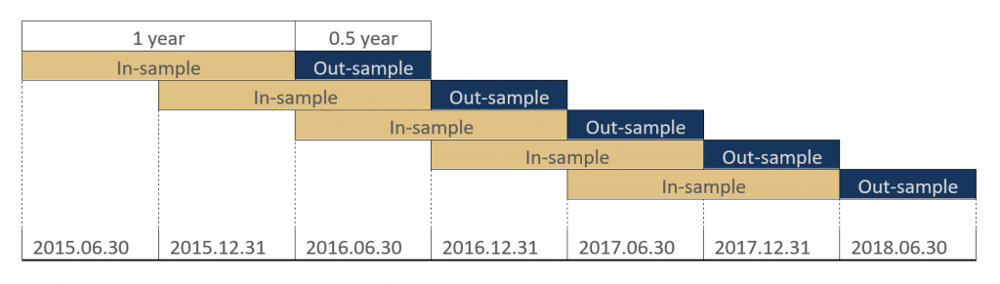

## Table of Contents

## What is Walk-Forward Optimization?

Walk-Forward Optimization is a method used in trading and finance to test and improve trading strategies. It works by breaking down historical data into smaller parts, called in-sample and out-of-sample periods. The strategy is first developed and optimized using the in-sample data. Then, it is tested on the out-of-sample data to see how well it performs. This process is repeated, moving forward through time, to make sure the strategy works well over different periods.

This method helps to avoid overfitting, which happens when a strategy works well on past data but not on new data. By testing the strategy on different time periods, Walk-Forward Optimization gives a more realistic view of how the strategy might perform in the future. It's like practicing a sport with different conditions to get better at it, rather than just practicing in one specific way.

## Why is Walk-Forward Optimization important in trading and forecasting?

Walk-Forward Optimization is important in trading and forecasting because it helps make sure that trading strategies work well over time, not just in the past. When you create a trading strategy, you might use old data to see how it would have worked. But if you only use that old data, your strategy might not work well with new data. Walk-Forward Optimization fixes this problem by testing the strategy on different time periods, which makes it more likely to work well in the future.

This method also helps avoid a big problem called overfitting. Overfitting happens when a strategy is too focused on past data and doesn't work well with new data. By using Walk-Forward Optimization, you can see how your strategy does on data it hasn't seen before. This gives you a better idea of how it might perform in real trading situations. It's like checking if your strategy can adapt to different market conditions, making it more reliable and useful for making money in trading.

## How does Walk-Forward Optimization differ from traditional backtesting?

Walk-Forward Optimization and traditional [backtesting](/wiki/backtesting) are both used to test trading strategies, but they do it in different ways. Traditional backtesting uses all the old data at once to see how a strategy would have worked in the past. It's like looking at a whole history book to see if your strategy would have made money. But this method can make the strategy too focused on the past, which might not help it work well in the future.

Walk-Forward Optimization, on the other hand, breaks the old data into smaller parts and tests the strategy step by step. It's like reading the history book chapter by chapter, making sure the strategy works well in each part. This method helps the strategy adapt to different times and conditions, making it more likely to work well in the future. By testing the strategy on new parts of the data as it moves forward, Walk-Forward Optimization gives a better idea of how the strategy might perform in real trading situations.

## What are the basic steps involved in performing Walk-Forward Optimization?

To perform Walk-Forward Optimization, you start by dividing your historical data into two parts: an in-sample period and an out-of-sample period. The in-sample period is used to develop and optimize your trading strategy. You test different settings and rules to see what works best with this data. Once you have a strategy that works well on the in-sample data, you then test it on the out-of-sample period to see how it performs on data it hasn't seen before. This helps you check if your strategy is good at adapting to new conditions.

After testing the strategy on the out-of-sample period, you move forward in time. You take the next part of your historical data and use it as a new in-sample period. You might adjust your strategy based on how it did in the last out-of-sample test, and then you optimize it again with this new in-sample data. Once optimized, you test it on the next out-of-sample period. You keep doing this, moving forward through time, until you've gone through all your data. This way, you can see how your strategy performs over different time periods, making it more likely to work well in the future.

## Can you explain the concept of in-sample and out-of-sample data in Walk-Forward Optimization?

In Walk-Forward Optimization, in-sample data is the part of your historical data that you use to create and fine-tune your trading strategy. Think of it like practicing a sport with a set of rules and conditions. You try different moves and strategies to see what works best within this specific set of data. Once you find a strategy that performs well on the in-sample data, you feel confident about it, but you need to check if it will work in different conditions too.

That's where out-of-sample data comes in. Out-of-sample data is the next part of your historical data that your strategy hasn't seen yet. It's like playing the sport in a new environment or against different opponents. You use this data to test your strategy and see how well it adapts to new conditions. By testing on out-of-sample data, you get a better idea of how your strategy might perform in the future, making sure it's not just good at the past but also ready for what's ahead.

## What are the key parameters to consider when setting up a Walk-Forward Optimization?

When setting up Walk-Forward Optimization, one of the key parameters to consider is the size of the in-sample and out-of-sample periods. You need to decide how much historical data to use for developing your strategy and how much to use for testing it. If the in-sample period is too short, you might not have enough data to create a good strategy. If it's too long, you might not have enough out-of-sample data to test it properly. Finding the right balance is important to make sure your strategy is both well-developed and well-tested.

Another important parameter is the step size, which is how far you move forward in time after each optimization and test cycle. A smaller step size means you'll have more cycles, which can give you a more detailed view of how your strategy performs over time. But it also means more work and more chances for overfitting if you're not careful. A larger step size means fewer cycles, which can be quicker but might miss important changes in market conditions. Choosing the right step size depends on how often you think market conditions might change and how much detail you need in your testing.

## How do you determine the optimal window size for Walk-Forward Optimization?

Determining the optimal window size for Walk-Forward Optimization involves finding the right balance between the in-sample and out-of-sample periods. The in-sample period is the part of the data you use to develop and fine-tune your trading strategy. If this period is too short, you might not have enough data to create a good strategy. On the other hand, if it's too long, you might not leave enough data for testing, which is important to see how your strategy performs on new data. The out-of-sample period is the part of the data you use to test your strategy. If this period is too short, you might not get a good idea of how your strategy will work in the future. If it's too long, you might not have enough data left to keep moving forward and testing your strategy over time.

To find the best window size, you can start by trying different sizes and seeing how your strategy performs. You might begin with a larger in-sample period to make sure you have enough data to develop a good strategy, and then gradually reduce it to see if your strategy still works well on the out-of-sample data. It's also important to consider the step size, which is how far you move forward in time after each cycle. A smaller step size means more cycles and more detailed testing, but it can be more time-consuming. A larger step size means fewer cycles, which can be quicker but might miss important changes in market conditions. By experimenting with different window sizes and step sizes, you can find the combination that works best for your trading strategy.

## What are common pitfalls and challenges when implementing Walk-Forward Optimization?

One common pitfall when implementing Walk-Forward Optimization is overfitting. This happens when you adjust your strategy too much to fit the in-sample data, making it work really well on that data but not on new data. It's like memorizing answers for a test instead of learning the material. To avoid this, you need to be careful not to make too many changes to your strategy based on the in-sample results. Another challenge is choosing the right window sizes for the in-sample and out-of-sample periods. If the in-sample period is too short, you might not have enough data to create a good strategy. If it's too long, you might not have enough data left to test it properly.

Another challenge is the computational demand of Walk-Forward Optimization. Since you're testing your strategy over many different time periods, it can take a lot of time and computer power. This can be especially tough if you're working with a lot of data or if you're trying many different strategies. You might need to use powerful computers or find ways to make the process more efficient. Also, deciding on the right step size can be tricky. A smaller step size means more detailed testing but more work, while a larger step size means less work but less detail. Finding the right balance is important to make sure your strategy is both well-developed and well-tested.

## How can Walk-Forward Optimization be used to improve model robustness?

Walk-Forward Optimization helps make trading strategies more robust by testing them on different parts of historical data. Instead of just using all the old data at once, Walk-Forward Optimization breaks it into smaller pieces. You use one piece to create and fine-tune your strategy, and then you test it on a new piece of data it hasn't seen before. By doing this over and over, moving forward in time, you can see how your strategy works in different conditions. This helps make sure your strategy isn't just good at the past but can also handle new situations.

This method also helps avoid overfitting, which is when a strategy works too well on old data but not on new data. By testing your strategy on new data as you move forward, you can see if it's really good or if it's just good at the past. This makes your strategy more reliable because it has to prove itself over and over again. In the end, Walk-Forward Optimization helps you create a strategy that's more likely to work well in the future, making it more robust and useful for real trading.

## What advanced techniques can be applied to enhance the effectiveness of Walk-Forward Optimization?

One advanced technique to enhance Walk-Forward Optimization is using multiple in-sample and out-of-sample periods at the same time. Instead of just using one set of data to develop your strategy and another to test it, you can use several sets. This means you can create and test your strategy on different parts of the data at the same time. By doing this, you can see how your strategy works in many different conditions, making it more likely to work well in the future. It's like practicing a sport in different weather and against different teams to make sure you're ready for anything.

Another technique is to use [machine learning](/wiki/machine-learning) to help with the optimization process. Machine learning can look at a lot of data and find patterns that might be hard for a person to see. You can use it to help choose the best settings for your strategy during the in-sample period. Then, you can test these settings on the out-of-sample data to see how well they work. This can make your strategy even better because it's using smart technology to find the best way to trade. It's like having a coach who can see all the little details and help you improve your game.

## How does Walk-Forward Optimization integrate with machine learning algorithms?

Walk-Forward Optimization can work together with machine learning algorithms to make trading strategies even better. Machine learning can look at a lot of data and find patterns that might be hard for a person to see. You can use machine learning to help choose the best settings for your strategy during the in-sample period. This means you're using smart technology to find the best way to trade. It's like having a coach who can see all the little details and help you improve your game.

Once you've used machine learning to fine-tune your strategy on the in-sample data, you can then test it on the out-of-sample data to see how well it works. By doing this over and over, moving forward in time, you can see how your strategy works in different conditions. This helps make sure your strategy isn't just good at the past but can also handle new situations. In the end, using machine learning with Walk-Forward Optimization can help you create a strategy that's more likely to work well in the future, making it more reliable and useful for real trading.

## What are the latest research developments and future trends in Walk-Forward Optimization?

Recent research in Walk-Forward Optimization has focused on making it work better with new technology like machine learning and [artificial intelligence](/wiki/ai-artificial-intelligence). Scientists are trying to use these smart tools to find the best settings for trading strategies during the in-sample period. This means they can look at a lot of data and find patterns that might be hard for people to see. By using machine learning, they hope to make trading strategies even better and more likely to work well in the future. They're also working on ways to make the process faster and easier, so it doesn't take as much time and computer power.

In the future, Walk-Forward Optimization might become even more important in trading and forecasting. As more data becomes available and technology gets better, people might use it to test and improve their strategies in new ways. They might start using it with other methods, like [reinforcement learning](/wiki/reinforcement-learning), to make their strategies even smarter. This could help them make better decisions and make more money in trading. Overall, Walk-Forward Optimization is likely to keep getting better and more useful as technology and research move forward.

## References & Further Reading

[1]: Bergstra, J., Bardenet, R., Bengio, Y., & Kégl, B. (2011). ["Algorithms for Hyper-Parameter Optimization."](https://papers.nips.cc/paper/4443-algorithms-for-hyper-parameter-optimization) Advances in Neural Information Processing Systems 24.

[2]: ["Advances in Financial Machine Learning"](https://www.amazon.com/Advances-Financial-Machine-Learning-Marcos/dp/1119482089) by Marcos Lopez de Prado

[3]: ["Evidence-Based Technical Analysis: Applying the Scientific Method and Statistical Inference to Trading Signals"](https://www.amazon.com/Evidence-Based-Technical-Analysis-Scientific-Statistical/dp/0470008741) by David Aronson

[4]: ["Machine Learning for Algorithmic Trading"](https://github.com/stefan-jansen/machine-learning-for-trading) by Stefan Jansen

[5]: ["Quantitative Trading: How to Build Your Own Algorithmic Trading Business"](https://www.amazon.com/Quantitative-Trading-Build-Algorithmic-Business/dp/1119800064) by Ernest P. Chan