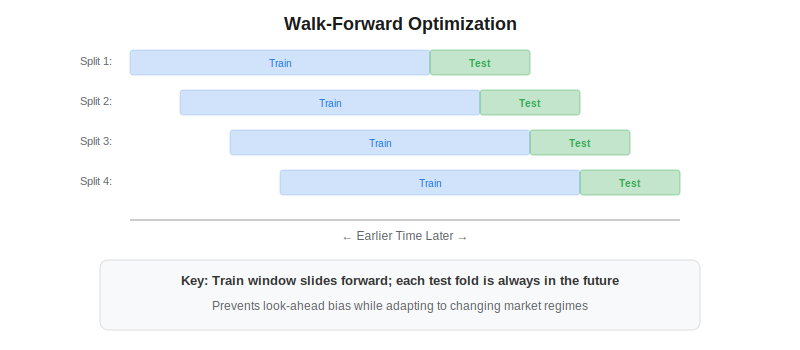
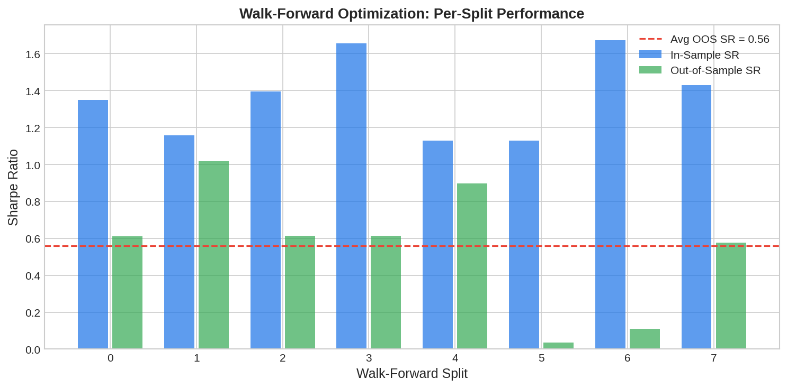

Walk-forward optimization (WFO) is a backtesting methodology that evaluates trading strategies by repeatedly training on a historical window and testing on the immediately following out-of-sample period, then sliding both windows forward in time. Unlike static train-test splits, WFO simulates the real-world workflow of a quant trader: calibrate a model on recent data, trade on new data, recalibrate, and repeat. It is a cornerstone of the AFML validation framework alongside [purged cross-validation](https://paperswithbacktest.com/wiki/purged-k-fold-cross-validation) and [CPCV](https://paperswithbacktest.com/wiki/combinatorial-purged-cross-validation-cpcv).

## Why Walk-Forward Optimization?

Static backtests train on data from period A and test on period B. This has two problems: the model never adapts to changing market conditions, and the single train-test boundary may coincide with a regime change that gives misleading results. WFO addresses both by producing *multiple* independent out-of-sample test periods, each preceded by fresh training.



## How WFO Works

1. **Define windows:** Choose a training window length $W_{\text{train}}$ and a test window length $W_{\text{test}}$.
2. **First split:** Train on bars $[0, W_{\text{train}})$, test on $[W_{\text{train}}, W_{\text{train}} + W_{\text{test}})$.
3. **Slide forward:** Move both windows by $W_{\text{test}}$ (or a step size $s$). Train on $[s, s + W_{\text{train}})$, test on $[s + W_{\text{train}}, s + W_{\text{train}} + W_{\text{test}})$.
4. **Repeat** until data is exhausted.
5. **Concatenate** all out-of-sample test results to form a continuous equity curve.

### Embargo Period

To prevent information leakage from labels that overlap the train-test boundary, add an embargo gap of $h$ bars between training and test sets. This is the same principle as [purged k-fold cross-validation](https://paperswithbacktest.com/wiki/purged-k-fold-cross-validation).



## Python Implementation

```python
import numpy as np
import pandas as pd
from sklearn.ensemble import RandomForestClassifier

def walk_forward_optimization(X, y, train_window, test_window, embargo=5):
    results = []
    n = len(X)
    start = 0
    while start + train_window + embargo + test_window <= n:
        train_end = start + train_window
        test_start = train_end + embargo
        test_end = test_start + test_window
        
        X_train = X.iloc[start:train_end]
        y_train = y.iloc[start:train_end]
        X_test = X.iloc[test_start:test_end]
        y_test = y.iloc[test_start:test_end]
        
        clf = RandomForestClassifier(n_estimators=200, max_depth=5, random_state=42)
        clf.fit(X_train, y_train)
        
        preds = clf.predict_proba(X_test)[:, 1]
        score = clf.score(X_test, y_test)
        results.append({"start": test_start, "end": test_end, "score": score,
                        "predictions": preds, "actuals": y_test.values})
        start += test_window  # slide forward
    return results
```

## Key Parameters

| Parameter | Typical Range | Tradeoff |
|---|---|---|
| Train window | 252–756 bars (1–3 years) | Longer = more stable, slower to adapt |
| Test window | 21–63 bars (1–3 months) | Shorter = more splits, noisier per-split |
| Embargo | 1–20 bars | Must exceed max label span |
| Step size | Equal to test window (non-overlapping) | Smaller step = more splits but correlated |

## Limitations and Risks

WFO assumes that the optimal model complexity is constant across all windows — in practice, some regimes may need deeper trees while others need shallower ones. WFO also has a fixed train window, which means very old data eventually drops out; this can be problematic if historical crises contain relevant signal. Finally, the concatenated OOS equity curve has non-constant observation density near the start and end of the dataset.

## Conclusion

Walk-forward optimization is the most realistic way to validate a trading strategy because it mimics the actual deployment cycle. Combined with the [deflated Sharpe ratio](https://paperswithbacktest.com/wiki/deflated-sharpe-ratio) to adjust for parameter tuning within each window, it provides a robust estimate of how a [systematic trading strategy](https://paperswithbacktest.com/wiki/systematic-trading-strategies) will perform in live markets.

---

**Explore further on PapersWithBacktest:**
- Browse [backtested strategies](https://paperswithbacktest.com/strategies) with Python code and performance metrics
- Access [clean historical market data](https://paperswithbacktest.com/datasets) for equities, crypto, and futures
- Take the [algo trading course](https://paperswithbacktest.com/course) — 60+ video lessons and notebooks
- Related wiki pages: [Purged K-Fold CV](https://paperswithbacktest.com/wiki/purged-k-fold-cross-validation) · [CPCV](https://paperswithbacktest.com/wiki/combinatorial-purged-cross-validation-cpcv) · [Backtesting Pitfalls](https://paperswithbacktest.com/wiki/backtesting-pitfalls-overfitting)
