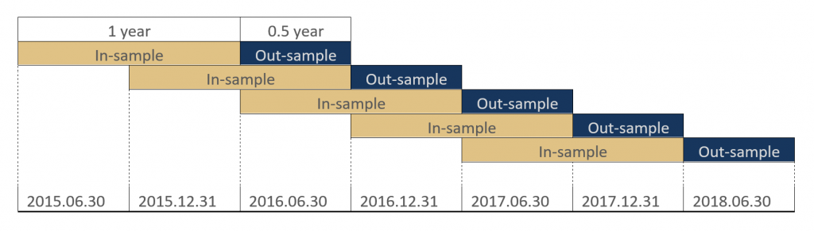

The Walk-Forward Timefolds method is an advanced approach in algorithmic trading aimed at optimizing trading strategies while reducing the risk of overfitting to historical data. It builds upon the concept of walk-forward optimization, a well-acknowledged technique used by traders to improve the predictive abilities of trading models. Walk-forward optimization involves systematically testing a trading strategy on a series of different time periods within a dataset, with the ultimate aim of applying these findings to future market forecasts. This method is particularly relevant in the constantly evolving world of algorithmic trading, where market conditions can shift rapidly and unpredictably.

Walk-forward optimization is crucial for traders seeking to anticipate future market behaviors because it more accurately simulates real-world trading conditions. Unlike traditional backtesting, which relies only on historical data to evaluate trading performance, walk-forward optimization tests strategies using non-overlapping timefolds of data. This involves repeatedly recalibrating the model with in-sample data, then validating it on out-of-sample data. The iterative nature of this process allows traders to identify which strategies are likely to perform well in future scenarios.



This article intends to cater to both novice and experienced traders who are interested in refining their strategy development processes. It provides insights into the sophisticated mechanisms of the Walk-Forward Timefolds method. For novice traders, this approach demystifies the complexities of advanced trading strategy optimization. Experienced traders, on the other hand, can benefit from the nuanced understanding of how walk-forward tests adapt models to cope with varying market conditions.

Adapting trading strategies to ever-changing market conditions is vital for maintaining a competitive edge. Financial markets are influenced by countless variables, from geopolitical developments to economic shifts, necessitating models that are both flexible and resilient. The Walk-Forward Timefolds method ensures that strategies are not only tailored to historical data patterns but are also robust enough to withstand market volatility. This method encourages continuous refinement and adaptation, guiding traders toward more effective and resilient trading strategies in the dynamic financial markets.

## Table of Contents

## Understanding the Walk-Forward Timefolds Method

The Walk-Forward Timefolds Method is a sophisticated approach in [algorithmic trading](/wiki/algorithmic-trading), designed to enhance the predictability and resilience of trading strategies. Primarily, this method is a specialized form of walk-forward analysis that incorporates a more nuanced view of time and data segmentation. The core components of the Walk-Forward Timefolds Method include the segmentation of historical data into distinct periods, the utilization of in-sample and out-of-sample datasets for strategy evaluation, and the adaptation of trading models to dynamic market conditions.

Walk-forward analysis is a methodology in algorithmic trading wherein trading strategies are repeatedly optimized on a sequence of time splits from historical data. The primary goal is to evaluate how well a trading strategy or model performs not only on past data but also in unseen future conditions. This is achieved by mirroring the sequential decision-making process of live trading. Unlike traditional [backtesting](/wiki/backtesting), which evaluates a strategy using a single dataset assumed to represent both past and future conditions indefinitely, walk-forward analysis iteratively tests a strategy across multiple time periods, thereby offering a more comprehensive assessment of its effectiveness.

The difference between the Walk-Forward Timefolds Method and traditional backtesting is substantial. Traditional backtesting typically involves evaluating a trading strategy over one continuous historical data segment split between two parts: an in-sample dataset for model development and an out-of-sample dataset for testing. This approach assumes market conditions are static, leading to potential overfitting, where the model learns market noise instead of true patterns, thus performing poorly in real market dynamics.

In contrast, the Walk-Forward Timefolds Method introduces iterative in-sample and out-of-sample data blocks. In this context, in-sample data is used to optimize the trading strategy, focusing on adjusting model parameters to fit known market conditions. The optimized strategy is then tested on subsequent out-of-sample data, which provides an estimate of the model's performance on future, unknown market conditions. This process is repeated over multiple folds or segments, each providing a unique perspective on the strategy's robustness. Through each iteration, new insights are gained, and the strategy may be adjusted to improve overall performance, thereby reducing the risk of overfitting.

Overall, the Walk-Forward Timefolds Method is a significant advancement in trading strategy validation, ensuring that algorithmic decisions are based on a robust evaluation of historical data, therefore equipping traders with a method that better adapts to the ever-evolving financial markets.

## Steps to Implement the Walk-Forward Timefolds Method

To implement the Walk-Forward Timefolds Method effectively, traders need to follow a systematic approach that encompasses data collection, segmentation, parameter optimization, and validation. Below is a detailed guide on executing this process:

### Step 1: Gathering and Preparing Relevant Trading Data

1. **Data Collection**: Begin by collecting historical price data for the financial instrument you are interested in. This data can typically be sourced from financial data providers, stock exchanges, or dedicated trading platforms.

2. **Data Quality and Cleaning**: Ensure the datasets are free from anomalies such as missing values or incorrect entries, which could distort analysis. Data cleaning may involve interpolation of missing values or removing outlier data points. 

3. **Normalization and Transformation**: Standardize the data to a common scale without distorting differences in the ranges of values. This step often involves computing returns from price data and normalizing them to have zero mean or unit variance.

### Step 2: Splitting Historical Data into Multiple Segments

The segmentation of historical data into in-sample and out-of-sample segments is a core component of the Walk-Forward Timefolds Method.

1. **In-Sample and Out-of-Sample Division**: Divide the dataset into multiple contiguous blocks. Each block consists of an in-sample period used for model training and an out-of-sample period used for validation. 

   If $n$ is the number of total data points, a walk-forward optimization might divide the data into $k$ segments. For example, with 1000 data points divided into 10 segments:

   - **In-Sample Period**: Select the first 80 data points as in-sample.
   - **Out-of-Sample Period**: Select the next 20 data points as out-of-sample.

   Iterate over the entire dataset, shifting the window forward by 20 data points each time, thus forming new in-sample and out-of-sample periods.

### Step 3: Optimizing Trading Parameters

1. **Selection of Parameters**: Identify parameters within your trading strategy that can be optimized, such as risk levels, stop-loss limits, or moving average durations.

2. **Optimization Techniques**: Utilize optimization algorithms like Genetic Algorithms, Simulated Annealing, or Grid Search to explore possible parameter combinations. Aim to maximize some objective function (e.g., Sharpe Ratio or cumulative returns) over the in-sample data.

3. **Backtesting in the In-Sample Data**: Run backtests on the in-sample data to evaluate the performance of different parameter combinations. Select the set of parameters that yields the best performance metric.

### Step 4: Validation Against Out-of-Sample Data

1. **Performance Testing**: Apply the optimized parameters to the out-of-sample data without any adjustments to evaluate the model's predictive power and robustness. 

2. **Walk-Forward Analysis**: Consolidate the performance results from all segments to assess the overall effectiveness of the model. This procedure helps in verifying the stability and adaptability of the trading strategy across different market conditions.

3. **Iterative Refinement**: Continuous refinement might be required based on the performance observed in out-of-sample validation. Adjust the in-sample and out-of-sample lengths or refine parameter boundaries as necessary.

By following these steps, traders can create an adaptive strategy that is better suited to respond to dynamic market conditions, minimizing the risk of overfitting and improving long-term performance projections.

## Advantages and Challenges of the Walk-Forward Timefolds Method

The Walk-Forward Timefolds Method offers several advantages for traders aiming to optimize their algorithmic strategies. One significant benefit is its ability to reduce overfitting. By continuously optimizing and validating a model across multiple segments of historical data, this method ensures that a trading strategy does not merely perform well on past data but also holds up under new, unseen conditions. This is achieved through the clear delineation between in-sample and out-of-sample data. In-sample data is used to fit the model, while out-of-sample data provides a testbed to verify the model's predictive capabilities.

Adapting to market changes is another key advantage. Financial markets are inherently dynamic and prone to sudden shifts due to economic events, policy changes, or technological advancements. The Walk-Forward Timefolds Method inherently supports the periodic adjustment of strategies to reflect these changes, thereby facilitating more realistic performance assessments. This adaptive nature ensures that trading strategies remain relevant over time, potentially increasing profitability and reducing risk.

Despite its benefits, the Walk-Forward Timefolds Method also presents challenges. One major challenge is its significant computational demands. The method requires extensive resources to systematically evaluate multiple data segments, each involving optimizations and subsequent testing. As a result, it can be computationally prohibitive, particularly for retail traders with limited access to high-performance computing.

Parameter selection in the Walk-Forward Timefolds Method can also be complex. Traders must judiciously choose parameters, such as the length of in-sample and out-of-sample periods, to ensure meaningful evaluations. Inappropriate parameter settings can lead to skewed results, potentially overlooking long-term trends that could otherwise be beneficial for strategic planning.

Another critical discussion point is the method's computational complexity compared to traditional backtesting. Traditional backtesting typically involves a single run over historical data, offering simplicity and less computational strain. However, it often risks overfitting, as the strategy is not continually validated against fresh data segments. In contrast, the Walk-Forward Timefolds Method, while computationally intensive, mitigates this risk by constantly evaluating strategy robustness across evolving datasets.

The balance between accuracy and resource investment must be carefully managed. Traders might use simplified models to quickly gain insights but must be aware of the trade-offs involved in computational complexity and strategy robustness. Ultimately, adopting the Walk-Forward Timefolds Method requires careful consideration of resource allocation, parameter selection, and the potential need for continuous market adaptation to yield optimal results.

## Optimizing and Validating Trading Strategies

In the dynamic world of algorithmic trading, optimizing and validating trading strategies are crucial stages to ensure strategy robustness and profitability. Setting proper objective functions is fundamental in this process, as they define what the optimization process aims to achieve. Objectives can range from maximizing returns, minimizing risk, or improving the Sharpe ratio, among others. Selecting appropriate objective functions will align the optimization process with the trader's financial goals and risk tolerance.

When employing the Walk-Forward Timefolds Method, choosing the right size for in-sample and out-of-sample datasets is vital for achieving accurate and reliable optimization results. The in-sample dataset, used for training the model, should be sufficiently large to capture the market conditions and patterns. Conversely, the out-of-sample dataset, reserved for testing the model's predictive performance, should also be significant enough to provide a realistic assessment of the strategy's effectiveness. A common practice is to use about 70% to 80% of the data as in-sample and the remaining 20% to 30% as out-of-sample, but the optimal split often depends on the data's nature and the trader's specific objectives.

Avoiding common pitfalls such as look-ahead bias and p-hacking is essential for maintaining the integrity of the strategy validation. Look-ahead bias occurs when future information is inadvertently used in model training, leading to overly optimistic performance metrics. To prevent this, strict separation of data into historical (in-sample) and future (out-of-sample) segments must be maintained.

Furthermore, p-hacking, the practice of over-testing parameters until a desirable result is found, can lead to overfitting and unreliable strategies. To circumvent this, it's advisable to use a pre-defined hypothesis and stick to it throughout the testing process. Additionally, incorporating statistical techniques such as cross-validation or employing regularization methods can help ensure that the optimized parameters generalize well to unseen data.

In practice, Python programming offers tools to implement these strategies effectively. For example, using libraries like `sklearn` for cross-validation and `numpy` for data manipulation can streamline the optimization and validation process. Here's a simple illustration of setting up a walk-forward validation using Python's `pandas` and `sklearn`:

```python
import pandas as pd
from sklearn.model_selection import TimeSeriesSplit
from sklearn.metrics import accuracy_score

# Example data
data = pd.DataFrame({
    'feature1': [...],  # Placeholder for features
    'feature2': [...],
    'target': [...]     # Placeholder for the target variable
})

# Define walk-forward time series split
ts_split = TimeSeriesSplit(n_splits=5)

for train_index, test_index in ts_split.split(data):
    train, test = data.iloc[train_index], data.iloc[test_index]

    # Fit model on train set and evaluate on test set
    model.fit(train[['feature1', 'feature2']], train['target'])
    predictions = model.predict(test[['feature1', 'feature2']])
    print(f'Test Accuracy: {accuracy_score(test["target"], predictions)}')
```

This setup illustrates dividing the dataset into multiple folds for walk-forward analysis, ensuring temporal order is respected and minimizing potential look-ahead bias. This approach, combined with stringent validation strategies, helps create robust trading models adaptable to fluctuating market conditions.

## Best Practices and Common Pitfalls

### Best Practices and Common Pitfalls

To effectively deploy the Walk-Forward Timefolds Method in algorithmic trading, traders must adhere to several best practices while being mindful of potential pitfalls. 

#### Regular Updating and Retraining of Models

A critical practice is the regular updating and retraining of trading models. The financial markets are inherently dynamic, characterized by rapidly changing conditions that can render static models obsolete. Periodic retraining helps ensure that trading strategies remain relevant and effective in adapting to new market data. This process involves re-evaluating the model with the most recent data, allowing it to learn from the latest trends and patterns. 

#### Strategies to Avoid Overfitting

Overfitting occurs when a model captures noise rather than the underlying signal in historical data, leading to poor predictive performance on unseen data. To minimize overfitting, traders should employ strategies such as:

1. **Regularization Techniques**: Implement techniques like L1 (Lasso) and L2 (Ridge) regularization, which can prevent the model from becoming too complex by penalizing large coefficients.

2. **Cross-Validation**: Use cross-validation methods, such as k-fold cross-validation, to assess the model's performance across different data segments, thus ensuring it generalizes well.

3. **Simplification of Models**: Opt for simpler models with fewer parameters, which are less likely to fit the noise in the data. 

4. **Robust Out-of-Sample Testing**: Ensure robust testing on out-of-sample datasets to validate the strategy's effectiveness beyond the in-sample period.

#### Avoiding Common Mistakes

Several common mistakes can undermine the effectiveness of the Walk-Forward Timefolds Method if not properly managed:

1. **Ignoring Transaction Costs**: Transaction costs, such as broker fees and slippage, can significantly impact the profitability of a trading strategy. It is crucial to incorporate realistic cost estimates into the model to ensure accurate performance assessments.

2. **Overlooking Market Liquidity**: High-frequency or large-volume trading strategies may be adversely affected by insufficient market liquidity. Conducting a liquidity analysis helps in understanding whether the market can absorb trades without substantial price changes.

3. **Neglecting Parameter Stability**: Parameters optimized for a specific market condition may not hold in different contexts. Traders should aim for parameter stability over different market conditions to ensure consistent performance.

By adhering to these best practices and being vigilant about potential pitfalls, traders can enhance the robustness and reliability of their algorithmic trading strategies using the Walk-Forward Timefolds Method. Such diligence not only improves strategy performance but also increases the likelihood of sustained success in constantly evolving financial markets.

## Conclusion

The Walk-Forward Timefolds Method is a sophisticated approach to algorithmic trading that provides a dynamic way of adapting trading strategies to constantly shifting market conditions. It integrates the concept of walk-forward analysis, which evaluates a trading strategy's performance by repeatedly optimizing and testing over different time segments. This method is instrumental in minimizing the risks of overfitting, ensuring that trading strategies are robust and effective in real-world scenarios.

Utilizing the Walk-Forward Timefolds Method can significantly enhance predictive accuracy and trading performance, offering a more reliable assessment than traditional backtesting methods. Unlike static methods, Walk-Forward Timefolds allows traders to continually adjust strategies based on out-of-sample testing, reflecting genuine market behavior. By doing so, it also helps mitigate common analytical pitfalls like look-ahead bias and p-hacking, which can otherwise skew results and expectations.

Traders, both novice and experienced, are encouraged to incorporate the Walk-Forward Timefolds Method alongside other validation techniques. Combining various methods ensures a comprehensive analysis, leading to a more resilient strategy that can withstand unforeseen market fluctuations. Furthermore, using this method as part of a broader toolkit can provide a robust defense against potential strategy failures due to unanticipated market changes.

To build truly adaptive trading strategies, it is imperative for traders to commit to continuous enhancement of their methods. Markets are perpetually evolving, and strategies must evolve in tandem to remain successful. Through consistent testing, re-evaluation, and adaptation, traders can fine-tune their approaches, ensuring they are optimally positioned to capitalize on emerging trends and opportunities.

In conclusion, the Walk-Forward Timefolds Method is not only a technical procedure but also an approach that embodies the forward-thinking mindset essential for success in algorithmic trading. By persisting in refining trading strategies and employing comprehensive validation techniques, traders can navigate the complexities of the market with increased confidence and improved outcomes.

## References & Further Reading

[1]: Bergstra, J., Bardenet, R., Bengio, Y., & Kégl, B. (2011). ["Algorithms for Hyper-Parameter Optimization."](https://papers.nips.cc/paper/4443-algorithms-for-hyper-parameter-optimization) Advances in Neural Information Processing Systems 24.

[2]: ["Advances in Financial Machine Learning"](https://www.amazon.com/Advances-Financial-Machine-Learning-Marcos/dp/1119482089) by Marcos Lopez de Prado

[3]: ["Evidence-Based Technical Analysis: Applying the Scientific Method and Statistical Inference to Trading Signals"](https://www.amazon.com/Evidence-Based-Technical-Analysis-Scientific-Statistical/dp/0470008741) by David Aronson

[4]: ["Machine Learning for Algorithmic Trading"](https://github.com/stefan-jansen/machine-learning-for-trading) by Stefan Jansen

[5]: ["Quantitative Trading: How to Build Your Own Algorithmic Trading Business"](https://books.google.com/books/about/Quantitative_Trading.html?id=j70yEAAAQBAJ) by Ernest P. Chan