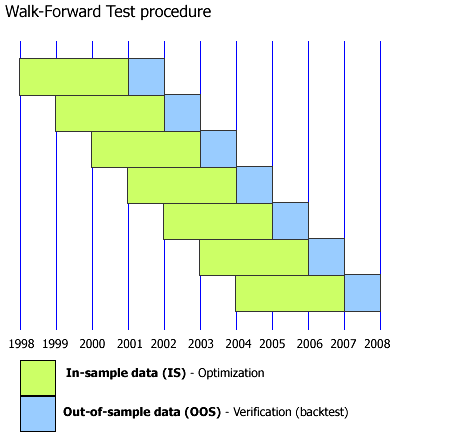

## Table of Contents

## What is the Walk-forward (WF) method?

The Walk-forward (WF) method is a way to test how well a trading strategy works over time. It's like checking if a recipe still tastes good when you make it again and again with new ingredients. In trading, you use past data to see if your strategy would have made money. You start with a small part of the data to create your strategy, then you test it on the next part of the data to see if it still works. You keep moving forward, using more and more data, to make sure your strategy is good over time.

This method helps you avoid a common problem called overfitting, where a strategy works great on past data but fails in the future. By testing the strategy on new data as you go, you get a better idea of how it will perform in real life. It's like practicing a sport with different opponents to make sure you can win no matter who you play against. The Walk-forward method gives traders more confidence that their strategy will keep working as markets change.

## Why is the Walk-forward method important in time series forecasting?

The Walk-forward method is important in time series forecasting because it helps make sure that the predictions you make are reliable over time. Imagine you're trying to guess what the weather will be like next week. If you only look at last week's weather to make your guess, you might get it wrong because weather changes. The Walk-forward method is like checking the weather every day and updating your guess. It uses past data to make a prediction, then checks how well that prediction did with new data, and keeps doing this step by step. This way, you can see if your way of guessing the weather works well over time, not just for one week.

This method is really helpful because it stops you from making a common mistake called overfitting. Overfitting is when you create a prediction model that works perfectly for the data you already have, but it doesn't work well with new data. It's like memorizing a test instead of learning the material. By using the Walk-forward method, you keep testing your model with new data as time goes on. This makes sure your model can adapt to changes and still give good predictions. It's like practicing a sport with different opponents to make sure you can win no matter who you play against.

## How does the Walk-forward method differ from traditional backtesting?

The Walk-forward method and traditional [backtesting](/wiki/backtesting) are both ways to check if a trading or forecasting strategy works well, but they do it differently. Traditional backtesting looks at all the past data at once to see how a strategy would have done. It's like looking at a whole year's worth of weather data to guess what the weather will be like next year. This can be good for getting a quick idea, but it might not show if the strategy will keep working as things change over time.

The Walk-forward method, on the other hand, breaks the data into smaller parts and tests the strategy step by step. It's like checking the weather every day and updating your guess for tomorrow based on what happened today. This method helps make sure the strategy can adapt to new situations and keeps working well over time. By testing the strategy on new data as you go, you get a better idea of how it will perform in the future, not just how it did in the past.

## What are the basic steps involved in implementing the Walk-forward method?

To use the Walk-forward method, you start by dividing your data into two parts: a training set and a testing set. The training set is the first part of your data, and you use it to create your strategy or model. Once you have your model, you use it to make predictions on the next part of your data, which is the testing set. You then check how well your predictions did on this new data. If your predictions are good, you move forward to the next part of your data.

You keep repeating this process, always using the most recent data to update your model and then testing it on the next part of the data. This way, you keep checking if your model still works well as time goes on. By the end, you will have tested your model many times with new data, which helps you see if it can adapt and keep making good predictions over time.

## Can you explain the concept of out-of-sample testing in the context of Walk-forward optimization?

Out-of-sample testing is a key part of Walk-forward optimization. It means you test your model on data it hasn't seen before. Imagine you're learning to predict the weather. You use last week's weather data to make your model, and then you test it on this week's data to see if it works. This helps you know if your model can really predict the future, not just remember the past.

In Walk-forward optimization, you keep doing out-of-sample testing as you move forward in time. You start with some data to make your model, then you test it on the next bit of data. If it does well, you move to the next part of the data, update your model, and test it again. This way, you're always checking if your model can adapt to new situations and still make good predictions. It's like practicing a sport with different opponents to make sure you can win no matter who you play against.

## What are the advantages of using the Walk-forward method over other validation techniques?

The Walk-forward method has some big advantages over other ways of checking if a model works well. One big advantage is that it helps you avoid overfitting. Overfitting is when a model works great on the data you already have, but it doesn't work well with new data. The Walk-forward method keeps testing your model on new data as time goes on, so you can see if it can adapt and still make good predictions. It's like practicing a sport with different opponents to make sure you can win no matter who you play against.

Another advantage is that the Walk-forward method gives you a better idea of how your model will do in the future. Other methods might just look at all the past data at once, but the Walk-forward method breaks the data into smaller parts and tests the model step by step. This way, you can see if your model keeps working well over time, not just for one part of the data. It's like checking the weather every day and updating your guess for tomorrow based on what happened today.

## How do you determine the optimal window size for Walk-forward optimization?

Determining the optimal window size for Walk-forward optimization is important because it affects how well your model works. The window size is how much data you use to train your model before you test it on new data. If the window is too small, your model might not learn enough from the data, and it could miss important patterns. But if the window is too big, your model might overfit, meaning it works great on the data you already have but not on new data. You need to find a balance so your model learns well but can also adapt to new situations.

To find the best window size, you can try different sizes and see which one gives the best results. Start with a small window and slowly make it bigger, testing your model each time. Look at how well your model predicts on the new data for each window size. The size that gives the best predictions without overfitting is usually the best one to use. It's like trying different amounts of ingredients in a recipe to see which one tastes the best. By testing different window sizes, you can find the one that helps your model work well over time.

## What are some common pitfalls or challenges when applying the Walk-forward method?

One common challenge when using the Walk-forward method is choosing the right window size. If the window is too small, your model might not learn enough from the data and miss important patterns. But if the window is too big, your model might overfit, meaning it works great on the data you already have but not on new data. Finding the right balance can be tricky and often requires trying different sizes to see which one works best.

Another pitfall is dealing with changing market conditions or data trends. The Walk-forward method helps by testing your model on new data as time goes on, but if the market changes a lot, your model might still struggle to adapt. You need to keep an eye on how well your model is doing and be ready to update it if the data changes a lot. It's like trying to predict the weather in a place where the weather can change suddenly; you need to keep checking and adjusting your predictions.

Lastly, the Walk-forward method can be time-consuming and computationally intensive. You have to keep retraining and testing your model on new data, which can take a lot of time and computer power. This can be a challenge if you're working with a lot of data or if you need quick results. It's like baking a cake that needs to be checked and adjusted every few minutes; it takes more time and effort than just setting a timer and waiting.

## How can the Walk-forward method be adapted for use with machine learning models?

The Walk-forward method can be adapted for use with [machine learning](/wiki/machine-learning) models by breaking the data into smaller parts and using these parts to train and test the model step by step. You start with some data to train your model, then you use the next part of the data to test how well it predicts. If the predictions are good, you move to the next part of the data, update your model with the new data, and test it again. This way, you keep checking if your model can adapt to new situations and still make good predictions. It's like practicing a sport with different opponents to make sure you can win no matter who you play against.

One important thing to remember when using the Walk-forward method with machine learning models is to choose the right window size. The window size is how much data you use to train your model before you test it on new data. If the window is too small, your model might not learn enough from the data and miss important patterns. But if the window is too big, your model might overfit, meaning it works great on the data you already have but not on new data. You need to find a balance so your model learns well but can also adapt to new situations. By trying different window sizes and seeing which one gives the best results, you can find the one that helps your model work well over time.

## What metrics should be used to evaluate the performance of a model using the Walk-forward method?

When you use the Walk-forward method to check how well a model is doing, you need to look at some important numbers called metrics. One good metric to use is the Mean Absolute Error (MAE). This tells you how far off your predictions are from the real numbers, on average. Another useful metric is the Root Mean Square Error (RMSE), which also shows how far off your predictions are, but it gives more weight to bigger mistakes. You can also use the R-squared value, which tells you how well your model's predictions match the real data. A higher R-squared means your model is doing a better job at explaining what's happening.

Another important thing to look at is how well your model keeps working over time. You can use a metric called the Mean Absolute Percentage Error (MAPE) to see how big the mistakes are as a percentage of the real numbers. This helps you understand if your model is getting better or worse as you move forward. Also, you might want to check the stability of your model by looking at how much the metrics change from one step to the next. If the metrics stay pretty steady, it means your model is good at adapting to new data. By keeping an eye on these metrics, you can make sure your model is doing well and making good predictions over time.

## How does the Walk-forward method handle non-stationary time series data?

The Walk-forward method is really helpful when you're dealing with non-stationary time series data, which means the data changes over time and doesn't have a steady pattern. Imagine you're trying to predict the weather in a place where it can change a lot from day to day. The Walk-forward method helps by always using the most recent data to update your model. This way, your model can adapt to the changes in the data and keep making good predictions, even if the weather is different today than it was last week.

By breaking the data into smaller parts and testing the model step by step, the Walk-forward method makes sure your model can handle the ups and downs of non-stationary data. It's like checking the weather every day and updating your guess for tomorrow based on what happened today. This helps your model stay accurate over time, even when the data keeps changing. So, if you're working with data that's always shifting, the Walk-forward method is a great way to keep your predictions on track.

## Can you discuss any advanced techniques or variations of the Walk-forward method used in industry or research?

One advanced technique used with the Walk-forward method is called Walk-forward with Cross-Validation. This combines the Walk-forward method with another way of checking how well a model works called cross-validation. In this technique, you split your data into smaller parts and use some of these parts to train your model and the rest to test it. You do this many times, each time using different parts of the data for training and testing. This helps make sure your model works well not just on one part of the data, but on many different parts. It's like practicing a sport with different opponents to make sure you can win no matter who you play against.

Another variation is the Rolling Window Walk-forward method. In this approach, instead of using a fixed window size, you use a rolling window that keeps moving forward. You start with a certain amount of data to train your model, then you test it on the next bit of data. After that, you move the window forward a bit, so you use some new data to train your model and some old data to keep it stable. This helps your model adapt to new situations while still remembering what it learned before. It's like updating your weather guess every day but also keeping in mind what the weather was like last week.

## References & Further Reading

[1]: Bergstra, J., Bardenet, R., Bengio, Y., & Kégl, B. (2011). ["Algorithms for Hyper-Parameter Optimization."](https://dl.acm.org/doi/10.5555/2986459.2986743) Advances in Neural Information Processing Systems 24.

[2]: ["Advances in Financial Machine Learning"](https://www.amazon.com/Advances-Financial-Machine-Learning-Marcos/dp/1119482089) by Marcos Lopez de Prado

[3]: ["Evidence-Based Technical Analysis: Applying the Scientific Method and Statistical Inference to Trading Signals"](https://www.amazon.com/Evidence-Based-Technical-Analysis-Scientific-Statistical/dp/0470008741) by David Aronson

[4]: ["Machine Learning for Algorithmic Trading"](https://github.com/stefan-jansen/machine-learning-for-trading) by Stefan Jansen

[5]: ["Quantitative Trading: How to Build Your Own Algorithmic Trading Business"](https://books.google.com/books/about/Quantitative_Trading.html?id=j70yEAAAQBAJ) by Ernest P. Chan