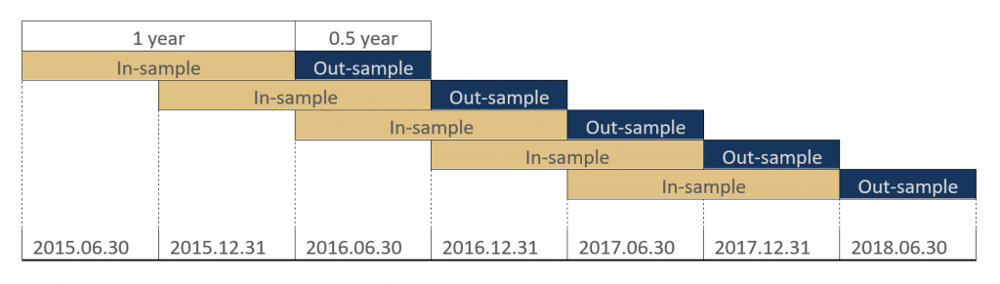

Walk-forward analysis (WFA) is an advanced testing methodology pivotal in algorithmic trading, where the goal is to boost the robustness and reliability of trading strategies. Unlike traditional backtesting, which might not always predict future performance with high accuracy due to overfitting, WFA aims to mitigate such risks by employing distinct data segments known as in-sample and out-of-sample periods.

The essence of this method is to continuously evaluate and optimize trading strategies in a manner that closely simulates real-world trading conditions. By dividing historical data into these segments, WFA allows traders to test how well a strategy performs on unseen data—providing a more authentic simulation of future trading performance. This approach helps identify strategies that are not only successful in the testing phase but also durable in real trading scenarios.



This article will explore the intricacies of the walk-forward method, offering a comprehensive breakdown of its step-by-step execution, benefits, and potential caveats.

## Table of Contents

## What is Walk-Forward Analysis?

Walk-forward analysis is a sophisticated evaluation technique used in [algorithmic trading](/wiki/algorithmic-trading) to enhance the predictive accuracy and robustness of trading strategies. Unlike traditional [backtesting](/wiki/backtesting), which merely applies a trading strategy to historical data, walk-forward analysis involves a more dynamic process of continuous optimization and subsequent testing, simulating how a strategy would have performed in a real-world scenario over time.

The methodology starts by dividing the available data into multiple segments or "windows." Typically, these segments are split into two main categories: in-sample and out-of-sample data. The in-sample data serves as the subset of the historical data on which strategy parameters are optimized. Once these parameters are fine-tuned, they are then applied to the immediately succeeding out-of-sample window, which has not been previously seen during the optimization phase. This approach helps in assessing the strategy's performance on data that the model has not encountered before, reducing the likelihood of overfitting.

Mathematically, if $D$ represents the entire dataset, it can be divided into subsets $D_1, D_2, \ldots, D_n$. The optimization process occurs in subset $D_i$, and the resultant parameters are validated in subset $D_{i+1}$. This sequence continues, iteratively moving through the dataset, thereby enhancing the evaluation's robustness.

This forward-looking testing method provides valuable insights into how a trading strategy might perform under evolving market conditions, reflecting the ever-changing nature of financial markets. By continuously adapting and recalibrating, walk-forward analysis offers a more realistic picture of a strategy's effectiveness across different market scenarios, capturing both short-term fluctuations and broader trends.

## Step-by-Step Walk-Forward Analysis Process

Walk-forward analysis is a structured process that allows traders to rigorously test and validate their trading strategies. The approach involves several critical steps to ensure that strategy optimizations are robust and applicable across different data segments. Here is a detailed breakdown of the step-by-step walk-forward analysis process:

**Step 1: Gather all necessary data relevant to the trading instruments.**

The initial step requires the collection of comprehensive historical data pertinent to the trading instruments under consideration. This data includes price movements, [volume](/wiki/volume-trading-strategy), market events, and any other relevant indicators. Ensuring data accuracy and completeness is crucial for reliable analysis and model training.

**Step 2: Split the data into in-sample and out-of-sample windows.**

Once the data is collected, it is divided into multiple segments or windows. Each segment is comprised of two parts: the in-sample data, used for optimizing the strategy parameters, and the out-of-sample data, used for testing the strategy's performance. The proportion of these two can be varied, but a common practice is to use about 2/3 of the data as in-sample and 1/3 as out-of-sample. 

**Step 3: Optimize the strategy parameters on the in-sample data.**

In this step, the strategy parameters are adjusted to achieve optimal performance on the in-sample data. This involves running the trading algorithm across the in-sample segment multiple times, tweaking the parameters until the desired performance metrics are achieved. Techniques such as grid search, genetic algorithms, or other optimization methods can be employed to ensure the best parameter set is identified.

**Step 4: Apply the optimized parameters to the out-of-sample data.**

After optimization, the refined set of parameters is applied to the out-of-sample data. This step is crucial as it tests the strategy's ability to maintain performance across new, unseen data. Successful performance on out-of-sample data indicates that the strategy and its parameters are robust and not merely tailored to the specific nuances of the in-sample data.

**Step 5: Record performance and repeat the process for additional data segments.**

The performance metrics from the out-of-sample testing are recorded, providing insights into the strategy's validity and potential for real-world implementation. This process is repeated across successive data windows, each time advancing the data window forward, simulating a walk-forward in time. By iterating this procedure, traders can compile a comprehensive view of how the strategy might perform across different market conditions.

This iterative walk-forward analysis process provides a dynamic framework for evaluating trading strategies, mitigating the risk of curve fitting, and enhancing the predictive power of the strategy over time. Each iteration offers additional insights, allowing traders to refine and adapt their strategies based on performance feedback from multiple data segments.

## Anchored vs. Rolling Walk-Forward Testing

Anchored Walk-Forward and Rolling Walk-Forward Testing are two distinct approaches within the walk-forward analysis framework, each with its unique methodology and benefits. 

The Anchored Walk-Forward Testing method involves continuously expanding the in-sample data size as the test progresses. Initially, a strategy is optimized using a specific in-sample period. As new data becomes available, this data is added to the existing in-sample period, thereby increasing its size. This method leverages a growing pool of historical data, which can help in identifying longer-term trends and patterns. With a larger dataset, the strategy might be better tuned to general market conditions, perhaps enhancing its robustness and providing a more comprehensive evaluation of its performance over time.

On the other hand, Rolling Walk-Forward Testing maintains a constant in-sample window size throughout the testing process. The in-sample window moves forward in time as new data becomes available, dropping the oldest data while incorporating the most recent data. This technique is particularly useful in adapting to recent market changes, as it focuses on more current and relevant information. By keeping the window size constant, it allows for quicker adjustment to market dynamics, which can be beneficial for strategies that rely on short- to medium-term price movements.

The choice between Anchored and Rolling Walk-Forward Testing often depends on the specific needs and characteristics of the trading strategy in question. Strategies that benefit from recognizing long-term trends might prefer the anchored approach due to its use of extensive historical data. Conversely, strategies that require adaptation to the latest market conditions might find the rolling method more suitable due to its emphasis on recent data. 

In summary, both Anchored and Rolling Walk-Forward Testing offer distinct advantages, and selecting the appropriate method depends on the strategy's requirements and the nature of the markets being traded. Each offers a unique means of validating trading strategies, contributing to the development of robust and adaptive trading models.

## Does Walk-Forward Testing Work?

Walk-forward testing is regarded as an effective method to enhance the reliability of trading strategies, primarily due to its capacity to minimize the risk of curve fitting. By employing walk-forward analysis (WFA), strategies are evaluated across multiple data segments, which allows for a more comprehensive assessment of their adaptability and performance over time. This dynamic form of analysis stands in contrast to traditional static backtesting, which often leads to optimized strategies that perform well on historical data but fail in live trading, primarily due to overfitting.

Despite its strengths, walk-forward testing is not without its drawbacks. One significant challenge is the potential introduction of parameter selection bias. As strategies are continuously optimized on new data windows, there is a risk of inadvertently selecting parameter sets that incidentally perform well in the historical context but may not generalize effectively to real market conditions. Additionally, the iterative nature of WFA demands substantial computational resources. Each iteration involves optimizing and testing over multiple data windows, which can be computationally intensive, especially for complex strategies or large datasets.

To mitigate these issues, walk-forward testing should be supplemented with other forms of validation, such as cross-validation or out-of-sample testing. These additional layers of validation can help ensure that the strategy not only fits past data but is also robust to new, unseen data. By integrating WFA with other techniques, traders can enhance the reliability and robustness of their strategy development process, making it less likely to fall victim to the pitfalls of curve fitting and parameter selection bias.

## Common Challenges with Walk-Forward Testing

Walk-forward analysis (WFA) is a sophisticated method employed in algorithmic trading to ensure robustness and adaptability of trading strategies. Despite its advantages, it presents several challenges that practitioners must carefully navigate.

Firstly, WFA is computationally intensive. Each iteration of optimizing and testing requires substantial processing power, especially for large datasets or complex strategies. This computational demand can be a barrier for individual traders or firms with limited resources, potentially necessitating the use of cloud computing or high-performance hardware to manage the workload efficiently.

The sensitivity of WFA to parameter values and window sizes is another significant challenge. Selecting appropriate parameters is crucial because if the chosen values do not accurately capture market dynamics, the strategy might underperform in a live environment. Similarly, window sizes for in-sample and out-of-sample data must be chosen carefully. If the windows are too small, the analysis might not capture enough market variability, while excessively large windows might obscure responsiveness to current market conditions.

Another concern is WFA's potential to overlook long-term market trends due to its segmented nature. As the process involves testing over successive data windows, it may fail to account for broader trends extending beyond the individual segments. This segmentation can lead to strategies that perform well within specific windows but are not adaptable to sustained trend movements in the market.

Furthermore, overfitting remains a pertinent risk in WFA. To mitigate this, it is essential to ensure that strategies exhibit consistent performance across multiple segments, rather than merely excelling in isolated instances. Overfitting may manifest when a model is excessively tailored to specific dataset characteristics, compromising its generalizability to new data. Consistency checks, such as cross-validation, should be integrated to verify that strategies are not only optimized for particular historical patterns but are adaptable across diverse market conditions.

In summary, while WFA is valuable for refining and validating trading strategies, its challenges—computational demands, sensitivity to parameters and window sizes, potential neglect of long-term trends, and risk of overfitting—must be managed through careful planning and execution to harness its full potential effectively.

## Best Practices for Walk-Forward Analysis

To effectively conduct Walk-Forward Analysis (WFA) in algorithmic trading, several best practices should be adhered to. These practices ensure that the analysis yields robust and reliable trading strategies.

### Ample Historical Data

One of the foundational practices in Walk-Forward Analysis is using a substantial amount of historical data for both in-sample and out-of-sample testing. Sufficient data helps to capture a broad range of market conditions, enabling the strategy to be tested against various economic scenarios. This diversity in testing conditions helps prevent strategies that are overly tailored to specific market situations, thus increasing their general applicability.

### Combining WFA with Other Validation Techniques

While WFA is a powerful method on its own, its utility is significantly enhanced when combined with other validation techniques such as cross-validation. Cross-validation involves dividing data into multiple subsets and ensuring that each subset is used both as training and test data, though not simultaneously. In trading, this helps ensure that the developed strategies are not only sound during specific time periods but also robust across different market environments and time frames.

### Meticulous Documentation

Careful documentation is essential in WFA to track the development and performance of trading strategies thoroughly. This includes recording the parameters used, the performance metrics, and the outcomes of each test iteration. Detailed documentation allows for a better understanding of how strategies respond to various market conditions and provides insights for adjusting and improving the strategies over time. Additionally, documentation ensures that all steps are transparent and can be reviewed or audited if necessary.

### Python Code Example

To illustrate, here is a simple Python snippet that demonstrates how one might begin setting up a WFA framework assuming the availability of historical data:

```python
import numpy as np
import pandas as pd
from sklearn.model_selection import TimeSeriesSplit

# Load historical data
data = pd.read_csv('historical_data.csv')

# Define walk-forward parameters
n_splits = 5 # Number of walk-forward validation steps
tscv = TimeSeriesSplit(n_splits=n_splits)

for train_index, test_index in tscv.split(data):
    train, test = data.iloc[train_index], data.iloc[test_index]

    # Optimize strategy parameters on train set
    # Here, you'd apply your strategy optimization code

    # Apply optimized parameters to test set to evaluate performance
    # Here, you'd implement your backtest or performance evaluation function

    # Log the performance metrics
    # Example: print(f"Trading Strategy Performance: {metrics}")
```

This code outline showcases the cyclical process of training and testing that WFA entails while highlighting the importance of clear segmentation and evaluation throughout the analysis.

In summary, by ensuring that ample historical data is used, combining WFA with cross-validation, and meticulously documenting each stage of testing and analysis, traders can greatly enhance the robustness and effectiveness of their trading strategies. These practices collectively contribute to forming a more comprehensive validation approach, ultimately increasing confidence in the strategy's ability to perform under real market conditions.

## Conclusion

Walk-forward analysis (WFA) is a valuable addition to an algorithmic trader's toolkit, providing a more adaptive testing approach compared to traditional backtesting methods. By systematically evaluating trading strategies on unseen data through a dynamic sequence of in-sample and out-of-sample tests, WFA enhances the predictive reliability of algorithmic models. This nuanced methodology helps in curbing the over-optimization trap, commonly known as curve fitting, by continuously adjusting strategy parameters and applying them to new market conditions. 

Despite its advantages, WFA is not without challenges. The computational demand and sensitivity to window size and parameter selection necessitate a careful setup and execution. For optimal results, traders should integrate WFA alongside other robust validation techniques to mitigate its inherent limitations, such as potential parameter selection bias and the possibility of missing broader market trends. 

In summary, while walk-forward analysis alone is not a panacea, its strategic application, in combination with complementary validation practices, can significantly bolster the robustness and longevity of trading strategies. By embracing this iterative and meticulous testing process, traders position themselves better to navigate the complexities of evolving financial markets.

## FAQ

What is the main advantage of Walk-Forward Testing in trading?

Walk-Forward Testing offers a dynamic approach to evaluating trading strategies by continuously adapting to new data. This methodology segments historical data into in-sample (used for optimization) and out-of-sample (used for validation) windows, allowing traders to simulate real-world performance more accurately. The primary advantage is its ability to provide a more realistic expectation of how a trading strategy might perform in the future by continuously testing it on unseen data. This dynamic adaptation reduces the risk of overfitting, where a model performs well on historical data but fails in live trading.

How does Walk-Forward Analysis prevent curve fitting?

Curve fitting occurs when a trading strategy is excessively optimized to historical data, capturing noise rather than the underlying pattern. Walk-Forward Analysis mitigates this by optimizing the strategy on a designated in-sample period and then testing the strategy on an out-of-sample period. This approach ensures that the strategy is robust across different market conditions. By repeatedly cycling through this process over multiple data segments, and focusing on out-of-sample performance, the method inherently checks for overfitting, as strategies that only perform well due to excessive optimization will likely fail in out-of-sample tests.

What are the differences between Anchored and Rolling Walk-Forward Testing?

Anchored and Rolling Walk-Forward Testing are two variations of the walk-forward approach, each with distinct methodologies for handling data windows:

1. **Anchored Walk-Forward Testing**: In this approach, the in-sample data set begins with a fixed starting point and grows over time as new data becomes available. As the in-sample window increases, the out-of-sample performance is checked against a fixed size of future data. This method leverages a larger historical data set to optimize strategy parameters, aiming to capture more comprehensive market behaviors. 

2. **Rolling Walk-Forward Testing**: This variant keeps the in-sample window size constant, rolling forward over time as new data is added. After each test, both in-sample and out-of-sample periods move forward. This approach adapts more quickly to recent market changes, which can be advantageous in rapidly changing markets.

Choosing between these two methods depends on the specific trading strategy and market conditions. Anchored testing can benefit strategies that require extensive historical data for optimization, while rolling testing may be better for strategies that need to respond swiftly to new market information.

## References & Further Reading

[1]: Bergstra, J., Bardenet, R., Bengio, Y., & Kégl, B. (2011). ["Algorithms for Hyper-Parameter Optimization."](https://dl.acm.org/doi/10.5555/2986459.2986743) Advances in Neural Information Processing Systems 24.

[2]: ["Advances in Financial Machine Learning"](https://www.amazon.com/Advances-Financial-Machine-Learning-Marcos/dp/1119482089) by Marcos Lopez de Prado

[3]: ["Evidence-Based Technical Analysis: Applying the Scientific Method and Statistical Inference to Trading Signals"](https://www.amazon.com/Evidence-Based-Technical-Analysis-Scientific-Statistical/dp/0470008741) by David Aronson

[4]: ["Machine Learning for Algorithmic Trading"](https://github.com/stefan-jansen/machine-learning-for-trading) by Stefan Jansen

[5]: ["Quantitative Trading: How to Build Your Own Algorithmic Trading Business"](https://books.google.com/books/about/Quantitative_Trading.html?id=j70yEAAAQBAJ) by Ernest P. Chan