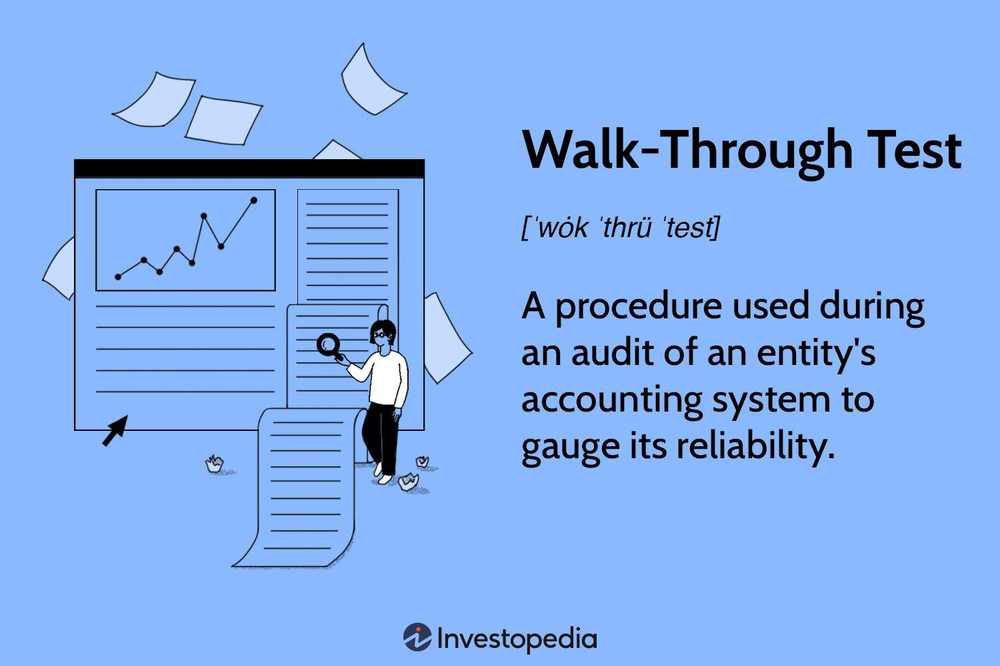

## Table of Contents

## What is a walk-through test in accounting?

A walk-through test in accounting is a way to check if a company's financial processes are working correctly. It involves following a transaction from start to finish to see if all the steps are done right. This helps make sure that the company's financial records are accurate and that there are no mistakes or fraud.

During a walk-through test, an auditor or accountant will talk to the people involved in the process and look at the documents and records. They do this to understand how the process works and to find any problems. By doing a walk-through test, the company can be more confident that their financial reporting is reliable and that they are following the rules.

## Why are walk-through tests important in the auditing process?

Walk-through tests are important in the auditing process because they help auditors understand how a company handles its financial transactions. By following a transaction from start to finish, auditors can see if the company's processes are working correctly. This helps them find any mistakes or problems that could affect the financial statements. If auditors find issues, they can suggest ways to fix them, which makes the company's financial reporting more accurate and reliable.

Another reason walk-through tests are important is that they help auditors check if the company is following the rules and regulations. By talking to the people involved and looking at the documents, auditors can see if the company is doing things the right way. This is important because it helps prevent fraud and makes sure the company is following the law. Overall, walk-through tests are a key part of making sure a company's financial information is trustworthy.

## How does a walk-through test differ from other types of audit tests?

A walk-through test is different from other types of audit tests because it focuses on understanding the whole process of a transaction. In a walk-through test, the auditor follows a transaction from the beginning to the end, talking to the people involved and looking at the documents. This helps the auditor see if the company's processes are working correctly and if there are any problems. Other types of audit tests, like substantive tests, focus more on checking the numbers and details in the financial statements to see if they are correct.

For example, a substantive test might involve checking a sample of transactions to make sure the amounts are right and that they are recorded in the right accounts. This type of test is more about verifying the accuracy of the financial data. On the other hand, a walk-through test is more about understanding how the company does things and finding any weaknesses in their processes. By doing a walk-through test, auditors can get a better picture of how the company works and suggest ways to improve their financial reporting.

## What are the steps involved in conducting a walk-through test?

To conduct a walk-through test, the auditor first picks a transaction to follow. This could be something like a sale or a purchase. The auditor then starts at the beginning of the transaction and follows it through all the steps until it is finished. They talk to the people who are involved in each step, like the person who enters the transaction into the computer or the person who approves it. The auditor also looks at the documents and records that are used in the process, like invoices or receipts. This helps the auditor understand how the company handles the transaction and if they are doing it the right way.

After following the transaction through all the steps, the auditor thinks about what they have learned. They look for any problems or mistakes that could affect the company's financial statements. If they find any issues, they write them down and think about how to fix them. The auditor might suggest changes to the company's processes to make them better. By doing a walk-through test, the auditor can make sure the company's financial reporting is accurate and that they are following the rules.

## Who typically performs a walk-through test in an organization?

In an organization, a walk-through test is usually done by an auditor. This could be someone from inside the company, like an internal auditor, or someone from outside, like an external auditor from a public accounting firm. The auditor's job is to make sure the company's financial processes are working correctly and that the financial statements are accurate.

The auditor starts by choosing a transaction to follow, like a sale or a purchase. They then talk to the people involved in each step of the transaction and look at the documents and records. This helps the auditor understand how the company handles the transaction and if they are doing it the right way. By doing a walk-through test, the auditor can find any problems or mistakes and suggest ways to fix them, which helps make the company's financial reporting more reliable.

## Can you explain the role of documentation in a walk-through test?

Documentation plays a big role in a walk-through test. When an auditor does a walk-through test, they look at the documents and records that are used in each step of a transaction. This could be things like invoices, receipts, or computer records. By looking at these documents, the auditor can see if the company is doing things the right way and if the information is correct. The documents help the auditor understand the whole process and make sure that everything is recorded properly.

The documents also help the auditor find any problems or mistakes. If something is missing or doesn't look right, the auditor can ask questions and figure out what went wrong. This is important because it helps the company fix any issues and make their financial reporting better. By using documentation in a walk-through test, the auditor can make sure the company's financial statements are accurate and that they are following the rules.

## What are common challenges faced when performing a walk-through test?

One common challenge when doing a walk-through test is getting all the information needed. Sometimes, the people involved in the transaction might not be available to talk to the auditor. Or, the documents and records might be hard to find or not complete. This can make it difficult for the auditor to understand the whole process and see if everything is done right.

Another challenge is that the process might be complicated. A company might have many steps and different people involved in handling a transaction. This can make it hard for the auditor to follow everything and find any problems. The auditor needs to be patient and ask a lot of questions to make sure they understand how the company does things.

Lastly, time can be a challenge. Doing a walk-through test can take a long time because the auditor needs to go through each step carefully. If the company is busy or if there are many transactions to check, it can be hard to find the time to do the test properly. The auditor needs to plan well and work with the company to make sure they can do a good job.

## How can the effectiveness of a walk-through test be measured?

The effectiveness of a walk-through test can be measured by looking at how well it helps the auditor understand the company's processes. If the auditor can follow a transaction from start to finish and see all the steps clearly, then the test is working well. The auditor should be able to talk to the people involved and look at the documents to make sure everything is done right. If the auditor finds any problems or mistakes, it shows that the test is effective because it helps find issues that need to be fixed.

Another way to measure the effectiveness of a walk-through test is by seeing if it helps improve the company's financial reporting. If the auditor can suggest changes to the company's processes that make them better, then the test is useful. The company should be able to use the information from the test to make their financial statements more accurate and reliable. If the test helps the company follow the rules and prevent fraud, it shows that it is effective in making the company's financial reporting better.

## What are the best practices for ensuring a thorough walk-through test?

To make sure a walk-through test is done well, the auditor should start by [picking](/wiki/asset-class-picking) a clear and simple transaction to follow. This helps them understand the process better. The auditor should talk to everyone involved in the transaction, from the person who starts it to the one who finishes it. They should ask a lot of questions to make sure they know all the steps. It's also important to look at all the documents and records, like invoices and receipts, to see if everything is recorded correctly. If something is missing or doesn't look right, the auditor should ask about it and find out what happened.

Another important thing is to take enough time to do the test properly. The auditor should not rush through the steps but should go through each one carefully. If the company is busy, the auditor should plan ahead and work with the company to find a good time to do the test. It's also helpful to write down everything they learn during the test, so they can remember all the details and share them with others. By following these steps, the auditor can make sure the walk-through test is thorough and helps improve the company's financial reporting.

## How do walk-through tests contribute to understanding internal controls?

Walk-through tests help auditors understand how a company's internal controls work. Internal controls are the rules and steps a company uses to make sure their financial information is correct and safe. When an auditor does a walk-through test, they follow a transaction from start to finish. They talk to the people involved and look at the documents to see if the company is following their internal controls. This helps the auditor see if the controls are working well or if there are any problems.

By doing a walk-through test, the auditor can find out if the company's internal controls are strong or if they need to be fixed. If the auditor sees that the company is not following their rules or if something is missing, they can suggest ways to make the controls better. This is important because good internal controls help prevent mistakes and fraud, and make sure the company's financial statements are accurate. So, walk-through tests are a key part of making sure a company's internal controls are working the way they should.

## In what ways can technology enhance the process of a walk-through test?

Technology can make walk-through tests easier and better. For example, using computer systems can help auditors keep track of all the steps in a transaction. They can use software to look at documents and records quickly, without having to go through piles of paper. This saves time and makes it easier to find any problems or mistakes. Also, technology can help auditors talk to the people involved in the transaction, even if they are not in the same place. They can use video calls or emails to ask questions and get information, which makes the test more thorough.

Another way technology helps is by making it easier to record and share what the auditor learns during the test. They can use tools to write down notes and make reports, which can be shared with others in the company. This helps everyone understand the results of the test and what needs to be fixed. Technology also lets auditors use data analysis to look at a lot of transactions at once, which can help them find patterns or issues that might be hard to see otherwise. By using technology, auditors can do a better job of making sure the company's financial processes are working right.

## How should the results of a walk-through test influence subsequent audit procedures?

The results of a walk-through test can help auditors decide what to do next in their audit. If the test shows that the company's processes are working well and there are no big problems, the auditors might feel confident that the financial statements are accurate. They might then focus on checking a smaller number of transactions to make sure everything is correct. But if the test finds mistakes or issues, the auditors will need to look at more transactions and do more tests to find out how big the problems are and how to fix them.

The walk-through test can also help auditors understand where the company's internal controls might be weak. If the test shows that the company is not following their rules or if something is missing, the auditors will need to do more work to check those areas. They might do more detailed tests to see if the problems are happening a lot or just sometimes. By using the results of the walk-through test, auditors can make their audit better and help the company improve their financial reporting.

## References & Further Reading

[1]: Bergstra, J., Bardenet, R., Bengio, Y., & Kégl, B. (2011). ["Algorithms for Hyper-Parameter Optimization."](https://dl.acm.org/doi/10.5555/2986459.2986743) Advances in Neural Information Processing Systems 24.

[2]: ["Advances in Financial Machine Learning"](https://www.amazon.com/Advances-Financial-Machine-Learning-Marcos/dp/1119482089) by Marcos Lopez de Prado

[3]: ["Evidence-Based Technical Analysis: Applying the Scientific Method and Statistical Inference to Trading Signals"](https://www.amazon.com/Evidence-Based-Technical-Analysis-Scientific-Statistical/dp/0470008741) by David Aronson

[4]: ["Machine Learning for Algorithmic Trading"](https://github.com/stefan-jansen/machine-learning-for-trading) by Stefan Jansen

[5]: ["Quantitative Trading: How to Build Your Own Algorithmic Trading Business"](https://www.amazon.com/Quantitative-Trading-Build-Algorithmic-Business/dp/1119800064) by Ernest P. Chan