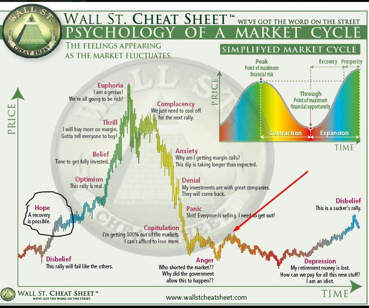

## Table of Contents

## What is market psychology and why is it important for trading?

Market psychology refers to the emotions and behaviors of traders and investors that influence their decisions in the market. It includes feelings like fear, greed, hope, and confidence, which can cause people to buy or sell assets based on their moods rather than on facts or analysis. For example, if many people start selling a stock because they are afraid it will lose value, this can cause the stock's price to actually drop, even if the company is doing well.

Understanding market psychology is important for trading because it helps traders predict how the market might move based on how people are feeling. If traders can spot when others are acting out of fear or greed, they can make better decisions about when to buy or sell. By understanding these emotional patterns, traders can avoid making the same mistakes others do and find opportunities to profit from the market's emotional swings.

## How does understanding market psychology help in making better trading decisions?

Understanding market psychology helps traders make better decisions by letting them see why other people are buying or selling. If a trader knows that many people are selling a stock because they are scared, even though the company is doing well, the trader can choose to buy the stock at a lower price. This way, the trader can make money when the price goes back up because the fear was not based on real problems with the company.

Also, knowing about market psychology can help traders avoid making bad choices based on their own feelings. For example, if a trader feels greedy and wants to buy a stock that everyone is talking about, understanding market psychology can remind them to check if the stock is really a good buy or if it's just popular because of hype. By staying calm and thinking clearly, traders can make smarter choices and not follow the crowd into risky moves.

## What are the common psychological biases that affect traders?

One common psychological bias that affects traders is called the confirmation bias. This is when traders only look for information that agrees with what they already believe. For example, if a trader thinks a stock will go up, they will only read news or reports that say the stock will go up and ignore anything that says it might go down. This can lead to bad decisions because they are not seeing the whole picture.

Another bias is the loss aversion bias. This means that traders feel the pain of losing money much more than the joy of making money. Because of this, they might hold onto a losing stock for too long, hoping it will go back up, instead of selling it and cutting their losses. This can make their losses even bigger if the stock keeps going down.

Lastly, there's the overconfidence bias. This happens when traders think they know more than they really do and take too many risks. They might think they can predict the market perfectly and make big bets, but the market can be unpredictable, and this can lead to big losses. Being overconfident can make traders ignore important information and make them think they are better at trading than they really are.

## How can a beginner trader identify and manage their emotions during trading?

A beginner trader can start by keeping a trading journal. In this journal, they should write down how they feel before, during, and after each trade. This helps them see patterns in their emotions and understand how these feelings affect their decisions. For example, if they notice they often feel scared and sell too early, they can work on staying calm and waiting longer before making a move.

Another way to manage emotions is to set clear rules for trading and stick to them. This means deciding ahead of time when to buy or sell, and not changing these plans just because they feel nervous or excited. Having a plan can help traders avoid making quick decisions based on their feelings. It's also good to take breaks from trading when they feel too emotional, so they can come back with a clear mind.

Lastly, talking to other traders or joining a trading community can be helpful. Sharing experiences and getting advice from others can make a beginner feel less alone and more supported. It's also a good way to learn from others' mistakes and successes, which can help them manage their own emotions better.

## What role does fear and greed play in market movements?

Fear and greed are big feelings that can move the market a lot. When people are scared, they might sell their stocks quickly because they think the prices will go down. This can make the prices actually go down because so many people are selling. For example, if there's bad news about a company, people might get scared and sell their stocks in that company, even if the news isn't that bad. This fear can make the stock price drop a lot.

On the other hand, when people feel greedy, they might buy a lot of stocks because they think the prices will go up fast. This can make the prices go up because so many people are buying. For example, if a stock is going up and people hear about it, they might want to buy it too, hoping to make money quickly. This greed can make the stock price go up a lot, even if the company isn't doing that well. Both fear and greed can make the market move in big ways, sometimes not based on what's really happening with the companies.

## How can traders use market sentiment indicators to their advantage?

Traders can use market sentiment indicators to see how other people feel about the market. These indicators can show if people are feeling scared or greedy. For example, if a lot of people are scared and selling their stocks, a trader might see this as a chance to buy stocks at a lower price. They can use tools like the Fear and Greed Index or the Put/Call Ratio to understand the overall mood of the market. By knowing what others are feeling, traders can make smarter choices about when to buy or sell.

Another way traders can use market sentiment indicators is to avoid following the crowd. If everyone is feeling very greedy and buying a certain stock, it might be a sign that the stock is overvalued and could soon drop. By paying attention to these indicators, traders can decide to wait or even sell their stocks before the price goes down. This helps them make decisions based on what the market might do next, not just what it's doing right now.

## What are some strategies to overcome the fear of missing out (FOMO) in trading?

One way to overcome the fear of missing out (FOMO) in trading is to stick to a trading plan. A trading plan is like a set of rules that you decide on before you start trading. It tells you when to buy and when to sell, based on things like how much a stock is worth or what the market is doing. If you follow your plan, you won't make quick decisions just because you see other people making money. This helps you stay calm and not feel like you're missing out on something.

Another strategy is to focus on the long term instead of trying to make quick money. FOMO often makes people want to jump into trades that seem to be making money fast. But if you think about your goals over a longer time, like months or years, you won't feel as rushed. You can take your time to make good choices and not worry about missing out on short-term gains. This way, you can build a more stable and successful trading approach.

## How does the herd mentality influence trading decisions and market trends?

Herd mentality is when people do what everyone else is doing, even if it might not be the best choice. In trading, this means that if a lot of people start buying a certain stock, others will follow, thinking they will also make money. This can make the stock's price go up a lot, even if the company isn't doing anything special. But if everyone suddenly decides to sell, the price can drop quickly. This can lead to big swings in the market, where prices go up and down a lot because of what the crowd is doing, not because of what's really happening with the companies.

Traders need to be careful about following the herd because it can lead to bad decisions. If everyone is buying a stock because it's popular, it might be overvalued, meaning its price is too high. When the hype dies down, the price can fall, and people who bought in late can lose money. On the other hand, if everyone is selling a stock out of fear, it might be a good time to buy because the price is low. By understanding herd mentality, traders can avoid making the same mistakes as the crowd and find opportunities to make smart trades.

## What psychological techniques can be used to maintain discipline in trading?

One way to keep discipline in trading is to use a trading journal. Writing down your trades and how you feel about them helps you see patterns in your behavior. If you notice you often make quick decisions when you're feeling excited or scared, you can work on staying calm. By looking back at your journal, you can learn from your past mistakes and make better choices in the future. This helps you stick to your trading plan and not let your emotions control your actions.

Another technique is to set clear rules for yourself and follow them strictly. Decide ahead of time when you will buy or sell, and stick to those decisions no matter how you feel in the moment. This means setting stop-loss orders to limit your losses and take-profit orders to lock in your gains. By having these rules, you can avoid making impulsive trades based on fear or greed. It's like having a safety net that keeps you disciplined and focused on your long-term goals, not just the ups and downs of the market.

## How do experienced traders use contrarian investing based on market psychology?

Experienced traders use contrarian investing by going against what most people are doing in the market. They look at market psychology to see when everyone is feeling very scared or very greedy. If everyone is scared and selling a stock, a contrarian trader might think it's a good time to buy. They believe that the fear is making the stock's price lower than it should be. On the other hand, if everyone is greedy and buying a stock, a contrarian might sell it, thinking the price is too high because of all the excitement.

By understanding how people's feelings can push the market in one direction, contrarian traders try to find opportunities where they can make money by doing the opposite. They use tools like sentiment indicators to see if the market is too scared or too greedy. This helps them decide when to go against the crowd. Contrarian investing takes a lot of patience and belief in their own analysis, but it can lead to big rewards if they are right about the market turning around.

## What are the psychological impacts of winning and losing streaks on a trader's performance?

Winning streaks can make traders feel very confident and happy. When they keep making money, they might start to think they can do no wrong. This can make them take bigger risks because they feel like they are on a roll. But this overconfidence can be dangerous. If they start to think they are better at trading than they really are, they might ignore important signs that the market is changing. This can lead to big losses if they don't stay careful and stick to their trading plan.

Losing streaks, on the other hand, can make traders feel scared and unsure. When they keep losing money, they might start to doubt their skills and feel like they will never win again. This fear can make them either take too many risks to try to make up for their losses quickly, or become too scared to make any trades at all. Both of these reactions can make their losses even worse. It's important for traders to stay calm during losing streaks, stick to their plan, and not let their emotions control their decisions.

## How can advanced traders develop a psychological edge over the market?

Advanced traders can develop a psychological edge over the market by understanding and managing their own emotions. They know that feelings like fear and greed can make them do things that aren't smart. So, they work on staying calm and sticking to their trading plan, no matter what the market is doing. They keep a trading journal to see how their feelings affect their trades. By looking at their past trades, they can learn from their mistakes and make better choices in the future. This helps them avoid making quick decisions based on how they feel in the moment.

Another way advanced traders get a psychological edge is by using market psychology to their advantage. They watch how other people are feeling about the market and use that information to make smart trades. For example, if everyone is scared and selling, they might see it as a chance to buy at a lower price. They use tools like sentiment indicators to understand the overall mood of the market. By going against what the crowd is doing, they can find opportunities to make money when others are making bad choices because of their emotions. This contrarian approach helps them stay one step ahead of the market.

## References & Further Reading

[1]: [Wall Street Cheat Sheet: The Psychology Of Market Cycles](https://priceactionninja.com/wall-street-cheat-sheet-the-psychology-of-market-cycles/)

[2]: [Market Psychology: Why the Wall St. Cheat Sheet Still Works for CBOE:SPX](https://www.tradingview.com/chart/SPX/NglfOraO-Market-Psychology-Why-the-Wall-St-Cheat-Sheet-Still-Works/)

[3]: [Wall Street Cheat Sheet Explained: How to Spot Market Cycles](https://www.morpher.com/blog/decoding-the-wall-street-cheat-sheet)

[4]: [Wallstreet Cheat Sheet: Psychology of a Market Cycle](https://steemit.com/money/%40naturaltrading/wallstreet-cheat-sheet-psychology-of-a-market-cycle)

[5]: [Wall Street Cheat Sheet - QuantifiedStrategies.com](https://www.quantifiedstrategies.com/wall-street-cheat-sheet/)

[6]: [Here are the 14 stages of the psychology of a market cycle from beginning to end](https://medium.com/%40KayodeOla/here-are-the-14-stages-of-the-psychology-of-a-market-cycle-from-beginning-to-end-66a832a0aa06)

[7]: [What The Wall Street Cheat Sheet Says About Stocks Now](https://finimize.com/content/what-the-wall-street-cheat-sheet-says-about-stocks-now)

[8]: [How to Read the Psychological State of the Market with Technical Indicators](https://www.investopedia.com/articles/trading/03/010603.asp)

[9]: [Understanding the Psychology of Market Cycle](https://www.wallstreetinsiderreport.com/p/understanding-the-psychology-of-market)

[10]: [Market Psychology Chart: Tips for Informed Investment Decisions](https://tacticalinvestor.com/market-psychology-chart-tips/)

[11]: [Fear and Greed Index - Investor Sentiment](https://www.cnn.com/markets/fear-and-greed)

[12]: [Financial Markets: When Fear and Greed Take Over](https://www.investopedia.com/articles/01/030701.asp)

[13]: [Greed and fear - Wikipedia](https://en.wikipedia.org/wiki/Greed_and_fear)

[14]: [The Fear & Greed Index: What It Is and How It Works](https://www.investopedia.com/terms/f/fear-and-greed-index.asp)

[15]: [Market Psychology: The 14 Stages of Investor Emotions](https://www.stockbrokers.com/education/trading-psychology-stages-investor-emotions)

[16]: [Technical Analysis That Indicates Market Psychology](https://www.investopedia.com/articles/trading/02/121602.asp)

[17]: [Market Cycle Investing Guide: 4 Stages & 13 Emotions](https://www.stopsaving.com/market-cycle-investing-guide/)