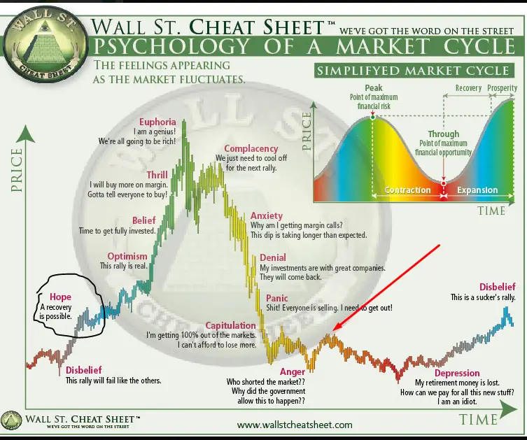

The Wall Street Cheat Sheet is an iconic representation that encapsulates the rollercoaster of emotions and psychological states traders and investors undergo during market cycles. From the peaks of euphoria to the troughs of despair, it captures the progression of sentiments as market conditions evolve. Conceived as a way to chart human reactions during a typical market cycle, it delineates both the bullish ascent of optimism and confidence and the bearish descent into doubt and pessimism.

At its core, the Wall Street Cheat Sheet isn't just a reflection of price movements; it offers a profound insight into the collective psyche of the market participants. By tracing the emotional journey of traders, the cheat sheet aids in recognizing recurring patterns of human behavior in response to financial ebbs and flows. Grasping the essence of these patterns is pivotal. It allows traders to not only predict potential market moves with greater acuity but also to manage their emotional responses, thereby making more informed and less impulsive decisions.

## Table of Contents

## Historical Perspective

The Wall Street Cheat Sheet emerged as a response to the recurring emotional cycles observed in financial markets. Its origins can be traced back to the early days of stock trading, though its conceptualization and popularization came much later. Observers of the market noticed that, irrespective of time periods and distinct market events, human reactions to profit and loss appeared to follow a predictable pattern. These observations eventually coalesced into the cheat sheet we recognize today, presenting a visual journey through the peaks and troughs of trader emotions.

The essence of the cheat sheet lies in its ability to capture universal human responses to change, uncertainty, and risk. While the cheat sheet specifically addresses the financial realm, the emotions it charts – from disbelief to euphoria and from anxiety to depression – resonate across various human experiences, especially in situations that involve high stakes and unpredictability. These are emotions rooted deeply in our evolutionary history, crafted from millennia of facing challenges, weighing risks, and adapting to ever-changing circumstances.

One of the most vivid demonstrations of the Wall Street Cheat Sheet's stages in action was during the Dot-com Bubble of the late 1990s and early 2000s. As technology stocks soared, traders transitioned from disbelief to euphoria, convinced that traditional valuation metrics no longer applied to these "new economy" companies[1]. However, as the bubble burst, the market plunged into the stages of anxiety, denial, and ultimately, capitulation. Investors who had once believed in endless growth were left grappling with anger and depression as they witnessed the evaporation of their investments.

## Detailed Exploration of Each Phase

### Disbelief

Disbelief is the initial phase of a market's upward journey, characterized by skepticism and a general reluctance to believe that the market is starting a positive trend. During this stage, traders, having been recently scarred by adverse market events, find it challenging to trust the budding uptrend. It's not mere pessimism but a defensive reflex built from recent experiences of losses and market downturns.

A historical event that embodies this sentiment was the period following the 2008 financial crisis. When the markets began to show signs of recovery in 2009, many investors remained in disbelief. The memory of the financial meltdown was too fresh, with prominent banks collapsing and the global economy spiraling into a recession[2]. Given the magnitude of the crash, investors were cautious, thinking that any upward tick was just a momentary relief before another downward spiral.

In real-world scenarios, the phase of disbelief can be illustrated by the phenomenon where good news about a stock or the economy gets ignored or downplayed. Investors, at this stage, often wait for multiple positive signals before committing, fearing that they might get trapped in a false rally. The implication for investors is that they might miss out on the early stages of a genuine bull run due to their excessive caution.

For traders navigating the disbelief phase, the key is to differentiate between being cautious and being paralyzed by past failures. While it's crucial to be wary and diligent, it's equally important not to let past events blind one to genuine opportunities. Employing a systematic approach, diversifying investments, and setting clear entry and [exit](/wiki/exit-strategy) criteria can help traders strike a balance between caution and opportunity.

### Hope

As the disbelief phase wanes, hope starts to permeate the market environment. This phase is marked by a subtle shift from skepticism to a more constructive outlook, as traders begin to entertain the possibility that the market might indeed be on an upward trajectory. Hope emerges from the ashes of recent downturns, representing a collective aspiration that better times might be around the corner.

Historically, a poignant example of this hopeful phase can be drawn from the early 1980s. After a tumultuous period during the late 1970s marred by economic stagflation, oil crises, and political unrest, the 1980s heralded the onset of a bullish market[1]. The lowering of [interest rate](/wiki/interest-rate-trading-strategies)s and initiation of expansive monetary policies instilled a sense of hope among traders that the economy might finally be pulling out of its quagmire.

During the hope phase, market trends often showcase gradual yet sustained upward movement. While the rises aren't typically meteoric, they are consistent. Trading [volume](/wiki/volume-trading-strategy)s may begin to increase as more investors re-enter the market, lured by the budding optimism. However, it's crucial to note that while the trend is upwards, the market can still be sensitive, reacting to smaller pieces of negative news more sharply than it would in more robust bullish phases.

For investors, the hope phase presents both opportunities and challenges. The potential upside is evident: entering the market during this early upward trend can offer substantial rewards as the cycle matures. However, the challenge lies in differentiating between a genuine trend reversal and a bear market rally.

Traders navigating this phase would benefit from maintaining a disciplined approach to investing. It's essential to set clear investment criteria, diversify portfolios, and continuously monitor market indicators for sustained upward [momentum](/wiki/momentum). Patience is a virtue here; while the urge to jump headfirst might be strong, a more measured approach could yield more favorable long-term results.

### Optimism & Belief

Following the subtle stirrings of hope, the market atmosphere matures into a phase characterized by optimism and belief. Traders start to shed their initial reservations, replaced by a growing confidence in the market's upward trajectory. The widespread sentiment is that the worst is behind, and prosperity lies ahead.

The dot-com boom of the late 1990s serves as a vivid illustration of this phase. Initial skepticism about the internet's commercial potential eventually gave way to overwhelming optimism. As companies like Amazon, eBay, and Yahoo began to demonstrate viable business models and unprecedented growth rates, investors' belief in the transformative power of the internet solidified[3].

During the optimism and belief phase, market trends tend to showcase steady growth, supported by robust fundamentals and positive economic indicators. Trading volumes see a substantial uptick, and media coverage is predominantly bullish. This positivity often leads to increased foreign investments and a general sense of economic buoyancy.

For investors, this phase offers promising opportunities. Riding the wave of optimism can lead to considerable gains, especially for those who entered the market during the early stages of hope. However, challenges arise in the form of FOMO (Fear of Missing Out). Investors might be tempted to over-leverage or invest without thorough due diligence, buoyed by the prevalent optimism.

To navigate this phase effectively, traders should adhere to [fundamental analysis](/wiki/fundamental-analysis) and maintain a disciplined investment strategy. While the temptation to chase every promising stock or asset can be overwhelming, diversifying investments and setting clear profit-taking and loss-cutting strategies can ensure sustainable gains. As the old Wall Street adage goes, "Bulls make money, bears make money, pigs get slaughtered." It's a reminder that while optimism is a powerful market driver, overconfidence can be an investor's downfall.

### Thrill & Euphoria

As markets continue to climb, investors enter a state of thrill, where anticipation of further gains becomes the predominant emotion. This period is characterized by a strong belief in the invincibility of the market. Talk of a "new normal" or a "revolutionary shift" in economics often surfaces, reinforcing the notion that traditional metrics no longer apply. The thrill is intoxicating, but it is merely a precursor to euphoria.

Euphoria, a state of irrational exuberance, represents the zenith of market psychology. It's when everyone, from seasoned [hedge fund](/wiki/hedge-fund-trading-strategies) managers to the average Joe, believes that nothing can go wrong. Asset prices skyrocket, often detached from their intrinsic value, and speculation runs rampant.

A glaring example of this is the tulip mania of the 17th century. At its peak, some tulip bulbs in the Netherlands were priced higher than houses. The belief that tulip prices would always rise led to wild speculation, only for it to crash spectacularly, leaving many facing financial ruin[4]. More recently, the housing bubble of 2008 was fueled by euphoria around real estate investments. The perception that house prices could only go up led banks to offer risky loans, eventually culminating in a financial meltdown with global repercussions[5].

The consequences of market bubbles are severe. Rapid price inflations followed by sharp declines lead to significant wealth erosion. For investors, the euphoria phase can be especially perilous. The fear of missing out often results in buying assets at peak prices, leading to substantial losses when the bubble bursts.

Navigating the thrill and euphoria phase requires a balanced approach. Here are some tips:

1. **Stay Informed**: Keep abreast of market fundamentals. If asset prices deviate significantly from their intrinsic value, it's a sign of speculative behavior.
2. **Avoid Herd Mentality**: Just because everyone is buying doesn't mean it's the right decision. Base investments on thorough research.
3. **Take Profits**: If you've experienced significant gains, consider taking some profits off the table. It's essential to secure returns rather than be overly greedy.
4. **Maintain a Long-term Perspective**: Bubbles burst, but solid investments with sound fundamentals tend to recover over time. Ensure your portfolio is diversified and aligned with long-term objectives.

### Complacency

Following the peaks of thrill and euphoria, markets inevitably face pullbacks. However, instead of recognizing these as early warning signs, many investors view these dips as minor hiccups, believing that the upward trajectory will soon resume. This is the complacency phase, characterized by a deceptive calmness and a false sense of security.

The dot-com bubble of the late 1990s serves as a prime illustration. As technology stocks soared, many believed in the limitless potential of the Internet. Even when the market began showing cracks in 2000, numerous investors dismissed concerns, confident in a swift recovery[6]. Yet, what followed was a prolonged bear market, erasing trillions in wealth.

Such complacency can lead to a lax approach to risk. Investors might ignore or downplay negative news, maintain overexposure to certain sectors, or neglect to re-evaluate their portfolios. This phase's danger lies in its subtlety; the shift from euphoria to complacency can be so gradual that investors might not even realize they've entered a riskier terrain.

To stay grounded during this deceptive phase:

1. **Continual Education**: Stay updated with market news. Minor corrections might indicate deeper structural problems.
2. **Diversify**: If certain sectors or assets have performed exceedingly well during the euphoria phase, consider rebalancing your portfolio to avoid overexposure.
3. **Seek External Perspectives**: Discuss your investment strategies with trusted financial advisors or peers to ensure you're not viewing things through rose-tinted glasses.
4. **Re-evaluate Investment Thesis**: If the primary reasons for your investments have changed or no longer hold, it might be time to reconsider your positions.

Being complacent in investing is akin to ignoring the smoke detector in your home. While everything might seem fine, the costs of neglect can be severe.

### Anxiety, Denial, & Panic

When the market transitions from a state of complacency, the initial tremors of uncertainty introduce the phase of anxiety. Investors start questioning their strategies, yet many aren't ready to accept potential losses. This hesitance morphs into denial, where investors are unwilling to believe or acknowledge a looming downturn.

The 2008 financial crisis serves as a haunting embodiment of these stages. Initially, when housing prices began to stall and mortgage defaults surged, the broader market was awash with anxiety[5]. But major financial institutions and many investors remained in denial, underestimating the systemic risks. This denial was shattered when Lehman Brothers filed for bankruptcy, plunging the market into full-blown panic.

Here's the cascading effect of these phases:

1. **Anxiety**: An unease sets in. Investors become hyper-alert to negative news, but most remain hopeful of a rebound.
2. **Denial**: As the downturn persists, investors cling to the belief that it's a temporary setback. They might hold onto devaluing assets, expecting a turnaround.
3. **Panic**: When reality can't be ignored any longer, a rush to exit investments ensues. Markets drop rapidly, liquidity can evaporate, and prices are driven down further by the frantic selling.

To navigate these treacherous waters:

1. **Stay Informed, Not Reactive**: Continuously update your knowledge, but differentiate between informational news and noise. Reacting to every piece of news can lead to poor decisions.
2. **Have an Exit Strategy**: Define your risk tolerance. Set stop-loss orders to prevent emotion-driven decisions in the heat of the moment.
3. **Diversify**: Ensure your portfolio isn't overly concentrated in any one asset or sector. This can mitigate potential losses.
4. **Seek Counsel**: Consult with financial advisors or trusted peers. In times of widespread panic, an external perspective can provide clarity.

Understanding and recognizing these stages early can mean the difference between making calculated decisions and being swept away by the tumultuous tide of market emotions.

### Capitulation, Anger, & Depression

The market's descent from anxiety and panic eventually culminates in capitulation, a phase characterized by investors giving up any previous gains or hopes of recovery. This abrupt surrender is not just a financial move but a stark emotional response, an admission of defeat.

A striking example of capitulation occurred during the global financial crisis. By early 2009, after months of devastating losses, many investors threw in the towel, selling off assets in a desperate bid to salvage whatever they could. What followed was a period of pronounced anger, not just at personal losses, but directed towards financial institutions, regulators, and even rating agencies, leading to global protests and a clamor for change.

Post the anger phase, depression sets in. Investors start internalizing their losses, leading to a deep sense of regret and despondency. The Dot-com bubble's burst in the early 2000s exemplifies this stage[6]. After the anger at perceived corporate malfeasances, many investors, having lost significant sums, grappled with a sense of disillusionment about tech investments and questioned their own decision-making abilities.

Navigating through these emotional quagmires requires a blend of self-awareness and strategic planning:

1. **Capitulation**: Recognize the emotion but act rationally. If you're selling, ensure it aligns with your long-term financial goals, not just a knee-jerk reaction.
2. **Anger**: Channel this emotion productively. Re-evaluate your investment strategy, seek accountability if there's a genuine grievance but avoid blame games.
3. **Depression**: Focus on the bigger picture. Market cycles are inevitable. Reflect on mistakes, learn from them, but also remember past successes.

For traders and investors:

- **Stay Connected**: Engage with a community or support group. Sharing experiences, especially during downturns, can offer fresh perspectives and alleviate feelings of isolation.
- **Regular Portfolio Reviews**: Periodically reassess risk tolerance and asset allocation. This proactive approach can minimize reactive decisions during volatile times.
- **Seek Professional Advice**: Financial planners or therapists specializing in financial wellness can offer strategies to manage the emotional and financial aspects of downturns.

The tumultuous journey from capitulation to depression underlines the intertwined relationship between finances and emotions. While market movements are inevitable, how one responds can influence both financial outcomes and mental well-being.

## Beyond the Cheat Sheet: Additional Phases to Consider

**Greed** often takes center stage during market rallies. While optimism and hope are rooted in genuine positive sentiment, greed is driven by an insatiable desire for more, often causing traders to make impulsive decisions without evaluating underlying risks. This emotion played a pivotal role in the lead-up to the 2008 financial crisis. Many investors, lured by the seemingly endless upward trajectory of housing prices, purchased properties on leverage, often without due diligence.

On the flip side, the **Adaptive** phase represents the market's resilience and traders' agility in evolving scenarios. Traders in this phase are keen observers, quickly learning from both their triumphs and missteps. They modify their strategies, hedging against known risks and seeking new opportunities in changing market conditions. A remarkable instance of adaptability was the swift embrace of tech stocks after the initial shock of the COVID-19 pandemic. Investors, recognizing the accelerated digital transformation, pivoted towards companies poised to benefit from this paradigm shift.

Lastly, **Regret** is an emotion every trader faces at some point. Whether it's the sorrow of selling a stock too early only to see its price skyrocket or the anguish of holding onto a plummeting asset for too long, the weight of "what could have been" is a heavy burden. The aftermath of the Dot-com bubble saw widespread regret as investors ruminated on missed signs and overexposure to tech stocks without solid fundamentals. While hindsight is 20/20, the feeling of regret can serve as a powerful lesson, teaching traders the value of thorough research and measured decision-making.

## Applying the Cheat Sheet in Real-time Trading

The Wall Street Cheat Sheet isn't just a theoretical framework; it's an actionable tool that, when wielded correctly, can significantly augment a trader's decision-making process. Here's how traders can harness its power in real-time trading scenarios:

1. **Stay Informed, Not Influenced**: Use the cheat sheet as a compass to gauge market sentiment, but always couple it with sound technical and fundamental analysis. For instance, if the market appears to be in the 'Euphoria' phase, it might be tempting to join the buying frenzy. However, diligent research might reveal overvaluation, advising caution.
2. **Regularly Reassess Your Emotional State**: Periodically check in with your emotions and assess which phase of the cheat sheet you personally resonate with. If you find yourself feeling 'Thrilled' every time your stock ticks up, it might be time to re-evaluate whether you're basing decisions on objective analysis or emotional whims.
3. **Set Clear Entry and Exit Strategies**: Establishing predefined entry and exit points helps mitigate emotional decision-making. If the market enters the 'Panic' phase, having a predetermined exit point can prevent unnecessary losses or the pitfalls of trying to 'catch a falling knife'.
4. **Diversify and Hedge**: In phases like 'Complacency' or 'Anxiety', consider diversifying your portfolio to spread risk or using hedging techniques. This can act as a safety net, ensuring not all your investments are impacted by a sudden downturn.
5. **Maintain a Trading Journal**: Documenting trades, rationales, and emotional states can provide invaluable insights over time. By reflecting on past behaviors during specific market phases, traders can pinpoint emotional triggers and strategize better for future scenarios.
6. **Continuous Learning and Emotional Intelligence**: Emotional intelligence – the ability to recognize, understand, and manage our emotions and influence the emotions of others – is crucial in trading. Engage in mindfulness practices or consider reading up on emotional intelligence to bolster resilience against market volatility.
7. **Seek Peer Review**: Regularly discuss your trading strategies with trusted peers or mentors. They might offer a perspective you haven't considered, especially if their assessment of the current market phase differs from yours.

In the volatile world of trading, it's easy to get swayed by emotions. The Wall Street Cheat Sheet provides a structured lens to view these emotions, but cultivating emotional intelligence ensures that traders navigate these phases with both clarity and strategy.

## The Modern-Day Relevance of the Cheat Sheet

The Wall Street Cheat Sheet, despite being conceptualized years ago, remains remarkably pertinent in today's ever-evolving financial world. Its portrayal of human emotional cycles in response to market fluctuations proves time and time again that while technology and markets change, human psychology remains consistent.

One might argue that with the advent of technological marvels like [algorithmic trading](/wiki/algorithmic-trading), the emotional roller coaster depicted by the cheat sheet should be less influential. Algorithmic trading, using pre-set instructions for placing trades based on timing, price, or quantity, theoretically minimizes human emotional interference[7]. However, while algorithms can trade without emotion, they are designed by humans who inherently [carry](/wiki/carry-trading) biases and emotions into their coding decisions[8].

Moreover, these algorithms often rely on historical data. Past performance and trends can predict future market movements to a certain extent, but they cannot entirely account for sudden market shifts driven by collective human emotion. During times of global uncertainty or unprecedented news, the markets can still show patterns of panic, euphoria, or complacency that the cheat sheet aptly captures.

The introduction of AI in trading presents another layer of complexity. Advanced as they might be, AI systems are still trained on data generated by human actions and reactions in the market. While they can analyze vast amounts of information at speeds incomprehensible to humans, they still operate within the confines of their training data. Thus, even in an AI-driven market, the cyclical nature of human emotions, as represented by the cheat sheet, can find its way into AI predictions and actions[9].

Furthermore, as retail trading platforms become more accessible and popular, a new wave of individual traders is entering the market. These traders, many of whom might lack the experience or resources of institutional traders, can be particularly susceptible to the emotional pitfalls highlighted in the cheat sheet. Their collective actions can lead to market movements that resonate with the cheat sheet's phases, reinforcing its relevance.

## Conclusion

Understanding market psychology isn't just an academic endeavor; it's an essential facet of successful trading and investment strategies. By recognizing the collective emotions and behavioral patterns that drive market movements, traders can gain insights that mere quantitative data might not reveal.

The Wall Street Cheat Sheet stands as a testament to the cyclical nature of human emotions in finance. Whether one is a novice taking their first tentative steps into the world of trading or a seasoned veteran with years of experience, the cheat sheet serves as a mirror, reflecting the timeless dance of hope, euphoria, despair, and everything in between. It is a reminder that markets, no matter how sophisticated or technologically advanced, are driven at their core by human actors with all their inherent emotional complexities.

Every phase, from the early whispers of disbelief to the crushing weight of capitulation, offers lessons. By being aware of these stages, traders can make informed decisions, sidestep potential pitfalls, and capitalize on opportunities that others might miss.

In an era where information is abundant, and the pace of market changes can be dizzying, tools like the Wall Street Cheat Sheet are invaluable. They ground us, provide perspective, and remind us that while markets evolve, the human psyche, with all its triumphs and frailties, remains a constant.

## References & Further Reading

[1]: Shiller, R. J. (2005). [Irrational exuberance](https://www.amazon.fr/Irrational-Exuberance-Robert-J-Shiller/dp/0767923634). Princeton university press.

[2]: Gorton, G., & Metrick, A. (2012). [Getting up to Speed on the Financial Crisis: A One-Weekend-Reader's Guide](https://www.aeaweb.org/articles?id=10.1257/jel.50.1.128). Journal of Economic Literature, 50(1), 128-150.

[3]: [Cassidy, J. (2002). [Dot.con: How America lost its mind and money in the internet era](https://www.amazon.com/Dot-America-Lost-Money-Internet/dp/0060008814). Harper Collins.]

[4]: Goldgar, A. (2007). [Tulipmania: Money, Honor, and Knowledge in the Dutch Golden Age](https://www.amazon.com/Tulipmania-Money-Honor-Knowledge-Golden/dp/0226301265). University of Chicago Press.

[5]: Sorkin, A. R. (2009). [Too Big to Fail: The Inside Story of How Wall Street and Washington Fought to Save the Financial System—and Themselves](https://www.amazon.com/Too-Big-Fail-Washington-System/dp/0143118242). Viking.

[6]: [Lowenstein, R. (2004). [Origins of the Crash: The Great Bubble and Its Undoing](https://www.goodreads.com/book/show/96578.Origins_of_the_Crash). Penguin Books.]

[7]: Kissell, R. (2013). [The Science of Algorithmic Trading and Portfolio Management](https://www.amazon.com/Science-Algorithmic-Trading-Portfolio-Management/dp/0124016898). Academic Press.

[8]: Chaboud, A. P., Chiquoine, B., Hjalmarsson, E., & Vega, C. (2014). [Rise of the machines: Algorithmic trading in the foreign exchange market](https://onlinelibrary.wiley.com/doi/abs/10.1111/jofi.12186). The Journal of Finance, 69(5), 2045-2084.

[9]: Treleaven, P., Galas, M., & Lalchand, V. (2013). [Algorithmic trading review](https://www.researchgate.net/publication/262239006_Algorithmic_Trading_Review). Communications of the ACM, 56(11), 76-85.