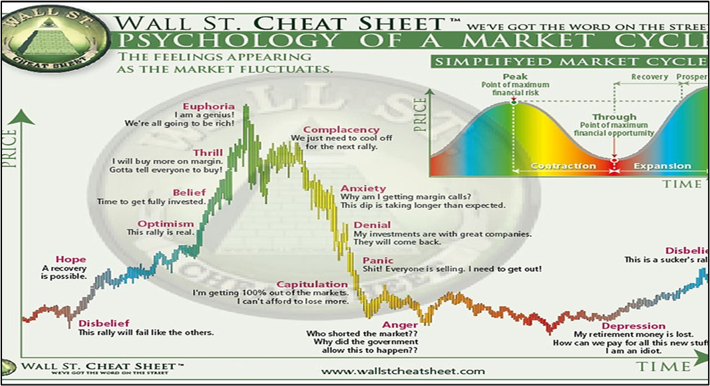

The world of financial markets is intricate and ever-evolving, with Wall Street at its epicenter. A focal point of innovation in this domain is algorithmic trading, a process that leverages advanced computing and analytics to transform investment strategies. This technological advancement has significantly altered the landscape of investing, providing investors with tools to make more timely and data-driven decisions.

Algorithmic trading involves the use of algorithms—sets of rules or instructions that determine trading strategies based on pre-determined criteria. These algorithms are capable of processing vast amounts of market data at speeds far beyond human capability, allowing for rapid and informed trading decisions. This fusion of technology and finance is not only optimizing trade execution but is also redefining how financial markets operate.



As algorithmic trading continues to shape the strategies employed by Wall Street, understanding its role has become crucial for investors. It offers insights into operational efficiencies, cost-effectiveness, and enhanced precision within the trading process. By embracing algorithmic trading, investors can identify new opportunities, optimize their portfolios, and potentially achieve better returns.

This article aims to provide a comprehensive overview of algorithmic trading by covering its key concepts, benefits, risks, and future trends. In an era where technology is integrated into nearly every facet of finance, recognizing the impact of algorithmic trading is essential for those wishing to navigate the complexities of modern markets effectively. The ongoing advancements in this field underscore the necessity for investors and institutions to remain adaptable and informed.

## Table of Contents

## What is Algorithmic Trading?

Algorithmic trading, often referred to as algo trading, employs computerized systems to execute trades through pre-defined criteria. This methodology leverages advanced mathematical models and statistical analyses to make swift trading decisions, surpassing human execution speeds. It capitalizes on market inefficiencies and trends to optimize the buying and selling of financial instruments.

The algorithms underpinning this trading strategy are designed to process vast quantities of market data, including historical prices, volumes, and real-time updates, in order to identify profitable opportunities. This approach minimizes human intervention and relies heavily on computational efficiency to gain a competitive edge.

Several strategies are integral to [algorithmic trading](/wiki/algorithmic-trading). Trend-following strategies, for instance, capitalize on consistent market movements, employing algorithms to identify and follow existing market trends without forecasting specific price levels. Mean reversion strategies operate under the assumption that prices will tend to move back towards an average value, triggering trades when assets deviate significantly from their historical average. Market making involves providing [liquidity](/wiki/liquidity-risk-premium) by simultaneously quoting buy and sell prices, [earning](/wiki/earning-announcement) a profit from the spread.

Prominent market participants like Renaissance Technologies have demonstrated the efficacy of algorithmic trading. Renaissance, notable for its quantitative approach, has consistently achieved high returns by employing complex models to analyze market behavior, setting a benchmark for the potential of algo trading.

This technology-driven trading paradigm has reshaped the financial landscape, making it essential for traders and institutions to incorporate advanced algorithms to maintain competitive advantage in fast-paced financial markets.

## Significance of Wall Street in Algo Trading

Wall Street, often regarded as the epicenter of global finance, has played a pivotal role in embracing and advancing algorithmic trading (algo trading). The integration of technology into trading practices has significantly reshaped the dynamics of how trades are executed on this financial powerhouse. Wall Street's influence is evident in its ability to set benchmarks for innovation and efficiency, which are emulated by financial markets worldwide.

Algorithmic trading has revolutionized trade execution processes on Wall Street by enabling rapid, data-driven decision-making. This transformation allows for trades to be conducted with unparalleled speed and accuracy, surpassing the capabilities of human traders. The algorithms deployed analyze vast datasets in real-time, identifying profitable opportunities and executing trades with minimal latency. This high-speed execution not only leads to increased efficiency but also substantially reduces the likelihood of human errors, which are common in traditional trading setups.

The technological advances spearheaded by Wall Street have set a precedent for global financial hubs. These hubs often measure their own technological and strategic advancements against Wall Street standards. The adoption of algo trading has spurred a shift towards more automated and systematic trading approaches, influencing other major financial centers like London, Tokyo, and Hong Kong.

Furthermore, Wall Street's commitment to continuous innovation ensures that it remains at the forefront of leveraging cutting-edge technologies in trading strategies. This drive for upgrading and optimizing trading systems influences the global financial ecosystem, prompting other markets to adopt similar practices for competitive advancement. As a result, Wall Street serves not just as a financial center but also as a beacon of innovation in algorithmic trading practices, shaping the evolution and adoption of technology across the global financial landscape. 

Overall, Wall Street's role in advancing algorithmic trading highlights its significance in modern finance by promoting efficiency and setting technological standards that other markets aspire to meet.

## Benefits of Algorithmic Trading

Algorithmic trading brings several advantages to the financial markets, primarily attributed to its ability to leverage computational power for fast and precise decision-making. One of its most significant benefits is speed and precision. Algorithms are capable of analyzing vast datasets and executing trades in fractions of a second, a task impossible for human traders to accomplish manually. This computational ability allows traders to capitalize on fleeting market opportunities that appear and vanish rapidly.

Moreover, automated systems reduce the impact of human emotions in trading. Emotional decision-making, often influenced by fear or greed, can lead to irrational and inconsistent strategies. Algorithmic trading mitigates these tendencies by adhering to pre-established parameters, resulting in more consistent and objective trading outcomes. This impartiality enhances the precision and reliability of trading strategies.

Scalability is another major benefit of algorithmic trading. With the ability to manage and execute trades across multiple accounts simultaneously, algorithmic systems offer traders the flexibility to operate efficiently in diverse market conditions. This feature allows for the handling of large volumes of data and transactions without a corresponding increase in human resources, making it an efficient approach for large-scale trading operations.

From a cost-efficiency perspective, algorithmic trading significantly reduces the expenses associated with traditional trading. By automating processes, firms can decrease the need for manual interventions, thus lowering labor costs. Additionally, the minimized risk of human error can prevent costly mistakes, further enhancing cost savings. As such, algorithmic trading provides a financially viable solution for firms aiming to streamline their operations in competitive markets.

## Risks and Challenges

Algorithmic trading, while beneficial in many respects, presents several risks and challenges that market participants must carefully navigate. One significant risk is technical failure. Automated trading systems rely heavily on complex software and hardware infrastructures, and any malfunction or error, such as server downtime or software bugs, can result in unintended trades or financial losses. A notable example is the infamous 2012 Knight Capital Group incident, where a software glitch led to a loss of $440 million in 45 minutes, highlighting the potential catastrophic impact of technical failures in algorithmic trading systems.

Market [volatility](/wiki/volatility-trading-strategies) further exacerbates risks, as algorithms that are not designed to cope with sudden changes in market conditions may perform poorly, leading to significant drawdowns. This situation can be particularly problematic if an algorithm leverages positions to amplify small expected gains, as unexpected volatility can result in outsized losses. Algorithms designed for stable market conditions may fail to incorporate risk management strategies that account for sudden market shifts, exemplifying the importance of adaptive and robust algorithm design.

Additionally, the rapid growth of algorithmic trading has attracted increased regulatory scrutiny. Financial authorities worldwide are implementing stricter regulations to ensure market stability and protect investors. For instance, the U.S. Securities and Exchange Commission (SEC) has set forth numerous rules requiring transparency and risk controls for firms engaged in algo trading. Institutions engaged in algorithmic trading need to ensure compliance with these regulations to avoid legal repercussions and potential financial penalties.

Lastly, the challenge of overfitting is a critical consideration in developing trading algorithms. Overfitting occurs when a model is excessively tailored to historical data, capturing noise rather than the underlying market signal. Such models may exhibit outstanding past performance but fail to generalize to new, unseen data in live trading environments. This problem can be mitigated by employing robust validation techniques, such as cross-validation, and by testing the models on out-of-sample data before deployment.

In conclusion, while algorithmic trading offers considerable efficiencies and opportunities for profit, it necessitates a comprehensive understanding of its inherent risks and challenges. Balancing technical capabilities with rigorous risk management and compliance strategies is vital for optimizing performance and ensuring the longevity of algorithmic trading endeavors in volatile and ever-evolving financial markets.

## Getting Started with Algorithmic Trading

For aspiring traders aiming to venture into algorithmic trading, establishing a strong foundation in both financial markets and programming is essential. A well-rounded understanding of financial principles, market dynamics, and trading strategies forms the backbone of any successful algorithmic trading journey. This foundational knowledge helps in grasping the complexities of market behavior and developing strategies that can adapt to varying market conditions.

Programming skills are equally crucial, as they enable traders to automate trading strategies, analyze large data sets, and implement complex algorithms. Python is often the preferred language due to its simplicity and the extensive libraries available, such as NumPy for numerical computations, pandas for data manipulation, and [backtrader](/wiki/backtrader) for strategy [backtesting](/wiki/backtesting). Here is an example of a simple moving average crossover strategy in Python:

```python
import pandas as pd
import numpy as np
import backtrader as bt

class SmaCross(bt.SignalStrategy):
    def __init__(self):
        sma1 = bt.ind.SMA(period=10)
        sma2 = bt.ind.SMA(period=30)
        self.signal_add(bt.SIGNAL_LONG, bt.ind.CrossOver(sma1, sma2))

data = bt.feeds.YahooFinanceData(dataname='AAPL')
cerebro = bt.Cerebro()
cerebro.addstrategy(SmaCross)
cerebro.adddata(data)
cerebro.run()
cerebro.plot()
```

Platforms like TradeStation and TrendSpider offer robust environments for creating and testing trading strategies. TradeStation provides comprehensive tools for strategy development, backtesting, and automation, while TrendSpider emphasizes advanced charting with automated technical analysis.

Starting with thorough research is imperative. This involves reading relevant financial literature, studying existing algorithms, and understanding market mechanics. Additionally, backtesting strategies with historical data can help identify potential weaknesses before actual implementation. It's advisable to begin with small investments, thereby minimizing risk while gaining practical experience. As traders become more comfortable and confident, gradually increasing investment size allows for scaling strategies without undue risk exposure.

By combining a solid educational foundation with practical application, traders can effectively navigate the complexities of algorithmic trading and enhance their potential for success.

## Future Trends in Algorithmic Trading

Algorithmic trading is continually evolving with technological advancements, particularly through the increased application of [artificial intelligence](/wiki/ai-artificial-intelligence) (AI) and [machine learning](/wiki/machine-learning). These technologies facilitate the creation of more intelligent decision-making systems in trading. Algorithms using AI can process vast datasets to identify patterns and execute trades autonomously, enhancing accuracy and efficiency. Machine learning models are adept at learning from new data, which allows for improved prediction of market movements and rapid adaptation to market changes. Models such as [reinforcement learning](/wiki/reinforcement-learning) are increasingly being adopted to optimize trading strategies by learning through an iterative process akin to trial and error.

The integration of [alternative data](/wiki/best-alternative-data) sources is another significant trend. These include social media sentiment analysis and satellite imagery, which provide unique insights beyond traditional financial data. For instance, natural language processing (NLP) techniques can be employed to gauge market sentiment by analyzing large volumes of social media posts, news articles, and other forms of text data. Python libraries like `TextBlob` or `VADER` are effective tools for this purpose. Additionally, satellite imagery can offer valuable information on variables like commodity supply estimates or retail foot traffic, contributing to more informed trading strategies.

```python
from textblob import TextBlob

# Example of sentiment analysis using TextBlob
def analyze_sentiment(text):
    blob = TextBlob(text)
    sentiment = blob.sentiment
    return sentiment.polarity, sentiment.subjectivity

# Example data
example_text = "The market is showing strong potential for growth."

# Analyzing sentiment
polarity, subjectivity = analyze_sentiment(example_text)
print(f"Polarity: {polarity}, Subjectivity: {subjectivity}")
```

The global expansion of financial markets further necessitates sophisticated and flexible algorithmic trading models. As markets become more interconnected, algorithms must adapt to diverse trading conditions and regulatory environments. This requires an increased focus on models that are robust to environmental changes and capable of operating under a range of constraints. Developing cross-market algorithms that can seamlessly function in multiple geographic locations is expected to become a focal point in the industry.

Overall, the future of algorithmic trading is aligned with technological advancements. Innovations in AI and data analytics are set to redefine trading strategies, offering unprecedented opportunities for traders and institutions who can effectively harness these tools.

## Conclusion

Algorithmic trading is a transformative force in financial markets like Wall Street, offering a blend of opportunities and challenges that are reshaping investment landscapes. The integration of advanced algorithms enables trading at unprecedented speed and accuracy, which has resulted in more efficient markets. However, these benefits come with unique challenges. One primary challenge is the risk of technical failures leading to significant financial losses if not promptly managed. Furthermore, market volatility can amplify these risks, making robust risk management strategies essential for the sustainability of algorithmic trading systems.

Innovation is at the heart of thriving in the algorithmic trading domain. As the trading environment evolves, strategies must be continually refined. Techniques such as machine learning and the use of alternative data sources provide avenues for developing more intelligent and adaptive trading algorithms. However, the deployment of these advanced methods requires careful consideration of factors such as overfitting, where algorithms are too tailored to historical data and may not perform efficiently in live market conditions.

For investors and financial institutions, staying ahead in the ever-evolving landscape of algorithmic trading demands a commitment to vigilance and adaptability. This involves not only keeping abreast of technological advancements but also ensuring compliance with regulatory standards as scrutiny on algorithmic trading practices increases. Furthermore, fostering a culture of continuous learning and innovation can help capitalize on the potential rewards while mitigating inherent risks. By maintaining a forward-thinking approach, investors and institutions can effectively harness the full benefits of algorithmic trading, contributing to more dynamic and efficient financial markets.

## References & Further Reading

[1]: Bergstra, J., Bardenet, R., Bengio, Y., & Kégl, B. (2011). ["Algorithms for Hyper-Parameter Optimization."](https://papers.nips.cc/paper/4443-algorithms-for-hyper-parameter-optimization) Advances in Neural Information Processing Systems 24.

[2]: ["Advances in Financial Machine Learning"](https://www.amazon.com/Advances-Financial-Machine-Learning-Marcos/dp/1119482089) by Marcos Lopez de Prado

[3]: ["Evidence-Based Technical Analysis: Applying the Scientific Method and Statistical Inference to Trading Signals"](https://www.amazon.com/Evidence-Based-Technical-Analysis-Scientific-Statistical/dp/0470008741) by David Aronson

[4]: ["Machine Learning for Algorithmic Trading"](https://github.com/stefan-jansen/machine-learning-for-trading) by Stefan Jansen

[5]: ["Quantitative Trading: How to Build Your Own Algorithmic Trading Business"](https://books.google.com/books/about/Quantitative_Trading.html?id=j70yEAAAQBAJ) by Ernest P. Chan