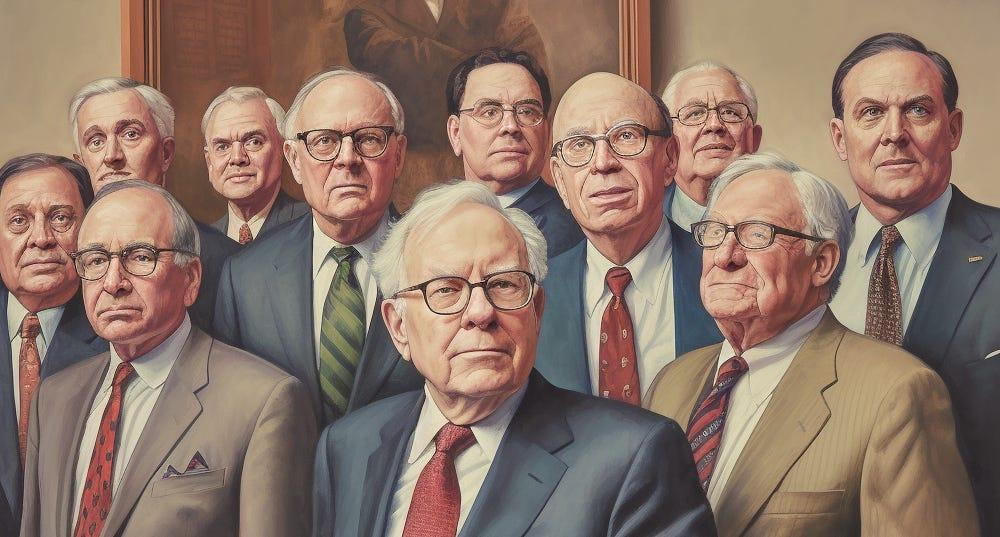

## Table of Contents

## What is Wall Street and why is it significant in the world of finance?

Wall Street is a famous street in New York City where many important financial businesses are located. It is known all over the world because it is the home of the New York Stock Exchange, which is one of the biggest places where people buy and sell stocks. When people talk about Wall Street, they are often talking about the whole American financial industry, not just the street itself.

Wall Street is very important in the world of finance because it is a big part of the global economy. The decisions made by the people working on Wall Street can affect the prices of stocks, how much money people have, and even the economy of whole countries. Because of this, what happens on Wall Street is watched closely by people all around the world who are interested in money and business.

## How does Wall Street influence individual investing decisions?

Wall Street influences individual investing decisions a lot because it's where big financial news and trends start. When something important happens on Wall Street, like a big company's stock going up or down a lot, it gets a lot of attention. People who invest their own money often watch these events closely. They might decide to buy or sell their own stocks based on what they see happening on Wall Street. For example, if a popular company's stock goes up, many individual investors might want to buy that stock too, hoping to make money.

Also, Wall Street is home to many experts who share their opinions and predictions about the market. These experts work for big banks and investment firms, and what they say can guide what individual investors do. If an expert says a certain type of investment is a good idea, many people might follow that advice. On the other hand, if experts warn about a risky investment, people might decide to stay away from it. So, Wall Street not only sets trends but also shapes what individual investors think and do with their money.

## What are some common investment products associated with Wall Street?

Wall Street is known for many different investment products that people can buy and sell. One of the most common is stocks. Stocks are pieces of ownership in a company. When you buy a stock, you own a little bit of that company. Another popular investment product is bonds. Bonds are like loans that you give to a company or the government. They promise to pay you back with interest over time.

There are also more complex investment products like mutual funds and exchange-traded funds (ETFs). Mutual funds are a way for many people to pool their money together to invest in a bunch of different stocks or bonds at once. ETFs are similar, but you can buy and sell them throughout the day, just like stocks. These products help people spread out their risk because they invest in many things instead of just one.

Options and futures are other investment products you might hear about on Wall Street. Options give you the right to buy or sell a stock at a certain price in the future. Futures are agreements to buy or sell something, like a commodity, at a set price on a specific date. These can be riskier but can also offer big rewards if used correctly.

## How has Wall Street contributed to the development of financial markets?

Wall Street has played a big role in shaping financial markets around the world. It started with the New York Stock Exchange, which was set up in the late 1700s. This exchange made it easier for companies to raise money by selling stocks to the public. Over time, Wall Street became a place where new financial products were created and traded. These products, like bonds, mutual funds, and ETFs, helped people invest their money in different ways. Wall Street also helped make trading faster and more efficient with new technology, like electronic trading systems.

Because Wall Street is so important, it has influenced how financial markets work everywhere. When big events happen on Wall Street, like a stock market crash or a big company going bankrupt, it can affect markets all over the world. This is because many countries' economies are connected to the U.S. economy. Wall Street also sets standards for how financial markets should operate, like rules about transparency and fairness. These standards help make sure that markets are safe and fair for everyone who wants to invest.

## What role do major Wall Street firms play in the global economy?

Major Wall Street firms play a big role in the global economy because they help move money around the world. These firms, like big banks and investment companies, help businesses and governments borrow money. They do this by selling bonds and other financial products. When a company or a country needs money to grow or build something new, they can go to Wall Street firms to get it. This helps the global economy grow because it lets more projects happen and more jobs be created.

Wall Street firms also help people invest their money. They manage big funds that buy stocks, bonds, and other investments from all over the world. When these firms invest in different countries, they help those economies grow. For example, if a Wall Street firm buys a lot of stocks from a company in another country, it can make that company's stock price go up. This can help the company grow and create more jobs. So, what Wall Street firms do can affect the whole world's economy.

## Can you explain the concept of 'Wall Street vs. Main Street' and its implications?

The phrase 'Wall Street vs. Main Street' is used to talk about the difference between big financial businesses and regular people. Wall Street stands for the big banks, investment firms, and stock markets in New York City. Main Street, on the other hand, represents everyday people and small businesses in towns and cities across the country. The idea behind this phrase is that what's good for Wall Street might not always be good for Main Street. For example, when big banks make a lot of money, it doesn't always mean that regular people are doing well too.

This difference can have big effects on the economy and how people feel about it. Sometimes, the government makes rules to help Wall Street, like giving big banks money during a crisis. But these rules might not help Main Street as much. Regular people might feel left out or think that the system is unfair. This can lead to less trust in the economy and even protests or political movements. Understanding the 'Wall Street vs. Main Street' idea helps us see how big financial decisions can impact everyone's lives in different ways.

## How has Wall Street been portrayed in media and popular culture?

Wall Street has been shown in movies, TV shows, and [books](/wiki/algo-trading-books) in many different ways. Often, it is seen as a place where people can get rich fast but also take big risks. One famous movie is called "Wall Street," where the main character, Gordon Gekko, says that "greed is good." This movie shows how some people on Wall Street might do anything to make money, even if it's not always honest. Another movie, "The Wolf of Wall Street," tells the true story of a man who made a lot of money but also broke the law. These stories make Wall Street seem exciting but also a bit dangerous.

In TV shows and books, Wall Street is sometimes shown as a place where smart people work hard to make money for others. Shows like "Billions" show the lives of people who work in big investment firms and how they try to beat the market. These stories can make Wall Street seem like a place where you need to be very smart and always on your toes. But not all stories are about making money. Some books and documentaries talk about how Wall Street can affect the whole economy and how it can be hard for regular people when big banks make mistakes.

## What are some historical events that have shaped Wall Street's reputation?

Wall Street's reputation has been shaped by many big events over the years. One of the most famous is the stock market crash of 1929, which started the Great Depression. This crash made a lot of people lose their money and jobs. It showed that what happens on Wall Street can affect everyone, not just rich people. After this, the government made new rules to try to stop something like it from happening again. These rules were meant to make the stock market safer and more fair.

Another important event was the financial crisis of 2008. This crisis started when many big banks made risky bets that didn't pay off. It led to a lot of banks failing and many people losing their homes and jobs. The government had to step in to help the banks, which made some people angry because they thought the banks were being saved but regular people were not. This event made people think that Wall Street might be too focused on making money and not enough on being safe and fair. Both of these events have made Wall Street known as a place where big things can happen, for better or worse.

## How do regulations affect Wall Street operations and what are some key regulatory bodies?

Regulations are rules that the government makes to keep Wall Street safe and fair. These rules stop banks and other financial companies from doing things that could hurt the economy or regular people. For example, they might limit how much risk a bank can take or make sure that companies tell the truth about their money. Without these rules, Wall Street could be a wild place where anything goes, and that could lead to big problems like the financial crisis of 2008. So, regulations help make sure that Wall Street works in a way that is good for everyone.

Some of the main groups that make and enforce these rules are the Securities and Exchange Commission (SEC) and the Federal Reserve. The SEC looks after the stock market and makes sure that companies follow the rules when they sell stocks and bonds. They also check that people who buy and sell stocks are doing it fairly. The Federal Reserve, on the other hand, keeps an eye on banks and helps control the overall economy. They can change interest rates and make other rules to keep the economy stable. Both of these groups play a big role in making sure that Wall Street operates in a way that is safe and fair for everyone.

## What are the ethical considerations and controversies surrounding Wall Street practices?

Wall Street has faced many ethical questions and controversies over the years. One big issue is insider trading, where people use secret information to make money in the stock market. This is seen as unfair because it gives some people an advantage over others. Another problem is how much money top bankers and traders make, even when their decisions hurt the economy. Many people think it's wrong for a few people to get rich while others lose their jobs and homes. These issues make people wonder if Wall Street really cares about being fair and honest.

Another controversy is about how Wall Street firms treat their customers. Sometimes, they might sell products that are risky or not good for the customer, just to make more money for themselves. This can lead to big losses for regular people who trusted the firms to help them. Also, there have been times when big banks have broken the law and had to pay huge fines. These actions make people question if Wall Street is more interested in making money than in doing what's right. Overall, these ethical issues and controversies show that Wall Street needs to work hard to earn and keep people's trust.

## How do technological advancements impact trading and investment strategies on Wall Street?

Technological advancements have changed the way trading and investing happen on Wall Street a lot. Computers and the internet have made it easier and faster for people to buy and sell stocks. Now, instead of calling someone on the phone or going to the stock exchange in person, people can trade with just a few clicks on their computer or phone. This has made trading faster and cheaper. Also, new technology like algorithms and [artificial intelligence](/wiki/ai-artificial-intelligence) helps traders make decisions. These tools can look at a lot of information very quickly and find patterns that people might miss. This can help traders make better choices about when to buy or sell.

Another big change is the rise of high-frequency trading. This is when computers trade stocks very quickly, sometimes in just a few seconds. High-frequency trading can make the market more efficient, but it can also make it more risky. Sometimes, these fast trades can cause big swings in stock prices. Also, technology has made it easier for regular people to invest. With apps and online platforms, anyone can start investing without needing a lot of money or help from a big Wall Street firm. This has made investing more open to everyone, but it also means people need to be careful and learn how to use these tools the right way.

## What future trends might influence Wall Street's role in global finance?

In the future, Wall Street might see big changes because of new technology. One trend is the use of blockchain and cryptocurrencies. These new ways of moving money could change how people invest and trade. Blockchain makes transactions safer and easier to track, which could make the stock market more open and fair. Cryptocurrencies like Bitcoin might become more common, and Wall Street firms might start offering more ways for people to invest in them. This could shake up the traditional ways of investing and make Wall Street adapt to new kinds of financial products.

Another trend is the growing focus on sustainable investing. More and more people want to put their money into companies that are good for the environment and society. This could push Wall Street firms to change how they do business. They might start looking for investments that not only make money but also help the planet. This shift could make Wall Street a leader in fighting climate change and other big problems. As these trends grow, Wall Street will need to keep up with the changes to stay important in the world of finance.

## References & Further Reading

[1]: Bergstra, J., Bardenet, R., Bengio, Y., & Kégl, B. (2011). ["Algorithms for Hyper-Parameter Optimization."](https://papers.nips.cc/paper/4443-algorithms-for-hyper-parameter-optimization) Advances in Neural Information Processing Systems 24.

[2]: ["Advances in Financial Machine Learning"](https://www.amazon.com/Advances-Financial-Machine-Learning-Marcos/dp/1119482089) by Marcos Lopez de Prado

[3]: ["Evidence-Based Technical Analysis: Applying the Scientific Method and Statistical Inference to Trading Signals"](https://www.amazon.com/Evidence-Based-Technical-Analysis-Scientific-Statistical/dp/0470008741) by David Aronson

[4]: ["Machine Learning for Algorithmic Trading"](https://github.com/stefan-jansen/machine-learning-for-trading) by Stefan Jansen

[5]: ["Quantitative Trading: How to Build Your Own Algorithmic Trading Business"](https://books.google.com/books/about/Quantitative_Trading.html?id=j70yEAAAQBAJ) by Ernest P. Chan