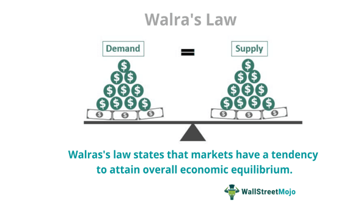

## Table of Contents

## What is Walras's Law?

Walras's Law is an economic theory that says the total demand for goods and services in an economy must equal the total supply. It's named after the economist Leon Walras. The idea is that if you add up everything people want to buy and everything businesses want to sell, they should balance out. If they don't, it means the market isn't in balance, and prices will need to change until they do.

This law is important because it helps economists understand how markets work. If there's a shortage of one good, the price will go up, encouraging more production and less consumption until the market balances out again. On the other hand, if there's a surplus, the price will go down, encouraging more consumption and less production. Walras's Law shows that all markets are connected, and a change in one can affect others, helping to keep the whole economy in balance.

## Who was Léon Walras and why is he important in economics?

Léon Walras was a French economist who lived from 1834 to 1910. He is famous for his work in the field of economics, especially for creating the general equilibrium theory. This theory says that all markets in an economy are connected, and they all need to be in balance for the whole economy to work well. Walras used math to explain how prices and quantities in different markets can adjust until they reach a point where everything is balanced.

Walras is important in economics because his ideas changed how economists think about markets. Before Walras, economists mostly looked at one market at a time. But Walras showed that you need to look at all markets together to understand how an economy works. His work led to the development of modern economic theories and models that are used today to study and predict how economies behave. Walras's Law, which says that the total demand for goods and services must equal the total supply, is one of his most famous ideas and is still taught in economics classes around the world.

## How does Walras's Law relate to the concept of general equilibrium?

Walras's Law and the concept of general equilibrium are closely connected. Walras's Law says that the total amount people want to buy must equal the total amount businesses want to sell. If they don't match, prices will change until they do. This idea is important for understanding general equilibrium, which is when all markets in an economy are balanced at the same time. In a general equilibrium, every market is in balance, and no one wants to change what they are buying or selling because they are happy with the current prices and quantities.

Léon Walras used his law to help explain general equilibrium. He showed that if one market is out of balance, it will affect other markets too. For example, if there is too much of one product, its price will go down, and people might start buying more of it and less of other products. This change can cause other markets to become unbalanced, and prices will keep adjusting until all markets are in balance again. So, Walras's Law helps us see how all markets are connected and why they need to be in balance for the whole economy to work well.

## Can you explain the basic mathematical formulation of Walras's Law?

Walras's Law can be explained using a simple math equation. Imagine an economy with lots of different goods and services. Each of these has a price and a quantity that people want to buy or sell. If you add up the value of everything people want to buy (total demand) and subtract the value of everything businesses want to sell (total supply), the result should be zero. In math, this can be written as: Σ (P_i * Q_i^d) - Σ (P_i * Q_i^s) = 0, where P_i is the price of good i, Q_i^d is the quantity demanded of good i, and Q_i^s is the quantity supplied of good i. The symbol Σ means you add up all the values for every good in the economy.

This equation shows that the total spending on all goods and services must equal the total income from selling them. If they are not equal, it means the market is not in balance, and prices will need to change. For example, if people want to buy more than businesses are selling, prices will go up until people want to buy less and businesses want to sell more. This keeps happening until the total demand equals the total supply, and the equation equals zero. This is the basic idea behind Walras's Law and how it helps explain how markets work to reach a balance.

## What is the significance of Walras's Law in understanding market mechanisms?

Walras's Law is important because it helps us understand how markets work to find a balance. It says that the total amount of money people want to spend on goods and services should equal the total amount of money businesses get from selling them. If they don't match, prices will change until they do. This idea is key to understanding how markets adjust to keep everything in balance. When there's too much of a product, its price goes down, making people buy more of it. When there's not enough, the price goes up, and people buy less. This back-and-forth helps the market find a point where everyone is happy with what they are buying and selling.

The law also shows us that all markets are connected. If one market is out of balance, it can affect other markets too. For example, if the price of one product goes down, people might start buying more of it and less of other products. This change can cause other markets to become unbalanced, and prices will keep adjusting until all markets are in balance again. Understanding this connection helps economists predict how changes in one part of the economy can affect the whole system. It's like a big puzzle where all the pieces need to fit together for the picture to be complete.

## How does Walras's Law apply to the concept of excess demand?

Walras's Law helps us understand what happens when there's too much demand for something, which we call excess demand. Excess demand means people want to buy more of a product than businesses are willing to sell at the current price. According to Walras's Law, if there's excess demand in one market, it means there must be excess supply (too much of something) in another market. This is because the total amount of money people want to spend must equal the total amount of money businesses get from selling. If they don't match, prices will change until they do.

When there's excess demand for a product, its price will go up. As the price goes up, people will start buying less of it because it's more expensive. At the same time, businesses will want to sell more because they can make more money. This keeps happening until the amount people want to buy matches the amount businesses want to sell. So, Walras's Law shows us how excess demand in one market can lead to changes in other markets, helping the whole economy find a balance.

## What are the assumptions required for Walras's Law to hold?

For Walras's Law to work, we need to assume a few things about how the economy works. First, we assume that everyone in the economy is rational. This means people and businesses make choices based on what they think is best for them. They want to buy things that give them the most value for their money, and businesses want to sell things that make them the most profit. Another important assumption is that all markets are perfectly competitive. This means there are lots of buyers and sellers, and no one can control prices. Everyone has the same information about prices and products, so they can make good choices.

We also assume that money is neutral, which means changes in the money supply don't affect real economic variables like how much people want to buy or sell. Lastly, we assume that all goods and services can be bought and sold freely, without any restrictions. This means there are no government rules or other barriers that stop people from buying or selling what they want. If all these things are true, then Walras's Law says the total amount people want to spend will always equal the total amount businesses get from selling, and the economy will find a balance.

## How does Walras's Law interact with the law of supply and demand?

Walras's Law and the law of supply and demand work together to help us understand how markets find balance. The law of supply and demand says that if there's more demand for something than there is supply, the price will go up. If there's more supply than demand, the price will go down. This keeps happening until the amount people want to buy matches the amount businesses want to sell. Walras's Law adds to this by saying that the total amount of money people want to spend on all goods and services must equal the total amount of money businesses get from selling them. If they don't match, prices will change until they do.

This connection is important because it shows that all markets are linked. If there's too much demand for one thing, its price will go up, and people might start buying less of other things. This can cause other markets to become unbalanced, and prices will keep adjusting until everything is in balance again. So, Walras's Law helps us see the bigger picture of how changes in one market can affect the whole economy, while the law of supply and demand explains how individual markets find their own balance. Together, they help us understand how the economy works to keep everything in harmony.

## Can Walras's Law be empirically tested? If so, how?

Yes, Walras's Law can be tested in the real world, but it's not easy. Economists use data from markets to see if the total amount people want to spend matches the total amount businesses get from selling. They look at prices and how much people buy and sell to check if the law holds true. For example, they might study a specific market, like the housing market, to see if changes in prices lead to changes in demand and supply that eventually balance out. They use math and [statistics](/wiki/bayesian-statistics) to analyze this data and see if the results match what Walras's Law predicts.

However, testing Walras's Law has some challenges. Real-world markets are not perfect like the ones in economic models. There are things like government rules, taxes, and people not always acting rationally that can mess up the balance. Also, it's hard to get all the data needed to test the law for the whole economy at once. So, economists often focus on smaller parts of the economy or use computer simulations to see if Walras's Law works. Even with these challenges, testing Walras's Law helps us learn more about how markets work and how close real economies come to the balance the law describes.

## What are some criticisms or limitations of Walras's Law?

One big criticism of Walras's Law is that it assumes the world works perfectly, which it doesn't. The law says that if one market is out of balance, other markets will adjust until everything is balanced. But in real life, things like government rules, taxes, and people not always making smart choices can stop markets from finding balance. Also, Walras's Law assumes that everyone has the same information about prices and products, which isn't true. People often don't know everything, and this can lead to markets staying out of balance longer than the law predicts.

Another limitation is that it's hard to test Walras's Law in the real world. Economists need a lot of data about how much people want to buy and sell in all markets at the same time. Getting this data is tough, and even when they do, other things like economic changes or unexpected events can mess up the results. Because of these challenges, some people think Walras's Law is more useful as a way to understand how markets should work in theory, rather than how they actually work in practice.

## How has Walras's Law influenced modern economic theories and models?

Walras's Law has had a big impact on modern economic theories and models. It helped start the idea of general equilibrium, which says that all markets in an economy need to be in balance at the same time. This idea changed how economists think about the economy. Instead of looking at one market at a time, they now look at how all markets are connected. This has led to the creation of complex math models that try to predict how the whole economy will act. These models are used by governments and businesses to make decisions about things like taxes and investments.

Another way Walras's Law has influenced economics is by helping economists understand how markets adjust to changes. The law says that if one market is out of balance, other markets will change until everything is balanced again. This idea is used in modern economic models to study how changes in one part of the economy, like a change in the price of oil, can affect other parts, like the cost of transportation. By using Walras's Law, economists can better predict how the economy will respond to different events and policies. This helps them give better advice to policymakers and businesses about how to keep the economy stable and growing.

## What are the implications of Walras's Law for economic policy making?

Walras's Law has important implications for economic policy making. It tells us that all markets in an economy are connected, so if one market is out of balance, it can affect other markets too. This means when making policies, governments need to think about how changes in one area, like raising taxes on a certain product, can have effects on other parts of the economy. For example, if the government increases taxes on gasoline, it could lead to higher prices for transportation, which might affect the cost of goods and services in other markets. Understanding these connections helps policymakers make better decisions that keep the whole economy balanced.

Another implication is that Walras's Law shows us how markets adjust to find balance. If there's too much demand for something, its price will go up until people want to buy less and businesses want to sell more. This means policies that try to control prices directly, like setting a maximum price for a product, can cause problems. If the price is too low, there might be too much demand and not enough supply, leading to shortages. Policymakers need to be careful not to mess up the natural balance of markets. By understanding how markets work to find balance, they can create policies that help the economy stay stable and grow without causing unintended problems.

## What is Walras's Law and how can it be understood?

Walras's Law is a fundamental economic principle asserting that in a system of interconnected markets, the presence of excess supply in one market must be counterbalanced by excess demand in another. This ensures that overall market equilibrium is maintained. The law is integral to Léon Walras's general equilibrium theory, which seeks to explain how markets achieve overall stability and interdependence.

At its core, Walras's Law operates on the premise that the value of aggregate excess demand across all markets is zero. Mathematically, if we denote excess demand in market $i$ as $E_i$, Walras's Law can be expressed as:

$$
\sum_{i=1}^{n} p_i \cdot E_i = 0
$$

where $p_i$ represents the price in the $i$-th market, and $n$ is the total number of markets. This relationship highlights market clearing and equilibrium pricing mechanisms, indicating that any imbalance in one market is offset by imbalances in others, thus aligning with the market-clearing conditions.

While Walras's Law has significantly shaped classical economic thought, it faces ongoing scrutiny regarding its applicability to real-world complexities. Critics argue that the law relies heavily on assumptions of perfect information and rational behavior, which are rarely observed in practice. Additionally, the law's abstraction can make it difficult to quantify utility and apply these concepts empirically.

The criticism also focuses on the applicability of Walras's Law in dynamic and unpredictable environments, where factors like technological change and financial market complexities challenge the static nature of traditional equilibrium concepts. Despite these challenges, the foundational insights provided by Walras's Law continue to influence the development of more adaptive economic models that seek to incorporate real-world dynamics and technological advancements.

## What is Walras's Law in the Context of Supply and Demand?

Walras's Law provides a comprehensive perspective of markets, framing the equilibrium of supply and demand as an interconnected phenomenon across multiple markets. This approach contrasts with more isolated models by illustrating that imbalances in one market can impact others, thereby emphasizing the systemic nature of economic equilibriums.

Adhering to the principles of general equilibrium theory, Walras's Law highlights the role of the "invisible hand" in managing market forces. It suggests that excess supply in one market is offset by excess demand in another, ensuring that resources are allocated efficiently across the entire economic system. This theory is a fundamental aspect of classical economics, reinforcing the idea that markets, when left to their own devices, tend toward equilibrium.

Comparing this to Keynesian economics underscores Walras's distinctive focus on the interconnected nature of markets. Keynesian theory often emphasizes individual market dynamics and the need for intervention to address specific market failures. In contrast, Walras's Law posits that achieving overall balance requires considering the aggregate impact of all markets. This holistic view suggests that interventions in one market could disrupt the equilibrium in others, aligning with the classical notion of interconnected market forces.

Supply and demand dynamics under Walras's framework are crucial for understanding market equilibrium and price formation. The interaction between these forces across different markets allows for a dynamic adjustment process. For example, if a surplus occurs in one sector, Walras's Law suggests that this will lead to increased demand in another, helping reestablish equilibrium. This aligns with the mathematical representation of market equilibrium:

$$
\sum_{i=1}^{n} (D_i - S_i) = 0
$$

where $D_i$ and $S_i$ represent the demand and supply in the $i^{th}$ market, respectively, indicating that the sum of excess demands across all markets should equal zero.

Moreover, Walras's Law illuminates how shifts in one market necessitate adjustments in others, influencing the broader economic equilibrium. For instance, a technological advancement in the electronics market might reduce production costs, leading to increased supply. This surplus would be balanced by corresponding demand changes in other related markets, highlighting the interconnected nature of market economies. Consequently, understanding Walras's framework is key to comprehending how economic systems self-correct and maintain equilibrium through the interplay between different markets.

## References & Further Reading

[1]: Walras, L. ([1954] 2013). "Elements of Pure Economics, or the Theory of Social Wealth." Routledge.

[2]: Arrow, K. J., & Hahn, F. H. (1971). "General Competitive Analysis." Holden-Day.

[3]: Mas-Colell, A., Whinston, M. D., & Green, J. R. (1995). "Microeconomic Theory." Oxford University Press.

[4]: De Prado, M. L. (2018). ["Advances in Financial Machine Learning."](https://www.amazon.com/Advances-Financial-Machine-Learning-Marcos/dp/1119482089) Wiley.

[5]: Smith, N. (2008). ["Liquidity: Considerations of Choice, Competition and the Balance Between Markets."](https://www.jstor.org/stable/4227537) Journal of Financial Markets.