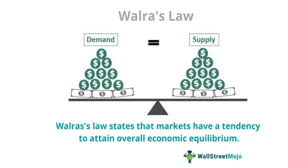

Walras's Law is a foundational principle in economics, asserting the inherent interdependence of markets and the pursuit of equilibrium within an economic system. Formulated by Léon Walras, a pioneer of general equilibrium theory, this concept underscores the idea that excess supply in one market must be mirrored by excess demand in another, ensuring that these imbalances collectively maintain an equilibrium across the entire economy. This interplay is crucial in understanding the behavior of complex market systems and presents significant implications for both theoretical and practical economic frameworks.

As we examine Walras's Law, it is essential to contrast this theory with other economic paradigms to appreciate its unique contributions. Unlike some approaches that might analyze markets in isolation, Walras's perspective provides a holistic view, taking into account the interconnected nature of different markets. This comprehensive approach has profound implications for economists and policy-makers who seek to understand and predict market behaviors, thereby shaping informed economic strategies.

In today's digital era, the application of Walras's Law finds renewed relevance, particularly in the fast-evolving field of algorithmic trading. This technology harnesses advanced algorithms to execute trades with unprecedented speed and precision, relying on the principles of market equilibrium articulated by Walras. By optimizing trade execution and efficiency, algorithmic trading systems reflect how digital innovations can enhance traditional economic models, offering novel insights into the dynamics of supply and demand in financial markets.

Moreover, an understanding of Walras's Law sheds light on the intricate balance of supply and demand within the modern trading environment. By recognizing how shifts in one market necessitate compensatory adjustments in others, we can better grasp the complexities of market equilibrium within algorithmic trading frameworks.

This exploration also involves critiquing Walras's Law, observing how it withstands scrutiny amid today’s rapid technological advancements and ever-changing market landscapes. Although the theory faces critiques regarding its practical application and assumptions, it remains a pivotal theoretical foundation for developing adaptive economic models and strategies.

In summary, Walras's Law provides essential insights into the structural dynamics of markets and continues to inform contemporary economic and trading paradigms. Understanding its principles offers a valuable lens through which to analyze and navigate the complexities of modern market systems, especially within the context of digital technology and algorithmic trading.

## Table of Contents

## Understanding Walras's Law

Walras's Law is a fundamental economic principle asserting that in a system of interconnected markets, the presence of excess supply in one market must be counterbalanced by excess demand in another. This ensures that overall market equilibrium is maintained. The law is integral to Léon Walras's general equilibrium theory, which seeks to explain how markets achieve overall stability and interdependence.

At its core, Walras's Law operates on the premise that the value of aggregate excess demand across all markets is zero. Mathematically, if we denote excess demand in market $i$ as $E_i$, Walras's Law can be expressed as:

$$
\sum_{i=1}^{n} p_i \cdot E_i = 0
$$

where $p_i$ represents the price in the $i$-th market, and $n$ is the total number of markets. This relationship highlights market clearing and equilibrium pricing mechanisms, indicating that any imbalance in one market is offset by imbalances in others, thus aligning with the market-clearing conditions.

While Walras's Law has significantly shaped classical economic thought, it faces ongoing scrutiny regarding its applicability to real-world complexities. Critics argue that the law relies heavily on assumptions of perfect information and rational behavior, which are rarely observed in practice. Additionally, the law's abstraction can make it difficult to quantify utility and apply these concepts empirically.

The criticism also focuses on the applicability of Walras's Law in dynamic and unpredictable environments, where factors like technological change and financial market complexities challenge the static nature of traditional equilibrium concepts. Despite these challenges, the foundational insights provided by Walras's Law continue to influence the development of more adaptive economic models that seek to incorporate real-world dynamics and technological advancements.

## Walras's Law in the Context of Supply and Demand

Walras's Law provides a comprehensive perspective of markets, framing the equilibrium of supply and demand as an interconnected phenomenon across multiple markets. This approach contrasts with more isolated models by illustrating that imbalances in one market can impact others, thereby emphasizing the systemic nature of economic equilibriums.

Adhering to the principles of general equilibrium theory, Walras's Law highlights the role of the "invisible hand" in managing market forces. It suggests that excess supply in one market is offset by excess demand in another, ensuring that resources are allocated efficiently across the entire economic system. This theory is a fundamental aspect of classical economics, reinforcing the idea that markets, when left to their own devices, tend toward equilibrium.

Comparing this to Keynesian economics underscores Walras's distinctive focus on the interconnected nature of markets. Keynesian theory often emphasizes individual market dynamics and the need for intervention to address specific market failures. In contrast, Walras's Law posits that achieving overall balance requires considering the aggregate impact of all markets. This holistic view suggests that interventions in one market could disrupt the equilibrium in others, aligning with the classical notion of interconnected market forces.

Supply and demand dynamics under Walras's framework are crucial for understanding market equilibrium and price formation. The interaction between these forces across different markets allows for a dynamic adjustment process. For example, if a surplus occurs in one sector, Walras's Law suggests that this will lead to increased demand in another, helping reestablish equilibrium. This aligns with the mathematical representation of market equilibrium:

$$
\sum_{i=1}^{n} (D_i - S_i) = 0
$$

where $D_i$ and $S_i$ represent the demand and supply in the $i^{th}$ market, respectively, indicating that the sum of excess demands across all markets should equal zero.

Moreover, Walras's Law illuminates how shifts in one market necessitate adjustments in others, influencing the broader economic equilibrium. For instance, a technological advancement in the electronics market might reduce production costs, leading to increased supply. This surplus would be balanced by corresponding demand changes in other related markets, highlighting the interconnected nature of market economies. Consequently, understanding Walras's framework is key to comprehending how economic systems self-correct and maintain equilibrium through the interplay between different markets.

## Algorithmic Trading and Walras's Law

Algorithmic trading utilizes advanced algorithms to execute transactions at speeds and volumes unattainable by human traders. This transformative approach to trading applies economic principles, akin to those found in Walras's Law, to enhance trade execution and bolster market efficiency. Walras's Law, which suggests that excess supply in one market is offset by excess demand in another, aligns with the underlying mechanics of [algorithmic trading](/wiki/algorithmic-trading) systems, as they continuously strive to maintain equilibrium across digital exchanges.

Within the framework of algorithmic trading, computational models and data analytics are deployed to predict market movements, ensuring efficient resource allocation based on prevailing market signals. This continuous adjustment mimics the dynamic balancing act described by Walrasian equilibrium, where the equality of supply and demand is perpetually sought across interconnected markets.

Traders employing algorithmic systems benefit from enhanced precision in their strategic decisions, facilitated by the rapid processing of vast amounts of market data. Algorithms can identify patterns and trends, optimizing entry and [exit](/wiki/exit-strategy) points for trades, which in turn can lead to improved [liquidity](/wiki/liquidity-risk-premium) and reduced transaction costs. Algorithmic trading systems exemplify modern-day adaptations of traditional economic theories, such as those posited by Léon Walras, by integrating these principles with cutting-edge technology.

The adaptability of algorithmic trading provides a fertile ground for validating the applicability of economic theories in contemporary technological settings. By harmonizing the principles of Walras's Law with real-time data analysis and predictive modeling, traders can achieve transactions that align with broader economic equilibria, proving the viability of these theories in enhancing market performance.

As technology advances, the synergistic relationship between algorithmic trading and economic theory offers promising opportunities for further integration and innovation. The ongoing development of more sophisticated algorithms promises to not only refine the applications of Walras's principles but also push the boundaries of what is achievable in financial markets, ultimately shaping the future of trading and economic analysis.

## Criticisms and Limitations of Walras's Law

Walras's Law faces significant criticisms and limitations, primarily due to its foundational assumptions that often do not hold up in real-world settings. A major assumption of Walras's Law is the existence of perfect information and price flexibility. In real-world markets, information asymmetry is a pervasive issue — all participants rarely possess the same information, which leads to mispricing and market inefficiencies. Price flexibility, another assumption, suggests that prices can adjust instantly to clear markets, a scenario scarcely observed outside theoretical models.

Another limitation of Walras's Law is its static nature. The law is grounded in a framework that assumes markets are at rest, essentially ignoring the continuous and dynamic changes that modern markets undergo. This static perspective does not consider the impact of technological advancements, such as algorithmic trading, which introduce rapid fluctuations and complex behaviors that static models cannot adequately capture.

Furthermore, the focus on theoretical equilibria tends to overlook the nuanced role of monetary factors and the complexities inherent in financial markets. The abstraction inherent in Walras's models does not easily incorporate variables such as money supply, interest rates, and financial regulations, which are critical in influencing real-world economic scenarios.

Critics also emphasize the challenges associated with applying Walras's Law in empirical studies. The law's reliance on abstract economic assumptions makes it difficult to test and validate in practical settings. Variables like utility and market preferences are often intertwined with subjective interpretations, further complicating empirical measurements.

Despite these criticisms, Walras's Law continues to hold substantial value in economic theory. Its insights into market interdependencies and equilibrium conditions provide foundational perspectives for developing more adaptive economic models. These models strive to integrate the dynamic and complex nature of today's economic systems, aiming to enhance their applicability and robustness. Thus, while Walras's Law may encounter limitations, it remains a pivotal element in the evolution of economic thought and strategy.

## Conclusion

Walras's Law remains an influential theoretical framework for understanding market equilibrium and interdependence, emphasizing the interconnectedness of multiple markets and their collective equilibrium. Its principles are pivotal for both economic policy formulation and the development of practical market strategies, particularly within the expanding domain of algorithmic trading. By ensuring the continual balancing of supply and demand, Walras's Law offers foundational insights into optimizing trade execution and market efficiency through computational technologies.

Despite facing criticisms, primarily concerning its assumptions of perfect information and price flexibility, Walras's Law maintains a crucial role in modern finance and economic theory. Critics argue that these assumptions often don't hold in real-world markets, yet the law’s framework provides essential perspectives on market dynamics. It serves as a basis for analyzing and predicting how various markets respond to shifts in economic variables, thereby shedding light on broader economic phenomena.

Looking to the future, Walras's Law could benefit significantly from integrating technological advancements that address its current limitations. For instance, data analytics and [machine learning](/wiki/machine-learning) could be employed to adapt the static nature of this law to account for dynamic market changes. Such integration has the potential to refine theoretical models, offering more accurate representations of real-world market scenarios.

In summary, the synthesis of Walrasian principles with digital trading technologies suggests promising prospects for enhancing market efficiency and economic analysis. By embracing new technological tools, the foundational elements of Walras's Law can evolve, supporting more adaptive and resilient frameworks for navigating contemporary market environments.

## References & Further Reading

[1]: Walras, L. ([1954] 2013). "Elements of Pure Economics, or the Theory of Social Wealth." Routledge.

[2]: Arrow, K. J., & Hahn, F. H. (1971). "General Competitive Analysis." Holden-Day.

[3]: Mas-Colell, A., Whinston, M. D., & Green, J. R. (1995). "Microeconomic Theory." Oxford University Press.

[4]: De Prado, M. L. (2018). ["Advances in Financial Machine Learning."](https://www.amazon.com/Advances-Financial-Machine-Learning-Marcos/dp/1119482089) Wiley.

[5]: Smith, N. (2008). ["Liquidity: Considerations of Choice, Competition and the Balance Between Markets."](https://www.jstor.org/stable/4227537) Journal of Financial Markets.