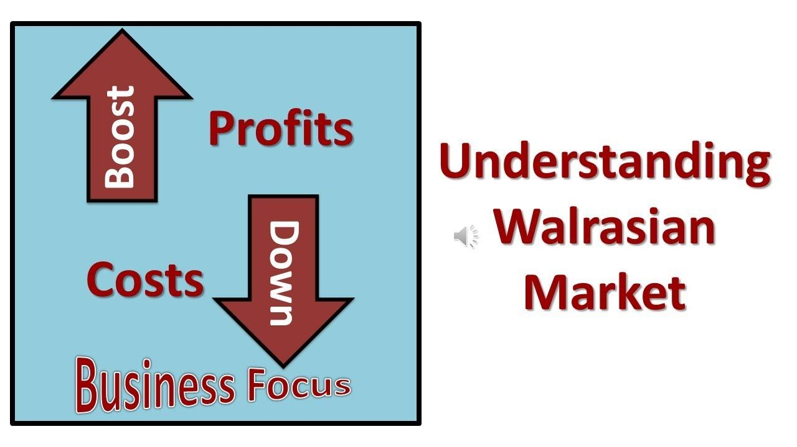

The Walrasian Equilibrium is a cornerstone in economic theory, playing a crucial role in understanding how markets reach a state of balance where supply equals demand. Named after the French economist Léon Walras, this concept is often referred to as a general equilibrium, representing an idealized state in perfectly competitive markets. The essential idea is that through a series of price adjustments, markets will naturally gravitate toward an equilibrium where all agents—consumers and producers—are maximizing their utility and profit respectively, given their budget constraints.

This article investigates the complexities of the Walrasian market equilibrium, emphasizing its mathematical underpinnings and significance in contemporary financial markets. The Walrasian model utilizes a system of equations to represent the interactions between different market forces, with prices serving as the central coordinating mechanism to achieve market clearing and efficient resource allocation. By examining these principles, one can discern the alignment between theoretical predictions and market realities, a task essential for evaluating market efficiency and the optimal allocation of resources.



In modern financial markets, Walrasian principles find applications in algorithmic trading and dynamic market interactions. The adaptations of these principles facilitate the continuous adjustment in prices and trading volumes, crucial for maintaining liquidity and reducing market friction. For instance, algorithmic trading systems leverage these principles to optimize trade execution by reacting swiftly to price changes, ensuring market balance is maintained.

Furthermore, understanding Walrasian equilibrium is instrumental for evaluating the impact of policy decisions on markets. Through its analytical framework, economists can gauge the effects of various market interventions and assess their implications on economic welfare and stability. By comparing theoretical equilibrium states with actual market outcomes, policymakers can make informed decisions to promote economic growth and stability.

Grasping the foundational principles of Walrasian equilibrium is of paramount importance in navigating the complexities of modern economic and financial systems. This fundamental understanding aids in driving innovations across finance, market design, and policy analysis, providing a clear verdict on the interplay of market forces.

## Table of Contents

## Understanding Walrasian Markets

Named after the influential economist Léon Walras, the Walrasian market presents an idealized framework quintessential to understanding competitive markets. This theoretical construct is central to economic theory and suggests that through the adjustment of prices, markets can achieve a state where supply equals demand, thereby facilitating efficient resource allocation.

At the heart of the Walrasian market framework is the concept of general equilibrium. General equilibrium refers to a condition where all markets within an economy are simultaneously in equilibrium. Léon Walras pioneered the notion that all markets are interrelated, and equilibrium in one affects equilibrium in others. The culmination of his work is to mathematically demonstrate that under certain conditions, there exists a set of prices where markets clear, meaning that all goods and services supplied are exactly equal to those demanded.

Integral to understanding Walrasian markets is the infamous Walras' Law. This principle states that if all but one market in an economy are in equilibrium, then the remaining market must also be in equilibrium. Formally, Walras' Law suggests that for any given price vector, the summation of the value of excess demands across all markets must be zero. Mathematically, if $p_i$ denotes the price of good $i$ and $x_i$ denotes the excess demand, then:

$$
\sum_{i=1}^{n} p_i \cdot x_i = 0
$$

This equation implies that excess demand in one market must be offset by excess supply in another, ensuring that no resources are wasted.

Central to the mechanics of Walrasian markets is the tâtonnement process, a concept akin to a trial-and-error mechanism. In a tâtonnement or "groping" process, prices are adjusted in response to excess demand or supply until equilibrium is achieved. Although generally considered a hypothetical construct due to the instantaneous and perfect adjustment it implies, the tátonnement process provides essential insight into how prices coordinate decentralized decision-making in real-world markets.

The Walrasian framework and its principles serve as foundational concepts in economic analysis and continue to inform how economists and policymakers perceive market interactions and dynamics. While the assumptions of perfect competition and instantaneous price adjustments may not hold true in real-world markets, the theoretical insights gained from examining these idealized conditions remain valuable for advancing economic theory and practice.

## Mathematical Representation of Walrasian Equilibrium

The Walrasian model provides a structured approach to understanding economic equilibrium through mathematical formulation. At its core, it considers a set of commodities and [agents](/wiki/agents) interacting within a market, where prices adjust to balance supply and demand.

Central to the Walrasian model are budget constraints, which define the purchasing power of agents. An agent’s budget constraint can be expressed as:

$$
\sum_{j=1}^n p_j x_{ij} \leq w_i
$$

where $p_j$ represents the price of commodity $j$, $x_{ij}$ denotes the quantity of commodity $j$ demanded by agent $i$, and $w_i$ is the wealth of agent $i$.

Market clearing conditions ensure that the total supply of each commodity equals the total demand across all agents. This is expressed as:

$$
\sum_{i=1}^m x_{ij} = S_j
$$

where $S_j$ is the total supply of commodity $j$ in the market.

Prices play a crucial role in achieving equilibrium. They serve as signals that prompt adjustments in supply and demand until the market clears. The computation of Walrasian equilibria often involves solving a system of simultaneous equations. These equations encapsulate the interactions of supply and demand across all commodities and agents.

Fixed point algorithms are frequently employed to find equilibria. The tâtonnement process, a conceptual auctioneer mechanism proposed by Walras, iteratively adjusts prices based on excess demand until an equilibrium is reached. In practice, this is computationally represented by algorithms that iteratively solve for price vectors $p = (p_1, p_2, ..., p_n)$ that satisfy market clearing conditions and budget constraints.

For computational approaches, code implementation might leverage fixed point libraries or numerical solvers. An example using Python's `scipy.optimize` might look like:

```python
from scipy.optimize import fsolve

def excess_demand(p):
    # Define excess demand function for commodities
    # Aggregated over all agents
    # Placeholder for illustrative purposes
    return [total_demand(p[i]) - total_supply[i] for i in range(len(p))]

initial_guess = [1.0 for _ in range(n)]  # Initial price guess
equilibrium_prices = fsolve(excess_demand, initial_guess)
```

This code illustrates how numerical solvers seek price vectors that yield zero excess demand, thereby satisfying market clearing conditions. By engaging computational techniques, the Walrasian model transforms theoretical economic principles into practical tools for analyzing complex market systems.

## Applications in Algorithmic Trading

Walrasian market principles are integral to the operation and design of electronic trading platforms and high-frequency trading algorithms. These advanced trading systems, which aim to maximize efficiency and profitability, capitalize on the rapid price adjustments indicative of a Walrasian equilibrium to facilitate market clearing and to identify exploitable price discrepancies.

In [algorithmic trading](/wiki/algorithmic-trading), the concept of the Walrasian equilibrium is applied to ensure that supply and demand are dynamically balanced, minimizing transaction costs and market impact. Trading algorithms utilize these principles to execute large volumes of orders with minimal market disturbance, essential in environments characterized by high [liquidity](/wiki/liquidity-risk-premium) and continuous trading.

Electronic trading platforms deploy algorithms that emulate the tâtonnement process, a mechanism described by Walras for reaching market equilibrium through iterative price adjustments. By continuously updating orders based on incoming market data, trading algorithms adjust prices to reflect supply-demand dynamics promptly. This mechanism ensures that markets remain liquid and prices accurately represent underlying values, an outcome consistent with the efficiency of a Walrasian market.

High-frequency trading ([HFT](/wiki/high-frequency-trading-strategies)) is another area where Walrasian principles are evident. HFT algorithms operate at high speeds, analyzing tick-by-tick data to exploit short-lived [arbitrage](/wiki/arbitrage) opportunities and price inefficiencies. These algorithms are designed to react to price changes instantaneously, reflecting the principle of markets clearing through rapid price adjustments. By maintaining liquidity and narrowing bid-ask spreads, HFT contributes to market efficiency, a core tenet of the Walrasian equilibrium.

Algorithmic solutions also leverage computational techniques aligned with Walrasian models to simulate market conditions and predict price trends. Adaptive algorithms, for instance, incorporate [machine learning](/wiki/machine-learning) to refine trading strategies based on observed market patterns, aligning their operations with the principle of achieving equilibrium in real-time.

In conclusion, the application of Walrasian market principles in algorithmic trading highlights their adaptability and utility in modern finance. By fostering liquidity, optimizing price discovery, and improving market efficiency, these principles are vital for the functionality and integrity of contemporary electronic and automated trading environments.

## Implications and Policy Analysis

Walrasian Equilibrium serves as a crucial reference point for assessing the efficacy of market interventions and government policies. By establishing a theoretical benchmark where supply equals demand across all markets, Walrasian Equilibrium allows economists to evaluate the performance of real markets against an idealized model.

### Assessing Market Efficiency and Welfare

By comparing actual market outcomes with the theoretical predictions of Walrasian Equilibrium, economists can gain insights into the efficiency and welfare implications of various policies. For example, any deviations from the equilibrium can highlight inefficiencies such as misallocated resources or welfare losses that might occur due to market distortions. These deviations provide valuable information for understanding how policies might improve or impair market performance.

### Informed Decision-Making by Policymakers

Policymakers can use the insights derived from Walrasian Equilibrium to evaluate the likely impacts of prospective economic policies. For instance, if a government decides to intervene in an agricultural market by setting price floors, the model can predict potential surplus supplies that may result, allowing policymakers to think ahead about mechanisms to handle such outcomes, such as government purchases or subsidies.

### Quantitative Analysis

Walrasian Equilibrium offers a quantitative framework that helps in policy analysis. Mathematical approaches such as models consisting of budget constraints and market clearing conditions are fundamental tools in this analysis. Here is a basic Python script example demonstrating how market equilibrium can be computed using supply and demand equations:

```python
from scipy.optimize import fsolve

# Example supply (S) and demand (D) functions
def supply(price):
    return 10 + 2 * price  # Example: supply increases with price

def demand(price):
    return 50 - 3 * price  # Example: demand decreases with price

# Define the market-clearing condition
def market_clearing(price):
    return supply(price) - demand(price)

# Find equilibrium price
equilibrium_price = fsolve(market_clearing, 0)[0]

# Calculate equilibrium quantities
equilibrium_supply = supply(equilibrium_price)
equilibrium_demand = demand(equilibrium_price)

print(f'Equilibrium Price: {equilibrium_price}')
print(f'Equilibrium Supply: {equilibrium_supply}')
print(f'Equilibrium Demand: {equilibrium_demand}')
```

### Impacts on Economic Growth and Stability

The analysis of Walrasian Equilibrium is instrumental in promoting economic growth and stability. By understanding how different variables interact within the market, policymakers can design interventions that enhance economic efficiency and distribute resources more equitably. For example, in monetary policy, central banks might adjust interest rates to influence aggregate demand, aiming to stabilize economies without causing inflation, a balance which can be examined through equilibrium models.

In summary, Walrasian Equilibrium provides a theoretical benchmark that is invaluable for evaluating the impact of market interventions and government policies. It helps ensure that policies enhance efficiency and welfare, ultimately contributing to more informed, effective economic governance.

## Limitations and Criticisms

The Walrasian model, while foundational in economic theory, faces several notable limitations and criticisms. One of the primary assumptions of the Walrasian framework is the existence of perfect competition, characterized by numerous buyers and sellers, identical products, and no individual influence over prices. However, such conditions are seldom observed in actual markets, where monopolistic practices, product differentiation, and barriers to entry often disrupt the ideal competitive environment outlined by Léon Walras.

Moreover, the static nature of the Walrasian model poses significant challenges to its practical application. The model typically assumes a time-invariant perspective, where economic agents interact within a single time period to reach equilibrium. Real-world markets, conversely, are dynamic, with continuous changes in preferences, technology, and external conditions. This static assumption limits the model's ability to account for time-dependent factors and the temporal adjustments that occur as markets move toward equilibrium.

Computational complexities also hinder the application of the Walrasian model. Identifying and computing equilibria in large, multi-agent markets can be computationally intensive and resource-demanding. The requirement to solve numerous simultaneous equations to ensure market clearing introduces significant complexity. While modern computational techniques, such as fixed-point algorithms, have improved the feasibility of finding Walrasian equilibria, these methods still face scalability issues and require significant computational power, particularly in complex markets.

Critics argue that the model's reliance on price adjustments as the sole mechanism for reaching equilibrium, known as the tâtonnement process, fails to capture other relevant factors such as transaction costs and institutional constraints that play critical roles in market operations. Real-world decision-making often involves strategic behavior, negotiation, and non-price competition, aspects not fully addressed by the Walrasian framework.

To address these critiques, economists have explored extensions and modifications of the Walrasian model, incorporating aspects like imperfect competition, dynamic adjustments, and more sophisticated agent behaviors. These adaptations aim to bridge the gap between theoretical elegance and practical relevance, providing a more nuanced understanding of market mechanisms. Nevertheless, while the Walrasian model's assumptions and limitations are acknowledged, its foundational insights remain pivotal for theoretical exploration and teaching in economics.

## Conclusion

The Walrasian market theory remains a cornerstone in the study of economic equilibria and resource allocation. The theoretical framework laid out by Léon Walras significantly aids in the interpretation of how markets self-regulate through price adjustments to achieve a state of equilibrium. Despite its idealized assumptions, the Walrasian model provides essential insights that continue to influence modern financial practices, market design, and economic policy-making.

In finance, the principles of Walrasian equilibria underpin the architecture of algorithmic trading systems and electronic marketplaces. These systems emulate the market-clearing processes described by Walras to maintain liquidity and efficiency in real-time trading environments. For instance, in algorithmic trading, prices are continuously adjusted to reflect market demand and supply, much like the Walrasian tâtonnement process, facilitating efficient resource allocation and price discovery.

From a policy analysis perspective, the Walrasian equilibrium offers a benchmark to assess the impacts of market interventions. By contrasting theoretical equilibrium outcomes with real market data, economists can evaluate how policy measures influence economic efficiency and social welfare. This evaluation is crucial for governments and regulatory bodies striving to enact policies that promote economic growth and stability while minimizing market distortions.

Yet, acknowledging the limitations of the Walrasian model is equally important. Perfect competition, as assumed in the model, is seldom realized in practical markets populated by monopolies, oligopolies, and other market imperfections. Additionally, the model’s static nature does not capture dynamic market fluctuations, necessitating more advanced computational and empirical methods to simulate real-world market conditions.

Nevertheless, understanding Walrasian equilibrium remains vital for economic theorists and practitioners. As financial systems grow more complex and interconnected, the foundational concepts provided by Walrasian theory help navigate these complexities, fostering innovations that enhance market efficiency and economic resilience. Hence, the continued exploration and adaptation of Walrasian principles promise to inspire future advancements in economic thought and practice.

## References & Further Reading

[1]: Arrow, K. J., & Debreu, G. (1954). ["Existence of an Equilibrium for a Competitive Economy."](https://web.stanford.edu/class/msande314/arrow-debreu.pdf) Econometrica, 22(3), 265-290.

[2]: Walras, L. (1954). *Elements of Pure Economics: Or the Theory of Social Wealth*. Translated by William Jaffé. George Allen and Unwin.

[3]: Debreu, G. (1959). *Theory of Value: An Axiomatic Analysis of Economic Equilibrium*. Yale University Press.

[4]: Arrow, K. (1974). *General Equilibrium Analysis: A Micro-Economic Text*. Holden-Day.

[5]: Lo, A. W., & MacKinlay, A. C. (1999). *A Non-Random Walk Down Wall Street*. Princeton University Press.

[6]: Fama, E. F. (1970). ["Efficient Capital Markets: A Review of Theory and Empirical Work."](https://www.jstor.org/stable/2325486) The Journal of Finance, 25(2), 383-417.

[7]: Biais, B., Glosten, L., & Spatt, C. (2005). ["Market Microstructure: A Survey of Microfoundations, Empirical Results, and Policy Implications."](https://www.cis.upenn.edu/~mkearns/finread/bias-spatt-survey.pdf) Journal of Financial Markets, 8(2), 217-264.

[8]: Plott, C. R., & Smith, V. L. (2008). *Handbook of Experimental Economics Results*. North-Holland.

[9]: Joskow, P. L., & Schmalensee, R. (1983). *Markets for Power: An Analysis of Electric Utility Deregulation*. MIT Press.