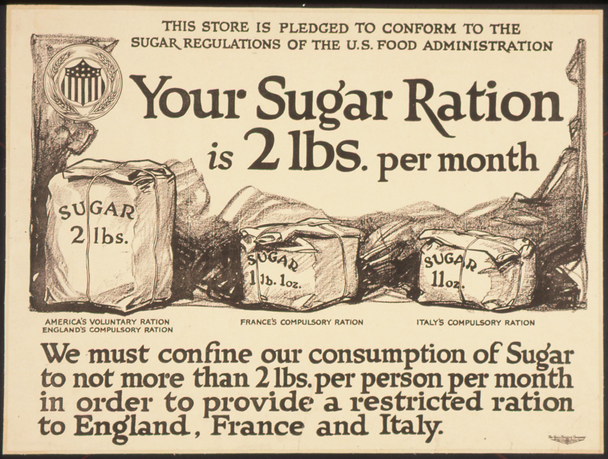

## Table of Contents

## What is a war economy?

A war economy is when a country changes how it uses its money and resources because it is fighting a war. During a war, a country needs to make more weapons, food, and other things for its soldiers and people. To do this, the government might tell factories to make war supplies instead of normal products. The government might also control prices and tell people where they can work.

In a war economy, the government often spends a lot more money than usual. It might borrow money or raise taxes to pay for the war. People might have to use ration cards to buy things like food and gas, so everyone gets a fair share. Life can be hard for people at home because they have to do without some things they are used to. But, a war economy can help a country win a war by making sure it has what it needs.

## How does a war economy differ from a peacetime economy?

In a peacetime economy, people and businesses can choose what to make and buy. Factories might make cars, toys, or clothes. People can work where they want and spend their money on things they like. The government does not control prices or tell people what to do with their money. Life is usually easier, and people can enjoy more of what they want.

In a war economy, the government takes control to help win the war. It tells factories to make weapons, tanks, and other war supplies instead of normal products. The government might set prices and tell people where to work. People might have to use ration cards to get food and gas, so everyone gets a fair share. Life can be harder because people have to do without some things they are used to, but it helps the country have what it needs to fight the war.

## What are the main characteristics of a war economy?

In a war economy, the government takes charge of how resources are used. It tells factories to make weapons and other war supplies instead of normal things like cars or toys. The government might also control prices and tell people where they need to work. This is different from a peacetime economy where people and businesses can choose what to make and buy.

People in a war economy might have to use ration cards to get food and gas. This means everyone gets a fair share, but it can be hard because people have to do without some things they are used to. The government often spends a lot more money than usual and might borrow money or raise taxes to pay for the war. All of this is done to help the country win the war by making sure it has what it needs.

## Can you provide historical examples of countries that have operated under a war economy?

During World War II, many countries had war economies. In the United States, factories that used to make cars started making tanks and planes instead. The government told people where they could work and used ration cards so everyone could get food and gas. The U.S. government spent a lot of money on the war and borrowed money to pay for it. This helped the U.S. win the war by making sure it had enough weapons and supplies.

In the Soviet Union during World War II, the government also changed the economy to focus on the war. Factories that made things like tractors started making weapons. The government controlled prices and told people where to work. People had to use ration cards to get food and other things. The Soviet Union spent a lot of money on the war and had to do without many things, but it helped them fight against Germany.

Another example is the United Kingdom during World War II. The British government took control of the economy to help win the war. Factories made war supplies instead of normal products. The government used rationing to make sure everyone got enough food and other things. The UK spent a lot of money on the war and had to borrow money and raise taxes. This war economy helped the UK fight against Germany and its allies.

## What are the economic impacts of transitioning to a war economy?

When a country switches to a war economy, it changes how it uses its money and resources. The government tells factories to make weapons and other war supplies instead of normal things like cars or toys. This can make the economy grow quickly because the government spends a lot of money on the war. The government might borrow money or raise taxes to pay for it. This can lead to more jobs and higher wages for people working in war industries. But, it can also cause inflation, which means prices go up and money buys less.

On the other hand, a war economy can be hard on people at home. They might have to use ration cards to get food and gas, so everyone gets a fair share. This means people have to do without some things they are used to. The government might control prices and tell people where they need to work. This can make life harder and less free. After the war, the country might have a lot of debt and need to change its economy back to peacetime. This can be a big challenge and take a long time.

## How do governments finance a war economy?

When a country switches to a war economy, the government needs a lot of money to pay for the war. One way they do this is by raising taxes. This means people and businesses have to pay more money to the government. Another way is by borrowing money. The government can borrow from its own people by selling war bonds, or it can borrow from other countries or banks. This helps the government get the money it needs to buy weapons, food, and other things for the war.

Sometimes, the government might also print more money to pay for the war. But this can cause inflation, which means prices go up and money buys less. The government might also take control of businesses and tell them what to make. This can help the country make more war supplies, but it can be hard on people at home. They might have to use ration cards to get food and gas, so everyone gets a fair share. All of these ways help the government finance a war economy, but they can also make life harder for people.

## What role does rationing play in a war economy?

Rationing is important in a war economy because it helps make sure everyone gets a fair share of things like food and gas. During a war, the government might not have enough of these things for everyone. So, they use ration cards to control how much each person can buy. This way, no one can buy too much and leave others without enough. Rationing helps keep things fair and makes sure the country can keep fighting the war.

Rationing can be hard for people at home. They might have to do without some things they are used to. For example, they might not be able to buy as much sugar or meat as they want. But, rationing is important because it helps the country use its resources wisely. It makes sure soldiers on the front lines have what they need to fight. Even though it can be tough, rationing is a big part of how a war economy works.

## How does a war economy affect the labor market and employment?

In a war economy, the government often tells people where they need to work. This means that jobs in factories making weapons and other war supplies become very important. Many people might have to leave their old jobs and start working in these war industries. This can lead to more jobs and higher wages for people working in these areas. But, it can also mean that people have less choice about where they work. The government might even tell businesses to stop making normal things like cars or toys and start making war supplies instead.

This change can be good for some people because they get jobs and earn more money. But, it can be hard for others. People who used to work in businesses that made normal things might lose their jobs. And, because the government is spending a lot of money on the war, prices might go up. This can make life harder for people at home. After the war, the country might have to change its economy back to peacetime. This can be a big challenge and take a long time, and some people might have trouble finding new jobs.

## What are the long-term effects of a war economy on a country's economic development?

When a country has a war economy, it can change how the country grows and develops in the long run. During the war, the government spends a lot of money on weapons and supplies. This can make the economy grow quickly because there are more jobs and people earn more money. But, after the war, the country might have a lot of debt. It might have to pay back the money it borrowed or raise taxes. This can make it hard for the economy to grow and can slow down development.

After the war, the country also has to change its economy back to peacetime. This can take a long time and be a big challenge. Factories that made war supplies have to start making normal things again. People who worked in war industries might have trouble finding new jobs. The government might have to help the economy grow again by spending money on things like schools and roads. But, if the country used its resources wisely during the war, it might be able to grow and develop well in the long run.

## How do war economies influence international trade and relations?

When a country has a war economy, it changes how it trades with other countries. The government might stop buying things from other countries and start making everything at home. This can hurt trade because other countries might not be able to sell their things. But, it can also help the country be more independent and not rely on others. During a war, a country might also trade with its allies to get the things it needs. This can make trade stronger with some countries but weaker with others.

War economies can also change how countries get along with each other. If a country is fighting a war, it might make new friends with countries that help it. These countries might trade more and work together more. But, it might also make enemies with the countries it is fighting against. After the war, the country might have to fix its relationships with other countries. This can take a long time and be hard. But, if the country used its resources well during the war, it might be able to have good trade and relations with other countries in the long run.

## What are the ethical considerations and criticisms of war economies?

War economies can be criticized because they change how people live and work. The government tells factories to make weapons instead of normal things like cars or toys. This can make life harder for people at home. They might have to use ration cards to get food and gas, so everyone gets a fair share. But, this means people have to do without some things they are used to. Some people think it's not fair that the government controls prices and tells people where to work. They say it takes away people's freedom and makes life harder.

Another ethical issue is how the government pays for the war. It might raise taxes or borrow money, which can make life harder for people after the war. The government might also print more money, which can cause inflation and make prices go up. Some people think it's wrong to spend so much money on war when there are other things the country needs, like schools and hospitals. They say it's not right to make people at home suffer so the country can fight a war. These are some of the ethical problems and criticisms of war economies.

## How can a country effectively transition from a war economy back to a peacetime economy?

When a war ends, a country needs to change its economy back to peacetime. This can be hard because the government has to help factories start making normal things like cars and toys again instead of weapons. The government might need to spend money on things like schools and roads to help the economy grow. It also has to find new jobs for people who worked in war industries. This can take a long time and be a big challenge, but if the country used its resources wisely during the war, it can make the transition easier.

After the war, the country might have a lot of debt from borrowing money to pay for the war. The government might have to raise taxes or find other ways to pay back the money. This can make life harder for people at home. The government also has to fix its relationships with other countries and start trading again. If the country can do all of these things well, it can grow and develop in the long run. But, it takes a lot of planning and hard work to make the transition from a war economy to a peacetime economy.

## References & Further Reading

[1]: Metzler, M. (2016). ["Forging a New Order: The Distraction of Progressive Narratives in the Midst of Statistics and Science during War Economies"](https://news.kisspr.com/2024/10/30/mayan-metzler-of-german-kitchen-center-discusses-industry-innovation-and-future-tech-in-exclusive-chat-with-marco-derhy_1164214.html). Journal of Global History.

[2]: Smith, R. (2009). ["Military Economics: The Interaction of Power and Money"](https://link.springer.com/book/10.1057/9780230244672) by Ron Smith.

[3]: Spoerer, M. (2001). ["The Evolution of War Economies and the Economic Consequences of Armed Conflicts"](https://www.jstor.org/stable/2698022). Economic History Review.

[4]: Aldrich, M. E. (2013). ["Understanding the Economic Effects of Warfare"](https://www.researchgate.net/publication/340266709_ORGANIZATIONS_EVOLVING_Third_Edition) by Mark E. Aldrich.

[5]: Chamley, C. (2019). ["Dynamic Economics: Quantitative Methods and Applicability of Algorithmic Trading in Conflict Situations"](https://people.bu.edu/chamley/0-EC-717/717-RL-2024.pdf). Quarterly Journal of Economics.