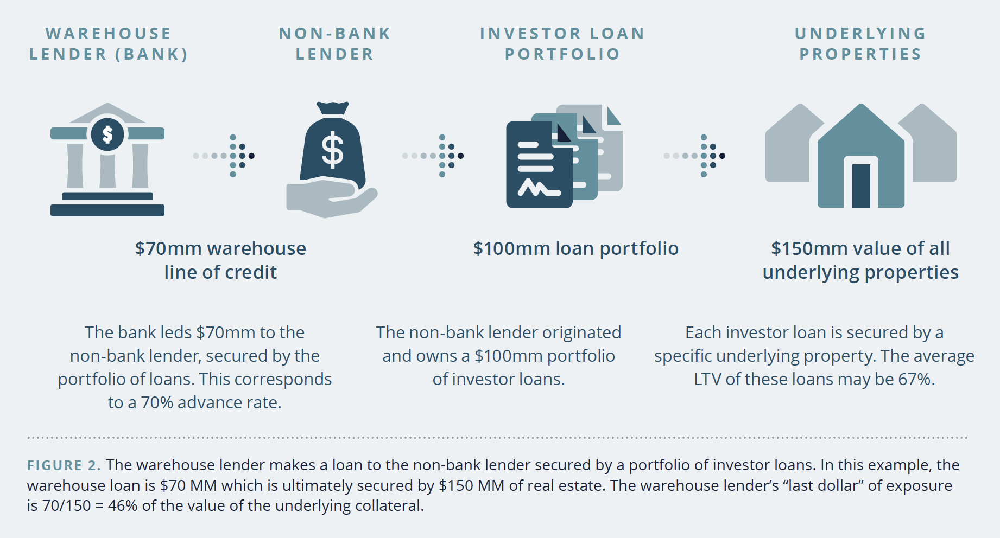

## Table of Contents

## What is warehouse financing?

Warehouse financing is a type of short-term loan that businesses use to buy products they plan to sell later. It helps companies keep their inventory stocked without using all their own money. For example, a toy store might use warehouse financing to buy toys before the holiday season, so they have enough to sell to customers.

This type of financing is useful because it lets businesses grow without spending all their cash at once. They can buy more products and keep their shelves full, which can attract more customers. However, it's important for businesses to sell the products quickly, so they can pay back the loan on time and avoid extra costs.

## What is lending in the context of warehouses?

Lending in the context of warehouses means giving money to businesses so they can buy things to put in their warehouses. This is called warehouse financing. It helps businesses keep their warehouses full of products without using all their own money. For example, a company that sells clothes might borrow money to buy more clothes to store in their warehouse before selling them in stores or online.

This type of lending is helpful because it lets businesses grow and have more products to sell. It's important for the business to sell these products quickly, though. If they don't, they might have trouble paying back the loan. So, warehouse lending is a way for businesses to keep their warehouses stocked, but they need to be careful and manage their sales well.

## How do warehouse financing and lending differ?

Warehouse financing and lending are closely related but have some differences. Warehouse financing is a specific type of short-term loan that businesses use to buy products they will store in their warehouses. It helps them keep their inventory stocked without using all their own money. For example, a toy store might use warehouse financing to buy toys before the holiday season, so they have enough to sell to customers.

Lending, in a broader sense, means giving money to someone who needs it, and it can be used for many different things, not just buying products for a warehouse. When we talk about lending in the context of warehouses, it usually means the same thing as warehouse financing. But outside of warehouses, lending can be for things like buying a car, starting a business, or paying for school. So, while warehouse financing is a specific kind of lending, lending itself can cover a wider range of uses.

## What are the primary uses of warehouse financing?

Warehouse financing is mainly used by businesses to buy products they will store in their warehouses. This helps them keep their inventory full without spending all their own money. For example, a company that sells clothes might use warehouse financing to buy more clothes before a big sale season. This way, they can have enough products to meet customer demand and keep their shelves stocked.

Another important use of warehouse financing is to help businesses grow. By borrowing money to buy more products, a business can increase its sales and attract more customers. However, it's important for the business to sell these products quickly. If they don't, they might have trouble paying back the loan. So, warehouse financing is a useful tool for businesses to manage their inventory and grow, but they need to be careful and manage their sales well.

## Can you provide examples of warehouse financing?

A toy store wants to have lots of toys for the holiday season. They don't have enough money to buy all the toys they need, so they use warehouse financing. They borrow money from a bank to buy the toys and store them in their warehouse. When the holidays come, they sell the toys and use the money they make to pay back the loan. This way, they can have enough toys to sell without using all their own money.

A clothing company wants to buy new clothes for the summer season. They use warehouse financing to borrow money and buy the clothes. They store the clothes in their warehouse and then sell them in their stores or online. By using warehouse financing, they can have a lot of clothes to sell during the summer. They need to sell the clothes quickly to pay back the loan, but it helps them keep their inventory full and attract more customers.

## What are the typical terms and conditions of warehouse lending?

Warehouse lending usually comes with short-term repayment periods, often ranging from a few months to a year. This means businesses need to sell the products they bought with the loan quickly to pay it back on time. The interest rates for warehouse lending can be higher than other types of loans because they are short-term and considered riskier. Lenders might also ask for collateral, like the products in the warehouse, to make sure they can get their money back if the business can't pay.

Lenders often set limits on how much money a business can borrow, based on the value of the inventory they plan to buy. They might also check the business's credit history and financial health to decide if they can lend money. If the business doesn't pay back the loan on time, they might face extra fees or penalties. So, it's important for businesses to understand all the terms and conditions before they agree to warehouse lending.

## How does warehouse financing impact a company's cash flow?

Warehouse financing can help a company's cash flow by letting them buy products without using all their own money. This means they can keep their shelves full and have more things to sell without spending all their cash at once. For example, a toy store can use warehouse financing to buy toys before the holiday season, so they have enough to sell to customers. This can help them make more money and keep their business running smoothly.

However, warehouse financing can also make cash flow harder if the company doesn't sell the products quickly. They need to pay back the loan, and if they don't have enough money from sales, they might struggle. This can lead to extra fees or penalties, which can make their cash flow even tighter. So, while warehouse financing can help a company grow and keep their inventory stocked, they need to be careful and make sure they can sell the products fast enough to pay back the loan.

## What are the risks associated with warehouse lending?

Warehouse lending can be risky for businesses. One big risk is that they might not sell the products they bought with the loan fast enough. If they can't sell the products quickly, they might not have enough money to pay back the loan on time. This can lead to extra fees or penalties, which can make their financial situation even worse. Another risk is that the interest rates for warehouse lending can be high because these loans are short-term and considered riskier. This means the business has to pay more money back than they borrowed, which can be hard if they're not making enough sales.

Another risk is that the lender might ask for collateral, like the products in the warehouse. If the business can't pay back the loan, the lender can take the products, which can hurt the business a lot. Also, if the business borrows too much money and can't manage it well, they might end up with too much debt. This can make it hard for them to get more loans in the future or even keep their business running. So, while warehouse lending can help a business grow, it's important for them to be careful and understand all the risks involved.

## How do financial institutions assess eligibility for warehouse financing?

Financial institutions look at a few things to decide if a business can get warehouse financing. They check the business's credit history to see if they have paid back loans on time before. They also look at the business's financial health, like how much money they make and how much they owe. This helps them see if the business can pay back the loan. Another thing they consider is the value of the inventory the business wants to buy. They want to make sure the products are worth enough to cover the loan if the business can't pay it back.

Sometimes, financial institutions also look at the business's plan for selling the products. They want to know if the business has a good way to sell the products quickly and make enough money to pay back the loan. If the business has a strong plan and a good track record, it's more likely to get approved for warehouse financing. But if the business has a lot of debt or a bad credit history, it might be harder for them to get the loan.

## What role does collateral play in warehouse financing and lending?

Collateral is very important in warehouse financing and lending. It is something valuable that a business gives to the lender to make sure they can get their money back if the business can't pay back the loan. In warehouse financing, the collateral is often the products that the business buys with the loan. If the business can't pay back the loan, the lender can take these products and sell them to get their money back.

Having collateral makes lenders feel safer about giving out loans. It lowers the risk for them because they know they can get something valuable if the business can't pay. This can help businesses get approved for warehouse financing, even if they don't have a perfect credit history. But it's important for businesses to understand that if they can't pay back the loan, they might lose the products they used as collateral, which can hurt their business a lot.

## How can warehouse financing be structured to optimize a business's operations?

Warehouse financing can be structured to help a business run better by matching the loan terms with the business's sales cycle. For example, if a business knows it will sell a lot of products during the holiday season, it can get a loan that needs to be paid back right after the holidays. This way, the business can buy products before the busy season, sell them, and then use the money from sales to pay back the loan. By doing this, the business can keep its shelves full without using all its own money, which helps it grow and make more money.

Another way to structure warehouse financing is to use it to buy products that are in high demand. If a business knows certain products will sell quickly, it can use the loan to buy more of those products. This can help the business make more sales and pay back the loan faster. It's important for the business to talk to the lender about its plans and make sure the loan terms fit well with its sales goals. By doing this, the business can use warehouse financing to keep its inventory stocked and its operations running smoothly.

## What advanced strategies can businesses employ to leverage warehouse financing for growth?

Businesses can use warehouse financing to grow by buying more products than they usually would. This means they can have a bigger variety of products to sell, which can attract more customers. For example, a business might use the loan to buy new types of products that are popular or in high demand. By doing this, they can increase their sales and make more money. It's important for the business to choose products that will sell quickly, so they can pay back the loan on time and keep growing.

Another strategy is to use warehouse financing to expand into new markets. A business might use the loan to buy products that are popular in a different area or country. This can help them reach new customers and grow their business. For example, a clothing company might use warehouse financing to buy clothes that are popular in another country and start selling them there. By carefully planning and choosing the right products, businesses can use warehouse financing to grow and reach new markets.

## References & Further Reading

[1]: Chan, E. P. (2009). ["Quantitative Trading: How to Build Your Own Algorithmic Trading Business."](https://github.com/ftvision/quant_trading_echan_book) John Wiley & Sons.

[2]: Jansen, S. (2020). ["Machine Learning for Algorithmic Trading: Predictive models to extract signals from market and alternative data for systematic trading strategies with Python."](https://www.amazon.com/Machine-Learning-Algorithmic-Trading-alternative/dp/1839217715) Packt Publishing.

[3]: Lopez de Prado, M. (2018). ["Advances in Financial Machine Learning."](https://www.amazon.com/Advances-Financial-Machine-Learning-Marcos/dp/1119482089) John Wiley & Sons.

[4]: Aronson, D. (2006). ["Evidence-Based Technical Analysis: Applying the Scientific Method and Statistical Inference to Trading Signals."](https://www.amazon.com/Evidence-Based-Technical-Analysis-Scientific-Statistical/dp/0470008741) John Wiley & Sons.

[5]: Bergstra, J., Bardenet, R., Bengio, Y., & Kégl, B. (2011). ["Algorithms for Hyper-Parameter Optimization."](https://dl.acm.org/doi/10.5555/2986459.2986743) Advances in Neural Information Processing Systems 24.