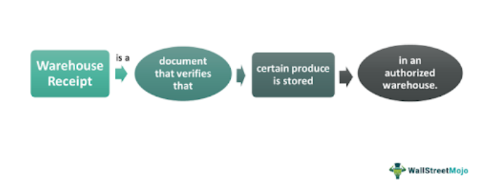

## Table of Contents

## What is a warehouse receipt?

A warehouse receipt is a document that proves you own goods stored in a warehouse. It's like a receipt you get when you buy something, but instead of showing you bought an item, it shows that your items are being kept safe in a warehouse. This receipt is important because it can be used as proof of ownership and can be traded or used to get a loan.

Warehouse receipts are useful for businesses that need to store large amounts of goods. For example, a farmer might store their crops in a warehouse and get a receipt for it. This receipt can then be used to show that the farmer owns the crops, even if they are not physically with them. It makes it easier for the farmer to sell the crops or use them as collateral for a loan without having to move the goods around.

## What are the main types of warehouse receipts?

There are two main types of warehouse receipts: negotiable and non-negotiable. A negotiable warehouse receipt can be transferred from one person to another, just like money. This means if you have a negotiable receipt, you can sell it or give it to someone else, and they will then own the goods stored in the warehouse. This type of receipt is useful if you want to trade your goods without moving them.

A non-negotiable warehouse receipt, on the other hand, cannot be transferred to someone else. It is issued to a specific person, and only that person can claim the goods from the warehouse. This type of receipt is useful if you want to keep control over your goods and make sure no one else can take them. Both types of receipts serve as proof that you own the goods, but they offer different levels of flexibility in how you can use them.

## How does a warehouse receipt work?

A warehouse receipt is a special paper that says you own things that are kept in a warehouse. When you put your things in a warehouse, the people who run the warehouse give you this receipt. It tells you what you have stored, how much of it there is, and where it is kept. This receipt is important because it proves that the things in the warehouse belong to you, even if you are not there to see them.

There are two kinds of warehouse receipts: negotiable and non-negotiable. A negotiable receipt is like money because you can give it to someone else, and then they own the things in the warehouse. This is helpful if you want to sell your things without moving them. A non-negotiable receipt is different because it can't be given to someone else. Only the person named on the receipt can take the things out of the warehouse. Both types of receipts help you keep track of your things and make sure they are safe.

## What are the benefits of using warehouse receipts?

Using warehouse receipts can help you in many ways. One big benefit is that they prove you own the things stored in the warehouse. This is important because it means you can show others that you have these things, even if they are not with you. It's like having a special paper that says, "Yes, these are mine." This can be really helpful if you need to show proof of ownership for any reason, like selling your things or getting a loan.

Another benefit is that warehouse receipts can make it easier to trade or sell your things without moving them. If you have a negotiable receipt, you can give it to someone else, and they will own the things in the warehouse. This means you don't have to take your things out of the warehouse to sell them. It saves time and money because moving big things can be hard and expensive. Plus, if you need money quickly, you can use the receipt to get a loan, using your stored things as a promise to pay back the loan.

## Who issues warehouse receipts?

Warehouse receipts are issued by the people who run the warehouse where you store your things. When you bring your things to the warehouse, they take care of them and give you a receipt to show that you own those things. This receipt is important because it's proof that your things are safe in the warehouse and that you can get them back when you need them.

The people who run the warehouse are responsible for keeping your things safe and making sure the receipt they give you is correct. They write down what you have stored, how much of it there is, and where it is kept in the warehouse. This helps you and others know exactly what you own, even if you can't see your things right away.

## What information is typically included on a warehouse receipt?

A warehouse receipt has important information that helps you know what you have stored in the warehouse. It usually includes your name, so everyone knows who owns the things. It also tells you what kind of things you have stored, like if they are crops, machines, or other goods. The receipt will say how much of these things you have, so you know exactly how many bags of wheat or how many boxes of toys are in the warehouse.

The receipt also tells you where your things are kept in the warehouse. This helps the people who work there find your things easily when you want them back. Another important part of the receipt is the date when you stored your things. This can be useful for keeping track of how long your things have been in the warehouse. If it's a negotiable receipt, it will say that too, so you know if you can give it to someone else.

## How can warehouse receipts be used as collateral?

Warehouse receipts can be used as collateral when you need to borrow money. Collateral is something valuable that you promise to give to the lender if you can't pay back the loan. When you use a warehouse receipt as collateral, you are promising the lender that they can take the things stored in the warehouse if you don't pay back the loan. This makes the lender feel safer because they know they can get something valuable if you don't pay.

Using a warehouse receipt as collateral is helpful because it lets you borrow money without having to move your things out of the warehouse. You just give the lender the receipt, and they know that the things in the warehouse are yours. This way, you can keep your things safe in the warehouse while still getting the money you need. It's a good option for people who have a lot of things stored and need a loan.

## What are the risks associated with warehouse receipts?

Using warehouse receipts can have some risks. One big risk is that if you lose the receipt, you might lose your things too. If someone else finds the receipt and it's a negotiable one, they could take your things from the warehouse. It's important to keep the receipt safe and secure to avoid this problem. Another risk is that the things in the warehouse could get damaged or lost. If that happens, the receipt won't be worth as much because the things it represents are not there anymore.

Another risk is that if you use the receipt as collateral for a loan and you can't pay back the loan, the lender can take your things. This means you could lose your stored goods if you're not careful with your loan payments. It's important to make sure you can pay back any loans you take out using your warehouse receipt. Also, if the warehouse goes out of business or has problems, it might be hard to get your things back, even with the receipt. So, it's a good idea to choose a reliable warehouse to store your things.

## How do electronic warehouse receipts differ from paper ones?

Electronic warehouse receipts are like the paper ones but they are stored on a computer instead of being printed out. They work the same way as paper receipts, showing that you own things in a warehouse. The big difference is that you can send electronic receipts to other people quickly over the internet. This makes it easier to trade or use them as collateral for loans without having to go to the warehouse or mail the paper receipt.

Using electronic receipts can be safer because they are harder to lose or steal. You can keep them safe with passwords and other computer security. But, you need to be careful because if someone hacks into your computer, they could get your electronic receipt. Also, you need to make sure the warehouse and the people you work with can use electronic receipts, because not everyone might have the right technology.

## What regulations govern the use of warehouse receipts?

Warehouse receipts are controlled by rules to make sure they are used fairly and safely. In the United States, the main rule is called the Uniform Commercial Code (UCC). This rule says how warehouse receipts should be made, what they should say, and how they can be used. It helps keep things clear and fair for everyone who uses warehouse receipts. Other countries might have their own rules, but they usually want to make sure the receipts are honest and safe too.

Another important rule is about electronic warehouse receipts. These rules say how electronic receipts should be kept safe and how they can be sent to other people. They make sure that electronic receipts are just as good as paper ones. Both types of receipts need to follow these rules to make sure they work well and keep everyone's things safe.

## How can warehouse receipts improve supply chain management?

Warehouse receipts can make supply chain management easier by helping businesses keep track of their goods. When a business stores things in a warehouse, they get a receipt that shows what they have and where it is. This helps them know exactly what they own, even if the goods are not right in front of them. It's like having a list that tells you where all your things are, so you can plan better and make sure you always have enough of what you need.

Using warehouse receipts also makes it easier to move goods around in the supply chain. If a business needs to sell or move their goods to another place, they can use the receipt to show that they own the goods. This can save time and money because they don't have to take the goods out of the warehouse to prove they own them. It also helps businesses work together better because they can trust that the receipts are real and show what goods are where.

## What are the best practices for managing warehouse receipts in a business?

Managing warehouse receipts well is important for any business that uses them. One good way to do this is to keep the receipts safe and organized. If you have paper receipts, store them in a secure place where they won't get lost or damaged. If you use electronic receipts, make sure they are protected with strong passwords and that you back them up regularly. It's also a good idea to keep a record of all your receipts, so you know what you have and where it is at all times. This helps you stay on top of your inventory and makes it easier to find what you need when you need it.

Another important practice is to check your receipts regularly to make sure they are still correct. Sometimes, things in the warehouse can get damaged or lost, so it's good to make sure your receipts match what's actually there. Also, if you use your receipts as collateral for loans, make sure you can pay back the loans on time. This will help you keep your goods safe and avoid any problems. By following these simple steps, you can manage your warehouse receipts well and keep your business running smoothly.

## References & Further Reading

[1]: Bergstra, J., Bardenet, R., Bengio, Y., & Kégl, B. (2011). ["Algorithms for Hyper-Parameter Optimization."](https://papers.nips.cc/paper/4443-algorithms-for-hyper-parameter-optimization) Advances in Neural Information Processing Systems 24.

[2]: ["Advances in Financial Machine Learning"](https://www.amazon.com/Advances-Financial-Machine-Learning-Marcos/dp/1119482089) by Marcos Lopez de Prado.

[3]: ["Evidence-Based Technical Analysis: Applying the Scientific Method and Statistical Inference to Trading Signals"](https://www.amazon.com/Evidence-Based-Technical-Analysis-Scientific-Statistical/dp/0470008741) by David Aronson.

[4]: ["Machine Learning for Algorithmic Trading"](https://github.com/stefan-jansen/machine-learning-for-trading) by Stefan Jansen.

[5]: ["Quantitative Trading: How to Build Your Own Algorithmic Trading Business"](https://www.amazon.com/Quantitative-Trading-Build-Algorithmic-Business/dp/1119800064) by Ernest P. Chan.