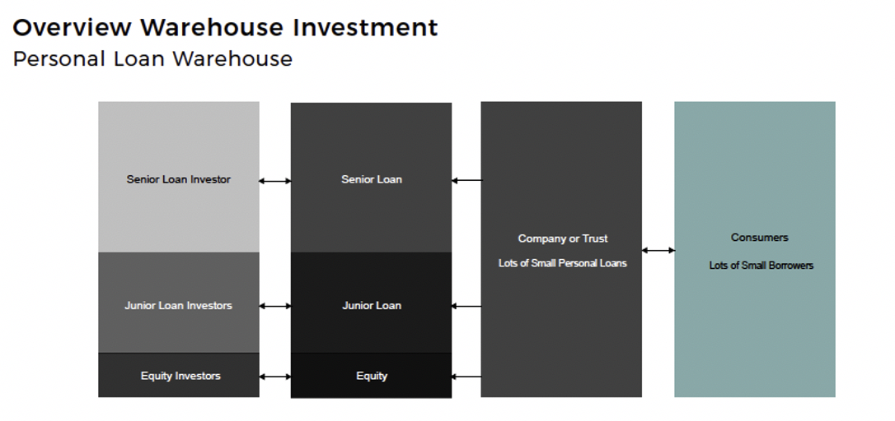

## Table of Contents

## What is warehousing in the context of investment banking?

Warehousing in investment banking refers to the practice of temporarily holding assets or securities before they are sold or distributed. Imagine a bank or financial institution buying a bunch of loans or securities and keeping them in a kind of storage until they can be packaged and sold to investors. This process helps banks manage their inventory of financial products and can be a key part of their business strategy.

For example, a bank might use warehousing to collect a large number of mortgages. Instead of selling these mortgages one by one, the bank keeps them in its warehouse until it has enough to create a mortgage-backed security. This security can then be sold to investors, providing the bank with a way to free up capital and earn profits. Warehousing helps banks manage risk and timing, making it easier to meet the demands of the market.

## How does warehousing differ from traditional warehousing in logistics?

Warehousing in investment banking is very different from traditional warehousing in logistics. In logistics, warehousing means storing physical goods like clothes, food, or machinery in a big building until they are needed or sold. The main goal is to keep these items safe and ready to move when customers want them. It's all about managing physical inventory and making sure products are in the right place at the right time.

In investment banking, warehousing is about holding financial assets, like loans or securities, not physical items. Banks keep these assets in a kind of digital storage until they can be bundled together and sold to investors. The goal here is to manage financial products and make money by selling them at the right time. It's more about managing financial risk and timing than physical storage.

Both types of warehousing aim to manage inventory, but they do it in very different ways. Logistics focuses on physical goods and their movement, while investment banking deals with financial assets and their timing in the market.

## What are the primary functions of warehousing in investment banking?

Warehousing in investment banking is all about holding onto financial assets like loans or securities for a little while before selling them. Imagine a bank buying up a bunch of home loans. Instead of selling these loans right away, the bank keeps them in a kind of digital storage. This helps the bank gather enough loans to make a bigger package that can be sold to investors. It's like collecting pieces of a puzzle until you can put them all together and sell the complete picture.

The main job of warehousing in investment banking is to manage the timing of when these financial assets are sold. Banks want to make sure they sell these assets at the best possible time to get the most money. By holding onto the assets, banks can wait for the market to be just right. This also helps banks manage risk because they can spread out when they sell things, instead of selling everything at once. It's a bit like waiting for the perfect moment to sell a valuable item, making sure you get the best deal.

## Can you explain the role of a warehouse facility in managing financial assets?

A warehouse facility in investment banking is like a temporary storage space for financial assets such as loans or securities. Imagine a bank buying lots of home loans from people. Instead of selling these loans right away, the bank keeps them in this warehouse facility. It's not a physical place but a digital system where the bank holds onto these assets until it's the right time to sell them. This helps the bank gather enough loans to create a bigger package, like a mortgage-backed security, which can then be sold to investors.

The main job of the warehouse facility is to help the bank manage when and how these financial assets are sold. By keeping the assets in the warehouse, the bank can wait for the best time to sell them, making sure they get the best price. This also helps the bank manage risk because they can spread out the sales over time instead of selling everything at once. It's like waiting for the perfect moment to sell something valuable, ensuring the best possible deal.

## What are the risks associated with warehousing financial assets?

Warehousing financial assets can be risky because the value of those assets can change while they're being held. Imagine a bank has a bunch of home loans in its warehouse. If the housing market suddenly goes down, those loans might be worth less when the bank tries to sell them. This means the bank could lose money. Also, if the bank keeps too many assets in the warehouse for too long, it might not have enough cash to do other important things, like giving out new loans or paying its bills.

Another risk is that the bank might not be able to sell the assets at all if the market changes too much. If no one wants to buy the bundled loans or securities, the bank is stuck with them. This can tie up a lot of money and make it hard for the bank to do other business. Plus, if the bank borrowed money to buy the assets it's warehousing, it still has to pay back that loan even if it can't sell the assets. So, the bank needs to be careful about how long it keeps assets in the warehouse and make sure it can handle any changes in the market.

## How do investment banks use warehousing to manage liquidity?

Investment banks use warehousing to manage their liquidity by temporarily holding onto financial assets like loans or securities. Instead of selling these assets right away, the bank keeps them in a kind of digital storage. This helps the bank control when it sells these assets, so it can wait for the best time to get the most money. By doing this, the bank can make sure it has enough cash on hand to do other important things, like giving out new loans or paying its bills.

If the bank sells all its assets too quickly, it might run out of things to sell and not have enough money coming in. By using warehousing, the bank can spread out its sales over time. This way, it can keep a steady flow of cash coming in, which helps it stay liquid and ready to handle any new business opportunities or unexpected expenses. So, warehousing is a smart way for investment banks to manage their money and make sure they always have enough cash to keep things running smoothly.

## What regulatory considerations must be taken into account when using warehousing in investment banking?

When investment banks use warehousing, they have to follow certain rules set by regulators. These rules are there to make sure the banks are not taking too much risk and that they are being honest with investors. For example, banks need to report how many assets they are holding in their warehouse and how long they are keeping them. This helps regulators keep an eye on the banks and make sure they are managing their money well. If banks don't follow these rules, they could get in trouble and might have to pay fines or face other penalties.

Another important thing to consider is the rules about how banks can use the money they borrow to buy assets for warehousing. Regulators want to make sure banks are not borrowing too much money and putting themselves at risk. There are also rules about how banks can package and sell the assets they have been holding in their warehouse. These rules are meant to protect investors and make sure they know what they are buying. So, banks need to be very careful to follow all these regulations to keep their business running smoothly and avoid any legal problems.

## How does warehousing impact the balance sheet of an investment bank?

Warehousing impacts the balance sheet of an investment bank by showing the financial assets they are holding as part of their assets. When a bank buys loans or securities and keeps them in the warehouse, these show up on the balance sheet as assets. This means the total value of the bank's assets goes up. But, the bank might also have to borrow money to buy these assets, which would show up on the balance sheet as liabilities. So, warehousing can make both the assets and liabilities on the balance sheet bigger.

The longer the bank keeps these assets in the warehouse, the more it can affect the balance sheet. If the value of the assets goes down while they are being held, the bank might have to report a lower value for these assets on its balance sheet. This can make the bank's overall financial health look worse. On the other hand, if the bank can sell the assets at a good price, it can turn those assets into cash, which can improve the balance sheet by reducing liabilities and increasing cash reserves. So, warehousing is a balancing act that can have a big impact on how the bank's financial situation looks on paper.

## What are some common strategies for optimizing the use of warehousing in investment banking?

One common strategy for optimizing the use of warehousing in investment banking is to carefully manage the timing of when assets are bought and sold. Banks try to buy assets when they are cheap and hold onto them until the market is good for selling. This way, they can make more money when they finally sell the bundled assets. Another strategy is to diversify the types of assets they keep in the warehouse. By having different kinds of loans or securities, banks can spread out their risk. If one type of asset goes down in value, they might still make money from the others.

Another strategy is to keep a close eye on how long assets are kept in the warehouse. Banks don't want to hold onto assets for too long because that can tie up their money and increase risk. They use data and market analysis to decide the best time to sell. Banks also make sure they have enough cash to cover any borrowed money used to buy the assets. This helps them stay liquid and ready for new opportunities. By balancing these factors, banks can use warehousing to their advantage and keep their business running smoothly.

## Can you discuss a case study where warehousing played a critical role in an investment banking operation?

Let's look at a case study where warehousing was really important for an investment bank. Imagine a big bank called ABC Bank that wanted to help more people buy homes. They started buying up a lot of home loans from different places. Instead of selling these loans right away, ABC Bank kept them in their warehouse. They waited until they had enough loans to make a big package called a mortgage-backed security. This package was then sold to investors who wanted to invest in home loans. By using warehousing, ABC Bank was able to gather enough loans to create a valuable product that investors wanted to buy.

This strategy worked well for ABC Bank, but it also came with risks. While the loans were in the warehouse, the housing market started to change. Some of the loans started to lose value because more people were having trouble paying them back. ABC Bank had to be careful about how long they kept the loans in the warehouse. They needed to sell the mortgage-backed security at the right time to make sure they didn't lose money. By watching the market closely and selling at the best time, ABC Bank was able to manage these risks and make a profit from their warehousing strategy.

## How do technological advancements affect warehousing practices in investment banking?

Technological advancements have made a big difference in how investment banks use warehousing. With new computer systems and software, banks can now keep track of all their financial assets much more easily. They can see in real-time how the value of these assets is changing and make quick decisions about when to buy or sell. This helps banks manage their warehouse more efficiently and reduce the risk of losing money. Also, technology lets banks automate a lot of their work, so they can handle more assets without needing more people.

Another way technology helps is by improving how banks package and sell their assets. With advanced data analysis tools, banks can figure out the best way to bundle their loans or securities to make them more attractive to investors. They can also use technology to communicate better with investors and regulators, making sure everyone has the information they need. Overall, technology makes the whole process of warehousing smoother and more profitable for investment banks.

## What future trends are expected to influence the use of warehousing in investment banking?

In the future, technology will keep changing how investment banks use warehousing. More advanced computer systems and artificial intelligence will make it easier for banks to manage their financial assets. These tools will help banks predict market changes better and decide the best time to buy and sell assets. This means banks can reduce risks and make more money. Also, blockchain technology might start being used more often, making it easier and safer for banks to keep track of their assets and share information with investors and regulators.

Another trend that will affect warehousing is the focus on sustainability and social responsibility. Banks will need to think about how their warehousing practices impact the environment and society. This might mean choosing to invest in assets that support green initiatives or help communities. As more people care about these issues, banks will need to show that they are using their warehousing in a responsible way. This can also help them attract investors who want to put their money into ethical and sustainable projects.

## How is Algorithmic Trading Revolutionizing Market Transactions?

Algorithmic trading, commonly referred to as 'algo trading', significantly alters the way market transactions are conducted by employing complex computer algorithms to execute trades with high speed and precision, minimizing human intervention. These algorithms analyze vast amounts of data, identifying trading opportunities by tracking market trends and calculating optimal trade execution. By automating the trading process, algo trading enhances efficiency, reducing transaction costs and minimizing the impact of human emotions such as fear and greed on trading decisions.

The core of [algorithmic trading](/wiki/algorithmic-trading) lies in its ability to utilize sophisticated mathematical models. These models process current and historical market data to generate predictions about future price movements. For example, consider a basic moving average strategy: 

$$
\text{Signal} = \begin{cases} 
\text{Buy}, & \text{if } \text{short-term MA} > \text{long-term MA} \\
\text{Sell}, & \text{if } \text{short-term MA} < \text{long-term MA}
\end{cases}
$$

Here, the algorithm computes moving averages (MAs) over different time frames and generates buy or sell signals based on their crossover points.

With the advent of [artificial intelligence](/wiki/ai-artificial-intelligence) (AI) and [machine learning](/wiki/machine-learning) (ML), the capabilities of algo trading have expanded exponentially. AI enhances algorithms by enabling them to adapt to changing market conditions and learn from data without being explicitly programmed to do so. Machine learning techniques, such as supervised learning for prediction or unsupervised learning for pattern recognition, are employed to improve the accuracy and efficacy of trading strategies. These technologies enable a deeper analysis of diverse and complex datasets, such as social media sentiment or news feeds, and their correlation with financial markets, which can offer competitive advantages to traders.

For instance, ML models can be implemented in Python using libraries like TensorFlow or scikit-learn to develop predictive trading strategies. A simple linear regression model can predict future stock prices based on historical prices:

```python
from sklearn.linear_model import LinearRegression
import numpy as np

# Sample data: historical stock prices
X = np.array([[1], [2], [3], [4], [5]])
y = np.array([10, 12, 15, 18, 21])

# Create and train the model
model = LinearRegression()
model.fit(X, y)

# Predict future stock price
future_day = np.array([[6]])
predicted_price = model.predict(future_day)
print(f"Predicted stock price for day 6: {predicted_price[0]}")
```

This Python snippet demonstrates a basic approach to forecasting stock prices using linear regression, highlighting how algo trading leverages ML for improved decision-making.

Algorithmic trading is not limited to institutional investors; individual traders also utilize these technologies, democratizing access to sophisticated trading methods once reserved for large financial institutions. As technology continues to advance, algorithmic trading remains a pivotal component of modern financial markets, driving increased market liquidity and efficiency.

## References & Further Reading

[1]: Bergstra, J., Bardenet, R., Bengio, Y., & Kégl, B. (2011). ["Algorithms for Hyper-Parameter Optimization."](https://dl.acm.org/doi/10.5555/2986459.2986743) Advances in Neural Information Processing Systems 24.

[2]: ["Advances in Financial Machine Learning"](https://www.amazon.com/Advances-Financial-Machine-Learning-Marcos/dp/1119482089) by Marcos Lopez de Prado

[3]: ["Evidence-Based Technical Analysis: Applying the Scientific Method and Statistical Inference to Trading Signals"](https://www.amazon.com/Evidence-Based-Technical-Analysis-Scientific-Statistical/dp/0470008741) by David Aronson

[4]: ["Machine Learning for Algorithmic Trading"](https://github.com/stefan-jansen/machine-learning-for-trading) by Stefan Jansen

[5]: ["Quantitative Trading: How to Build Your Own Algorithmic Trading Business"](https://www.amazon.com/Quantitative-Trading-Build-Algorithmic-Business/dp/1119800064) by Ernest P. Chan

[6]: Gorton, G., & Metrick, A. (2012). ["Securitization"](https://www.nber.org/papers/w18611) in Annual Review of Financial Economics

[7]: Hull, J. (2018). ["Risk Management and Financial Institutions"](https://archive.org/download/quant_books/Risk%20Management%20_%20Financial%20Institutions%20-%20J.%20C.%20Hull.pdf), 5th Edition, Wiley.

[8]: Shadab, H. B. (2008). ["The Law and Economics of Hedge Funds: Financial Innovation and Investor Protection"](https://lawcat.berkeley.edu/record/1122217/files/fulltext.pdf) in Berkeley Business Law Journal

[9]: Sirignano, J., & Cont, R. (2019). ["Universal features of price formation in financial markets: perspectives from Deep Learning"](https://arxiv.org/abs/1803.06917), Quantitative Finance.

[10]: L'Hoir, M. E. & Martins, B. (2004). ["Understanding Collateralized Debt Obligations: Securitization Techniques"](https://academic.oup.com/book/41593/chapter/353252467), Learning Opportunities.