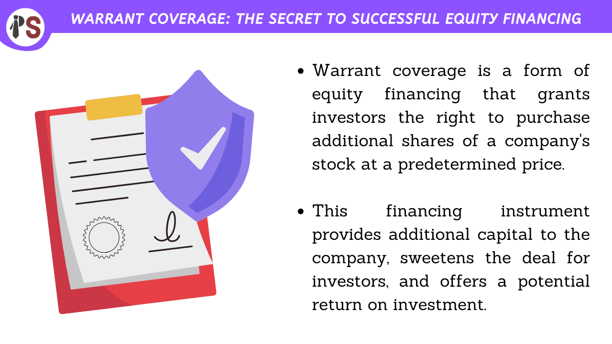

## Table of Contents

## What is warrant coverage in finance?

Warrant coverage is a term used in finance that refers to an agreement between a company and an investor. In this agreement, the company gives the investor the right to buy more of its stock at a set price in the future. This right is called a warrant. The company does this to make the investment more attractive to the investor. It's like a bonus that the investor can use later if they want to.

This kind of arrangement is often used when a company is trying to raise money. For example, a startup might offer warrant coverage to venture capitalists to encourage them to invest. The investor gets the chance to buy more shares at a lower price if the company does well. This can be a win-win situation. The company gets the money it needs now, and the investor has the potential to make more money later.

## How does warrant coverage differ from stock options?

Warrant coverage and stock options are similar because they both give someone the right to buy stock at a set price in the future. But they are given out in different ways. Warrant coverage is usually given to investors by a company when they are trying to raise money. It's like a bonus to make the investment more appealing. On the other hand, stock options are often given to employees as part of their pay. They are a way to reward and keep employees.

Another difference is who they are usually given to. Warrant coverage is mostly for outside investors, like venture capitalists or angel investors. These investors are looking for a chance to make more money if the company does well. Stock options, however, are given to employees inside the company. They help align the employees' goals with the company's success, encouraging them to work harder and stay longer.

## What are the benefits of warrant coverage for investors?

Warrant coverage gives investors a chance to buy more stock at a set price in the future. This can be a big benefit if the company's stock price goes up. If the stock price is higher than the set price when the investor uses the warrant, they can buy the stock for less than it's worth on the market. This means they can make more money by selling the stock at the higher market price.

Also, warrant coverage can make an investment less risky. It's like getting a bonus that could be worth a lot if the company does well. This extra chance to make money can make investors feel more comfortable about putting their money into the company. It's a way for the company to show they believe in their future success and want to share that potential with investors.

## How can companies use warrant coverage to raise capital?

Companies can use warrant coverage to raise capital by offering it as an extra incentive to investors. When a company needs money, it might sell shares to investors. To make the deal more attractive, the company can also give the investors warrants. These warrants let the investors buy more shares later at a set price. This can make the investment seem like a better deal, encouraging more people to invest and helping the company raise the money it needs.

Warrant coverage can be especially useful for startups or smaller companies that might have a harder time raising money. These companies can use warrants to show investors that they believe in their future success. By offering the chance to buy more shares at a potentially lower price, the company can make the investment more appealing. This can help them get the capital they need to grow and develop their business.

## What are the key terms typically found in a warrant coverage agreement?

A warrant coverage agreement usually includes a few important terms that both the company and the investor need to know. One key term is the exercise price, which is the set price at which the investor can buy the stock in the future. Another important term is the expiration date, which tells the investor how long they have to use the warrant before it becomes worthless. The agreement also often includes the number of warrants being offered, which shows how many shares the investor can buy.

Another term to look out for is the vesting period, which is the time the investor has to wait before they can use the warrants. Some agreements might also have a cashless exercise option, which lets the investor use the warrants without paying the full exercise price in cash. All these terms help make sure both the company and the investor understand the deal and know what to expect.

## How does the exercise price of a warrant affect its value?

The exercise price of a warrant is the set price at which an investor can buy the company's stock in the future. This price plays a big role in deciding how valuable the warrant is. If the exercise price is lower than the current market price of the stock, the warrant is more valuable. This is because the investor can buy the stock for less than it's worth on the market, which means they could make money by selling it at the higher price.

On the other hand, if the exercise price is higher than the current market price, the warrant is less valuable. In this case, it wouldn't make sense for the investor to use the warrant because they could buy the stock for less on the open market. The difference between the exercise price and the market price is called the intrinsic value of the warrant. The bigger this difference, the more valuable the warrant is to the investor.

## What is the impact of dilution on existing shareholders when warrants are exercised?

When investors use their warrants to buy more stock, it can lead to something called dilution. Dilution happens when the total number of shares in a company goes up. This means that each existing share represents a smaller piece of the company. For example, if a company has 100 shares and someone uses a warrant to buy 10 more, there are now 110 shares. Each of the original 100 shares now owns a smaller part of the company.

This can affect existing shareholders because their ownership percentage goes down. If the company's total value stays the same, the value of each share might go down too. But if the company uses the money from selling the new shares to grow and become more valuable, the impact of dilution might be less. It's a bit like adding more slices to a pizza - each slice gets smaller, but if the pizza gets bigger, each slice might still be just as tasty.

## Can you explain the difference between European and American style warrants?

European style warrants and American style warrants are two types of warrants that investors can use. The main difference between them is when they can be used. European style warrants can only be used on the expiration date. This means that if you have a European style warrant, you have to wait until the very last day to decide if you want to buy the stock at the set price. It's like having a ticket that you can only use on a specific date.

On the other hand, American style warrants give you more flexibility. You can use them at any time before the expiration date. So, if you have an American style warrant and the stock price goes up, you can decide to use your warrant early to buy the stock at the lower set price. It's like having a ticket that you can use anytime before it expires. This flexibility can be a big advantage for investors who want to take advantage of changes in the stock price.

## How do market conditions influence the decision to issue or invest in warrant coverage?

Market conditions play a big role in whether a company decides to issue warrant coverage or if an investor decides to invest in it. When the market is doing well and stock prices are going up, companies might be more likely to issue warrant coverage. This is because investors are more willing to take risks when the market is strong. They see the warrants as a chance to make more money if the company keeps doing well. On the other hand, if the market is not doing so well, companies might be more cautious about issuing warrants because investors might be less interested in taking risks.

For investors, market conditions can also affect their decision to invest in warrant coverage. In a strong market, investors might be more eager to buy warrants because they believe the stock price will keep going up. This means they can use the warrants to buy the stock at a lower price and then sell it at a higher price, making a profit. But in a weak market, investors might be more hesitant. They might worry that the stock price won't go up enough to make the warrants valuable, so they might look for safer investments instead.

## What are some advanced strategies for trading warrants?

One advanced strategy for trading warrants is called delta hedging. This means that if you own a warrant, you can buy or sell the stock to balance out the risk. For example, if you think the stock price might go down, you can sell some of the stock to protect yourself. This way, even if the stock price drops, the value of your warrant might not go down as much. Delta hedging can be tricky, but it helps traders manage their risk better.

Another strategy is to use warrants to make money from big changes in the stock price, either up or down. This is called a straddle. You buy both a call warrant, which lets you buy the stock if it goes up, and a put warrant, which lets you sell the stock if it goes down. If the stock price moves a lot in either direction, one of the warrants will become more valuable, and you can make money. This strategy can be risky, but it can also pay off big if the stock price moves a lot.

A third strategy is to trade warrants based on how much time is left before they expire. This is called time decay trading. As the expiration date gets closer, the value of the warrant can go down if the stock price doesn't move much. Traders can try to predict this and sell their warrants before they lose too much value. This strategy needs good timing and understanding of how time affects the value of warrants.

## How do tax implications vary for different types of warrant coverage?

When you use warrants to buy stock, you need to think about taxes. If you use a warrant and then sell the stock you bought, you might have to pay capital gains tax. This tax depends on how long you held the stock. If you held it for less than a year, it's a short-term capital gain, and you pay tax at your regular income tax rate. If you held it for more than a year, it's a long-term capital gain, and the tax rate is usually lower. The difference between the price you paid for the stock with the warrant and the price you sell it for is what you pay tax on.

There are also special rules for certain types of warrants. For example, if you get warrants as part of your job, like employee stock options, the tax rules can be different. You might have to pay income tax when you use the warrant, not just when you sell the stock. The tax you pay can depend on if the warrants are "qualified" or "non-qualified." It's a good idea to talk to a tax expert to understand how these rules apply to your situation.

## What case studies illustrate successful and unsuccessful uses of warrant coverage in corporate finance?

One successful use of warrant coverage was by Tesla in 2014. Tesla issued convertible bonds with warrant coverage to raise money for its expansion. Investors who bought these bonds got the chance to buy Tesla stock at a set price in the future. This made the bonds more attractive because Tesla's stock price was expected to go up. When Tesla's stock did rise, many investors used their warrants to buy more stock at the lower price and made a lot of money. This helped Tesla raise the money it needed and also made investors happy, showing how warrant coverage can be a win-win situation.

On the other hand, an example of an unsuccessful use of warrant coverage was by the company J.C. Penney in 2013. J.C. Penney issued warrants to raise money when it was struggling financially. The idea was to attract investors by offering them the chance to buy stock at a lower price later. However, J.C. Penney's stock price kept falling, and the warrants became almost worthless. Investors lost money, and J.C. Penney didn't get the financial boost it needed. This shows how warrant coverage can be risky if the company's stock doesn't perform well.

## How can warrant coverage be integrated with algorithmic trading?

Integrating warrant coverage with [algorithmic trading](/wiki/algorithmic-trading) presents a significant opportunity for investors to maximize returns by leveraging technology to efficiently trade these financial instruments. Warrant coverage, which involves the issuance of warrants along with equity or debt investments, provides a strategic tool for companies to raise capital while offering potential upside to investors. Algorithmic trading, using computer algorithms to automate and optimize trading processes, can effectively enhance the precision and speed required for handling the complexities of warrant trading.

### Development of Warrant Trading Algorithms

Trading warrants through algorithms necessitates a sophisticated approach that accounts for various market dynamics. Key factors include [volatility](/wiki/volatility-trading-strategies), leverage, and market sentiment, each of which significantly influences the pricing and behavior of warrants. Traditional models, such as the Black-Scholes model, can be adapted to consider these factors and modified for algorithmic applications. For example, consider the adjusted Black-Scholes model for pricing warrants:

$$
W = S \cdot N(d_1) - X \cdot e^{-rT} \cdot N(d_2)
$$

Where:
- $W$ is the price of the warrant,
- $S$ is the current stock price,
- $X$ is the strike price,
- $T$ is the time until expiration,
- $r$ is the risk-free interest rate,
- $N$ represents the cumulative distribution function of the standard normal distribution,
- $d_1$ and $d_2$ are calculated variables considering volatility and time to maturity.

Python libraries such as NumPy and Pandas can be used to efficiently compute these values and backtest strategies across historical data.

```python
import numpy as np
from scipy.stats import norm

def black_scholes_warrant(S, X, T, r, sigma):
    d1 = (np.log(S/X) + (r + (sigma**2)/2) * T) / (sigma * np.sqrt(T))
    d2 = d1 - sigma * np.sqrt(T)
    warrant_price = S * norm.cdf(d1) - X * np.exp(-r * T) * norm.cdf(d2)
    return warrant_price
```

### Addressing Challenges in Implementation

Implementing warrant trading algorithms brings forth several challenges. Liquidity concerns can impact the execution of trades, as warrants are often less liquid compared to ordinary shares. Algorithmic strategies must be designed to account for bid-ask spreads and order execution delays, minimizing market impact.

Regulatory compliance is another critical area, as warrant trades are subject to specific reporting and disclosure requirements that vary by jurisdiction. Ensuring adherence to these regulations is essential in developing compliant algorithms.

Data accuracy is fundamental to the success of algorithmic trading. Algorithms rely on precise input data to function correctly; therefore, data feeds must be continuously monitored and validated to prevent erroneous trading signals.

### Case Studies: Successful Integration

Several case studies underscore the successful integration of warrant coverage with algorithmic trading. For instance, a [hedge fund](/wiki/hedge-fund-trading-strategies) specializing in derivatives employed custom algorithms to exploit volatility in technology sector warrants during market fluctuations. By designing a strategy that used predictive analytics to forecast volatility shifts, the fund achieved returns significantly above market averages.

Another example is an investment firm that combined [machine learning](/wiki/machine-learning) techniques with traditional warrant pricing models to dynamically adjust its position sizing in real-time. This approach allowed them to capitalize on short-term market inefficiencies and optimize leverage.

By leveraging these strategies, investors can harness the inherent flexibility and potential of warrants while benefiting from the scalable capabilities of algorithmic trading. However, careful planning and an understanding of market mechanics are crucial in achieving successful outcomes.

## How do you set up an algorithmic trading system for warrants?

Setting up an algorithmic trading system for warrants involves several critical steps, each contributing to the overarching goal of maximizing returns while mitigating risks. The first essential step is choosing a suitable trading platform that supports the specific needs of warrant-based strategies. Platforms like MetaTrader and QuantConnect are popular choices due to their robust features and community support. MetaTrader offers extensive tools for technical analysis and automated trading, while QuantConnect provides a flexible environment for developing algorithms in Python, C#, and F# with [backtesting](/wiki/backtesting) capabilities.

A significant component of algorithmic trading system design is strategy formulation. This involves defining the trading algorithm's logic, based on expected patterns and signals in warrant prices. For instance, an investor might utilize a [momentum](/wiki/momentum)-based strategy that triggers buy or sell orders when certain thresholds are met. In mathematical terms, a simple momentum indicator can be defined as:

$$
\text{Momentum} = P_{t} - P_{t-n}
$$

where $P_{t}$ is the price at time $t$, and $P_{t-n}$ is the price n periods ago. By calibrating such indicators within the algorithm, traders can capitalize on short-term price movements characteristic of warrants.

Robust backtesting practices are paramount to ensure the reliability of these algorithms. By applying historical data, investors can simulate how trading strategies would have performed in the past. This process can be conducted using Python libraries like pandas for data manipulation and [backtrader](/wiki/backtrader) for backtesting:

```python
import backtrader as bt

class MomentumStrategy(bt.Strategy):
    params = (('period', 15),)

    def __init__(self):
        self.momentum = bt.indicators.Momentum(self.data, period=self.params.period)

    def next(self):
        if self.momentum[0] > 0:
            self.buy()
        elif self.momentum[0] < 0:
            self.sell()
```

This example outlines a basic momentum strategy, where buy and sell signals are generated based on current and past price differences.

Risk management is another pillar of a successful warrant trading system. Implementing stop-loss and take-profit orders can protect against severe losses and secure gains. Risk-reward ratios should be carefully considered to align with the investor's tolerance and strategy goals.

Beyond individual algorithm design, aligning the trading system with market dynamics is crucial. Warrant markets can exhibit high volatility and sensitivity to factors such as underlying asset performance and macroeconomic changes. Therefore, adapting algorithms dynamically based on real-time data inputs can optimize outcomes. Leveraging machine learning techniques to refine trading models as they ingest new data can further enhance this alignment.

By meticulously executing each step—from platform selection and strategy design to rigorous backtesting and responsive risk management—investors can develop a potent algorithmic trading system tailored for warrants, positioning themselves more effectively to navigate the complexities of modern financial markets and achieve optimized returns.

## References & Further Reading

[1]: Bergstra, J., Bardenet, R., Bengio, Y., & Kégl, B. (2011). ["Algorithms for Hyper-Parameter Optimization."](https://dl.acm.org/doi/10.5555/2986459.2986743) Advances in Neural Information Processing Systems 24.

[2]: ["Advances in Financial Machine Learning"](https://www.amazon.com/Advances-Financial-Machine-Learning-Marcos/dp/1119482089) by Marcos Lopez de Prado

[3]: ["Evidence-Based Technical Analysis: Applying the Scientific Method and Statistical Inference to Trading Signals"](https://www.amazon.com/Evidence-Based-Technical-Analysis-Scientific-Statistical/dp/0470008741) by David Aronson

[4]: ["Machine Learning for Algorithmic Trading"](https://github.com/stefan-jansen/machine-learning-for-trading) by Stefan Jansen

[5]: ["Quantitative Trading: How to Build Your Own Algorithmic Trading Business"](https://www.amazon.com/Quantitative-Trading-Build-Algorithmic-Business/dp/1119800064) by Ernest P. Chan