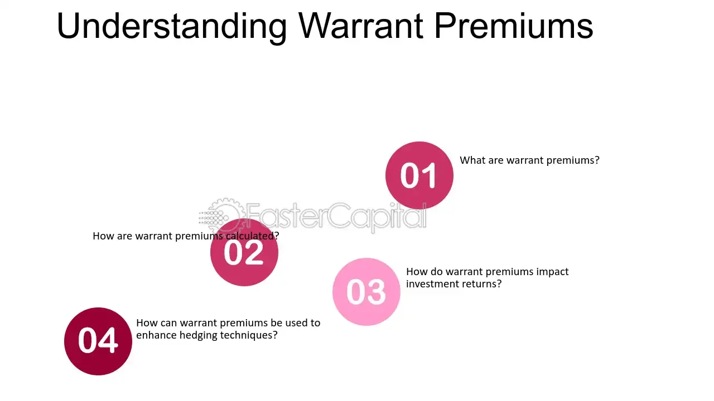

## Table of Contents

## What is a warrant premium?

A warrant premium is the extra amount you pay for a warrant compared to the value of the stock it can be used to buy. Imagine you have a special ticket, called a warrant, that lets you buy a company's stock at a set price. If the ticket costs more than the stock itself, that extra cost is the warrant premium.

This premium exists because the warrant gives you the right to buy the stock at a fixed price in the future, which could be lower than the market price at that time. People are willing to pay this extra amount because they believe the stock's price will go up, making the warrant valuable. So, the warrant premium reflects the hope and expectation that the stock will increase in value.

## How does a warrant premium differ from the warrant's intrinsic value?

The warrant premium and the warrant's intrinsic value are two different things. The intrinsic value of a warrant is how much the stock is worth right now compared to the price you can buy it for with the warrant. If the stock is trading at $50 and your warrant lets you buy it for $40, the intrinsic value is $10. That's the real, immediate value you get from using the warrant.

The warrant premium, on the other hand, is the extra amount you pay for the warrant beyond its intrinsic value. Using the same example, if you buy the warrant for $15, the premium is $5 because you're paying $5 more than the intrinsic value of $10. This extra cost reflects the potential future value of the stock and the time left until the warrant expires. People pay this premium because they believe the stock price will go up even more, making the warrant more valuable over time.

## What factors influence the warrant premium?

The warrant premium is influenced by several factors, one of which is the time left until the warrant expires. The more time there is before the warrant expires, the higher the premium can be. This is because there's more chance for the stock price to go up, making the warrant more valuable. Imagine you have a longer time to use your special ticket; you might be willing to pay more for that extra time because the stock could become worth a lot more.

Another factor is how much the stock price might change, which is called volatility. If the stock price is expected to swing a lot, the warrant premium can be higher. This is because there's a bigger chance the stock could go way up, making the warrant very valuable. It's like betting on a horse race; if the horse could win by a lot, you might pay more for the bet. The premium also depends on things like interest rates and how the stock has been doing lately, but time and volatility are the big ones.

## How is the warrant premium calculated?

The warrant premium is calculated by taking the market price of the warrant and subtracting its intrinsic value. The intrinsic value is the difference between the current stock price and the exercise price of the warrant. For example, if the stock is trading at $50 and the warrant lets you buy it for $40, the intrinsic value is $10. If you can buy the warrant for $15, the premium is $5 because you're paying $5 more than the intrinsic value.

Several factors affect the size of the warrant premium. The most important are the time left until the warrant expires and how much the stock price is expected to change, which is called volatility. If there's a long time before the warrant expires, the premium can be higher because there's more chance for the stock price to go up. Also, if the stock price is expected to swing a lot, the premium can be higher because there's a bigger chance the stock could go way up, making the warrant more valuable.

## Can you provide a basic example of calculating a warrant premium?

Let's say you have a warrant that lets you buy a company's stock for $30. Right now, the stock is trading at $40. So, the intrinsic value of the warrant is $10 because that's how much more the stock is worth right now compared to what you can buy it for with the warrant.

If you can buy the warrant for $12, then the warrant premium is $2. That's because you're paying $2 more than the intrinsic value of $10. The extra $2 is what people are willing to pay for the chance that the stock price might go even higher before the warrant expires.

## What role does time to expiration play in the warrant premium?

The time left until a warrant expires is really important for figuring out its premium. The longer you have before the warrant expires, the more you might be willing to pay for it. That's because there's more time for the stock price to go up. If you have a year to use your special ticket to buy the stock, you might think, "Hey, the stock could go way up in that time!" So, you'd be willing to pay more for that extra time.

On the other hand, if the warrant is about to expire soon, like in a month, you might not want to pay as much. There's less time for the stock price to change a lot, so the chance of making a big profit is smaller. That's why the premium goes down when there's less time left. It's all about how much time you have to wait and see if the stock price goes up.

## How does the volatility of the underlying stock affect the warrant premium?

The ups and downs of the stock price, called volatility, can make the warrant premium go up or down. If people think the stock price might swing a lot, they might be willing to pay more for the warrant. It's like betting on a horse race; if the horse could win by a lot, you might pay more for the bet. So, if the stock is expected to be very volatile, the warrant premium can be higher because there's a bigger chance the stock could go way up, making the warrant more valuable.

On the other hand, if the stock price is expected to stay pretty steady, the warrant premium might be lower. That's because there's less chance for the stock to jump up a lot before the warrant expires. People won't want to pay as much for the warrant if they think the stock price won't change much. So, the more the stock price is expected to move around, the higher the warrant premium can be.

## What is the relationship between interest rates and the warrant premium?

Interest rates can affect the warrant premium in a pretty straightforward way. When interest rates go up, the cost of borrowing money increases. This means that the money you could have invested elsewhere to earn interest becomes more valuable. So, if you're thinking about buying a warrant, you might want a higher premium to make up for the interest you're missing out on by not investing your money somewhere else.

On the flip side, when interest rates are low, the cost of borrowing money is cheaper, and the interest you could earn from other investments is less. This makes the warrant more attractive because you're not giving up as much potential interest income. So, the warrant premium might be lower because people are more willing to pay for the chance that the stock price will go up without worrying as much about what they could earn elsewhere.

## How do dividends impact the warrant premium?

Dividends can make the warrant premium go down. When a company pays a dividend, the stock price usually drops by about the same amount as the dividend on the day it's paid. This drop in stock price can lower the value of the warrant because the warrant's value is tied to the stock price. If you're thinking about buying a warrant, you might not want to pay as much for it if you know the stock price is going to drop because of a dividend payment.

But it's not just about the immediate drop in stock price. Dividends also affect how people see the value of the warrant over time. If a company pays regular dividends, it might mean the stock price won't go up as fast because the company is giving money to shareholders instead of using it to grow the business. This can make the warrant less attractive, so people might not be willing to pay as high a premium for it. They might think the stock price won't rise as much before the warrant expires, so they'll pay less for the chance to buy it at the set price.

## What are some strategies investors might use to capitalize on warrant premiums?

Investors might use a strategy called buying and holding to take advantage of warrant premiums. They buy warrants when they think the stock price will go up a lot before the warrant expires. If they're right, the warrant's value will go up because of the higher stock price and the premium people are willing to pay for it. They can then sell the warrant for more than they paid for it, making a profit. This works well if they pick the right stock and the right time to buy the warrant, so they need to keep an eye on things like how volatile the stock is, how long they have until the warrant expires, and what's happening with interest rates and dividends.

Another strategy is called writing warrants. This is when investors sell warrants to other people. They get money right away from selling the warrant, and they hope the stock price doesn't go up too much before the warrant expires. If it doesn't, they keep the money they got from selling the warrant without having to give anything more. This can be a good way to make money if they think the stock won't go up much, but it's riskier because if the stock price does go up a lot, they could lose money. So, they need to be careful and think about all the same things as when they're buying warrants, like volatility, time to expiration, interest rates, and dividends.

## How can advanced valuation models like Black-Scholes be used to estimate warrant premiums?

The Black-Scholes model is a fancy way to figure out how much a warrant should be worth. It looks at things like how long you have until the warrant expires, how much the stock price might swing around (called volatility), the difference between the stock price now and what you can buy it for with the warrant (intrinsic value), and even what's happening with interest rates. By putting all these pieces together, the Black-Scholes model can give you a number that tells you what the warrant's premium should be. If the actual premium is higher than what the model says, you might think the warrant is too expensive, and if it's lower, it might be a good deal.

Using the Black-Scholes model isn't perfect, but it's a helpful tool for investors. It helps them decide if a warrant's premium is too high or too low based on what they think will happen with the stock price and other factors. By comparing the model's estimate to the actual market price, investors can make smarter choices about buying or selling warrants. It's like having a calculator that helps you see if you're paying a fair price for the chance that the stock will go up before the warrant expires.

## What are the risks associated with investing in warrants based on their premiums?

Investing in warrants based on their premiums can be risky. One big risk is that the stock price might not go up as much as you hope before the warrant expires. If the stock price stays the same or goes down, the warrant's value could drop, and you might lose the money you paid for the premium. It's like betting on a horse race; if your horse doesn't win, you lose your bet. The premium you pay for the warrant is your bet, and if the stock doesn't perform well, you could lose it all.

Another risk is that the warrant might expire before the stock price goes up enough to make it worth using. Warrants have an expiration date, and if the stock price doesn't rise in time, the warrant becomes worthless. You can't get your money back for the premium you paid. It's like buying a ticket to a concert that gets canceled; you're out the money you paid for the ticket. So, you need to think carefully about how long you have until the warrant expires and whether the stock has a good chance of going up in that time.

## What is a Warrant Premium?

A warrant premium represents the difference between the market price of a warrant and its intrinsic value. Warrants are financial derivatives that grant the holder the right, but not the obligation, to purchase the underlying stock at a predetermined price, known as the exercise price or strike price, before a specific expiration date. These instruments are often embedded in corporate financial strategies to raise capital or as incentives in employee compensation packages.

To understand a warrant premium, it is vital to comprehend its two main components: the intrinsic value and the time value. The intrinsic value is the difference between the asset's current market price and the warrant’s exercise price. Mathematically, it can be expressed as:

$$
\text{Intrinsic Value} = \max(0, \text{Current Stock Price} - \text{Exercise Price})
$$

A warrant is said to have intrinsic value only if it is "in-the-money," meaning the current stock price is above the exercise price. If the stock price is below the exercise price, the warrant’s intrinsic value is zero.

The warrant premium, therefore, is the market price of the warrant minus its intrinsic value:

$$
\text{Warrant Premium} = \text{Market Price of Warrant} - \text{Intrinsic Value}
$$

This premium considers the additional compensation investors require to bear the potential [volatility](/wiki/volatility-trading-strategies) and remaining time until expiration. Factors influencing the warrant premium include the underlying stock's price volatility, interest rates, time until expiration, and dividend payments on the underlying stock, as these affect the potential for the stock price to climb above the exercise price.

Comparing warrant premiums to other instruments like options reveals some unique attributes. Both warrants and options provide rights without obligations, but they differ in issuance and market dynamics. Warrants are typically issued by the company, and their exercise leads to the creation of new shares, potentially diluting existing share ownership. In contrast, options are standardized contracts traded on exchanges and do not alter the company’s share structure upon exercise.

The warrant premium is also influenced by its time value, which diminishes as the expiration date nears, akin to the time decay characteristic of options. However, warrants often have longer maturities compared to options, providing a different risk and reward profile that must be considered when making investment decisions.

Grasping the relationship between intrinsic value, exercise price, and warrant premium is essential for investors. This knowledge allows for better appraisal of investment opportunities, balancing potential returns against associated risks. Understanding these concepts provides the foundation for making informed investment choices and effectively leveraging financial derivatives as part of a broader investment strategy.

## What is the Role of Warrant Premiums in Financial Calculations?

Warrant premiums are crucial elements in financial assessments, providing insights into market sentiment and the potential performance of underlying stocks. By understanding how warrant premiums are calculated, investors and analysts can better evaluate stock prospects and develop informed investment strategies.

To comprehend warrant premiums, it is essential to start with the foundational equation for calculating the premium:

$$
\text{Warrant Premium} = \text{Price of Warrant} - \text{Intrinsic Value}
$$

The intrinsic value of a warrant is derived from its intrinsic worth at the current stock price minus the exercise price:

$$
\text{Intrinsic Value} = \max(0, \text{Current Stock Price} - \text{Exercise Price})
$$

The warrant premium thus reflects the amount investors are willing to pay above this intrinsic value, fundamentally indicating market expectations about the future price appreciation of the underlying stock.

In financial calculations, the intrinsic and time values of a warrant are often considered. The time value represents the additional amount over its intrinsic value that investors are willing to pay due to the time left until the warrant's expiration. This component is closely associated with the volatility of the underlying stock, interest rates, and the time until expiration.

One practical application of warrant premiums in financial modeling involves using mathematical models that incorporate market data inputs to assess fair value. Models such as Black-Scholes, traditionally used for option pricing, can be adapted to include warrant-specific adjustments. These models calculate theoretical prices, helping identify mispriced warrants in the market.

Furthermore, analysts employ warrant premiums to speculate on market movements. An inflated premium might suggest potential stock upticks, as it shows high market confidence. Conversely, a shrinking premium may indicate skepticism about future growth. Therefore, warrant premiums offer a quantitative measure for predicting stock trajectories, aiding financial forecasting and strategic investment planning.

To enhance these calculations, programming languages like Python can be utilized to automate and refine the analysis. Python's financial libraries enable precise modeling and simulation of warrant pricing dynamics, allowing for real-time data application. Below is a basic Python script illustrating how one might calculate a simple warrant premium:

```python
def calculate_warrant_premium(warrant_price, stock_price, exercise_price):
    intrinsic_value = max(0, stock_price - exercise_price)
    warrant_premium = warrant_price - intrinsic_value
    return warrant_premium

# Example values
warrant_price = 15
stock_price = 50
exercise_price = 40

premium = calculate_warrant_premium(warrant_price, stock_price, exercise_price)
print(f"The warrant premium is ${premium}")
```

By mastering the calculation and interpretation of warrant premiums, financial professionals can substantially improve their investment analysis and decision-making processes. This understanding plays a pivotal role in crafting robust and dynamic strategies to navigate and capitalize on financial markets.

## What is the relationship between Algorithmic Trading and Warrant Premiums?

Algorithmic trading has become a significant force in financial markets, using complex algorithms to execute trades at speeds and frequencies that are beyond the reach of human traders. Within this domain, warrant premiums are increasingly recognized as valuable inputs that can influence trading strategies. 

Warrant premiums, the difference between the warrant's price and its intrinsic value, provide insights into market sentiment and the underlying stock's potential performance. Incorporating warrant premiums into [algorithmic trading](/wiki/algorithmic-trading) strategies can enhance decision-making by providing an additional layer of analysis.

To effectively integrate warrant premiums, algorithmic traders often utilize mathematical models that forecast future price movements and identify [arbitrage](/wiki/arbitrage) opportunities. Commonly, the Black-Scholes model—traditionally used for options pricing—can be adapted for warrants due to their similar characteristics. This model involves inputs such as the current price of the underlying stock, the exercise price of the warrant, the time to expiration, and market volatility. The formula is expressed as:

$$
C = S_0 \cdot N(d_1) - X \cdot e^{-rT} \cdot N(d_2)
$$

where:
- $C$ is the theoretical call price (which can be adapted to calculate warrant premiums),
- $S_0$ is the current price of the underlying stock,
- $X$ is the exercise price of the warrant,
- $T$ is the time to expiration,
- $N(d)$ is the cumulative distribution function of the standard normal distribution,
- $r$ is the risk-free interest rate.

Adaptations of this model for warrant pricing involve adjustments for potential dilution and specific terms of warrants that differ from standard options.

Another model, the Binomial Option Pricing Model, serves as a versatile tool for pricing warrants. It works by iterating possible price movements of the underlying stock over discrete time intervals until the expiration date. This model is particularly useful in scenarios where the underlying assumptions of the Black-Scholes model—such as constant volatility—do not hold. The Binomial model's flexibility makes it suitable for complex scenarios involving various market conditions.

Algorithmic trading systems can implement these models in trading strategies to determine optimal entry and [exit](/wiki/exit-strategy) points, leveraging warrant premiums to predict market trends. For example, a Python script might use quantitative libraries like NumPy and SciPy to automate such calculations:

```python
import numpy as np
from scipy.stats import norm

def black_scholes_warrant_premium(S, X, T, r, sigma):
    d1 = (np.log(S/X) + (r + sigma**2 / 2) * T) / (sigma * np.sqrt(T))
    d2 = d1 - sigma * np.sqrt(T)
    premium = S * norm.cdf(d1) - X * np.exp(-r * T) * norm.cdf(d2)
    return premium

# Example usage
current_stock_price = 100
exercise_price = 95
time_to_expiration = 1  # in years
risk_free_rate = 0.05
volatility = 0.2

warrant_premium = black_scholes_warrant_premium(current_stock_price, exercise_price, time_to_expiration, risk_free_rate, volatility)
print(f"Warrant Premium: {warrant_premium}")
```

By embedding such calculations into their trading algorithms, investors gain a competitive edge, enhancing their ability to navigate complex market environments. The inclusion of warrant premiums in algorithmic trading underscores the dynamic interaction between technology and financial analysis, advancing how investors capitalize on market opportunities.

## References & Further Reading

[1]: Hull, J. C. (2012). ["Options, Futures, and Other Derivatives."](https://www.semanticscholar.org/paper/Options%2C-Futures%2C-and-Other-Derivatives-Hull/89bdee500c8623864fc9eb7a471546aa713acc44) 9th Edition. Pearson.

[2]: Chance, D. M., & Brooks, R. (2015). ["An Introduction to Derivatives and Risk Management."](https://books.google.com/books/about/Introduction_to_Derivatives_and_Risk_Man.html?id=b8PgBQAAQBAJ) 10th Edition. Cengage Learning.

[3]: Gastineau, G. L. (2001). ["The Basics of Warrants and Convertible Securities."](https://www.semanticscholar.org/paper/Exchange-Traded-Funds-Gastineau/3340ee27c6e512591fdbf2f4b481e0d0eaec6eff) The Research Foundation of CFA Institute.

[4]: Black, F., & Scholes, M. (1973). ["The Pricing of Options and Corporate Liabilities."](https://www.cs.princeton.edu/courses/archive/fall09/cos323/papers/black_scholes73.pdf) Journal of Political Economy, 81(3), 637-654.

[5]: Choudhry, M. (2010). ["An Introduction to Bond Markets."](https://onlinelibrary.wiley.com/doi/book/10.1002/9781118371961) 4th Edition. Wiley. 

[6]: Kenyon, C., & Stamm, R. (2012). ["The Quantitative Analyst's Workbench."](https://www.amazon.com/Discounting-LIBOR-CVA-Funding-Quantitative/dp/1137268514) Pearson.

[7]: Jorion, P. (2006). ["Value at Risk: The New Benchmark for Managing Financial Risk."](https://link.springer.com/article/10.1007/s11408-007-0057-3) 3rd Edition. McGraw-Hill Education.