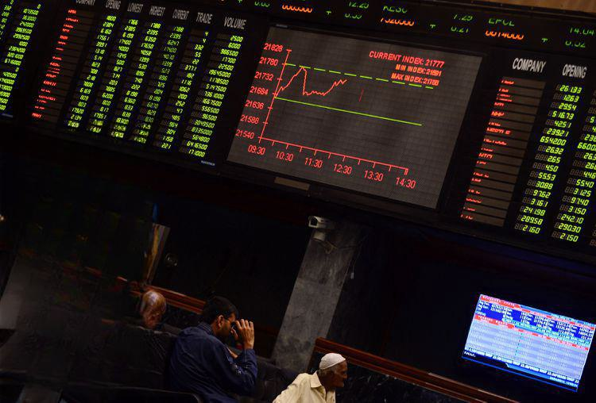

In the intricate world of financial investments, understanding the diverse instruments available is key to making informed decisions. Among these instruments, warrants stand out due to their unique characteristics and potential impact on investment strategies. At the heart of understanding warrants is the concept of the warrant premium, a critical yet often-overlooked aspect that carries significant implications for investors.

A warrant premium represents the difference between the current market price of a warrant and its intrinsic value. This concept is foundational in evaluating how much an investor is paying over the intrinsic value for the time and inherent volatility until expiry. Although closely related to other derivatives like options, warrants exhibit distinct features in terms of duration and issuer, which influence their pricing and investment potential.



The role of warrant premiums extends to various aspects of financial calculations. They act as indicators of market sentiment and potential stock performance, providing insight into investor expectations and risk appetite. Understanding the mathematical basis of warrant premiums allows investors to leverage this information for better financial modeling and strategic planning.

This article will explore the nuances of warrant premiums through examples from algorithmic trading. Algorithmic trading has revolutionized the investment landscape by employing sophisticated algorithms to analyze and execute trades based on extensive data analysis, where the role of warrant premiums is integral in optimizing trading strategies.

By the end of this exploration, readers will gain greater insight into how warrant premiums can be leveraged for financial benefit. From enhancing investment outcomes to achieving financial goals, the comprehension of warrant premiums opens new avenues for investment opportunities and risk management.

## Table of Contents

## What is a Warrant Premium?

A warrant premium represents the difference between the market price of a warrant and its intrinsic value. Warrants are financial derivatives that grant the holder the right, but not the obligation, to purchase the underlying stock at a predetermined price, known as the exercise price or strike price, before a specific expiration date. These instruments are often embedded in corporate financial strategies to raise capital or as incentives in employee compensation packages.

To understand a warrant premium, it is vital to comprehend its two main components: the intrinsic value and the time value. The intrinsic value is the difference between the asset's current market price and the warrant’s exercise price. Mathematically, it can be expressed as:

$$
\text{Intrinsic Value} = \max(0, \text{Current Stock Price} - \text{Exercise Price})
$$

A warrant is said to have intrinsic value only if it is "in-the-money," meaning the current stock price is above the exercise price. If the stock price is below the exercise price, the warrant’s intrinsic value is zero.

The warrant premium, therefore, is the market price of the warrant minus its intrinsic value:

$$
\text{Warrant Premium} = \text{Market Price of Warrant} - \text{Intrinsic Value}
$$

This premium considers the additional compensation investors require to bear the potential [volatility](/wiki/volatility-trading-strategies) and remaining time until expiration. Factors influencing the warrant premium include the underlying stock's price volatility, interest rates, time until expiration, and dividend payments on the underlying stock, as these affect the potential for the stock price to climb above the exercise price.

Comparing warrant premiums to other instruments like options reveals some unique attributes. Both warrants and options provide rights without obligations, but they differ in issuance and market dynamics. Warrants are typically issued by the company, and their exercise leads to the creation of new shares, potentially diluting existing share ownership. In contrast, options are standardized contracts traded on exchanges and do not alter the company’s share structure upon exercise.

The warrant premium is also influenced by its time value, which diminishes as the expiration date nears, akin to the time decay characteristic of options. However, warrants often have longer maturities compared to options, providing a different risk and reward profile that must be considered when making investment decisions.

Grasping the relationship between intrinsic value, exercise price, and warrant premium is essential for investors. This knowledge allows for better appraisal of investment opportunities, balancing potential returns against associated risks. Understanding these concepts provides the foundation for making informed investment choices and effectively leveraging financial derivatives as part of a broader investment strategy.

## The Role of Warrant Premiums in Financial Calculations

Warrant premiums are crucial elements in financial assessments, providing insights into market sentiment and the potential performance of underlying stocks. By understanding how warrant premiums are calculated, investors and analysts can better evaluate stock prospects and develop informed investment strategies.

To comprehend warrant premiums, it is essential to start with the foundational equation for calculating the premium:

$$
\text{Warrant Premium} = \text{Price of Warrant} - \text{Intrinsic Value}
$$

The intrinsic value of a warrant is derived from its intrinsic worth at the current stock price minus the exercise price:

$$
\text{Intrinsic Value} = \max(0, \text{Current Stock Price} - \text{Exercise Price})
$$

The warrant premium thus reflects the amount investors are willing to pay above this intrinsic value, fundamentally indicating market expectations about the future price appreciation of the underlying stock.

In financial calculations, the intrinsic and time values of a warrant are often considered. The time value represents the additional amount over its intrinsic value that investors are willing to pay due to the time left until the warrant's expiration. This component is closely associated with the volatility of the underlying stock, interest rates, and the time until expiration.

One practical application of warrant premiums in financial modeling involves using mathematical models that incorporate market data inputs to assess fair value. Models such as Black-Scholes, traditionally used for option pricing, can be adapted to include warrant-specific adjustments. These models calculate theoretical prices, helping identify mispriced warrants in the market.

Furthermore, analysts employ warrant premiums to speculate on market movements. An inflated premium might suggest potential stock upticks, as it shows high market confidence. Conversely, a shrinking premium may indicate skepticism about future growth. Therefore, warrant premiums offer a quantitative measure for predicting stock trajectories, aiding financial forecasting and strategic investment planning.

To enhance these calculations, programming languages like Python can be utilized to automate and refine the analysis. Python's financial libraries enable precise modeling and simulation of warrant pricing dynamics, allowing for real-time data application. Below is a basic Python script illustrating how one might calculate a simple warrant premium:

```python
def calculate_warrant_premium(warrant_price, stock_price, exercise_price):
    intrinsic_value = max(0, stock_price - exercise_price)
    warrant_premium = warrant_price - intrinsic_value
    return warrant_premium

# Example values
warrant_price = 15
stock_price = 50
exercise_price = 40

premium = calculate_warrant_premium(warrant_price, stock_price, exercise_price)
print(f"The warrant premium is ${premium}")
```

By mastering the calculation and interpretation of warrant premiums, financial professionals can substantially improve their investment analysis and decision-making processes. This understanding plays a pivotal role in crafting robust and dynamic strategies to navigate and capitalize on financial markets.

## Investing Examples Using Warrant Premiums

Incorporating warrant premiums into investment strategies can significantly influence market outcomes and investor gains. This section provides practical examples and case studies highlighting the impact of warrant issuance on company stocks and investor strategies.

One notable example is Tesla Inc.’s issuance of warrants during [capital raising](/wiki/hedge-fund-capital-raising) efforts. In 2014, Tesla issued convertible warrants to raise funds, which impacted market dynamics and attracted investor interest. Here, the warrant premium represented the additional value investors were willing to pay, over and above the intrinsic value, to secure the option of converting these warrants into equity. Investors evaluated factors like Tesla’s growth prospects and market conditions to determine the warrant premium's potential profitability.

Such case studies illustrate that when a company issues warrants, the market's perception often reflects in the warrant premium. Analyzing these premiums provides insights into the company's future outlook, market volatility, and demand dynamics. Smart investors monitored the warrant premium movements, adjusted their portfolios accordingly, and capitalized on the perceived undervaluation or overvaluation in the market.

Another example is the strategic use of warrant premiums in the biotechnology sector, known for high volatility and speculative growth. Companies like Amgen have issued warrants as part of financing packages, where the high warrant premiums were justified by speculative investor sentiments predicting significant future growth. Here, discerning investors analyzed the warrants' pricing in relation to the expected future earnings of such companies, factoring in pipeline products and potential FDA approvals.

To evaluate and capitalize on warrant premiums, investors often employ financial models to simulate potential outcomes. They might use this Python code to calculate the warrant premium:

```python
def calculate_warrant_premium(warrant_price, intrinsic_value):
    return warrant_price - intrinsic_value

# Example values
warrant_price = 15.0  # Current market price of the warrant
intrinsic_value = 10.0  # Intrinsic value of the warrant

premium = calculate_warrant_premium(warrant_price, intrinsic_value)
print("Warrant Premium:", premium)
```

By assessing real-world data through case studies like these, investors gain insights into recognizing lucrative opportunities when warrant premiums indicate potential undervaluation or predictable growth. This practical understanding, derived from systematic monitoring and evaluation of warrant movements, enables investors to apply theoretical knowledge accurately and adapt strategies to evolving market conditions. Through careful analysis and strategic positioning, leveraging warrant premiums can substantially enhance investment outcomes in complex financial landscapes.

## Algorithmic Trading and Warrant Premiums

Algorithmic trading has become a significant force in financial markets, using complex algorithms to execute trades at speeds and frequencies that are beyond the reach of human traders. Within this domain, warrant premiums are increasingly recognized as valuable inputs that can influence trading strategies. 

Warrant premiums, the difference between the warrant's price and its intrinsic value, provide insights into market sentiment and the underlying stock's potential performance. Incorporating warrant premiums into [algorithmic trading](/wiki/algorithmic-trading) strategies can enhance decision-making by providing an additional layer of analysis.

To effectively integrate warrant premiums, algorithmic traders often utilize mathematical models that forecast future price movements and identify [arbitrage](/wiki/arbitrage) opportunities. Commonly, the Black-Scholes model—traditionally used for options pricing—can be adapted for warrants due to their similar characteristics. This model involves inputs such as the current price of the underlying stock, the exercise price of the warrant, the time to expiration, and market volatility. The formula is expressed as:

$$
C = S_0 \cdot N(d_1) - X \cdot e^{-rT} \cdot N(d_2)
$$

where:
- $C$ is the theoretical call price (which can be adapted to calculate warrant premiums),
- $S_0$ is the current price of the underlying stock,
- $X$ is the exercise price of the warrant,
- $T$ is the time to expiration,
- $N(d)$ is the cumulative distribution function of the standard normal distribution,
- $r$ is the risk-free interest rate.

Adaptations of this model for warrant pricing involve adjustments for potential dilution and specific terms of warrants that differ from standard options.

Another model, the Binomial Option Pricing Model, serves as a versatile tool for pricing warrants. It works by iterating possible price movements of the underlying stock over discrete time intervals until the expiration date. This model is particularly useful in scenarios where the underlying assumptions of the Black-Scholes model—such as constant volatility—do not hold. The Binomial model's flexibility makes it suitable for complex scenarios involving various market conditions.

Algorithmic trading systems can implement these models in trading strategies to determine optimal entry and [exit](/wiki/exit-strategy) points, leveraging warrant premiums to predict market trends. For example, a Python script might use quantitative libraries like NumPy and SciPy to automate such calculations:

```python
import numpy as np
from scipy.stats import norm

def black_scholes_warrant_premium(S, X, T, r, sigma):
    d1 = (np.log(S/X) + (r + sigma**2 / 2) * T) / (sigma * np.sqrt(T))
    d2 = d1 - sigma * np.sqrt(T)
    premium = S * norm.cdf(d1) - X * np.exp(-r * T) * norm.cdf(d2)
    return premium

# Example usage
current_stock_price = 100
exercise_price = 95
time_to_expiration = 1  # in years
risk_free_rate = 0.05
volatility = 0.2

warrant_premium = black_scholes_warrant_premium(current_stock_price, exercise_price, time_to_expiration, risk_free_rate, volatility)
print(f"Warrant Premium: {warrant_premium}")
```

By embedding such calculations into their trading algorithms, investors gain a competitive edge, enhancing their ability to navigate complex market environments. The inclusion of warrant premiums in algorithmic trading underscores the dynamic interaction between technology and financial analysis, advancing how investors capitalize on market opportunities.

## Warrants vs. Options: A Comparative Analysis

Warrants and options are financial derivatives that provide holders with the right, but not the obligation, to purchase a company's stock at a predetermined price within a specified time frame. Despite their similar functionalities, they exhibit several distinct characteristics that hold significant implications for investors.

### Comparison of Warrant Premiums and Option Premiums

The premium for both warrants and options is essentially the cost of holding this right. However, the factors influencing these premiums can vary. The warrant premium generally reflects the difference between the trading price of the warrant and its intrinsic value, defined as the excess of the stock's current market price over the exercise price. Option premiums, on the other hand, are influenced by the same intrinsic value calculations but also significantly by factors like implied volatility and the time value, explained in the Black-Scholes model.

### Differences in Expiration

A key distinction between warrants and options is their expiration dates. Options typically have shorter expiration periods ranging from a few weeks to a couple of years. In contrast, warrants often have longer expiration periods, sometimes up to 15 years. This extended timeline with warrants allows investors a longer duration to capitalize on potential stock price increases, which can be particularly beneficial in a market exhibiting long-term growth trends.

### Impact of Dilution

Another crucial difference lies in the potential for dilution. When warrants are exercised, the issuing company creates new shares, thereby diluting existing shareholders' equity. This is a significant consideration for investors holding common shares. Options, usually traded on exchanges, do not inherently cause dilution upon exercise since they are generally settled in the open market rather than by issuing new shares.

### Market Dynamics

Market dynamics for warrants and options also diverge. Options are standardized contracts typically traded on regulated exchanges, promoting [liquidity](/wiki/liquidity-risk-premium) and transparency. Warrants, however, are often issued by the respective companies and traded over the counter or on less formalized platforms, which can lead to less liquidity and greater price volatility. This context must be understood when making investment decisions, as the liquidity of an asset can significantly impact trade execution prices and strategy outcomes.

### Strategy and Risk Assessment

Understanding these differences is fundamental for diversified investment and risk management strategies. The longer expiration time and potential for dilution in warrants might appeal to those with a longer-term investment horizon and a careful assessment of company fundamentals. Options, with their greater liquidity and absence of dilution, might be favored for short-term strategies and hedging purposes.

Conclusively, both warrants and options offer investors opportunities to leverage future price movements, but each with its own set of characteristics that influence investment strategy and risk assessment. These differences underscore the importance of a well-rounded understanding of financial instruments to optimize portfolio diversification and achieve tailored financial goals.

## Conclusion

Understanding warrant premiums opens new avenues for both investment opportunities and risk management. Throughout this article, we highlighted how warrant premiums play an essential role in shaping investment strategies and algorithmic trading. Mastery of warrant premiums equips investors with the ability to better navigate the complexities inherent in financial markets. By incorporating practical insights and examples, we aimed to bolster the confidence of investors in effectively utilizing warrant premiums to their advantage. 

In essence, warrant premiums are not merely theoretical constructs; they offer tangible benefits. Investors who comprehend and apply the principles associated with warrant premiums can enhance their investment outcomes, ultimately moving closer to achieving their financial goals. Whether through strategic investment in individual warrants or integrating warrant premiums into algorithmic models, the understanding of this concept translates into a valuable tool for optimizing returns and mitigating risks.

## References & Further Reading

[1]: Hull, J. C. (2012). ["Options, Futures, and Other Derivatives."](https://www.semanticscholar.org/paper/Options%2C-Futures%2C-and-Other-Derivatives-Hull/89bdee500c8623864fc9eb7a471546aa713acc44) 9th Edition. Pearson.

[2]: Chance, D. M., & Brooks, R. (2015). ["An Introduction to Derivatives and Risk Management."](https://books.google.com/books/about/Introduction_to_Derivatives_and_Risk_Man.html?id=b8PgBQAAQBAJ) 10th Edition. Cengage Learning.

[3]: Gastineau, G. L. (2001). ["The Basics of Warrants and Convertible Securities."](https://www.semanticscholar.org/paper/Exchange-Traded-Funds-Gastineau/3340ee27c6e512591fdbf2f4b481e0d0eaec6eff) The Research Foundation of CFA Institute.

[4]: Black, F., & Scholes, M. (1973). ["The Pricing of Options and Corporate Liabilities."](https://www.cs.princeton.edu/courses/archive/fall09/cos323/papers/black_scholes73.pdf) Journal of Political Economy, 81(3), 637-654.

[5]: Choudhry, M. (2010). ["An Introduction to Bond Markets."](https://onlinelibrary.wiley.com/doi/book/10.1002/9781118371961) 4th Edition. Wiley. 

[6]: Kenyon, C., & Stamm, R. (2012). ["The Quantitative Analyst's Workbench."](https://www.amazon.com/Discounting-LIBOR-CVA-Funding-Quantitative/dp/1137268514) Pearson.

[7]: Jorion, P. (2006). ["Value at Risk: The New Benchmark for Managing Financial Risk."](https://link.springer.com/article/10.1007/s11408-007-0057-3) 3rd Edition. McGraw-Hill Education.