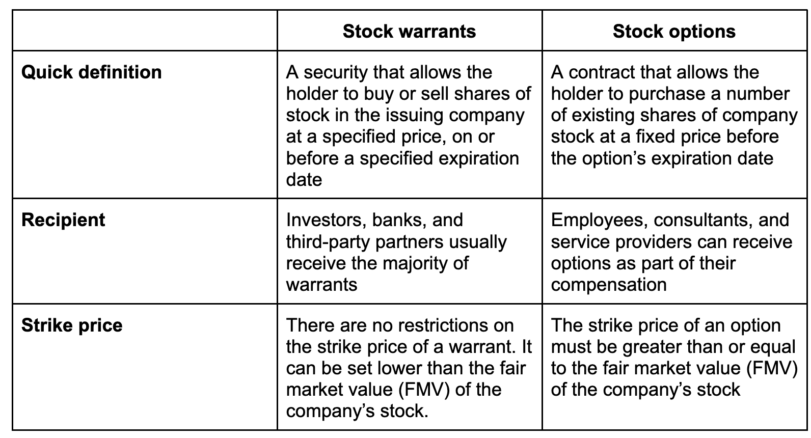

## Table of Contents

## What is a warrant in the context of finance?

A warrant in finance is like a special ticket that gives you the right to buy a company's stock at a certain price before a specific date. It's not the same as actually owning the stock, but it's a promise that you can buy it if you want to. People might get these warrants when they buy bonds or as part of other financial deals. The price at which you can buy the stock is called the exercise price, and the date by which you have to use the warrant is called the expiration date.

Warrants can be useful because they can make your investment grow faster. If the stock's price goes up a lot, you can buy it at the lower exercise price and then sell it at the higher market price, making a profit. But, if the stock's price doesn't go up enough before the expiration date, the warrant might not be worth using. It's a bit like a bet on the stock going up, and it can add excitement and potential reward to your investment, but it also comes with risks.

## How does a call option work?

A call option is like a special agreement that lets you buy a stock at a set price, called the strike price, before a certain date, known as the expiration date. You don't have to buy the stock if you don't want to, but having the option can be useful. You pay a fee, called the premium, to get this option. It's a bit like buying a ticket that gives you the chance to buy something later at today's price.

If the stock's price goes up a lot before the expiration date, you can use your call option to buy the stock at the lower strike price and then sell it at the higher market price, making a profit. But if the stock's price doesn't go up enough, or even goes down, you might decide not to use your option. In that case, you would lose the premium you paid for the option, but you wouldn't lose any more money. Call options can be exciting because they offer a chance for big gains, but they also come with the risk of losing the premium if things don't go as planned.

## What are the key differences between warrants and call options?

Warrants and call options both give you the right to buy a stock at a set price before a certain date, but they come from different places. Warrants are usually given out by the company that issues the stock. They might come with bonds or other financial products as a way to make them more attractive. On the other hand, call options are created by investors and traded on options markets. This means that when you buy a call option, you're dealing with another investor, not the company itself.

Another big difference is how long they last. Warrants often have longer expiration dates, sometimes lasting several years. This gives you more time to decide if you want to use them. Call options, however, usually expire much sooner, often within a few months. This shorter time frame can make call options riskier because you have less time for the stock price to go up. Also, when you use a warrant, the company issues new shares, which can dilute the value of existing shares. With call options, you're buying existing shares from another investor, so there's no dilution.

## Who typically issues warrants and why?

Companies usually issue warrants. They do this to make their other financial products, like bonds, more attractive to investors. When a company wants to raise money, it might offer bonds. But to make those bonds more appealing, the company might throw in some warrants as a bonus. This means that if you buy the bond, you also get the chance to buy the company's stock at a set price later on. It's like getting a little extra something for your investment.

The main reason companies issue warrants is to sweeten the deal for investors. By adding warrants, the company can offer bonds with lower interest rates because the warrants make the overall package more valuable. This helps the company save money on interest payments. Plus, if investors use their warrants to buy more stock, the company gets more money. It's a way for the company to raise more funds without having to pay high interest rates on their bonds.

## What are the common uses of call options for investors?

Investors use call options to make money when they think a stock's price will go up. They buy a call option, which gives them the right to buy the stock at a set price, called the strike price, before a certain date. If the stock's price goes up a lot, they can use their option to buy the stock at the lower strike price and then sell it at the higher market price, making a profit. This can be a way to make more money than just owning the stock itself, especially if the stock's price goes up quickly.

Call options can also be used to protect other investments. If an investor owns a stock and is worried that its price might go down, they can buy a call option on that stock. This way, if the stock's price does drop, they can still buy more of it at the lower strike price if they want to. It's like having insurance on their investment. But if the stock's price stays the same or goes up, they can just let the option expire and only lose the small amount they paid for it.

## How do the expiration dates of warrants compare to those of call options?

Warrants usually have longer expiration dates than call options. While a call option might expire in a few months, a warrant can last for several years. This gives investors more time to decide if they want to use their warrant to buy the stock at the set price.

The longer expiration period of warrants can be a big advantage. It means investors have more time for the stock's price to go up enough to make using the warrant worthwhile. On the other hand, call options with their shorter expiration dates can be riskier because there's less time for the stock's price to move in the right direction.

## What are the tax implications of exercising warrants versus call options?

When you exercise a warrant, you usually have to pay taxes on any profit you make. The profit is the difference between the stock's market price and the price you paid for it using the warrant. This profit is often treated as capital gain, which can be taxed at a lower rate than regular income if you hold the stock for more than a year. But if you sell the stock right after exercising the warrant, it might be considered a short-term capital gain and taxed at your regular income tax rate.

For call options, the tax situation can be a bit different. If you buy a call option and then exercise it to buy the stock, you'll have to pay taxes on any profit you make when you sell the stock. The profit from selling the stock is treated as a capital gain, just like with warrants. But if you sell the call option itself before it expires, any profit you make from that sale is also taxed as a capital gain. The tax rate depends on how long you held the option before selling it. If you held it for more than a year, it's a long-term capital gain, which is taxed at a lower rate. If you held it for less than a year, it's a short-term capital gain, taxed at your regular income tax rate.

## How does the pricing of warrants differ from the pricing of call options?

The pricing of warrants and call options is different because they come from different places and have different features. Warrants are issued by the company itself, and their price depends on things like the stock's current price, the exercise price of the warrant, how long it lasts, and how much the stock's price might move around. Because warrants can last for a long time, sometimes several years, their price can be higher than a call option's price. Also, when you use a warrant, the company makes new shares, which can affect the stock's price and the warrant's value.

Call options, on the other hand, are created by investors and traded on options markets. Their price is based on similar things like the stock's current price, the strike price, how long the option lasts, and how much the stock's price might change. But call options usually don't last as long as warrants, often expiring in just a few months. This shorter time frame can make call options cheaper than warrants. Also, because call options involve buying existing shares from another investor, their pricing doesn't have to account for the potential dilution of the stock's value that can happen with warrants.

## What are the risks associated with investing in warrants?

Investing in warrants can be risky because they might not be worth anything if the stock's price doesn't go up enough before the warrant expires. If the stock's price stays the same or goes down, you might lose the money you paid for the warrant. Also, because warrants can last for a long time, there's a lot of time for things to go wrong. The company might not do well, or the stock market might have a big drop, making the warrant less valuable or even worthless.

Another risk is that when you use a warrant to buy stock, the company makes new shares. This can make the value of the existing shares go down because there are more shares now. This is called dilution, and it can hurt the price of the stock and the value of your warrant. So, even if the stock's price goes up, the new shares might bring the price back down, making your warrant less profitable than you hoped.

## Can you explain the concept of leverage in relation to call options?

Leverage in call options is like using a small amount of money to control a much bigger investment. When you buy a call option, you pay a small fee called the premium. This premium gives you the right to buy a stock at a set price, even if the stock's price goes way up. So, if the stock's price does go up a lot, you can make a big profit compared to the small amount you paid for the option. It's like using a lever to lift a heavy object with less effort; the option lets you control a big investment with just a little money.

But leverage can also make things riskier. If the stock's price doesn't go up enough or even goes down, you might lose the money you paid for the option. Since you're using a small amount of money to bet on a big move, any small change in the stock's price can have a big effect on whether you make or lose money. So, while leverage can help you make more money if things go well, it can also lead to bigger losses if they don't.

## How do market conditions affect the value of warrants and call options?

Market conditions can really change how much warrants and call options are worth. If the stock market is doing well and stock prices are going up, both warrants and call options can become more valuable. This is because they give you the right to buy a stock at a set price, and if the stock's price goes up a lot, you can make a big profit. But if the market is not doing well and stock prices are going down, the value of warrants and call options can drop. This is because it's less likely that the stock's price will go up enough to make using the warrant or option worthwhile.

Another thing that affects the value of warrants and call options is how much the stock's price might move around. If the stock's price is expected to change a lot, either up or down, the value of the warrant or option can go up. This is because there's a bigger chance that the stock's price will go above the set price you need to use the warrant or option. But if the stock's price is expected to stay pretty steady, the value of the warrant or option might not be as high, because there's less chance of a big move in the stock's price.

## What advanced strategies can be employed using warrants and call options together?

One advanced strategy that investors can use with warrants and call options is called a "covered warrant strategy." In this strategy, an investor who already owns a stock might buy a warrant to buy more of the same stock at a set price. At the same time, they can sell a call option on the stock they already own. This way, they can make money from the premium of the call option they sold, and if the stock's price goes up, they can use the warrant to buy more stock at a lower price. It's like having a safety net while also trying to make more money.

Another strategy is called a "synthetic long position." Here, an investor might buy a warrant and a call option on the same stock at the same time. The idea is to use the warrant to buy the stock at a lower price if it goes up, and use the call option to make even more money if the stock's price goes up a lot. This can be a way to bet big on the stock going up, but it's also riskier because if the stock's price doesn't go up enough, the investor could lose money on both the warrant and the call option. It's like trying to win big, but knowing that you might lose more if things don't go as planned.

## References & Further Reading

[1]: ["Options, Futures, and Other Derivatives"](https://www.amazon.com/Options-Futures-Other-Derivatives-10th/dp/013447208X) by John C. Hull

[2]: ["Warrants and Other Derivatives: A Practical Guide to Investment"](https://www.supermoney.com/encyclopedia/derivative-warrants) by Wolfgang K. Seiler

[3]: ["Algorithmic Trading: Winning Strategies and Their Rationale"](https://www.amazon.com/Algorithmic-Trading-Winning-Strategies-Rationale-ebook/dp/B00CY5HC0U) by Ernest P. Chan

[4]: Carr, P., & Madan, D. (1999). ["Option Valuation Using the Fast Fourier Transform."](https://engineering.nyu.edu/sites/default/files/2018-08/CarrMadan2_0.pdf) Journal of Computational Finance.

[5]: Tsay, R. S. (2010). ["Analysis of Financial Time Series"](https://onlinelibrary.wiley.com/doi/book/10.1002/9780470644560) by Ruey S. Tsay