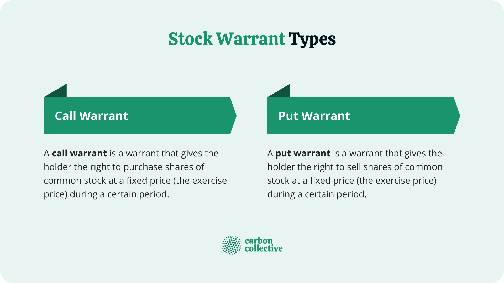

## Table of Contents

## What are warrants and how do they function as investment tools?

Warrants are financial instruments that give the holder the right, but not the obligation, to buy a specific stock at a set price before a certain date. They are similar to options but are issued by the company itself rather than a third party. When you buy a warrant, you're essentially betting that the stock's price will go up. If it does, you can use the warrant to buy the stock at the lower, set price and then sell it at the higher market price, making a profit.

Warrants can be a good investment tool because they can offer high returns if the stock price increases significantly. However, they also come with risks. If the stock price doesn't go up or even goes down, the warrant could become worthless, and you would lose the money you paid for it. Because of this, warrants are often used by investors who are willing to take on more risk in hopes of getting higher rewards.

## How do warrants differ from options?

Warrants and options are similar because they both give you the right to buy a stock at a certain price before a certain time. But they are different in some important ways. Warrants are issued by the company that the stock comes from. This means the company gets money when someone buys a warrant. Options, on the other hand, are created by other investors and traded on an exchange. The company doesn't get any money when options are bought and sold.

Another difference is how long they last. Warrants usually last longer than options. Options often expire in a few months, while warrants can last for several years. This gives you more time to decide if you want to use the warrant to buy the stock. Also, when you use a warrant to buy a stock, it can increase the number of shares the company has. Using an option doesn't change the number of shares because the shares are already out there.

In summary, while both warrants and options can be used to bet on a stock's price going up, they work differently. Warrants are issued by the company and can last longer, and they can increase the number of shares. Options are traded between investors, usually don't last as long, and don't change the number of shares.

## What are the types of warrants available to investors?

There are two main types of warrants that investors can buy: traditional warrants and covered warrants. Traditional warrants are issued directly by the company that the stock comes from. When you buy a traditional warrant, you're giving money to the company, and in return, you get the right to buy their stock at a set price before a certain date. These are often used by companies to raise money without immediately issuing new shares.

Covered warrants, on the other hand, are issued by financial institutions, not the company itself. These are more like options because they are created by a third party. When you buy a covered warrant, you're betting that the stock's price will go up, and if it does, you can make money by buying the stock at the lower price set by the warrant and then selling it at the higher market price. Covered warrants can be a bit riskier but also offer the potential for higher returns.

## What are the potential benefits of investing in warrants?

Investing in warrants can offer big rewards if the stock price goes up a lot. When you buy a warrant, you're betting that the stock will be worth more in the future. If you're right, you can use the warrant to buy the stock at a lower price and then sell it at the higher market price. This can lead to big profits, especially since warrants usually cost less than buying the stock outright. So, you can control a lot of stock for less money, which can make your investment grow faster.

Another benefit is that warrants give you more time to decide what to do. They often last longer than options, sometimes for several years. This means you can wait and see how the stock does before you have to make a move. If the stock price goes up, you can use the warrant to buy it. If it doesn't, you can just let the warrant expire without losing much money. This extra time can be a big help if you're not sure about the stock's future.

## What are the risks associated with investing in warrants?

Investing in warrants can be risky because they can lose all their value if the stock price doesn't go up. If the stock price stays the same or goes down, the warrant might become worthless. This means you could lose all the money you spent on the warrant. Because of this, warrants are often seen as a high-risk investment. They're best for people who are okay with taking big risks and who understand that they might lose their money.

Another risk is that warrants can be hard to understand and trade. They're not as common as stocks or options, so there might not be a lot of people buying and selling them. This can make it hard to sell your warrant if you need to. Also, the rules about how warrants work can be complicated. If you don't fully understand how they work, you might make a mistake and lose money. So, it's important to do a lot of research and maybe talk to a financial advisor before you start investing in warrants.

## How can warrants be used to leverage an investment portfolio?

Warrants can be a powerful tool to leverage an investment portfolio because they let you control a lot of stock for less money. When you buy a warrant, you're not buying the stock itself, but the right to buy it later at a set price. This means you can use less money to bet on a stock's price going up. If the stock price does go up a lot, you can use the warrant to buy the stock at the lower price and then sell it at the higher market price. This can lead to big profits compared to how much you spent on the warrant.

However, using warrants to leverage your portfolio also comes with big risks. If the stock price doesn't go up or even goes down, the warrant could become worthless, and you would lose the money you paid for it. This makes warrants a high-risk investment. They're best for people who are okay with taking big risks and who understand that they might lose their money. So, while warrants can help you make more money if things go well, they can also lead to big losses if they don't.

## What should beginners know before investing in warrants?

Before beginners start investing in warrants, they should know that warrants are a high-risk investment. Warrants give you the right to buy a stock at a set price before a certain date. If the stock price goes up a lot, you can make a big profit. But if the stock price stays the same or goes down, the warrant can become worthless, and you could lose all the money you spent on it. So, it's important to be ready to lose the money you invest in warrants.

Beginners should also understand that warrants can be hard to buy and sell. They're not as common as stocks or options, so there might not be many people trading them. This can make it hard to sell your warrant if you need to. Also, the rules about how warrants work can be complicated. If you don't fully understand how they work, you might make a mistake and lose money. So, it's a good idea to do a lot of research and maybe talk to a financial advisor before you start investing in warrants.

## How do you evaluate the value of a warrant?

To evaluate the value of a warrant, you need to look at a few things. First, you should check the current price of the stock that the warrant is for. If the stock price is higher than the price set in the warrant, the warrant is worth something. If the stock price is lower, the warrant might not be worth much. You also need to think about how long you have until the warrant expires. The more time you have, the more valuable the warrant can be because you have more time for the stock price to go up.

Another thing to consider is how much the stock price might change. If the stock is likely to go up a lot, the warrant could be worth more. You can use a special formula called the Black-Scholes model to help figure out the value of a warrant. This formula looks at the stock price, the price set in the warrant, how long until it expires, and how much the stock price might change. It can give you a good idea of what the warrant is worth, but it's not perfect. So, it's important to do your own research and maybe talk to a financial advisor before you decide to buy a warrant.

## What are some strategies for trading warrants?

One strategy for trading warrants is to buy them when you think the stock price will go up a lot. If you're right, you can use the warrant to buy the stock at a lower price and then sell it at the higher market price. This can lead to big profits, especially since warrants usually cost less than buying the stock outright. But you need to be careful because if the stock price doesn't go up, the warrant could become worthless, and you would lose the money you paid for it. So, it's important to do a lot of research on the stock before you buy the warrant.

Another strategy is to use warrants to make your investment portfolio grow faster. Since warrants let you control a lot of stock for less money, you can use them to bet on a stock's price going up without spending a lot. If the stock price does go up, you can make a big profit compared to how much you spent on the warrant. But remember, this is a high-risk strategy. If the stock price doesn't go up or goes down, you could lose all the money you spent on the warrant. So, it's best for people who are okay with taking big risks and who understand that they might lose their money.

A third strategy is to sell warrants that you already own. If you think the stock price won't go up much or will go down, you can sell the warrant before it expires and maybe make some money back. This can help you cut your losses if you think the warrant will become worthless. But it's important to watch the stock price and the time until the warrant expires. If you wait too long, you might not be able to sell the warrant at a good price. So, it's a good idea to keep an eye on the stock and be ready to act quickly if needed.

## How do tax implications affect warrant investments?

When you invest in warrants, you need to think about taxes. If you make money from a warrant, you have to pay taxes on that money. The tax you pay depends on how long you held the warrant before you sold it or used it to buy the stock. If you held it for less than a year, the profit is taxed as regular income. If you held it for more than a year, the profit is taxed at a lower rate, called the long-term capital gains rate. This can make a big difference in how much tax you have to pay.

Another thing to know is that if you lose money on a warrant, you might be able to use that loss to lower your taxes. If you sell a warrant for less than you paid for it, you can use that loss to reduce the taxes you owe on other investments. This is called tax loss harvesting. But the rules about how to do this can be complicated, so it's a good idea to talk to a tax advisor to make sure you're doing it right.

## What role do warrants play in corporate finance and how might this impact their value?

In corporate finance, companies use warrants to raise money without immediately issuing new shares. When a company issues a warrant, it gets money from investors who buy the warrant. This money can help the company grow or pay off debts. The company doesn't have to give out new shares right away, which can be good because it doesn't dilute the value of the existing shares. But if the warrant holders decide to use their warrants to buy stock, the company will issue new shares, which can dilute the value of the existing shares.

The value of a warrant can be affected by how the company uses the money it raises. If the company uses the money well and grows, the stock price might go up. This would make the warrant more valuable because the warrant holder can buy the stock at a lower price and then sell it at the higher market price. But if the company doesn't use the money well and the stock price goes down, the warrant could become worthless. So, the value of a warrant depends a lot on what the company does with the money it raises and how that affects the stock price.

## How can advanced investors use warrants in complex investment strategies?

Advanced investors can use warrants to make their investment strategies more complex and potentially more profitable. One way they do this is by combining warrants with other investments, like stocks or options, to create a mix that can help them make money no matter which way the stock price goes. For example, they might buy a warrant and also buy a put option on the same stock. If the stock price goes up, they can use the warrant to buy the stock at a lower price and make a profit. If the stock price goes down, they can use the put option to sell the stock at a higher price and make money that way. This kind of strategy can help them manage risk and make money in different situations.

Another way advanced investors use warrants is to take advantage of big changes in the stock market. They might buy a lot of warrants on a stock they think will go up a lot because of a new product or a merger. If they're right, the stock price could go up a lot, and the warrants could become very valuable. They can then sell the warrants for a big profit or use them to buy the stock at a lower price and sell it at the higher market price. But this is a high-risk strategy because if the stock price doesn't go up, the warrants could become worthless, and they could lose a lot of money. So, it's important for advanced investors to do a lot of research and understand the risks before they use warrants in their strategies.

## References & Further Reading

[1]: Bergstra, J., Bardenet, R., Bengio, Y., & Kégl, B. (2011). ["Algorithms for Hyper-Parameter Optimization."](https://papers.nips.cc/paper/4443-algorithms-for-hyper-parameter-optimization) Advances in Neural Information Processing Systems 24.

[2]: ["Advances in Financial Machine Learning"](https://www.amazon.com/Advances-Financial-Machine-Learning-Marcos/dp/1119482089) by Marcos Lopez de Prado

[3]: ["Evidence-Based Technical Analysis: Applying the Scientific Method and Statistical Inference to Trading Signals"](https://www.amazon.com/Evidence-Based-Technical-Analysis-Scientific-Statistical/dp/0470008741) by David Aronson

[4]: ["Machine Learning for Algorithmic Trading"](https://github.com/PacktPublishing/Machine-Learning-for-Algorithmic-Trading-Second-Edition) by Stefan Jansen

[5]: ["Quantitative Trading: How to Build Your Own Algorithmic Trading Business"](https://www.amazon.com/Quantitative-Trading-Build-Algorithmic-Business/dp/1119800064) by Ernest P. Chan