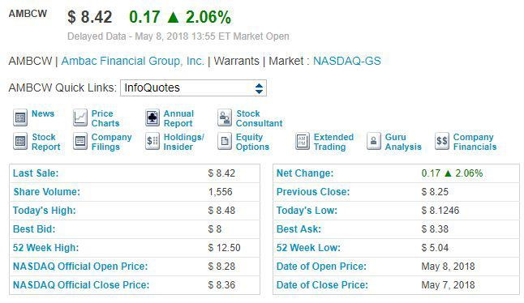

Modern investment strategies have evolved significantly, driven by technological advancements and the increasing complexity of financial markets. These strategies range from traditional buy-and-hold approaches to more sophisticated techniques involving derivatives and algorithmic trading. As investors seek higher returns, the integration of complex financial instruments and technology has become essential.

Warrants are a prominent instrument in high-return investment strategies. A warrant is a derivative security that gives the holder the right, but not the obligation, to buy or sell a security—typically equities—at a specific price before expiration. Distinct from options, warrants are often issued by the company whose securities they pertain to and typically have longer durations. Warrants can be attractive to investors due to their potential for significant leverage, allowing small initial outlays to control large positions in stocks. As a result, they offer potentially substantial returns, albeit accompanied by higher risk.



Algorithmic trading, another cornerstone of modern investment, is the use of computer algorithms to execute trades at speeds and frequencies beyond human capability. Algorithms analyze market conditions and execute trades based on pre-defined criteria, offering precision, speed, and the ability to process vast amounts of data. This technological approach is particularly beneficial in executing high-frequency trades and managing large portfolios.

Algorithmic trading can significantly enhance warrant investments. By using algorithms, investors can capitalize on market inefficiencies, optimize execution prices, and manage the complexities associated with warrants. The ability to process complex datasets and execute trades rapidly allows investors to react swiftly to market changes, enhancing the potential for high returns while managing risk.

This article will explore the relationship between warrants and algorithmic trading, explaining how the integration of these elements can maximize investment returns. The purpose of this article is to provide a comprehensive understanding of how modern investment strategies can be optimized through the combination of warrants and algorithmic trading, offering insights into setting up trading systems, managing risks, and navigating legal considerations for successful outcomes in this rapidly evolving landscape.

## Table of Contents

## Understanding Warrants

Warrants are financial instruments that provide the holder the right, but not the obligation, to purchase a security, typically a stock, at a specific price before a certain date. Unlike options, which are primarily traded on exchanges, warrants are usually issued by the company itself, often as a means to attract investors to bonds or preferred shares and can sometimes be traded over-the-counter. This distinction makes warrants particularly useful for companies seeking to raise capital without immediately issuing equity.

Key features of warrants include a longer-term expiry compared to options and a lower initial cost, making them an intriguing investment for those speculating on the future value of the issuing company's stock. One of the significant benefits of investing in warrants is their leverage potential; a small price change in the underlying stock can lead to a substantial fluctuation in the warrant's price. This leverage often attracts those looking for high-return opportunities, with the caveat being increased [volatility](/wiki/volatility-trading-strategies).

However, investing in warrants carries substantial risks. The primary risk is related to the expiration date; if the underlying stock does not exceed the exercise price, the warrant may expire worthless, leading to a complete loss of the invested capital. Additionally, warrants can suffer from limited [liquidity](/wiki/liquidity-risk-premium) and price transparency, which can introduce challenges in executing trades at favorable prices.

Historically, warrants have experienced varying performance metrics as an investment vehicle. During bullish market conditions or positive speculation about a particular issuing company's future, warrants have shown significant upside. However, during market downturns, their high volatility can result in substantial losses. The performance of warrants often correlates with overall equity market conditions and specific corporate events.

Market conditions that favor warrant investments typically include periods of high growth or positive market sentiment towards the issuing company, technological advancements within the industry, or anticipated strategic corporate movements such as mergers, acquisitions, or new product launches. These conditions can encourage speculation, thereby increasing demand and value for warrants.

In conclusion, while warrants offer a high-risk, high-reward proposition, they require careful consideration and an understanding of both the financial instrument itself and the broader market forces at play. Investors should weigh the potential for significant gains against the likelihood of total loss, ensuring alignment with their risk tolerance and investment strategy.

## The Role of Algorithmic Trading

Algorithmic trading, often referred to as algo trading, involves the use of computer programs to execute trades automatically based on pre-defined criteria and algorithms. This approach leverages complex mathematical models to analyze market data and execute trades at speeds significantly faster than human capabilities. It has revolutionized the trading landscape by enhancing precision, speed, and data analysis.

One of the primary benefits of using algorithms in trading is precision. Algorithms are designed to follow specific instructions and execute trades with a level of exactness that minimizes human error. This precision is crucial in markets where even the smallest price differences can result in significant profit or loss. Speed is another pivotal advantage; algorithms can process orders in milliseconds, allowing traders to take advantage of fleeting opportunities in the market.

Additionally, [algorithmic trading](/wiki/algorithmic-trading) excels in data analysis. Algorithms can analyze vast datasets in real-time to identify trends and opportunities that might be invisible to human traders. This capability is enhanced by the integration of big data and [machine learning](/wiki/machine-learning) technologies, which allow for more sophisticated data analysis and pattern recognition. Machine learning models can adapt to new data inputs, improving decision-making processes over time.

There are various types of algorithms used in trading, each designed for specific applications. Market-making algorithms, for example, aim to profit from the spread between buy and sell prices of securities. Trend-following algorithms identify and capitalize on sustained market movements, while [arbitrage](/wiki/arbitrage) algorithms exploit price discrepancies between different markets or instruments.

The incorporation of big data and machine learning in algorithmic trading has elevated its potential. Big data provides a wealth of information, from market trends to geopolitical events, feeding sophisticated models that predict market movements. Machine learning allows these models to evolve as they process new information, refining trading strategies automatically.

Examples of successful algo trading strategies are abundant. One popular strategy is [statistical arbitrage](/wiki/statistical-arbitrage), which involves complex mathematical models to predict price movements based on historical data and statistical correlations. Another is the pairs trading strategy, where traders find two securities with historically correlated price movements, betting that the prices will converge over time if they diverge.

The role of algorithmic trading is further expanding with technological advancements. As computation power increases and data becomes more accessible, algo trading strategies continue to evolve, offering improved accuracy and efficiency. These improvements have not only increased profitability for many traders but have also transformed how financial markets operate globally.

## Integrating High-Return Warrants with Algorithmic Trading

Integrating algorithmic trading with high-return warrants presents a strategic opportunity for investors aiming to maximize their returns. The dynamic nature of market warrants allows algorithmic systems to exploit price inefficiencies and optimize entry and [exit](/wiki/exit-strategy) points with precision and speed.

### Developing Algorithms Specifically for Trading Warrants

Algorithm development for trading warrants involves leveraging quantitative methods to capture the nuanced movements of warrant prices. Since warrants are influenced by various factors such as the underlying asset's price, volatility, time decay, and market sentiment, algorithms need to be designed considering these variables. The process typically starts with defining a strategy, such as trend-following, mean-reversion, or volatility arbitrage.

Python, R, and MATLAB are commonly used for developing these algorithms due to their rich libraries and tools for data analysis and machine learning. Here is a simple Python example using pandas and numpy libraries to construct a basic moving average crossover strategy for warrants:

```python
import pandas as pd
import numpy as np

# Assuming `data` is a pandas DataFrame with 'Close' prices of the warrant
data['Short_MA'] = data['Close'].rolling(window=20, min_periods=1).mean()
data['Long_MA'] = data['Close'].rolling(window=50, min_periods=1).mean()

# Buy/Sell signals
data['Signal'] = 0
data['Signal'][20:] = np.where(data['Short_MA'][20:] > data['Long_MA'][20:], 1, 0)  # 1 for buy, 0 for sell
data['Position'] = data['Signal'].diff()
```

### Challenges and Considerations

There are several challenges in integrating algorithmic trading with warrant investments:

1. **Liquidity Concerns:** Warrants can be less liquid than other financial instruments, leading to higher bid-ask spreads.
2. **Volatility and Leverage:** The high volatility and leverage associated with warrants can lead to larger swings in prices, necessitating robust risk management strategies.
3. **Data Quality:** Ensuring access to accurate and real-time data is critical for making informed trading decisions.
4. **Regulatory Compliance:** Traders must ensure their algorithms are in compliance with financial regulations regarding automated trading.

### Software and Platforms Useful for Warrant-Based Algo Trading

Several software platforms are available to facilitate warrant-based algorithmic trading:

- **QuantConnect:** An open, cloud-based algorithmic trading platform offering backtesting and live trading.
- **AlgoTrader:** Provides a comprehensive platform supporting multiple asset classes, including warrants.
- **MetaTrader 5:** Known for its flexibility and advanced trading functionalities, suitable for developing custom algorithms.
- **Interactive Brokers API:** Allows for the development of custom trading applications with extensive market data access.

### Case Studies

Numerous investors have successfully deployed algorithms in the warrant market. For instance, a [hedge fund](/wiki/hedge-fund-trading-strategies) specializing in derivative trading used a volatility arbitrage strategy on European call warrants, capturing significant returns by exploiting mispriced volatility. Another example is an individual trader who leveraged machine learning models to predict short-term price movements of warrants issued by large tech firms, achieving consistent returns by accurately timing entry and exit points.

In conclusion, integrating algorithmic trading strategies with high-return warrants offers substantial potential for maximizing investment returns. By developing tailored algorithms and addressing inherent challenges, investors can enhance their ability to navigate the warrant markets effectively.

## Setting Up Your Algorithmic Trading System

Setting up an algorithmic trading system for warrants involves a series of deliberate and informed steps to ensure effective execution and maximize potential returns. Below is a structured guide to launching your journey in algorithmic trading for warrants.

### Steps to Begin with Algorithmic Trading for Warrants

1. **Choosing the Right Trading Platform and Tools**

Selecting a suitable trading platform is crucial. It should provide a stable and fast execution environment, support algorithm development, and offer robust APIs for seamless integration. Platforms such as MetaTrader, [Interactive Brokers](/wiki/interactive-brokers-api), and QuantConnect are popular choices due to their comprehensive toolkits and support for algorithmic integration. When evaluating platforms, consider factors like ease of use, community support, available data feeds, and compatibility with programming languages like Python, which is widely used in financial modeling and algorithmic trading.

2. **Designing a Robust Trading Strategy to Maximize Returns**

A well-structured strategy should include clear entry and exit signals, risk parameters, and position sizing rules. Start by identifying indicators or patterns that align well with how warrants behave in the market—for instance, analyzing price movements or volatility. To facilitate this, algorithms can use historical data to identify patterns by employing techniques such as moving averages or [momentum](/wiki/momentum) oscillators. A simple example of an entry signal might be:

```python
# Example: Simple Moving Average Crossover
def moving_average_crossover(prices, short_window, long_window):
    short_ma = prices.rolling(window=short_window).mean()
    long_ma = prices.rolling(window=long_window).mean()
    signal = (short_ma > long_ma).astype(int)  # 1 if short_ma > long_ma, else 0
    return signal
```

This calculation aids in identifying favorable trading conditions based on average price trends.

3. **Backtesting Your Trading Algorithms for Efficiency and Reliability**

Before deploying any trading algorithm, conducting rigorous [backtesting](/wiki/backtesting) is essential. This process involves testing your strategy against historical market data to evaluate its performance. Key metrics to analyze include the Sharpe ratio, maximum drawdown, and overall returns. Platforms like QuantConnect and Backtrader offer environments for backtesting with historical data. Use the following simple framework to get started:

```python
# Pseudo code for backtesting
def backtest_strategy(prices, strategy, initial_capital):
    cash = initial_capital
    positions = 0
    for date, price in prices.iterrows():
        signal = strategy(date, price)
        if signal == 1:  # Buy signal
            positions += 1
            cash -= price
        elif signal == -1:  # Sell signal
            positions -= 1
            cash += price
    portfolio_value = cash + positions * prices.iloc[-1]
    return portfolio_value
```

This hypothetical backtesting approach calculates the outcome based on historical data and an investment strategy.

4. **Risk Management Strategies to Protect Investment in Warrants**

Managing risk is fundamental in any trading system. Set stop-loss limits to automatically exit losing positions to cap losses. The position size should be based on a percentage of total capital to diversify risk—known as position sizing. Additionally, regularly reassess and adjust your strategy based on market conditions and performance metrics. Use risk assessment measures like Value at Risk (VaR) and Conditional Value at Risk (CVaR) to quantify potential losses and ensure capital preservation.

Incorporating these components effectively forms the backbone of a robust algorithmic trading system focused on warrants. Continuous learning and adaptation are essential for aligning with evolving market dynamics to enhance trading efficacy and outcomes.

## Legal and Ethical Considerations

Understanding the legal and ethical considerations in algorithmic trading is crucial for investors, especially when dealing with warrants. These financial instruments, while offering high-return potential, also come with complex regulatory landscapes and ethical dilemmas.

Regulations surrounding algorithmic trading are influenced by various national and international bodies. In the United States, for instance, the Securities and Exchange Commission (SEC) and the Commodity Futures Trading Commission (CFTC) play significant roles. The SEC's Regulation ATS governs trading platforms that execute algorithmic trades, ensuring transparency and fairness. The CFTC, on the other hand, focuses on derivatives, requiring strict compliance to safeguard market integrity.

Compliance requirements for algorithmic trading of warrants involve adhering to rules around market manipulation and ensuring that algorithms do not disrupt market order. Firms must implement pre-trade risk checks, post-trade surveillance, and stress tests to prevent erratic trading behaviors. This includes maintaining audit trails of algorithmic decisions to allow for regulatory scrutiny.

Ethical considerations in automated trading are becoming increasingly important. Algorithms, if unchecked, can perpetuate unfair advantages or contribute to flash crashes. It's essential for algorithmic traders to incorporate ethical guidelines, such as ensuring market fairness and avoiding exploitation of market inefficiencies at the cost of market stability.

The impact of regulatory changes on warrant trading strategies is significant. Changes can affect trading velocity, cost structures, and risk profiles. For instance, tighter regulations on leverage can impact the pricing and demand for warrants. Moreover, compliance with rules like the European Union's Markets in Financial Instruments Directive II (MiFID II) requires transparent reporting and best execution policies, impacting how algorithms are designed and implemented.

Staying updated with legal aspects of algorithmic trading requires access to continuous resources. Regulatory bodies often release updates through official publications and guidance notes. Professional associations like the Algorithmic Traders Association provide forums and resources for traders to understand emerging regulatory changes. Financial news platforms and legal advisory firms also offer insights into the changing landscape, guiding traders in navigating the complexities of compliance.

In sum, navigating the legal and ethical considerations in algorithmic trading, particularly with warrants, requires a robust understanding of regulations, diligent compliance practices, and adherence to ethical standards. This ensures not only the protection of investors but also the integrity and stability of financial markets.

## Future Trends in High-Return Investments

Warrant investments are experiencing significant evolution, influenced by advancements in financial technology and market dynamics. Emerging trends in warrant investments include the integration of [artificial intelligence](/wiki/ai-artificial-intelligence) (AI) and machine learning to improve prediction accuracy and decision-making processes. By analyzing vast data sets, AI can identify patterns and trends that are not immediately apparent to human traders, thus making warrant trading strategies more sophisticated and potentially more profitable.

The evolving role of artificial intelligence in trading is transforming traditional approaches. Machine learning algorithms can automatically adapt to changing market conditions, making them indispensable in volatile warrant markets. Techniques such as natural language processing (NLP) are being used to assess market sentiment by analyzing news articles, earnings reports, and other textual data, which can be vital for making informed decisions on warrant investments.

Predictions about the future of algorithmic trading suggest an increased reliance on AI-driven models. The ability of AI to process and analyze significant volumes of data at lightning speed will likely lead to more autonomous trading systems. These systems are expected to minimize human intervention, increase trading efficiency, and potentially uncover new investment opportunities that were previously inaccessible due to human constraints.

Innovations shaping high-return investments encompass quantum computing and blockchain technology. Quantum computing promises exponential improvements in computation speeds, offering the ability to solve complex optimization problems far more efficiently than classical computers. This capability could revolutionize risk assessment and pricing models in warrant trading. Meanwhile, blockchain technology offers increased transparency and security, which could lead to enhanced trust and efficiency in executing warrant trades. Smart contracts on blockchain platforms can automate the execution of trades when specific conditions are met, further streamlining the process.

To stay ahead in a rapidly changing market, investors must embrace continuous learning and adaptability. Engaging with educational resources, attending seminars, and collaborating with tech-driven financial institutions are strategies that can keep investors informed about the latest developments. Participating in online communities and forums can also provide insights and peer support. Moreover, adopting a proactive approach to integrating new technologies into investment strategies will be crucial for maintaining a competitive edge. By fostering an innovative mindset and staying informed about emerging trends, investors can better navigate the challenges and seize the opportunities presented by the future of high-return investments.

## Conclusion

Integrating warrants with algorithmic trading presents a promising avenue for achieving high returns in investment portfolios. This strategy leverages both the leverage and flexibility offered by warrants and the precision and efficiency of algorithmic trading. By utilizing complex algorithms, investors can swiftly identify market opportunities and execute trades that might be missed with traditional trading methods. The resulting synergy can potentially enhance returns, especially during favorable market conditions.

Balancing risk and reward is a critical aspect of this investment strategy. The volatile nature of warrants requires a robust system of risk management to mitigate potential losses. Algorithmic trading aids in this by allowing for backtesting strategies and constantly monitoring live market data. Moreover, automated systems can incorporate advanced risk metrics, such as Value at Risk (VaR), to manage exposure proactively.

Investors are encouraged to explore this innovative strategy not just for the potential financial gains, but also for the chance to participate in the evolving landscape of financial technology. As markets and technologies continue to evolve, staying informed and adaptable is crucial. This approach requires ongoing education and adjustment to strategies as new data and trading methodologies emerge. 

Looking ahead, the combination of warrants and algorithmic trading is likely to be influenced by advancements in artificial intelligence and machine learning. These technologies will further enhance the capabilities of trading algorithms, making them even more predictive and adaptive. To capitalize on these advancements, investors should remain vigilant and continuously integrate emerging technologies into their trading systems.

In conclusion, the potential future of investments that combine warrants and algorithmic trading is bright, offering opportunities for high returns and innovation. Investors who embrace this combination and its continual technological evolution stand to benefit not only from substantial financial gains but also from a deeper understanding of the mechanics driving modern financial markets.

## References & Further Reading

[1]: Bergstra, J., Bardenet, R., Bengio, Y., & Kégl, B. (2011). ["Algorithms for Hyper-Parameter Optimization."](https://papers.nips.cc/paper/4443-algorithms-for-hyper-parameter-optimization) Advances in Neural Information Processing Systems 24.

[2]: ["Advances in Financial Machine Learning"](https://www.amazon.com/Advances-Financial-Machine-Learning-Marcos/dp/1119482089) by Marcos Lopez de Prado

[3]: ["Evidence-Based Technical Analysis: Applying the Scientific Method and Statistical Inference to Trading Signals"](https://www.amazon.com/Evidence-Based-Technical-Analysis-Scientific-Statistical/dp/0470008741) by David Aronson

[4]: ["Machine Learning for Algorithmic Trading"](https://github.com/PacktPublishing/Machine-Learning-for-Algorithmic-Trading-Second-Edition) by Stefan Jansen

[5]: ["Quantitative Trading: How to Build Your Own Algorithmic Trading Business"](https://www.amazon.com/Quantitative-Trading-Build-Algorithmic-Business/dp/1119800064) by Ernest P. Chan