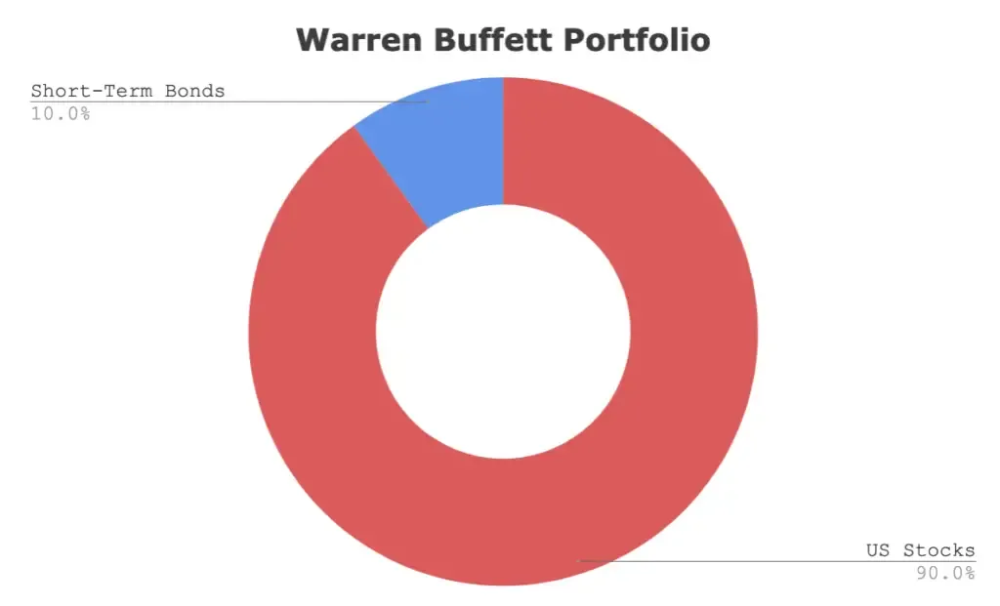

## Table of Contents

## What is a Warren Buffett ETF Portfolio?

A Warren Buffett ETF Portfolio is a way to invest money by following the advice of Warren Buffett, a famous investor. Instead of buying individual stocks, you invest in exchange-traded funds (ETFs). ETFs are like baskets that hold many different stocks or bonds. By using ETFs, you can spread your money across many companies, which can be safer than putting all your money into one or two stocks.

Warren Buffett has suggested that a good, simple way to invest is to put 90% of your money into an S&P 500 index fund, which is a type of ETF. The S&P 500 is a collection of 500 big American companies. The other 10% can go into government bonds, which are safer investments. This strategy is easy to follow and can help you grow your money over time without needing to pick individual stocks.

## What does the 90/10 ratio mean in the context of Warren Buffett's ETF Portfolio?

In Warren Buffett's ETF Portfolio, the 90/10 ratio means you should put 90% of your money into an S&P 500 index fund and the other 10% into government bonds. The S&P 500 is a group of 500 big American companies, and an index fund that follows it lets you own a little bit of all those companies. This part of the portfolio is meant to grow your money over time because these companies usually do well in the long run.

The other 10% goes into government bonds, which are safer investments. Bonds are like loans you give to the government, and they pay you back with interest. This part of the portfolio helps protect your money because bonds are less risky than stocks. By using this 90/10 split, you can balance the potential for growth with some safety, making it a simple and effective way to invest your money.

## Why might someone choose to follow Warren Buffett's investment strategy?

Someone might choose to follow Warren Buffett's investment strategy because it's simple and has a good track record. Buffett is known as one of the best investors ever, and his advice is trusted by many people. His strategy of putting 90% of your money into an S&P 500 index fund and 10% into government bonds is easy to understand and follow. You don't need to spend a lot of time [picking](/wiki/asset-class-picking) individual stocks or worrying about the ups and downs of the market. This makes it a great choice for people who want to invest but don't want to become experts in finance.

Another reason to follow Buffett's strategy is that it's designed to work well over the long term. The S&P 500 has historically provided good returns over many years, which means your money can grow steadily. The 10% in government bonds adds a layer of safety, helping to protect your investment if the stock market goes through a rough patch. By balancing growth and safety, Buffett's approach can help you build wealth without taking on too much risk. This makes it a smart choice for anyone looking to invest for the future.

## What are the specific ETFs recommended in a 90/10 Warren Buffett portfolio?

In a 90/10 Warren Buffett portfolio, the main [ETF](/wiki/etf-trading-strategies) recommended for the 90% portion is an S&P 500 index fund. A popular choice for this is the Vanguard S&P 500 ETF (VOO). This ETF tracks the performance of the S&P 500, which includes 500 of the largest companies in the U.S. By investing in VOO, you own a small piece of all these companies, which helps spread out your risk and can lead to good growth over time.

For the 10% portion, you would invest in a government bond ETF. A commonly recommended ETF for this part is the iShares 1-3 Year Treasury Bond ETF (SHY). This ETF holds short-term U.S. Treasury bonds, which are very safe investments. They don't grow as fast as stocks, but they help protect your money if the stock market goes down. Together, VOO and SHY make up a simple and effective way to follow Warren Buffett's investment advice.

## How does the 90/10 portfolio allocation work in practice?

In practice, the 90/10 portfolio allocation means you take your total investment money and split it into two parts. Ninety percent of your money goes into an S&P 500 index fund, like the Vanguard S&P 500 ETF (VOO). This part of your investment is meant to grow over time because the S&P 500 includes many big and successful American companies. By investing in VOO, you own a little bit of all these companies, which helps spread out your risk and can lead to good growth over the years.

The other ten percent of your money goes into a government bond ETF, such as the iShares 1-3 Year Treasury Bond ETF (SHY). This part of your investment is safer because government bonds are less risky than stocks. They don't grow as fast, but they help protect your money if the stock market goes through a rough patch. By balancing 90% in stocks and 10% in bonds, you can grow your money while also keeping some safety in your investment plan.

## What are the potential benefits of using a 90/10 Warren Buffett ETF Portfolio?

The 90/10 Warren Buffett ETF Portfolio has several benefits. One big benefit is that it's simple to follow. You don't need to be an expert in finance or spend a lot of time picking individual stocks. By putting 90% of your money into an S&P 500 index fund like VOO, you own a piece of many big American companies. This helps your money grow over time because these companies usually do well in the long run. The other 10% goes into safe government bonds like SHY, which helps protect your money if the stock market goes down.

Another benefit is that this strategy can help you build wealth without taking on too much risk. The S&P 500 has a good history of providing solid returns over many years. By investing in it, you can see your money grow steadily. The 10% in government bonds adds a layer of safety, balancing out the risk from the stock market. This way, you can feel more secure about your investments while still having the chance to see good growth. It's a smart way to invest for the future without needing to worry too much about the ups and downs of the market.

## What are the risks associated with a 90/10 Warren Buffett ETF Portfolio?

Even though a 90/10 Warren Buffett ETF Portfolio is simple and has worked well over time, it still has some risks. The main risk comes from the 90% you put into the S&P 500 index fund. The stock market can go up and down a lot, and if it goes down, the value of your investment can drop too. This means you could lose money, especially if you need to take it out during a bad time for the market. Also, even though the S&P 500 has done well in the past, there's no guarantee it will keep doing well in the future.

The other risk is that the 10% in government bonds might not grow as fast as you want. Bonds are safer than stocks, but they usually don't give you as much growth. If inflation goes up, the money you get from bonds might not be worth as much as before. Also, if interest rates go up, the value of the bonds you own can go down. So, while the 90/10 split helps balance growth and safety, you still need to be ready for some ups and downs in your investment.

## How does the performance of a 90/10 Warren Buffett ETF Portfolio compare to other investment strategies?

The 90/10 Warren Buffett ETF Portfolio often does well compared to other investment strategies because it's simple and focuses on long-term growth. By putting 90% of your money into an S&P 500 index fund like VOO, you're betting on the overall success of big American companies. Over many years, the S&P 500 has given good returns, which means your money can grow steadily. The other 10% in government bonds like SHY adds a layer of safety, helping to protect your money if the stock market goes down. This balance of growth and safety can lead to better results than more complicated strategies that try to pick individual stocks or time the market.

However, the 90/10 portfolio might not always beat every other strategy. Some people might choose to invest in different types of ETFs or individual stocks, hoping to get higher returns. For example, if you pick the right tech stocks, you could see faster growth than the S&P 500. But this also comes with more risk because those stocks can go up and down a lot. Other strategies, like investing in real estate or commodities, can also give different results. The 90/10 portfolio is a good choice for people who want a simple, reliable way to grow their money over time, but it might not be the best fit for everyone depending on their goals and how much risk they're willing to take.

## What are the tax implications of investing in a 90/10 Warren Buffett ETF Portfolio?

Investing in a 90/10 Warren Buffett ETF Portfolio can have tax implications that you should know about. When you invest in ETFs like the Vanguard S&P 500 ETF (VOO) and the iShares 1-3 Year Treasury Bond ETF (SHY), you might have to pay taxes on any money you make from them. If you hold these ETFs for more than a year, any profits you make when you sell them are considered long-term capital gains. These are usually taxed at a lower rate than your regular income. But if you sell them within a year, the profits are short-term capital gains, which are taxed at your regular income tax rate.

Also, ETFs can sometimes pay out dividends, which are payments from the companies in the ETF. These dividends are usually taxed as regular income. But if you hold the ETFs in a tax-advantaged account like an IRA or a 401(k), you might not have to pay taxes on the gains or dividends right away. Instead, you'll pay taxes when you take the money out of the account, and the tax rate might be different depending on your age and income at that time. So, it's a good idea to think about where you put your 90/10 portfolio to help manage your taxes better.

## How should one rebalance a 90/10 Warren Buffett ETF Portfolio?

Rebalancing a 90/10 Warren Buffett ETF Portfolio means making sure your money stays split the right way between stocks and bonds. Over time, the value of your S&P 500 index fund (like VOO) might go up more than your government bond ETF (like SHY). This can change your 90/10 split. To fix it, you need to sell some of the S&P 500 fund and buy more of the bond fund to get back to 90% in stocks and 10% in bonds. It's a good idea to check your portfolio once a year and rebalance if it's off by more than a few percent.

Rebalancing helps keep your investment plan on track. If you don't rebalance, you might end up with too much money in stocks, which can be riskier. By selling some of the stocks that have gone up and buying more bonds, you're taking some money off the table and making your portfolio safer. This way, you can keep growing your money while also protecting it from big drops in the stock market.

## What are some advanced strategies for optimizing a 90/10 Warren Buffett ETF Portfolio?

To optimize a 90/10 Warren Buffett ETF Portfolio, you can use a strategy called tax-loss harvesting. This means selling some of your ETFs that have gone down in value to get a tax break. You can use that tax break to lower the taxes you pay on your other investments. After selling, you can buy a similar ETF to keep your portfolio balanced. This way, you can save on taxes while still following Buffett's strategy. It's a smart move, but you need to be careful not to break any tax rules, so it might be good to talk to a tax advisor.

Another advanced strategy is to use dollar-cost averaging. Instead of putting all your money into the 90/10 portfolio at once, you can invest a little bit every month. This helps you buy more ETFs when prices are low and fewer when prices are high, which can lead to better returns over time. You can also look at using different types of ETFs within the 90% part of your portfolio. For example, you might add a small amount of an international stock ETF to spread your risk even more. These tweaks can help you get the most out of Buffett's simple but effective investment plan.

## How can one adapt the 90/10 Warren Buffett ETF Portfolio strategy for different market conditions?

To adapt the 90/10 Warren Buffett ETF Portfolio for different market conditions, you can change how much money you put into stocks and bonds. If the stock market is doing really well and you think it might keep going up, you could put a little more than 90% into the S&P 500 index fund. But if the market seems risky or you think it might go down, you could put more than 10% into government bonds to keep your money safer. This way, you can adjust your portfolio to match what's happening in the market and feel more comfortable with your investments.

Another way to adapt the strategy is by using different types of ETFs within the 90% part of your portfolio. For example, if you think international stocks might do better than American stocks, you could add a small amount of an international stock ETF. This can help spread your risk and maybe even get better returns. By making small changes like these, you can keep following Buffett's simple plan but also make it work better for you in different market conditions.

## References & Further Reading

[1]: Bogle, J. C. (1999). ["Common Sense on Mutual Funds: New Imperatives for the Intelligent Investor"](https://www.amazon.com/Common-Sense-Mutual-Funds-Imperatives/dp/0471392286). John Wiley & Sons.

[2]: Graham, B. (1949). ["The Intelligent Investor: The Definitive Book on Value Investing"](https://www.amazon.com/Intelligent-Investor-Definitive-Investing-Essentials/dp/0060555661). Harper Business.

[3]: Malkiel, B. G. (2015). ["A Random Walk Down Wall Street: The Time-Tested Strategy for Successful Investing"](https://www.academia.edu/10850809/A_Random_Walk_Down_Wall_Street_The_Time_Tested_Strategy_for_Successful_Investing). W. W. Norton & Company.

[4]: ["Investing in ETFs: The Essential Guide"](https://www.fool.com/investing/how-to-invest/etfs/) by CFA Institute Research Foundation

[5]: Lo, A. W., & MacKinlay, A. C. (1999). ["A Non-Random Walk Down Wall Street"](https://www.jstor.org/stable/j.ctt7tccx). Princeton University Press.

[6]: ["The Little Book of Common Sense Investing: The Only Way to Guarantee Your Fair Share of Stock Market Returns"](https://www.amazon.com/Little-Book-Common-Sense-Investing/dp/1119404509) by John C. Bogle