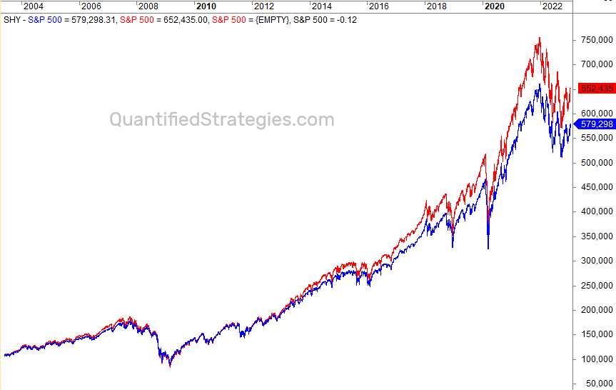

Warren Buffett, often regarded as one of the most successful investors of all time, has consistently advocated for a long-term, value-driven investment philosophy. His approach is characterized by its simplicity and prudence, emphasizing investments in businesses with enduring competitive advantages and competent management. This philosophy has not only influenced countless individual investors but also significantly shaped modern investing practices, particularly the emphasis on passive investment strategies. One such strategy he recommends is investing 90% in a low-cost S&P 500 index fund and 10% in government bonds, often referred to as the Warren Buffett ETF Portfolio. This portfolio, while straightforward, embodies the hallmarks of Buffett's investment approach: low costs, diversified risk, and steady long-term growth.

ETFs, or Exchange-Traded Funds, play a critical role in Buffett's recommended strategy. ETFs are investment funds traded on stock exchanges, much like stocks, and are designed to track the performance of a specific index or asset class. They offer investors a cost-effective way to achieve diversification. Buffett's advocacy for the S&P 500 index fund highlights his belief in the resilience and potential of the American economy, as this index covers 500 of the largest companies in the U.S. By including government bonds in the allocation, Buffett aims to add a layer of security and income, especially during market volatilities.



As investing methods evolve, algorithmic trading has emerged as a powerful tool in modern finance. It involves using algorithms to automate trading decisions, enabling swift and complex transactions based on predetermined criteria. Integrating algorithmic trading with Buffett's ETF portfolio presents intriguing possibilities for optimizing returns while adhering to his core investment tenets. This combination allows investors to harness the benefits of both value-based investing and technological efficiency. Algorithmic trading can help implement Buffett’s strategy by managing the portfolio dynamically, capturing any slight inefficiencies in the market, and rebalancing when necessary without human intervention. 

The prospect of leveraging algorithmic trading to enhance Buffett's ETF Portfolio opens new avenues for investors seeking to maximize their returns while adhering to a disciplined, value-oriented approach. As we explore this integration, it becomes essential to assess the potential benefits and challenges, ultimately bridging traditional investment wisdom with contemporary trading practices.

## Table of Contents

## Understanding the Warren Buffett ETF Portfolio

Warren Buffett, renowned as one of the most successful investors of the 20th century, offers straightforward yet profoundly impactful advice on investment allocation. He suggests that individuals invest 90% of their portfolio in a low-cost S&P 500 index fund and allocate the remaining 10% to short-term government bonds. This approach epitomizes his preference for passive investing, a strategy that relies on minimizing transaction costs and market timing errors while benefiting from the broad market's inherent upward trajectory over time.

The rationale behind Buffett's advocacy for this 90/10 allocation lies in his conviction about the efficiency and reliability of the stock market as a wealth-building mechanism. The S&P 500 index, representing the 500 largest publicly traded companies in the United States, provides substantial diversification across sectors, reducing the unsystematic risk associated with individual stocks. By focusing on a low-cost index fund, investors partake in the overall growth of the market without incurring the high fees and potential underperformance linked to actively managed funds.

Additionally, the emphasis on maintaining 10% in short-term government bonds reflects a prudent approach to risk management. These bonds are considered one of the safest investments, given their backing by the government, and they help cushion the portfolio against market [volatility](/wiki/volatility-trading-strategies). The balance between equity and bonds offers a safeguard, ensuring [liquidity](/wiki/liquidity-risk-premium) and preserving capital during market downturns.

The benefits of Buffett's 90/10 strategy are clear. First, the strategy significantly reduces fees, as passive index funds typically charge lower expense ratios compared to actively managed funds. This cost-effectiveness can have a substantial impact over time, compounding the investor's returns. Furthermore, the strategy's inherent simplicity reduces the psychological burden on investors, who may otherwise react impulsively to short-term market fluctuations. By committing to a systematic investment allocation, individuals can avoid the pitfalls of market timing and emotional trading, leading to more consistent long-term growth.

Overall, Warren Buffett's [ETF](/wiki/etf-trading-strategies) portfolio strategy, emphasizing a heavy tilt towards equity with a conservative bond buffer, reflects a holistic understanding of market dynamics and individual investor behavior. It aligns with his broader investment philosophy—trusting in the long-term growth potential of the U.S. economy while safeguarding against unpredictable market events.

## The Role of ETFs in Buffett’s Portfolio

Exchange-Traded Funds (ETFs) have become a fundamental component of Warren Buffett's investment strategy, primarily due to their ability to offer broad market exposure at a low cost. ETFs are investment funds traded on stock exchanges, similar to stocks, and they hold assets such as stocks, commodities, or bonds. They typically track an index, such as the S&P 500, and provide investors with diversified exposure to the underlying assets.

Buffett's endorsement of ETFs, particularly in his advice to the trustees of his estate, underscores their significance in his strategic approach. He recommends that the trustee invests 90% of his wife's inheritance in a low-cost S&P 500 index fund, signifying his trust in broad market averages to deliver consistent long-term returns. The remaining 10% is advised to be invested in short-term government bonds, illustrating his preference for safety and income preservation alongside growth.

The use of ETFs aligns with Buffett’s principles of diversification and cost-effective management. Diversification is a critical advantage offered by ETFs. By owning a single ETF, investors can gain exposure to a wide spectrum of sectors and companies, significantly reducing unsystematic risk as compared to investing in individual stocks. This is particularly fitting for Buffett's approach, where managing risk is paramount.

Another compelling advantage of using ETFs is their cost-effectiveness. ETFs generally have lower expense ratios compared to mutual funds due to their passive management style. This cost-efficiency translates into higher net returns for investors over time, resonating with Buffett's philosophy of maximizing returns through minimal expenses.

Among the ETFs recommended by Buffett, the S&P 500 index ETF is notable for its embodiment of the U.S. stock market and excellent historical performance. The S&P 500 ETF offers exposure to 500 of the largest U.S. companies, allowing investors to benefit from the growth of these enterprises while bearing lower individual stock risk. Additionally, it reflects Buffett's belief in the potential of the American economy.

Short-term government bond ETFs are also pivotal in Buffett’s recommended portfolio allocation. These ETFs invest in government securities that typically have maturities of less than five years. They are considered low-risk and provide stability to the portfolio, along with modest income. This aspect of the strategy is aimed at safeguarding the portfolio's capital during market downturns, ensuring steady cash flow.

In summary, ETFs serve as a pillar of Warren Buffett's investment strategy due to their abilities to deliver diversification, cost savings, and market exposure. They constitute an efficient way to incorporate Buffett's principles of sound investment, particularly in creating a balanced, risk-managed portfolio that can yield sustained returns over the long term.

## Exploring Algorithmic Trading

Algorithmic trading, often referred to as "algo trading," is the use of computer algorithms to automate trading decisions and execute trades at speeds and frequencies that are impossible for a human to achieve. It has become a crucial component in modern investment strategies due to its ability to analyze vast amounts of market data, implement complex trading strategies, and significantly reduce transaction costs. This approach utilizes pre-set rules and intricate mathematical models to make trading decisions, allowing investors to exploit market opportunities with precision and efficiency.

**How Algorithmic Models Exploit Market Opportunities**

Algorithmic models can capitalize on market inefficiencies by analyzing price movements, trading volumes, and other real-time data to identify patterns that signal buying or selling opportunities. These models often incorporate techniques such as statistical [arbitrage](/wiki/arbitrage), mean reversion, and [momentum](/wiki/momentum) trading. For instance, a mean reversion strategy assumes that asset prices will revert to their historical averages over time. An algorithm could be programmed to buy when an ETF's price dips below its historical average and sell when the price exceeds this average.

The implementation of algorithms can be as simple as using moving averages to trigger trades, or as complex as employing [machine learning](/wiki/machine-learning) techniques to predict market movements. Consider the following example in Python, which demonstrates a basic crossover strategy using moving averages:

```python
import pandas as pd

def moving_average_strategy(prices, short_window=40, long_window=100):
    signals = pd.DataFrame(index=prices.index)
    signals['price'] = prices
    signals['short_mavg'] = prices.rolling(window=short_window, min_periods=1, center=False).mean()
    signals['long_mavg'] = prices.rolling(window=long_window, min_periods=1, center=False).mean()

    signals['signal'] = 0.0
    signals['signal'][short_window:] = np.where(signals['short_mavg'][short_window:] > signals['long_mavg'][short_window:], 1.0, 0.0)
    signals['positions'] = signals['signal'].diff()

    return signals
```

In this code, a short-term and a long-term moving average are computed. A buy signal is generated when the short-term moving average crosses above the long-term average, indicating a potential upward trend.

**Applying Algorithmic Trading to the Warren Buffett ETF Portfolio**

When considering the application of [algorithmic trading](/wiki/algorithmic-trading) to manage a Warren Buffett ETF Portfolio efficiently, the focus is on enhancing a traditionally passive investment strategy with the precision and speed of algorithmic systems. While Buffett advocates for a straightforward 90/10 allocation—90% in a low-cost S&P 500 index fund and 10% in government bonds—algo trading could optimize this approach by dynamically adjusting the allocation based on market conditions.

For instance, an algorithmic model could adjust the bond allocation in response to [interest rate](/wiki/interest-rate-trading-strategies) changes or economic indicators. Moreover, leveraging techniques such as [pair trading](/wiki/pair-trading) or [factor](/wiki/factor-investing) investing could help in maximizing returns or minimizing risks, maintaining fidelity to Buffett’s low-cost ethos while attempting to enhance overall portfolio performance.

The application of algorithms in this context not only aids in efficient portfolio management but also promises to uphold the principles of Buffett's strategy through systematic and disciplined market engagement. The integration of technology enables passive investing strategies to potentially outperform by reacting swiftly to advantageous market conditions, thus maximizing the dividends of Buffett’s proven approach while remaining aligned with evolving financial technologies.

## Integrating Buffett's Portfolio with Algorithmic Trading

Combining Warren Buffett's passive investment strategy with the precision of algorithmic trading presents a compelling approach for modern investors. This integration leverages the foundational philosophy of Buffett—emphasizing simplicity, low-cost investments, and market longevity—while introducing the advantages of advanced technological execution and data analysis to optimize portfolio returns.

### Conceptual Framework

To marry these two strategies, one would begin by adhering to Buffett's recommended allocation: approximately 90% in a low-cost S&P 500 index ETF and 10% in government bonds. This foundational structure benefits from the historical resilience and broad market exposure of the S&P 500, combined with the stability of government bonds. Algorithmic trading can optimize this setup by ensuring precise execution and adapting to changing market conditions.

1. **Data-Driven Decision Making**: Algorithms can rapidly analyze large sets of historical and real-time data to make informed decisions that might be too complex for manual calculation. For instance, using machine learning models, one can predict market trends or anomalies, ensuring the portfolio's allocations are consistently aligned with the most favorable conditions.

2. **Automatic Rebalancing**: Periodic rebalancing can be systematically optimized through algorithms. An algorithmic strategy could, for instance, trigger a rebalance whenever the allocation drifts beyond a predetermined threshold, keeping the risk profile and expected returns in alignment with investment goals.

3. **Risk Management Enhancements**: Algorithms are excellent at executing stop-loss orders or employing hedging strategies, safeguarding the portfolio against severe market downturns. They do this through constant monitoring of volatility metrics and other risk indicators, allowing the portfolio to react swiftly to adverse market movements.

### Algorithmic Strategies for a 90/10 Portfolio

Different algorithmic approaches can be employed depending on market conditions and investor objectives. 

- **Momentum Trading**: This strategy involves buying into assets that show upward trends and is adaptable for the S&P 500 portion of the portfolio. By analyzing historical price movements, algorithms can identify and capitalize on short to medium-term price trends.

    ```python
    import pandas as pd
    import numpy as np

    # Example of a simple momentum trading strategy
    def momentum_strategy(prices, window=14):
        returns = prices.pct_change()
        momentum = returns.rolling(window).mean()
        return np.sign(momentum)
    ```

- **Mean Reversion**: This strategy hinges on the assumption that prices will revert to the mean over time. Algorithms identify when the S&P 500 ETF becomes undervalued or overvalued relative to its historical average, allowing for strategic entry or exit points.

- **Arbitrage Opportunities**: In scenarios where the ETF and underlying stocks of the S&P 500 display minor discrepancies in pricing, a sophisticated algorithm could exploit these differences, ensuring enhanced gains with minimal risk.

In summary, integrating Warren Buffett's investment approaches with algorithmic trading allows for exploiting market efficiencies and improving decision-making processes, potentially enhancing portfolio performance. By leveraging the benefits of both strategies, investors could achieve superior risk-adjusted returns, maintaining alignment with Buffett's timeless wisdom while harnessing technological advancements.

## Performance Analysis and Backtesting

Analyzing historical performance data for a Warren Buffett ETF Portfolio within an algorithmic trading framework involves several key considerations. The primary objective is to assess how the integration of algorithmic models can potentially enhance the performance of a 90/10 portfolio strategy, which consists of 90% in an S&P 500 index ETF and 10% in government bonds. 

### Historical Performance Analysis

To conduct a comprehensive performance analysis, data over several decades for the S&P 500 index and government bonds are utilized. The S&P 500 index, representing a diversified collection of 500 large-cap U.S. companies, captures the general market's performance. Historically, the S&P 500 has exhibited an average annual return of approximately 7-10% after adjusting for inflation. In contrast, U.S. government bonds have provided lower but more stable returns, often around 2-3% annually.

### Backtesting the 90/10 Strategy

Backtesting is employed to simulate the performance of the 90/10 strategy under various market conditions using algorithmic models. Considering the historical annual returns mentioned, an algorithm could balance the 90% S&P 500 exposure with 10% government bonds, adjusting the allocations dynamically based on predefined indicators.

#### Algorithmic Models

Several algorithmic models can be used for [backtesting](/wiki/backtesting):

1. **Mean Reversion Models:** These models operate on the assumption that the price of a security will revert to its historical mean. Applying such a model could involve buying more of the S&P 500 ETF when its price deviates significantly below its historical average and reducing exposure when the price is above. 

2. **Momentum Models:** Momentum strategies capitalize on the continuation of existing trends. For a 90/10 portfolio, this might involve increasing the S&P 500 ETF allocation when it is in an upward momentum and reducing it when the trend reverses.

3. **Machine Learning Models:** Advanced machine learning techniques, such as reinforcement learning, can be used to optimize the asset allocation dynamically. These models can analyze patterns in historical data to identify optimal entry and exit points for both the ETF and bond components.

The following Python pseudocode demonstrates a simple backtesting framework for the 90/10 strategy using a momentum model:

```python
import pandas as pd

# Sample data loading
data = pd.read_csv('historical_data.csv')  # Assumed to contain 'date', 'spy_close', 'bond_close'
data['returns'] = data['spy_close'].pct_change()
data['momentum'] = data['returns'].rolling(window=12).mean()  # 12-month rolling mean

# Initial allocation
portfolio = {'S&P 500': 0.9, 'Bonds': 0.1}
cash = 100000  # Initial capital

# Backtesting loop
for i in range(len(data)):
    if data.loc[i, 'momentum'] > 0:  # Simple momentum signal
        portfolio['S&P 500'] = 0.95
        portfolio['Bonds'] = 0.05
    else:
        portfolio['S&P 500'] = 0.85
        portfolio['Bonds'] = 0.15

    # Update portfolio value
    cash *= 1 + ((portfolio['S&P 500'] * data.loc[i, 'returns']) + 
                 (portfolio['Bonds'] * (data.loc[i, 'bond_close'].pct_change())))
```

### Comparative Analysis

The outcomes from algorithmic backtesting are compared with a traditional buy-and-hold approach of maintaining a static 90/10 mix. Historically, a buy-and-hold investor in a 90/10 portfolio stands to gain stability from bonds while benefiting from equity growth. However, algorithmic models can potentially outperform by dynamically adjusting allocations based on market conditions.

### Conclusion on Performance Analysis

The historical performance analysis and backtesting provide crucial insights into how algorithmic trading strategies could optimize the classic Buffett 90/10 approach. While traditional strategies benefit from simplicity and reduced transaction costs, algorithmic enhancements offer potential for higher returns through market timing and dynamic allocation, albeit with increased complexity and risk.

## Benefits and Risks

Employing an algorithmic approach to managing a Warren Buffett-style ETF portfolio offers distinct benefits and presents specific risks that investors should consider. This section outlines the advantages, potential pitfalls, and risk management strategies associated with algorithmic trading in the context of a Buffett-like 90/10 investment strategy.

### Benefits of Algorithmic Trading in a Buffett-Style Portfolio

1. **Efficiency and Speed**: Algorithmic trading enables rapid execution of trades based on pre-set criteria, allowing investors to react quickly to market fluctuations. This is crucial in a Buffett-style portfolio, where opportunistic rebalancing can optimize the long-term allocation between equities and bonds.

2. **Consistency and Discipline**: Algorithms operate based on predefined rules, ensuring consistent application of investment strategies without emotional bias. This aligns closely with Buffett's philosophy of disciplined investing, where the focus is on adhering to a strategic plan regardless of market sentiments.

3. **Enhanced Data Analysis**: Algorithms can process vast amounts of market data to identify patterns or trends that might not be immediately apparent. This analytical capability enables better forecasting and strategic adjustments, potentially enhancing portfolio returns.

4. **Cost Reduction**: By automating the trading process, algorithmic strategies can reduce transaction costs and minimize human error, benefiting investors through increased net returns, which is particularly advantageous in low-cost ETF investments.

### Risks of Algorithmic Trading

1. **Market Risk**: Although algorithms can optimize trading strategies, the portfolio remains exposed to systemic market risks. Significant market events can lead to rapid losses that algorithms might not mitigate fully.

2. **Model Risk**: Flaws in the algorithm's logic or assumptions can lead to suboptimal trading decisions. If the model inaccurately predicts market movements, it can adversely affect portfolio performance. Continuous model validation and updates are essential.

3. **Execution Risk**: Latency issues or technical failures during trade execution can lead to significant discrepancies between expected and actual trade outcomes. Thus, robust technology infrastructure is a necessity.

4. **Overfitting**: Algorithms designed using historical data may perform well in backtesting but fail in live markets due to overfitting. This risk highlights the importance of validating models using out-of-sample data.

### Risk Management Considerations

1. **Diversification**: Maintaining diversification within the ETF portfolio can mitigate specific risks associated with algorithmic trading. A mix of S&P 500 index funds and government bonds remains a core feature of the Buffett strategy, offering built-in risk management through asset allocation.

2. **Robust Backtesting and Simulations**: Performing extensive backtesting using varied datasets and market conditions helps stress-test algorithms. Investors should employ out-of-sample testing and walk-forward analysis to ensure robustness.

3. **Continuous Monitoring and Adjustment**: Implementing a feedback loop where algorithms are regularly reviewed and adjusted based on performance outcomes ensures that they adapt to changing market dynamics. A systematic review process is vital for sustained success.

4. **Risk Controls and Limits**: Setting predefined risk limits for trades and portfolio allocations curtails excessive exposure. Investors can integrate stop-loss orders and max-drawdown thresholds within the algorithm to control downside risks effectively.

In conclusion, while algorithmic strategies can significantly enhance the efficiency and efficacy of a Warren Buffett-style ETF portfolio, careful consideration of risks and robust risk management frameworks is crucial for maintaining the portfolio's integrity and achieving long-term investment objectives.

## Conclusion

The exploration of a Warren Buffett ETF Portfolio through the lens of algorithmic trading has uncovered several valuable insights. At its core, Buffett’s investing philosophy emphasizes simplicity, low costs, and long-term growth potential—principles embodying wisdom that has stood the test of time. While traditionally associated with a buy-and-hold strategy, the introduction of algorithmic trading unlocks new dimensions for portfolio management, potentially enhancing decision-making and returns through systematic analysis and real-time data processing.

Blending Buffett's traditional investment wisdom with the precision of algorithmic trading suggests a paradigm where historical market models and contemporary technology coexist to offer a more dynamic approach to investing. Algorithmic trading, with its ability to perform intricate calculations and adapt swiftly to market changes, could optimize the 90/10 ETF allocation. This integration could potentially yield superior returns, harnessing the power of algorithms to manage risk more effectively and capitalize on transient market opportunities without deviating from the foundational investment strategy that emphasizes stability and cost-efficiency.

Investors are encouraged to weigh the long-term benefits of this hybrid approach, such as accessing enhanced analytical capabilities and automation, against the inherent risks associated with algorithmic systems. These risks include potential over-reliance on technology, algorithmic biases, and market unpredictability. To mitigate these challenges, robust risk management practices and continuous monitoring should form an integral part of any algorithmic trading strategy aligned with Buffett's portfolio ethos.

In conclusion, the synthesis of Buffett's enduring investment principles with the agility of algorithmic trading presents a novel frontier for portfolio management. While it promises substantial opportunities, investors must remain vigilant and prudent, acknowledging both the promise of technological integration and the complexities it introduces.

## References & Further Reading

[1]: Bogle, J. C. (1999). ["Common Sense on Mutual Funds: New Imperatives for the Intelligent Investor"](https://www.amazon.com/Common-Sense-Mutual-Funds-Imperatives/dp/0471392286). John Wiley & Sons.

[2]: Graham, B. (1949). ["The Intelligent Investor: The Definitive Book on Value Investing"](https://www.amazon.com/Intelligent-Investor-Definitive-Investing-Essentials/dp/0060555661). Harper Business.

[3]: Malkiel, B. G. (2015). ["A Random Walk Down Wall Street: The Time-Tested Strategy for Successful Investing"](https://www.academia.edu/10850809/A_Random_Walk_Down_Wall_Street_The_Time_Tested_Strategy_for_Successful_Investing). W. W. Norton & Company.

[4]: ["Investing in ETFs: The Essential Guide"](https://www.fool.com/investing/how-to-invest/etfs/) by CFA Institute Research Foundation

[5]: Lo, A. W., & MacKinlay, A. C. (1999). ["A Non-Random Walk Down Wall Street"](https://www.jstor.org/stable/j.ctt7tccx). Princeton University Press.

[6]: ["The Little Book of Common Sense Investing: The Only Way to Guarantee Your Fair Share of Stock Market Returns"](https://www.amazon.com/Little-Book-Common-Sense-Investing/dp/1119404509) by John C. Bogle