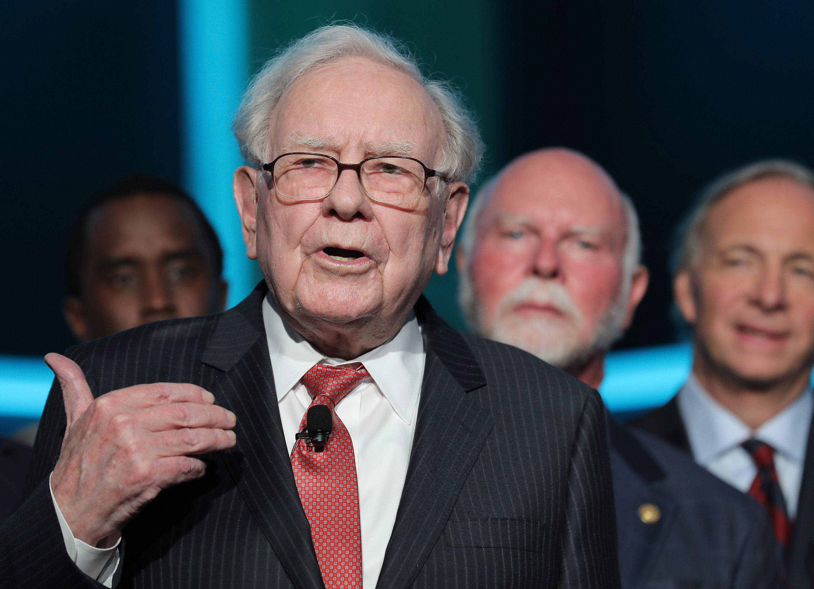

## Table of Contents

## What is Warren Buffett's general stance on investing in gold?

Warren Buffett has generally been critical of investing in gold. He believes that gold does not produce anything and has no utility, unlike businesses or farmland which can generate income and grow over time. Buffett often points out that gold's value is based purely on the hope that someone else will pay more for it in the future, which he sees as speculative rather than a sound investment strategy.

Buffett prefers to invest in productive assets that can generate earnings and dividends. He argues that over the long term, these types of investments will outperform gold because they contribute to economic growth and have intrinsic value. For example, he would rather invest in a company that makes products or provides services, as these can increase in value and profitability, whereas gold just sits there without generating any returns on its own.

## Has Warren Buffett ever invested in gold or gold-related companies?

Warren Buffett has generally stayed away from investing in gold or gold-related companies. He believes that gold does not produce anything useful and its value depends only on what someone else will pay for it later. Instead, Buffett likes to put his money into businesses that can make money and grow over time. These businesses can make products or offer services, and they can pay dividends to investors.

Even though Buffett does not like gold as an investment, his company, Berkshire Hathaway, did own shares in a company called Barrick Gold for a short time in 2020. This was unusual because it was the first time Berkshire Hathaway had invested in a gold mining company. However, they sold those shares after just a few months. This shows that even though Buffett might try something different sometimes, he still prefers to invest in things that can produce income and grow over time, not in gold.

## What are the reasons Warren Buffett gives for not investing in gold?

Warren Buffett does not like to invest in gold because he thinks it does not do anything useful. Gold just sits there and does not make any money by itself. It does not make products or provide services like a business does. Buffett believes that the value of gold only goes up if someone else is willing to pay more for it later. This is different from a business that can grow and make more money over time.

Buffett prefers to put his money into things that can produce income and grow. He likes businesses that can make profits and pay dividends to their investors. These kinds of investments can increase in value because they contribute to the economy and have real value. Gold, on the other hand, does not help the economy grow and its value is based on speculation, not on what it can do or produce.

## How does Warren Buffett's investment philosophy differ from investing in commodities like gold?

Warren Buffett's investment philosophy is all about putting money into things that can make more money over time. He likes to invest in businesses that make products or provide services. These businesses can grow and earn profits, which they can then share with their investors through dividends. Buffett believes that these kinds of investments are better because they have real value and can help the economy grow. He looks for companies that are strong and have good long-term potential.

On the other hand, investing in commodities like gold is very different. Gold does not make anything or provide any services. Its value comes from what someone else is willing to pay for it in the future. Buffett thinks this is risky because gold's price can go up and down a lot based on what people think it's worth, not on what it can actually do. He prefers to avoid commodities like gold because they don't produce income and their value is based on speculation, not on real growth or earnings.

## What alternative investments does Warren Buffett recommend over gold?

Warren Buffett likes to invest in businesses that make things or provide services. He thinks these are better than gold because they can grow and make money over time. For example, he might invest in a company that makes cars or a store that sells clothes. These businesses can earn profits and pay dividends to their investors. Buffett believes that these kinds of investments are more reliable because they have real value and can help the economy grow.

Another type of investment Buffett recommends is in stocks of companies that are strong and have good long-term potential. He looks for companies that are well-managed and have a solid business plan. These companies can increase in value as they grow and become more profitable. Unlike gold, which just sits there, these investments can produce income and contribute to economic growth. Buffett thinks that over time, these kinds of investments will do much better than gold.

## Can you provide examples of Warren Buffett's investments that he considers more productive than gold?

Warren Buffett likes to invest in companies that make things or provide services. One example is Coca-Cola. Buffett started buying Coca-Cola stock in the late 1980s because he believed in the company's strong brand and its ability to keep making money. Coca-Cola makes and sells drinks all over the world, and it pays dividends to its investors. This is different from gold, which does not make anything and does not pay dividends.

Another example is Apple. Buffett began investing in Apple in 2016 because he saw it as a great company with products that people love. Apple makes iPhones, iPads, and other tech products that are popular worldwide. The company earns a lot of money and also pays dividends. Buffett thinks that investing in a company like Apple is much better than investing in gold because Apple can grow and make more money over time, while gold just sits there without producing anything.

## How have Warren Buffett's views on gold influenced his investment decisions at Berkshire Hathaway?

Warren Buffett's views on gold have kept him away from investing in it at Berkshire Hathaway. He thinks gold does not do anything useful and does not make money by itself. Instead, he likes to put money into businesses that can grow and make profits. This is why Berkshire Hathaway has mostly stayed away from gold and gold-related companies. Buffett believes that investing in businesses that make things or provide services is a better way to make money over time.

Even though Buffett usually avoids gold, there was one time when Berkshire Hathaway bought shares in a gold mining company called Barrick Gold in 2020. This was unusual because it was the first time they had invested in a gold company. But they sold those shares after just a few months. This shows that even though Buffett might try something different sometimes, he still prefers to invest in things that can produce income and grow over time, not in gold.

## What economic conditions might lead Warren Buffett to reconsider his stance on gold?

Warren Buffett might think about investing in gold if the economy is in a really bad spot. If there is a lot of uncertainty and people are worried about money, gold can seem like a safe place to put money. During times like big financial crises or when inflation is very high, some people turn to gold because they think it will keep its value better than other things. If Buffett sees that the economy is going through a tough time and other investments are not doing well, he might consider gold as a way to protect his money.

However, even in tough economic times, Buffett would still be careful about gold. He believes that gold does not make anything and does not help the economy grow. So, he would only think about gold if he really believes that other investments are too risky. Even then, he might only invest a small amount, because his main focus is still on businesses that can make money and grow over time.

## How do Warren Buffett's views on gold compare to those of other prominent investors?

Warren Buffett's views on gold are different from some other big investors. Buffett does not like gold because it does not make anything or help the economy grow. He thinks gold's value is just based on what someone else will pay for it later, which he sees as risky. Instead, Buffett likes to invest in businesses that make things or provide services. These businesses can earn money and pay dividends, which he believes is a better way to invest.

Other investors, like Ray Dalio, have different ideas about gold. Dalio thinks gold can be a good way to protect money during tough economic times. He believes that when the economy is not doing well, gold can keep its value better than other things. Some investors also like gold because it can be a safe place to put money when they are worried about inflation or financial crises. So, while Buffett stays away from gold, other investors might see it as a useful part of their investment plan.

## What impact has Warren Buffett's stance on gold had on the gold market?

Warren Buffett's stance on gold has not had a big impact on the gold market. He does not like gold because it does not make anything or help the economy grow. Even though Buffett is a famous investor, his views on gold are just one person's opinion. The gold market is influenced by many things, like what central banks do, what people think about the economy, and what other big investors do. So, even though Buffett does not invest in gold, it does not change what most people do with gold.

However, when Buffett's company, Berkshire Hathaway, bought shares in Barrick Gold in 2020, it did get some attention. People were surprised because Buffett usually stays away from gold. But Berkshire Hathaway sold those shares after just a few months. This shows that even though Buffett might try something different sometimes, his overall view on gold has not changed much. The gold market keeps going up and down based on many other factors, not just what Warren Buffett thinks.

## Are there any instances where Warren Buffett's companies have indirectly benefited from the gold market?

Warren Buffett's companies have not directly invested in gold, but they might have indirectly benefited from the gold market in some ways. For example, if a company that Berkshire Hathaway owns does business with a gold mining company, they could make money from that. This would not be because they are investing in gold, but because they are doing business with companies that work with gold.

Another way Buffett's companies might benefit indirectly is if the economy is doing well and people are buying more things. When the economy is strong, people might buy more jewelry or other things made from gold. This could help companies that Berkshire Hathaway owns, like those in the retail or manufacturing sectors, even if they do not deal with gold directly. So, while Buffett does not invest in gold, his companies could still see some benefits from a strong gold market.

## How might future market trends affect Warren Buffett's potential interest in gold investments?

If the economy goes through a really tough time, like a big financial crisis or very high inflation, Warren Buffett might think about investing in gold. During these times, people often look for safe places to put their money, and gold can seem like a good choice because it might keep its value better than other things. Even though Buffett usually does not like gold because it does not make anything or help the economy grow, he might consider it if he thinks other investments are too risky.

However, even if the market trends change, Buffett would still be careful about gold. He believes in investing in businesses that can make money and grow over time. So, if he ever decides to invest in gold, it would probably be a small part of his overall investment plan. His main focus would still be on companies that can produce income and contribute to the economy, not on gold which he sees as more of a speculative investment.

## References & Further Reading

[1]: ["The Essays of Warren Buffett: Lessons for Corporate America"](https://books.google.com/books/about/The_Essays_of_Warren_Buffett.html?id=-fzqAQAAQBAJ) by Warren E. Buffett and Lawrence A. Cunningham

[2]: ["Security Analysis"](https://www.wallstreetmojo.com/security-analysis/) by Benjamin Graham and David Dodd

[3]: ["The Intelligent Investor"](https://www.amazon.com/Intelligent-Investor-3rd-Ed/dp/0063356724) by Benjamin Graham

[4]: Bandyopadhyay, S., & Elliott, R. J. (2004). ["A first course in algorithmic trading"](https://www.semanticscholar.org/paper/Internet-of-Things-Applications-and-Challenges-in-Bandyopadhyay-Sen/9dd2ac174976960a911b60cee7f21747b6233bf5) Available at ResearchGate. 

[5]: ["Warren Buffett: The Life, Lessons, and Rules for Success"](https://www.amazon.com/Warren-Buffett-Lessons-Rules-Success/dp/1521851123) by Influential Individuals