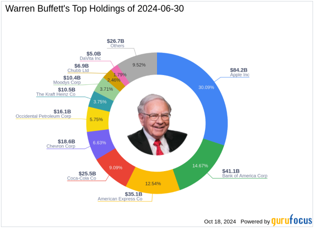

## Table of Contents

## Who is Warren Buffett and why is he considered an investment expert?

Warren Buffett is a very famous investor and businessman. He was born in 1930 in Omaha, Nebraska. He is known as the "Oracle of Omaha" because he is really good at picking investments that make a lot of money. He runs a big company called Berkshire Hathaway, which owns many other companies and investments.

People think Warren Buffett is an investment expert because he has made a lot of money from his investments over many years. He started investing when he was very young and has been successful for a long time. He believes in buying good companies at a fair price and holding onto them for a long time. Many people listen to his advice because he has proven that his way of investing works well.

## What are the key characteristics of Warren Buffett's investment strategy?

Warren Buffett's investment strategy is all about finding good companies and holding onto them for a long time. He looks for businesses that he understands well and that have a strong advantage over their competitors. He calls this having a "moat" around the business, which means it's hard for other companies to take away their customers. He also likes companies that make a lot of money and can keep making more money in the future.

Another important part of his strategy is buying these good companies at a fair price. He doesn't want to pay too much, even for a great company. He waits for the right time when the price is good, and then he buys. This way, he can get more value for his money. He believes that if you buy a wonderful company at a fair price, you don't have to worry about the stock market going up and down because the company will keep doing well over time.

## What is the significance of long-term investing according to Warren Buffett?

Warren Buffett believes that long-term investing is very important because it lets you take advantage of the growth of good companies over time. He thinks that if you buy a great company and hold onto it for many years, you can make a lot more money than if you keep buying and selling stocks quickly. He says that the stock market can go up and down a lot in the short term, but good companies usually keep getting better and making more money over the long term. This is why he likes to hold onto his investments for a long time.

He also believes that long-term investing helps you avoid making bad decisions based on short-term market changes. If you are always worried about what the market is doing today or tomorrow, you might sell your stocks at the wrong time or buy them when they are too expensive. But if you focus on the long term, you can ignore these short-term ups and downs and stay calm. This way, you can make better decisions and end up with more money in the end.

## Can you list some of Warren Buffett's top long-term investment picks?

Warren Buffett has made some really good long-term investment picks over the years. One of his biggest and most famous investments is in Coca-Cola. He started buying Coca-Cola stock in the late 1980s and has held onto it for a long time. He likes Coca-Cola because it's a strong brand that people all over the world know and love. Another big investment for him is in American Express. He began buying shares of American Express in the 1990s and still holds a lot of it. He thinks American Express is a great company because it has a strong position in the credit card business.

Buffett also has a big stake in Apple. He started buying Apple stock in 2016 and has kept adding to his position. He believes Apple is a fantastic company because it makes products that people really want and it keeps coming up with new ideas. Another long-term holding for him is in See's Candies, a company he bought in 1972. He likes See's Candies because it has a loyal customer base and makes good profits. These examples show how Buffett picks companies he believes will do well over many years and sticks with them.

## How does Warren Buffett evaluate a company before investing in it?

Warren Buffett looks at a few important things before he decides to invest in a company. He wants to understand the business really well. He reads a lot about the company and tries to figure out how it makes money and what makes it special. He looks for companies that have something called a "moat," which means they have a big advantage over other companies. This could be a strong brand, like Coca-Cola, or a special way of doing things that others can't copy easily. He also checks if the company is making good profits and if it can keep making more money in the future.

Another thing Buffett looks at is the price of the company's stock. He wants to buy good companies, but he doesn't want to pay too much for them. He waits for the right time when the price is fair, so he can get more value for his money. He believes that even the best company isn't a good investment if you pay too much for it. So, he is very patient and only buys when he thinks the price is right. This way, he can be sure that his investment will grow over time.

## What role does the economic moat play in Warren Buffett's investment decisions?

The economic moat is very important to Warren Buffett when he decides to invest in a company. He looks for businesses that have a strong advantage over their competitors. This advantage, or moat, could be a well-known brand like Coca-Cola, a special way of doing things that others can't copy easily, or something else that makes the company hard to beat. Buffett believes that a company with a good moat can keep making money and growing over time, even if other companies try to take away its customers.

Buffett wants to invest in companies that can keep their moat strong for a long time. He thinks that if a company has a good moat, it will be able to make more money in the future. This is why he is willing to hold onto his investments for many years. He knows that a company with a strong moat is more likely to do well over the long term, which is what he cares about most when he invests.

## How have Warren Buffett's long-term investment picks performed historically?

Warren Buffett's long-term investment picks have done really well over the years. For example, he started buying Coca-Cola stock in the late 1980s. Since then, Coca-Cola has grown a lot and paid out big dividends. Buffett's investment in Coca-Cola has made him a lot of money because he held onto it for a long time. Another good pick was American Express. He began buying shares in the 1990s, and American Express has become a very strong company in the credit card business. His patience with American Express has paid off because the company kept making more money over the years.

Another great long-term investment for Buffett is Apple. He started buying Apple stock in 2016, and since then, Apple has grown even bigger and more successful. Buffett likes Apple because it keeps coming up with new products that people want to buy. His investment in Apple has grown a lot because he believed in the company's future. See's Candies is another example. Buffett bought See's Candies in 1972, and it has been a steady source of profit for him. These examples show that Buffett's strategy of [picking](/wiki/asset-class-picking) good companies and holding them for a long time has worked very well.

## What industries does Warren Buffett typically invest in for the long term?

Warren Buffett likes to invest in companies from different industries, but he often picks businesses that he understands well and that have a strong position in their market. He has a lot of investments in the consumer goods industry. For example, he owns a big part of Coca-Cola, which makes drinks that people all over the world enjoy. He also likes companies like See's Candies, which sells sweets that people love. These companies have strong brands that make them hard for others to compete with.

Another industry Buffett invests in is finance. He has a big stake in companies like American Express, which is a leader in the credit card business. He also owns a lot of shares in banks and insurance companies. These businesses make money by helping people and companies manage their money and protect themselves from risks. Buffett believes that these companies can keep making profits over many years because they have a good understanding of the financial world.

Buffett also invests in technology, but he is very careful about which companies he picks. He started buying Apple stock a few years ago and has done very well with it. He likes Apple because it keeps coming up with new products that people want to buy. Even though he is careful with tech investments, he sees the value in companies that can grow and make money over the long term.

## How does Warren Buffett's approach to long-term investing differ from short-term trading?

Warren Buffett's approach to long-term investing is all about finding good companies and holding onto them for many years. He looks for businesses that he understands well and that have a strong advantage over their competitors. He believes that if you buy a great company at a fair price, you don't have to worry about the ups and downs of the stock market because the company will keep doing well over time. This means he is patient and waits for the right time to buy, and then he holds onto his investments for a long time. He thinks that this way, he can make a lot more money than if he kept buying and selling stocks quickly.

Short-term trading is very different from Buffett's approach. People who do short-term trading buy and sell stocks quickly, often within days or even hours. They try to make money from small changes in stock prices. This can be risky because the stock market can be unpredictable in the short term. Short-term traders need to watch the market all the time and make quick decisions. They don't focus on the long-term growth of a company but on making quick profits. This is the opposite of Buffett's strategy, where he focuses on the long-term success of the businesses he invests in.

## What are some lesser-known long-term investments that Warren Buffett has made?

Warren Buffett has made some lesser-known long-term investments that have still done well over time. One of these is in a company called Duracell. Buffett bought Duracell in 2014. Duracell makes batteries, and even though it's not as famous as some of his other investments, it's a good business that keeps making money. Buffett likes Duracell because it has a strong brand and people keep buying its batteries.

Another lesser-known investment is in a company called Dairy Queen. Buffett bought Dairy Queen in 1998. Dairy Queen sells ice cream and fast food, and it's a business that has been around for a long time. Even though it's not as big as some of his other investments, it's a steady business that makes money year after year. Buffett likes Dairy Queen because it has loyal customers and a good position in the market.

## How can an individual investor apply Warren Buffett's long-term investment principles?

An individual investor can apply Warren Buffett's long-term investment principles by focusing on understanding the businesses they invest in. Buffett looks for companies with a strong advantage over their competitors, something he calls an "economic moat." This could be a well-known brand, like Coca-Cola, or a special way of doing things that others can't copy easily. As an individual investor, you should try to find companies that you understand well and that have this kind of advantage. You should also look for businesses that make good profits and can keep making more money in the future. By picking companies like this, you can be more confident that your investments will grow over time.

Another important part of Buffett's strategy is buying these good companies at a fair price. He waits for the right time when the price is good, and then he buys. As an individual investor, you should be patient and not rush to buy stocks just because everyone else is. Instead, wait until you think the price is right. This way, you can get more value for your money. Once you buy a good company at a fair price, hold onto it for a long time. Don't worry about the ups and downs of the stock market in the short term. Focus on the long-term growth of the company. By following these principles, you can make smart investment decisions and hopefully see your money grow over many years.

## What are the potential risks and challenges associated with following Warren Buffett's long-term investment strategy?

Following Warren Buffett's long-term investment strategy can be hard because it takes a lot of patience. You have to wait for the right time to buy a good company at a fair price. This means you might miss out on quick profits that other people make by buying and selling stocks fast. Also, the stock market can go up and down a lot in the short term, and it can be hard to stay calm and not sell your stocks when the market is going down. If you don't understand the business well, you might make a bad choice and lose money.

Another challenge is that not all companies will do well over the long term. Even if a company has a strong advantage now, things can change. New competitors might come along, or the company might make bad decisions. It's hard to predict the future, and sometimes even good companies can have problems. Also, you need to keep learning about the companies you invest in because things can change over time. If you don't keep up with what's happening, you might not know when it's time to sell or buy more.

## References & Further Reading

[1]: ["The Intelligent Investor: The Definitive Book on Value Investing. A Book of Practical Counsel (Revised Edition)"](https://www.amazon.com/Intelligent-Investor-Definitive-Investing-Essentials/dp/0060555661) by Benjamin Graham

[2]: ["Common Stocks and Uncommon Profits and Other Writings"](https://financialfreedomisajourney.com/wp-content/uploads/2024/08/Common-Stocks-and-Uncommon-Profits-Philip-Fisher.pdf) by Philip A. Fisher

[3]: ["Advances in Financial Machine Learning"](https://www.amazon.com/Advances-Financial-Machine-Learning-Marcos/dp/1119482089) by Marcos Lopez de Prado

[4]: ["Algorithmic Trading: Winning Strategies and Their Rationale"](https://www.wiley.com/en-us/Algorithmic+Trading%3A+Winning+Strategies+and+Their+Rationale-p-9781118746912) by Ernest P. Chan

[5]: ["The Warren Buffett Way"](https://en.wikipedia.org/wiki/The_Warren_Buffett_Way) by Robert G. Hagstrom