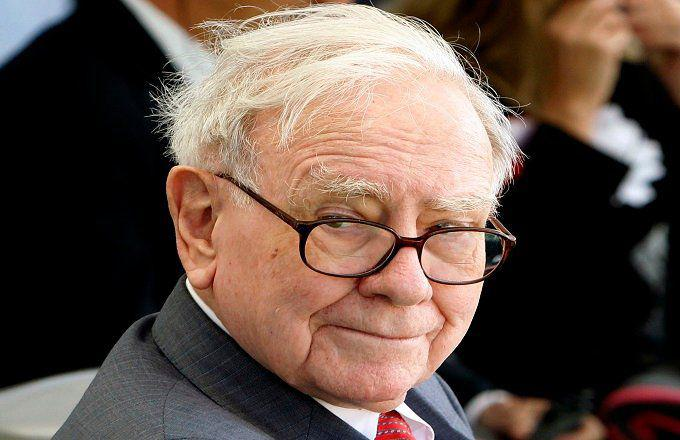

The world of investing has always held a certain allure, with Warren Buffett standing out as one of the most iconic figures in the domain. Known as the Oracle of Omaha, Buffett's investment strategies, particularly in long-term investments, have been widely studied and emulated by both novice and seasoned investors. His consistent success over decades has reinforced his legendary status in financial circles.

Warren Buffett's investment philosophy is rooted in value investing, a strategy that focuses on identifying undervalued stocks with strong intrinsic value. Buffett seeks out companies that possess substantial competitive advantages, often termed as economic moats, which help them maintain dominant positions in their respective markets. This conservative and thorough approach to stock selection emphasizes the importance of understanding the true worth of a company, irrespective of market volatility and short-term trends.



Buffett's strategic stock picks are testament to his skill in identifying opportunities that promise long-term growth and value. Companies like The Coca-Cola Company and Procter & Gamble are examples of his successful investments in consumer goods giants with global reach and steady financial performance. Such selections underscore his preference for firms with dependable earnings, robust management, and unique business models that stave off competition.

In the rapidly evolving financial landscape, the relevance and impact of algorithmic trading, or algo trading, cannot be overlooked. This modern approach has revolutionized investment strategies, offering speed and precision by automating trading decisions and execution. While traditional investing methods form the core of Buffett's strategy, modern techniques like algo trading provide a powerful complement, allowing investors to achieve more efficient trades and tap into data-driven insights.

This article explores the synergy between traditional value investing principles and contemporary algorithmic approaches, providing insights into adapting investment strategies to leverage both time-tested wisdom and modern technological advancements.

## Table of Contents

## Warren Buffett's Investment Philosophy

Warren Buffett's investment philosophy is rooted in the principles of value investing, a strategy he learned from his mentor, Benjamin Graham. Value investing involves identifying undervalued stocks that have strong intrinsic value, intending to hold these investments for the long term. Buffett's approach is characterized by a meticulous analysis of companies to ensure they possess competitive advantages and high barriers to entry, which help sustain their market dominance over time.

Central to Buffett's evaluation process are several key financial metrics. The price-to-book (P/B) ratio is one such metric, which measures a company's market value relative to its book value. This ratio provides insight into whether a stock is undervalued or overpriced. A lower P/B ratio may indicate that the stock is undervalued, aligning with Buffett's investment philosophy of purchasing securities at a price below their intrinsic value.

Similarly, the price-to-earnings (P/E) ratio is critical in assessing a company’s valuation. The P/E ratio compares a company's current share price to its earnings per share (EPS), providing a snapshot of investor expectations regarding future earnings growth. Buffett prefers companies with lower P/E ratios, suggesting that the stock is potentially undervalued relative to its earnings capability.

Another vital component of Buffett's investment criteria is the dividend yield, which reflects the dividend income a shareholder receives relative to the stock’s price. A higher dividend yield can be an indication of a company's ability to generate steady cash flows and distribute profits to shareholders, an essential aspect of long-term investments.

Buffett's focus extends beyond quantitative metrics. He emphasizes qualitative factors such as management quality, brand value, and company history. This comprehensive evaluation framework ensures that he invests in companies with robust business models and the potential for consistent growth.

## Notable Long-Term Stock Picks by Warren Buffett

Warren Buffett is renowned for his astute investment decisions, many of which focus on companies with clear competitive advantages and stable long-term growth prospects. His portfolio includes several notable long-term stock picks, reflecting his commitment to value investing and his emphasis on holding quality businesses over substantial periods.

**Nike Inc.** stands as a testament to Buffett's preference for companies with strong brand equity and global presence. As a leader in the apparel and sporting goods industry, Nike's brand value is substantial, contributing to its ability to maintain competitive pricing power and customer loyalty. The company's robust marketing strategies and innovative product lines continue to drive its market dominance and financial resilience.

**Burlington Northern Santa Fe Railway** (BNSF) is another strategic investment, demonstrating Buffett's appreciation for infrastructure businesses pivotal to economic activity. Acquiring BNSF allowed Buffett to capitalize on the consistent demand for freight transportation in North America. With extensive rail networks and an established position in the freight industry, BNSF benefits from high barriers to entry and significant capital requirements, ensuring a sustainable competitive advantage.

**ConocoPhillips** highlights Buffett's interest in the energy sector, especially in integrated energy companies with diversified operations. ConocoPhillips's involvement across the oil and gas value chain provides it with a robust business model capable of withstanding volatile commodity prices. This diversification, combined with efficient cost management and strategic exploration and production activities, ensures its long-term appeal as a value investment.

**Costco** is favored for its unique business model and strong emphasis on customer satisfaction. Known for its member-based warehouse retail structure, Costco enjoys high customer loyalty and a reputation for offering quality goods at competitive prices. Its efficient supply chain management and bulk purchasing enable it to maintain low prices, translating to consistent financial performance and growth.

**The Coca-Cola Company** epitomizes a Buffett staple, characterized by a timeless brand and exceptional global reach. With a vast portfolio of beverages and an extensive distribution network, Coca-Cola benefits from significant economies of scale. Its marketing prowess and longstanding consumer preference further cement its status as a leader in the beverage industry, ensuring steady cash flows and dividend returns.

**Procter & Gamble** embodies the characteristics Buffett seeks in consumer goods companies: a diverse product range, strong market share, and consistent leadership across its segments. Procter & Gamble's focus on innovation, efficient operations, and strategic acquisitions allows it to adapt to changing consumer preferences and maintain its position as a dominant player in the market.

These selections emphasize Buffett's strategy of investing in well-managed companies with enduring competitive advantages. Such companies not only promise stable returns but also align with his philosophy of holding investments for the long run to benefit from their intrinsic value appreciation.

## The Role of Algo Trading in Modern Investing

Algorithmic trading, commonly referred to as algo trading, has transformed investment practices by leveraging advancements in technology and data analytics. This methodology utilizes pre-programmed instructions to automatically execute trading decisions, enhancing both the speed and efficiency of transactions. The advent of algo trading has been propelled by the capacity of computers to process vast amounts of data in real time, a feat unattainable by human traders alone.

By automating the trading process, [algorithmic trading](/wiki/algorithmic-trading) enables investors to capitalize on market opportunities as they arise. Algorithms can analyze a large array of financial metrics, historical data, and market conditions to determine optimal trading strategies. For instance, algorithms can be designed to identify specific patterns or trends using statistical methods such as moving averages or regression analysis. This capability allows investors to establish precise entry and [exit](/wiki/exit-strategy) points, reducing the influence of human emotion and minimizing the likelihood of errors in decision-making.

In the context of long-term investing, algo trading complements traditional strategies by refining the timing of trades. Long-term investors, while primarily focused on the fundamental value of securities, can integrate algorithmic tools to optimize their positions over time. For example, they can use algorithms to enter positions gradually, avoiding the risk of influencing the market price with large trades. Similarly, algorithms can systematically rebalance portfolios to adhere to predefined risk parameters.

One practical application of algo trading in long-term investing is illustrated through strategies like mean-variance optimization, which can automate portfolio adjustments to maximize returns for a given level of risk. Python code exemplifying this might involve libraries such as NumPy and Pandas for data handling and optimization techniques from SciPy:

```python
import numpy as np
import pandas as pd
from scipy.optimize import minimize

# Expected returns and covariance matrix for a portfolio
expected_returns = np.array([0.05, 0.1, 0.15])
cov_matrix = np.array([[0.1, 0.02, 0.04],
                      [0.02, 0.3, 0.06],
                      [0.04, 0.06, 0.5]])

# Function to calculate portfolio variance
def portfolio_variance(weights, cov_matrix):
    return np.dot(weights.T, np.dot(cov_matrix, weights))

# Constraints and bounds
constraints = ({'type': 'eq', 'fun': lambda x: np.sum(x) - 1})
bounds = tuple((0, 1) for _ in range(len(expected_returns)))

# Initial guess and optimization
initial_guess = np.array([1/3, 1/3, 1/3])
optimized_result = minimize(portfolio_variance, initial_guess, args=(cov_matrix),
                            method='SLSQP', bounds=bounds, constraints=constraints)

print("Optimized Weights:", optimized_result.x)
```

This example demonstrates how algorithmic tools can enhance the management of investment portfolios by automating the optimization process according to risk-return requirements.

In conclusion, the role of algo trading in modern investing is pivotal, offering a quantitative and systematic approach to trading that complements traditional investment philosophies. By incorporating algorithmic strategies, investors can achieve greater precision in their trades while maintaining a long-term investment outlook.

## Balancing Traditional and Modern Strategies

While traditional value investing remains central to Warren Buffett's approach, adapting to the ever-changing investment landscape can provide significant advantages. By integrating modern tools such as algorithmic trading with value investing principles, investors can enhance their strategic positioning.

Algorithmic trading, which employs computer algorithms to automate trading decisions, offers efficiencies that are difficult to achieve manually. With algorithms, investors can execute trades at speeds and frequencies unparalleled by human capabilities, allowing for rapid response to market fluctuations. An example of a simple trading algorithm might look like this in Python:

```python
def simple_moving_average(prices, period=20):
    return sum(prices[-period:]) / period

def trading_strategy(prices):
    current_price = prices[-1]
    moving_average = simple_moving_average(prices)
    if current_price > moving_average:
        return "Buy"
    elif current_price < moving_average:
        return "Sell"
    else:
        return "Hold"
```

This code snippet represents a rudimentary strategy that uses a moving average to make trading decisions, showcasing how algorithmic methods can be employed for precise entry and exit points in the market.

Combining these algorithmic capabilities with Buffett's emphasis on comprehensive [fundamental analysis](/wiki/fundamental-analysis) ensures a robust investment strategy. While value investing focuses on financial metrics such as price-to-earnings (P/E) ratios or intrinsic value assessment, algorithmic trading leverages data patterns and trend analysis to optimize trade execution and timing.

The fusion of traditional value investing with the precision of algorithmic trading offers a balanced approach, enabling adaptability in modern markets. This dual strategy allows investors to capitalize on long-term growth opportunities while navigating the [volatility](/wiki/volatility-trading-strategies) of contemporary financial environments. In essence, this synthesis of time-honored principles with advanced technology equips investors to stay resilient and competitive.

## Conclusion

Warren Buffett's success in long-term investing underscores the effectiveness of value investing and meticulous stock selection. His approach prioritizes understanding the intrinsic value of companies and focusing on those with sustainable competitive strengths. By adopting Buffett's strategies, investors can target sustainable growth and achieve solid returns over time. This involves a deep analysis of financial metrics and a disciplined approach to holding investments over the long haul.

In parallel, algorithmic trading has introduced new dimensions to investment strategies, enhancing traditional methods through data-driven precision and speed. Algo trading provides investors with the tools to automate and optimize entry and exit points, making it possible to execute trades based on predefined criteria and market conditions swiftly. As it continues to evolve, algorithmic trading can complement conventional investment philosophies, offering new avenues for achieving returns in increasingly dynamic markets.

The future of investing lies in the synergy of combining time-honored investing wisdom with innovative approaches. By balancing Buffett's principles of value investing with the technological advancements provided by algorithmic trading, investors can maintain an adaptive edge. This integrated approach ensures that investors not only adhere to sound investment fundamentals but also leverage technological efficiencies to navigate the complexities of modern financial markets effectively.

## References & Further Reading

[1]: ["The Intelligent Investor: The Definitive Book on Value Investing. A Book of Practical Counsel (Revised Edition)"](https://www.amazon.com/Intelligent-Investor-Definitive-Investing-Essentials/dp/0060555661) by Benjamin Graham

[2]: ["Common Stocks and Uncommon Profits and Other Writings"](https://financialfreedomisajourney.com/wp-content/uploads/2024/08/Common-Stocks-and-Uncommon-Profits-Philip-Fisher.pdf) by Philip A. Fisher

[3]: ["Advances in Financial Machine Learning"](https://www.amazon.com/Advances-Financial-Machine-Learning-Marcos/dp/1119482089) by Marcos Lopez de Prado

[4]: ["Algorithmic Trading: Winning Strategies and Their Rationale"](https://www.wiley.com/en-us/Algorithmic+Trading%3A+Winning+Strategies+and+Their+Rationale-p-9781118746912) by Ernest P. Chan

[5]: ["The Warren Buffett Way"](https://en.wikipedia.org/wiki/The_Warren_Buffett_Way) by Robert G. Hagstrom