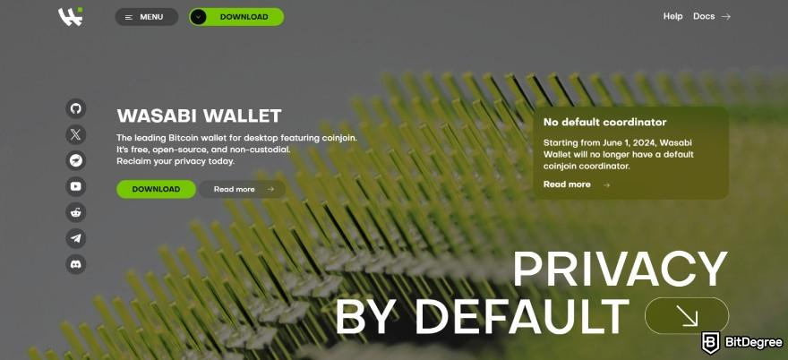

The landscape of cryptocurrency privacy is undergoing significant transformations as digital currencies increasingly become integral to the global financial ecosystem. The heightened emphasis on privacy and security reflects growing concerns over data breaches, surveillance, and the need for transactional anonymity. Wasabi Wallet has emerged as a key player in addressing these issues, offering robust privacy solutions tailored for cryptocurrency users. Established as a non-custodial, open-source Bitcoin wallet, Wasabi aims to provide users with enhanced privacy by leveraging sophisticated cryptographic techniques.

Privacy in the cryptocurrency space is crucial and relies on the trust inherent in decentralized networks. Users demand confidentiality, not just as a matter of personal preference, but as a necessity to protect their financial information from malicious actors and intrusive surveillance by states or corporations. Wasabi Wallet prioritizes user privacy by integrating advanced privacy features such as CoinJoin, a protocol designed to obscure transaction details, thereby making it difficult for third parties to trace the origin and destination of funds. By employing such mechanisms, Wasabi Wallet ensures that users maintain control over their financial data, aligning with the core principles of blockchain technology.

Recent years have seen a surge in interest towards algorithmic trading within the cryptocurrency sector. This trend has spotlighted the intersection between algorithm-driven strategies and privacy tools like Wasabi Wallet. Algorithmic trading strategies often involve executing large-sized trades at high speeds, making protection against "front-running"—where others in the market anticipate and act on known trades—essential. Privacy tools like Wasabi Wallet play a critical role in preventing the leakage of trading intentions, thereby securing strategic advantages for traders.

As we venture into 2024, the contribution of Wasabi Wallet to privacy in the cryptocurrency landscape continues to be of paramount importance. This article examines the evolution of Wasabi Wallet and its impact on privacy standards, featuring an in-depth review of its technical and operational aspects. We will explore its influence on algorithmic trading environments, assess its effectiveness compared to other privacy-focused solutions, and consider its future potential in shaping privacy paradigms within the cryptocurrency domain.

## Table of Contents

## Understanding Wasabi Wallet

Wasabi Wallet is distinguished by its robust features and functionality that prioritize user privacy in the cryptocurrency sphere. As an open-source and non-custodial wallet, it empowers users to maintain full control over their Bitcoin holdings without relying on third parties. This ensures that users retain sovereignty over their assets and personal data, aligning with the fundamental principles of cryptocurrency decentralization.

One of the key features of Wasabi Wallet is its implementation of the CoinJoin protocol for transaction obfuscation. CoinJoin is a trustless method that groups multiple users' transactions into a single transaction, thus masking the origin and destination of the funds. This is achieved by combining equal amounts of Bitcoin from different users into a single transaction, effectively obfuscating the trail of each individual transaction component. By doing so, Wasabi Wallet significantly enhances transactional privacy by making it difficult for external observers to trace the movement of funds on the blockchain.

In addition to CoinJoin, Wasabi Wallet leverages the Tor network to facilitate anonymous Bitcoin transactions. Tor, short for The Onion Router, is a decentralized network that routes user traffic through a series of nodes, each encrypting the transmitted data. This routing method prevents any intermediary from discerning both the packet's origin and destination, providing a layer of anonymity for Wasabi users. By integrating Tor, Wasabi Wallet ensures that users’ IP addresses are not exposed during transactions, thereby enhancing privacy and security.

Wasabi Wallet also boasts compatibility with a variety of hardware wallets, including popular options like Ledger and Trezor. This compatibility enables users to store their bitcoins securely offline while still benefiting from Wasabi’s privacy features when they transact. Furthermore, the wallet supports multiple operating systems, including Windows, macOS, and Linux, making it accessible to a wide range of users.

In summary, Wasabi Wallet's focus on open-source, non-custodial operation, its integration of CoinJoin for transaction anonymity, use of the Tor network for enhanced privacy, and its compatibility with hardware wallets and multiple operating systems make it a prominent tool for those prioritizing privacy in Bitcoin transactions.

## Privacy Features of Wasabi Wallet

Wasabi Wallet is renowned for its rigorous privacy-focused design, combining various techniques to enhance transaction anonymity for its users. Its privacy-first approach is built into its core functionalities, ensuring that user interactions remain secure and confidential.

Central to Wasabi Wallet's privacy model is its system of address management, which significantly bolsters transaction confidentiality. By employing automatic address generation, Wasabi ensures that each transaction utilizes a fresh address, thereby minimizing the traceability of any given transaction to a user. This approach is crucial in counteracting the analysis techniques employed by blockchain surveillance entities, which often attempt to associate addresses with identities.

Additionally, Wasabi Wallet employs robust Unspent Transaction Output (UTXO) management. UTXO management refers to the careful handling and selection of transaction outputs to further mitigate privacy risks. Wasabi's system selects which UTXOs to include in transactions based on privacy considerations, thus reducing the likelihood of linking different transactions to the same user.

The cornerstone of Wasabi Wallet's privacy offering is its integration of the CoinJoin protocol. CoinJoin is a mechanism that allows multiple users to combine their transactions into a single joint transaction. This obfuscates the origin of funds, as it becomes challenging to determine which input corresponds to which output. Essentially, CoinJoin transactions create a form of plausible deniability among participating users. This process is facilitated by a decentralized coordination system, where users coordinate without central trust to mix their coins prior to broadcasting them to the blockchain. Such an arrangement ensures that no single entity has control over the mixing process, reducing the risk of false promise on privacy claims.

Decentralized coordination plays a pivotal role in Wasabi Wallet's privacy guarantee. This system removes reliance on a central authority by allowing users to coordinate transactions amongst themselves secretly and efficiently. This is crucial for achieving privacy without central trust, as it ensures that no information, such as the participants' transaction details, is leaked even during the peer-to-peer communication phase.

Thus, Wasabi Wallet bridges complex privacy techniques with an intuitive user experience, facilitating a secure and private Bitcoin transaction environment.

## Algorithmic Trading and Privacy in 2024

Algorithmic trading has emerged as a powerful force in the [cryptocurrency](/wiki/cryptocurrency) market, where high-frequency trades and data-driven strategies are employed to capitalize on market movements. The use of algorithms allows traders to execute orders at speeds and frequencies that would not be possible for human traders, using complex mathematical models and computerized trading to optimize performance and minimize risks.

Privacy tools like Wasabi Wallet play a crucial role in supporting [algorithmic trading](/wiki/algorithmic-trading) strategies. These tools are essential in reducing signal intelligence and strategic exposure. Signal intelligence in trading refers to the ability to gather and analyze signals from market data, which could reveal trading strategies and positions. By leveraging privacy functionalities, such as those offered by Wasabi Wallet, traders can obscure their trading behaviors, making it difficult for competitors to reverse engineer their strategies or positions.

Wasabi Wallet utilizes techniques like CoinJoin, which combines multiple transactions into a single transaction, obscuring individual transaction details and enhancing privacy. This feature is particularly beneficial for algorithmic traders who wish to trade large quantities of cryptocurrency without revealing their trading intentions or [volume](/wiki/volume-trading-strategy) to the market. Moreover, the wallet's integration with Tor further anonymizes Bitcoin transactions, reducing the traceability of traders' activities. 

Security is another critical aspect where privacy-centric wallets benefit algorithmic traders. By using wallets that prioritize privacy and security, traders can protect their assets from potential cyber threats and unauthorized access. This is particularly significant in the automated trading environment, where numerous transactions are processed quickly, often without manual oversight.

As we look into 2024, the intersection of privacy tools and automated trading is poised for exciting developments. With the increasing sophistication of both trading algorithms and privacy solutions, we expect to see enhanced collaboration between these technologies. Privacy protocols could evolve to provide even more robust protections, possibly integrating advanced cryptographic techniques such as zero-knowledge proofs or homomorphic encryption to safeguard trading data further. Meanwhile, the continuous improvement of [machine learning](/wiki/machine-learning) algorithms is likely to optimize trading strategies that align with privacy-preserving requirements, allowing traders to maintain competitive advantages while minimizing risk.

Innovation in this domain may also lead to the development of standardized privacy frameworks that algorithmic traders can implement, ensuring compliance with legal and regulatory standards while maintaining the confidentiality and integrity of their trading activities. These advancements underscore the growing importance of privacy in the financial ecosystem, particularly as algorithmic trading continues to expand its influence in the cryptocurrency market.

## Pros and Cons of Using Wasabi Wallet

Wasabi Wallet stands out as a privacy-centric Bitcoin wallet, primarily due to its integration with technologies like Tor and CoinJoin. The utilization of Tor ensures that users can obfuscate their IP addresses, contributing significantly to maintaining anonymity during transactions. CoinJoin, a mechanism for combining multiple transactions into one, further enhances privacy by making it difficult to trace the source and destination of funds. This dual-layered approach markedly strengthens user privacy, making Wasabi Wallet an attractive option for privacy-focused individuals.

However, the complexity inherent in Wasabi Wallet's privacy tools can be a barrier for beginners. Users unfamiliar with the underlying mechanisms may find the initial setup and ongoing operation challenging. For those new to cryptocurrency, understanding and effectively utilizing CoinJoin transactions can be daunting, which could lead to its underutilization. Additionally, the reliance on network coordination for conducting CoinJoin transactions can sometimes result in inefficiencies or delays, as successful transaction mixing depends on the availability and willingness of other participants to join.

Feedback from the community highlights both praise and areas for improvement in Wasabi Wallet's current iteration. While the privacy features are widely commended, with users appreciating the robust protection against blockchain analysis, there are occasional criticisms regarding the user interface and its steep learning curve. In 2024, Wasabi's updates have focused on streamlining the user experience and enhancing the efficiency of the CoinJoin process, efforts that have been positively acknowledged by the community.

When compared to other privacy-focused wallets such as Samourai Wallet or the hardware-integrated Trezor, Wasabi Wallet's unique selling point lies in its advanced implementation of CoinJoin and seamless integration with Tor. Unlike some competitors, Wasabi remains a non-custodial solution, meaning that users retain full control over their private keys, thereby reducing vulnerability to hacks and third-party failures.

The balance between advanced privacy features and user-friendliness positions Wasabi Wallet as a powerful tool for those prioritizing anonymity in their cryptocurrency dealings, albeit with a learning curve that should be carefully considered by potential users.

## Conclusion

Wasabi Wallet stands out as a pivotal player in enhancing cryptocurrency privacy in 2024, chiefly through its commitment to integrating advanced privacy technologies. Leveraging mechanisms like CoinJoin, Wasabi enables users to obfuscate their transaction details effectively, thereby safeguarding their financial privacy. This effort to maintain privacy aligns closely with the demands of algorithmic trading, where the need to protect trade secrets and trading strategies from adversarial scrutiny is paramount. The intersection of privacy-focused tools like Wasabi Wallet and algorithmic trading provides traders with added layers of security, significantly reducing the risks associated with signal intelligence and external strategic exposure.

Encouraging users to be mindful of their privacy requirements when participating in cryptocurrency transactions is central to Wasabi's ethos. With the increasing sophistication of digital tracking technologies, privacy tools have become indispensable for users aiming to preserve anonymity and protect sensitive financial data. Wasabi's initiatives in privacy enhancement serve as a benchmark in the crypto space, illustrating a profound understanding of the nuanced challenges and opportunities within digital currency ecosystems.

Looking forward, we anticipate continued advancements in cryptocurrency privacy solutions. Developments in blockchain technology and cryptographic protocols promise to further refine transaction privacy, minimize latency, and enhance scalability. As the digital currency landscape evolves, the role of privacy-centric wallets like Wasabi is expected to expand, addressing not only individual privacy concerns but institutional needs as well. These advancements are instrumental in shaping a future where privacy is a standard feature rather than an optional add-on, fostering trust and inclusion in the cryptocurrency marketplace.

## References & Further Reading

[1]: Maxwell, G., Poelstra, A., Seurin, Y., & Wuille, P. (2017). ["Simple Schnorr Multi-Signatures with Applications to Bitcoin"](https://eprint.iacr.org/2018/068.pdf). International Association for Cryptologic Research.

[2]: Ermilov, D., Panov, M., & Yanovich, Y. (2017). ["Automatic Bitcoin Address Clustering"](https://www.semanticscholar.org/paper/Automatic-Bitcoin-Address-Clustering-Ermilov-Panov/91015d4b3cd700698406326309d0ccf101101a3e). Springer.

[3]: Narayanan, A., Bonneau, J., Felten, E., Miller, A., & Goldfeder, S. (2016). ["Bitcoin and Cryptocurrency Technologies: A Comprehensive Introduction"](https://press.princeton.edu/books/hardcover/9780691171692/bitcoin-and-cryptocurrency-technologies). Princeton University Press.

[4]: Antonopoulos, A. M. (2017). ["Mastering Bitcoin: Unlocking Digital Cryptocurrencies"](https://books.google.com/books/about/Mastering_Bitcoin.html?id=IXmrBQAAQBAJ). O'Reilly Media.

[5]: Böhme, R., Christin, N., Edelman, B., & Moore, T. (2015). ["Bitcoin: Economics, Technology, and Governance"](https://www.aeaweb.org/articles?id=10.1257/jep.29.2.213). Journal of Economic Perspectives.