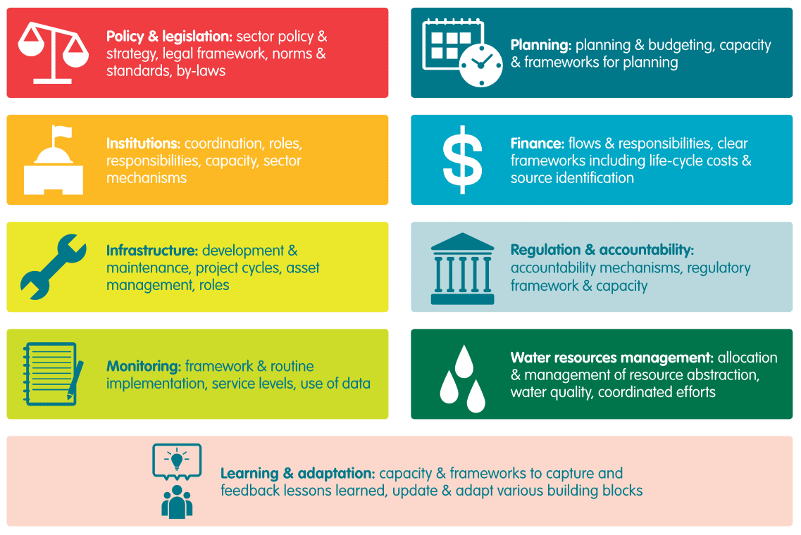

## Table of Contents

## What is the basic definition of a wash in the context of financial markets?

In the context of financial markets, a wash is a situation where a trade or transaction results in no net change in an investor's position. This means that the investor ends up with the same amount of money or assets as they started with, essentially canceling out any gains or losses.

A common example of a wash is when an investor sells a security at a loss and then quickly buys it back. This action might be done for tax purposes, to claim a loss on their taxes, but it doesn't change their overall investment position. In this case, the sale and repurchase "wash out" any real change in their portfolio.

## How does a wash trade function in stock trading?

A wash trade in stock trading happens when a person or a group buys and sells the same stock at the same time, or very close together. This makes it look like there is more trading happening than there really is. The goal is often to trick other people into thinking the stock is more popular or active than it really is. This can make the stock's price go up or down, depending on what the person doing the wash trade wants.

Wash trades are not allowed because they are a type of cheating. They can make the stock market seem busier and can affect the prices of stocks in a way that is not fair. If someone is caught doing a wash trade, they can get in big trouble with the people who watch over the stock market, like the Securities and Exchange Commission (SEC) in the United States. The SEC works hard to stop wash trades and other kinds of cheating to keep the stock market fair for everyone.

## What are the common reasons someone might engage in wash trading?

People might do wash trading because they want to make it look like a stock is more popular than it really is. By buying and selling the same stock quickly, they can make it seem like there is a lot of interest in that stock. This can trick other people into thinking the stock is a good buy, which might make its price go up. The person doing the wash trading hopes to sell the stock at a higher price later and make money from the difference.

Another reason someone might do wash trading is to make the stock's price go down. If they want to buy the stock cheaper, they can sell and buy it back quickly to make it look like there is less interest in the stock. This can scare other people into selling their shares, which makes the price drop. Then, the person doing the wash trading can buy the stock at a lower price and maybe sell it later for a profit. Both ways are cheating and against the rules of the stock market.

## Can you explain the difference between a wash sale and a wash trade?

A wash sale and a wash trade are two different things in the stock market. A wash sale happens when someone sells a stock at a loss and then buys the same or a very similar stock within 30 days before or after the sale. This is important for taxes because the loss from the sale can't be used right away to lower taxes. The idea is to stop people from selling stocks just to get a tax break and then buying them back right away.

On the other hand, a wash trade is when someone buys and sells the same stock at the same time or very close together. The goal is to make it look like there is more trading happening than there really is. This can trick other people into thinking the stock is more popular or active, which might change its price. Wash trades are not allowed because they are a type of cheating that can make the stock market unfair.

Both wash sales and wash trades are watched closely by people who make sure the stock market is fair, like the Securities and Exchange Commission (SEC). But they are different because wash sales are about tax rules, while wash trades are about trying to trick the market.

## What are the legal implications of wash trading in the United States?

Wash trading is against the law in the United States. The Securities and Exchange Commission (SEC) and the Commodity Futures Trading Commission (CFTC) are the main groups that watch for and stop wash trading. If someone is caught doing wash trading, they can face big fines and even go to jail. The SEC and CFTC work hard to keep the stock market fair for everyone, so they take wash trading very seriously.

When someone does wash trading, they are trying to trick other people into thinking a stock is more popular or active than it really is. This can change the price of the stock in a way that is not fair. Because wash trading can hurt the trust people have in the stock market, the government has strict rules against it. If someone is found guilty of wash trading, they might have to pay back any money they made from it, plus extra fines, and they could also be banned from trading in the future.

## How do regulatory bodies detect wash trading activities?

Regulatory bodies like the SEC and CFTC use special computer programs and data analysis to find wash trading. These programs look at lots of trading information to see if someone is buying and selling the same stock at the same time or very close together. They also check if the same person or group is doing these trades over and over again. By looking at patterns and how often these trades happen, the regulators can spot wash trading and start an investigation.

Once they think they have found wash trading, the regulators will look more closely at the trades. They might ask for more information from the people or companies involved. They can also use other tools like checking phone records or emails to see if there was any plan to trick the market. If they find enough proof, they will take action against the people doing the wash trading, which can lead to fines, jail time, and bans from trading.

## What penalties might individuals or firms face for engaging in wash trading?

If someone gets caught doing wash trading, they can face serious punishments. The Securities and Exchange Commission (SEC) and the Commodity Futures Trading Commission (CFTC) can give out big fines. These fines can be a lot of money, sometimes even more than what the person made from the wash trading. Besides fines, the person might also have to give back any money they made from the wash trading. This is called disgorgement, and it means they have to return all the profits they got from cheating.

On top of fines and disgorgement, people caught wash trading might also go to jail. The time they spend in jail can depend on how bad the wash trading was and if they have done it before. Also, the SEC or CFTC might stop them from trading in the future. This is called a trading ban, and it can last for a long time. All these punishments are meant to stop people from trying to trick the stock market and to keep it fair for everyone.

## How does wash trading impact the integrity of financial markets?

Wash trading hurts the trust people have in financial markets. When someone does wash trading, they make it look like a stock is more popular or active than it really is. This can trick other people into thinking the stock is a good buy or sell, which can change its price in a way that is not fair. If people find out that the market is being tricked, they might not want to trade anymore because they think it's not safe or honest. This can make the whole market less stable and harder to trust.

Regulators like the SEC and CFTC work hard to stop wash trading because it can make the market unfair. If wash trading happens a lot, it can make it hard for the market to work the way it should. Prices should go up and down based on what people really think about a stock, not because someone is trying to trick others. When wash trading is stopped, it helps keep the market fair and makes sure that everyone can trade without worrying about being cheated.

## Are there any legitimate uses of wash transactions in certain markets?

In most cases, wash transactions are not allowed and are seen as cheating in financial markets. They are used to trick people into thinking a stock is more popular or active than it really is. This can change the price of the stock in a way that is not fair. Because of this, regulators like the SEC and CFTC watch closely for wash trading and punish people who do it.

However, there are some situations where transactions that look like wash trades might be used for good reasons. For example, in some commodity markets, companies might use wash transactions to balance their [books](/wiki/algo-trading-books) or manage their inventory without changing their overall position. These are not meant to trick the market but to help the company keep track of their goods. Even in these cases, the transactions must follow strict rules to make sure they are not used to cheat.

## How have regulations regarding wash trading evolved over the past decade?

Over the past decade, rules about wash trading have gotten stricter. The SEC and CFTC have been working harder to stop wash trading because it can hurt the trust people have in the stock market. They have been using better computer programs to find wash trading faster. These programs look at lots of trading data to see if someone is buying and selling the same thing at the same time or very close together. If they find something that looks like wash trading, they start an investigation to see if it's really cheating.

The punishments for wash trading have also gotten tougher. If someone is caught doing wash trading, they can get bigger fines than before. They might also have to give back any money they made from the wash trading. Sometimes, people can even go to jail for wash trading. The SEC and CFTC want to make sure that the stock market is fair for everyone, so they are doing more to stop wash trading and to punish people who do it.

## What technological tools are used to prevent wash trading?

To stop wash trading, the SEC and CFTC use special computer programs that look at lots of trading data. These programs can find patterns that might mean someone is doing wash trading. They check if the same person or group is buying and selling the same thing at the same time or very close together. By looking at how often these trades happen and who is doing them, the programs can help spot wash trading and start an investigation.

Besides computer programs, other tools like checking phone records and emails are used to see if there was a plan to trick the market. These tools help the regulators find out if people were working together to do wash trading. By using all these different ways to look for wash trading, the SEC and CFTC can keep the stock market fair and stop people from cheating.

## Can you discuss a notable case study where wash trading was prosecuted?

One big case of wash trading that got a lot of attention was the case against a man named John P. Flannery. He was a stockbroker who got caught doing wash trading in the 1990s. Flannery was using his own money to buy and sell the same stocks over and over again. He did this to make it look like there was a lot of interest in those stocks. This tricked other people into thinking the stocks were more popular than they really were, and it made the prices go up. Flannery made a lot of money from this, but he got caught by the SEC. They found out what he was doing by looking at his trading records and seeing the same trades happening again and again.

The SEC took Flannery to court and he was found guilty of wash trading. He had to pay back all the money he made from his cheating, which was over $1 million. On top of that, he had to pay a big fine and he was not allowed to work in the stock market anymore. This case showed everyone that wash trading is a serious crime and that the SEC will do what it takes to stop it. It also made other people think twice before trying to trick the market because they knew they could get in big trouble.

## References & Further Reading

[1]: Bergstra, J., Bardenet, R., Bengio, Y., & Kégl, B. (2011). ["Algorithms for Hyper-Parameter Optimization."](https://dl.acm.org/doi/10.5555/2986459.2986743) Advances in Neural Information Processing Systems 24.

[2]: ["Advances in Financial Machine Learning"](https://www.amazon.com/Advances-Financial-Machine-Learning-Marcos/dp/1119482089) by Marcos Lopez de Prado

[3]: ["Evidence-Based Technical Analysis: Applying the Scientific Method and Statistical Inference to Trading Signals"](https://www.amazon.com/Evidence-Based-Technical-Analysis-Scientific-Statistical/dp/0470008741) by David Aronson

[4]: ["Machine Learning for Algorithmic Trading"](https://github.com/stefan-jansen/machine-learning-for-trading) by Stefan Jansen

[5]: ["Quantitative Trading: How to Build Your Own Algorithmic Trading Business"](https://www.amazon.com/Quantitative-Trading-Build-Algorithmic-Business/dp/1119800064) by Ernest P. Chan

[6]: Aldridge, I. (2013). ["High-Frequency Trading: A Practical Guide to Algorithmic Strategies and Trading Systems."](https://books.google.com/books/about/High_Frequency_Trading.html?id=8QpIsVUMhmEC) Wiley Finance.

[7]: Harris, L. (2003). ["Trading and Exchanges: Market Microstructure for Practitioners."](https://www.amazon.com/Trading-Exchanges-Market-Microstructure-Practitioners/dp/0195144708) Oxford University Press.

[8]: Gomber, P., Arndt, B., Lutat, M., & Uhle, T. (2011). ["High-frequency trading."](https://papers.ssrn.com/sol3/papers.cfm?abstract_id=1858626) Wirtschaftsinformatik.