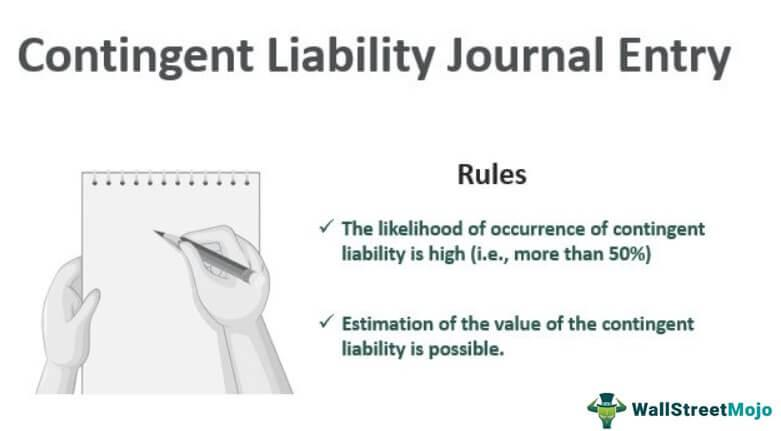

Algorithmic trading, also known as algo trading, refers to the use of computer programs to execute trades at speeds and frequencies that would be impossible for human traders. These algorithms make decisions based on pre-set criteria, such as timing, price, or quantity, allowing for orders to be executed with optimal efficiency. By automating the trading process, algorithmic trading enhances market liquidity and can potentially lead to more accurate pricing by processing vast arrays of market data.

The functionality and efficiency of trading algorithms play a crucial role in determining the success of algorithmic trading strategies. High functionality ensures that an algorithmic trading system can effectively process data, manage risk, and execute trades with speed and precision. Efficiency, on the other hand, refers to the ability of these algorithms to maximize profitability while minimizing costs and reducing the likelihood of errors. Enhancing both functionality and efficiency necessitates advanced computational tools, robust data analytics, and sophisticated decision-making processes.



Legal considerations are an important aspect of algorithmic trading, given the rapid evolution and complexities associated with these systems. Regulatory bodies worldwide have implemented strict guidelines to govern the use of algorithms in trading. Key legal aspects include transparency in the design and operation of trading algorithms, the prevention of market manipulation, and ensuring fair access to trading venues. The implementation of these regulations helps to protect the integrity of financial markets and safeguard investors against fraudulent practices.

A distinct concept within this domain is the 'functionality wash,' which refers to scenarios where a trading algorithm executes trades that may appear to add value or liquidity but ultimately result in circular or unnecessary activity. This activity might impact market behavior by creating artificial volume or misleading signals, potentially masking true market dynamics. Understanding the implications of a functionality wash is essential for algorithmic traders, not only for maximizing their strategies' efficiency but also for adhering to legal standards and avoiding regulatory risks.

This article's aim is to explore the multifaceted aspects of algorithmic trading, emphasizing the necessity for optimizing functionality and efficiency while adhering to legal and ethical standards. The concept of a functionality wash will be examined in detail to provide insight into its consequences within the trading environment. The subsequent sections will cover the essential aspects of algorithmic trading functionality, the legal framework surrounding it, and strategies to mitigate risks associated with functionality wash. The article will conclude with reflections on the current state and future directions for balancing innovation and compliance in the field of algorithmic trading.

## Table of Contents

## Understanding Algorithmic Trading Functionality

Algorithmic trading is a method of executing orders using automated and pre-programmed trading instructions, taking into account variables such as time, price, and volume. It leverages the power of algorithms to make trade decisions at speeds and frequencies impossible for a human trader. The basic principles of algorithmic trading lie in its systematic approach, which aims to exploit specific market opportunities based on a set series of conditions and rules.

Key functionalities are essential for the effective execution of [algorithmic trading](/wiki/algorithmic-trading). These functionalities include:

1. **Order Management**: This is the core of algorithmic trading systems. It handles the creation, execution, and tracking of orders. The ability to manage diverse order types, from market orders to complex conditional orders, is crucial. 

2. **Market Data Analysis**: Real-time data feeds are integrated to analyze the current market situation. Algorithms use this data to identify trends, spot arbitrage opportunities, or predict future price movements. 

3. **Quantitative Modeling**: Algorithms are often based on complex mathematical and statistical models. These models can range from mean reversion and trend-following to more sophisticated machine learning algorithms.

4. **Backtesting and Simulation**: Key to the development process, this functionality allows traders to test their strategies against historical data to assess potential risks and returns before applying them in real markets.

5. **Risk Management**: Ensuring that trading activities remain within predefined risk parameters is crucial. This involves setting stop-loss limits, position sizing, and portfolio diversification to mitigate potential losses.

The role of technology and data is paramount in enhancing trading efficiency. Technological advancements have enabled faster processing speeds, better data storage, and more sophisticated analytical tools. High-frequency trading, a subset of algorithmic trading, exemplifies how technology enables traders to execute millions of transactions in fractions of a second to capitalize on small price inefficiencies.

Real-time processing and decision-making are critical. Algorithmic trading systems are designed to react instantly to market changes, execute orders, and alter trading strategies as new information becomes available. For example, if a particular stock reaches a specified price point, an algorithm can execute a trade instantaneously, facilitating optimal entry or [exit](/wiki/exit-strategy) points.

Popular trading platforms provide various functionalities to support algorithmic trading. For instance, platforms like MetaTrader 5 offer integrated development environments for creating custom trading algorithms through scripting languages such as MQL5. Another example is [Interactive Brokers](/wiki/interactive-brokers-api), which supports API access, enabling traders to deploy their algorithms in languages like Python.

In conclusion, understanding and implementing the key functionalities of algorithmic trading are essential for developing trading strategies that are not only efficient and fast but also aligned with risk management principles. As technology continues to evolve, the scope for innovation within algorithmic trading expands, requiring continual adaptation and enhancement of these critical functionalities.

## The Concept of Functionality Wash

The term "functionality wash" in trading refers to a strategic action where a trader alters or modifies their trading algorithms or the functionalities within those algorithms not for the purpose of improving trading efficiency or performance, but rather to obscure their true trading intentions or to evade regulatory scrutiny. This concept is distinct from traditional "wash trading", where transactions are executed for the sole purpose of creating misleading activity in the market without any actual change in beneficial ownership. 

**Comparison with Traditional Forms of 'Wash Trading':**
Traditional wash trading involves buying and selling the same financial instruments to create an illusion of increased market activity, thereby misleading other market participants about the actual [liquidity](/wiki/liquidity-risk-premium) and demand of an asset. Functionality wash, however, manipulates the algorithmic components underlying trading processes, thereby affecting the transparency and traceability of trades without altering the execution of trades per se.

**Impact on Market Behavior:**
A functionality wash can have significant implications on market behavior. By manipulating algorithmic functions, traders can generate false market signals, thereby impacting price discovery, market depth, and overall market integrity. It can lead to a misallocation of resources as other traders might react based on inaccurate data, potentially leading to increased [volatility](/wiki/volatility-trading-strategies) and inefficiencies in market operations.

**Potential Advantages and Drawbacks:**
The intended advantage of a functionality wash might be to conceal proprietary trading strategies or to gain a perceived competitive edge by creating a facade of compliance with trading norms. However, the drawbacks are profound: it undermines market trust, possibly exposes the trader to regulatory penalties, and can damage the market's reputation leading to decreased investor confidence. 

**Case Studies or Hypothetical Scenarios Illustrating Functionality Wash:**
Consider a case where a trading firm, upon implementation of new regulatory surveillance technology, chooses to modify its algorithmic trading platform's reporting functions to hide particular trading patterns. While the firm continues its trading operations unchanged, the altered functionality ensures that specific, perhaps suspicious, trading activities are either not recorded or are reported in a manner that fits within the regulatory norms. In another scenario, a trader might adjust the algorithms' response times or data feeds to create artificial delays, hence misrepresenting the actions and intentions behind certain market movements. 

These scenarios demonstrate how a functionality wash operates under the guise of algorithmic sophistication but is fundamentally aimed at circumventing the transparency and ethical standards expected in financial markets. Addressing these strategies requires diligent surveillance from regulators and consistent refinement of compliance practices within trading entities.

## Legal Aspects of Algorithmic Trading

Algorithmic trading has increasingly become an integral component of financial markets, offering enhanced efficiency and speed in executing trades. However, with its rise comes the necessity to navigate a complex web of legal regulations designed to ensure market integrity and investor protection.

# to the Regulatory Environment

The regulatory environment for algorithmic trading is continuously evolving to address the challenges posed by high-speed and automated trading. Regulatory bodies worldwide, such as the SEC in the United States, ESMA in Europe, and other regional authorities, have established stringent rules to govern algorithmic trading. These regulations are designed to prevent market manipulation, ensure fair trading practices, and protect against systemic risks that could arise from automated trading systems.

### Key Legal Considerations

Algorithmic traders must consider several legal aspects to maintain compliance and avoid penalties. One primary consideration is the prevention of market manipulation, including practices such as spoofing and layering. Algorithms must be designed to adhere to anti-manipulative trading standards to ensure they do not inadvertently engage in prohibited activities.

Another critical area is data protection and privacy. With algorithms requiring access to vast amounts of data, adhering to regulations such as GDPR (General Data Protection Regulation) in the EU is imperative to protect personal information and maintain user privacy.

### Overview of Major Regulations

Regulatory frameworks impacting algorithmic trading include the Dodd-Frank Act, which addresses transparency and accountability in U.S. financial markets, and MiFID II (Markets in Financial Instruments Directive II) in the European Union, which imposes strict requirements on reporting and the systematic internalization of trades. These regulations mandate detailed record-keeping and reporting procedures to ensure transparency and prevent market abuse.

The SEC's Regulation SCI (Systems Compliance and Integrity) also plays a significant role, requiring financial entities to have robust policies and procedures to ensure their systems' security, capacity, and resiliency.

### Common Legal Pitfalls and How to Avoid Them

Algorithmic traders often face pitfalls such as inadequate system testing, leading to erroneous trades or unintended market impact. To mitigate these risks, thorough testing, including [backtesting](/wiki/backtesting) algorithms against historical data and conducting real-time simulations, is crucial.

A failure to monitor algorithms in real-time is another common issue that can lead to compliance breaches. Implementing robust monitoring and alert systems to detect and rectify deviations promptly can help traders maintain compliance.

### Potential Consequences of Ignoring Legal Aspects

Neglecting the legal aspects of algorithmic trading can result in severe consequences, including hefty fines, reputational damage, and in extreme cases, criminal charges. Regulatory bodies have become increasingly vigilant and are quick to impose sanctions on firms engaging in non-compliant trading activities.

To minimize risks and ensure sustained success, it is essential for algorithmic traders to integrate legal compliance into their trading strategies actively. Ensuring adherence to regulatory requirements not only protects traders from legal repercussions but also fosters trust in the financial markets.

## Mitigating Legal Risks in Functionality Wash

Mitigating legal risks associated with a functionality wash in algorithmic trading involves a comprehensive approach that ensures compliance with existing trading regulations while maintaining the efficiency of trading algorithms. This section outlines the steps and best practices for managing legal risks, highlighting the roles of legal advisors and compliance teams, and the utilization of technological solutions.

### Identifying Risks Associated with a Functionality Wash

A functionality wash, akin to wash trading, can expose traders to various risks, including regulatory scrutiny, reputational damage, and financial penalties. The primary risk lies in the potential perception of manipulative or deceitful practices similar to wash trading, where artificial trading [volume](/wiki/volume-trading-strategy) is created to give the impression of genuine market activity.

### Steps to Ensure Compliance with Trading Regulations

1. **Thorough Understanding of Regulations**: Traders must be well-versed in both local and international regulations that pertain to algorithmic and high-frequency trading. This involves continuous education on compliance requirements specific to the jurisdictions in which they operate.

2. **Documentation and Record-Keeping**: Maintaining detailed records of algorithm parameters, trade execution data, and order book interactions is critical. These records provide evidence of compliance and facilitate audits.

3. **Regular Compliance Audits**: Conducting routine audits of trading algorithms and their implementations ensures they adhere to legal standards. These audits can identify potential compliance issues before they lead to regulatory breaches.

### Best Practices for Legal Risk Management in Algorithmic Trading

1. **Algorithm Testing and Validation**: Before deployment, algorithms should undergo rigorous testing and validation to ensure they function as intended without generating false trading signals or contravening market rules.

2. **Robust Risk Management Frameworks**: Implementing comprehensive risk management frameworks that encompass risk assessment, control measures, and monitoring processes is essential in mitigating unintended legal consequences.

3. **Continuous Monitoring and Adjustment**: Vigilant monitoring of live market conditions and algorithm performance allows for real-time adjustments and minimizes the risk of contravening regulations due to market changes.

### The Role of Legal Advisors and Compliance Teams

1. **Legal Consultation**: Engaging with legal advisors who specialize in financial regulations provides updated insights on regulatory changes and helps interpret legal complexities associated with algorithmic trading.

2. **Dedicated Compliance Teams**: Establishing teams dedicated to compliance ensures that there is a focus on adhering to regulatory requirements and implementing any necessary changes in trading strategies.

3. **Cross-functional Collaboration**: Collaboration between traders, developers, and legal teams fosters an environment of compliance-awareness and establishes a culture of accountability.

### Technological Solutions to Aid in Legal Compliance

1. **Automated Compliance Tools**: Tools that automate the detection of trading anomalies and generate alerts for potential regulatory breaches can assist in maintaining compliance. Software solutions can be integrated into trading platforms to flag suspicious activities before they become problematic.

   ```python
   def check_compliance(trades):
       for trade in trades:
           if is_suspicious(trade):
               alert_compliance_team(trade)

   # Example: is_suspicious function may analyze trade patterns to detect wash trading
   def is_suspicious(trade):
       # Implement logic to determine suspicious activity
       pass
   ```

2. **Real-Time Analytics**: Using advanced analytics for real-time monitoring of trading activities provides insights into market behavior and facilitates compliance with evolving regulatory landscapes.

3. **Blockchain for Transparency**: Leveraging blockchain technology can enhance transparency and traceability in trade documentation, providing immutability and easier access for audit purposes.

Mitigating legal risks in a functionality wash requires a proactive and systematic approach. Ensuring adherence to regulations through diligent compliance measures not only safeguards traders against legal repercussions but also promotes healthy and sustainable algorithmic trading practices.

## Conclusion

Algorithmic trading represents a significant evolution in the financial markets, where efficiency and functionality are paramount. The capacity of trading algorithms to execute trades at optimal speeds and strategies underpins their value. Functionality, therefore, is not merely about the technical execution but also encompasses how these algorithms dynamically respond to market changes, incorporate statistical models, and leverage high-frequency data to make informed decisions.

Legal considerations are equally crucial in the landscape of algorithmic trading. Regulatory frameworks, such as the Markets in Financial Instruments Directive II (MiFID II) in the EU and the Dodd-Frank Act in the US, impose strict guidelines that traders must adhere to. These laws address key issues like market fairness, transparency, and risk management, which help maintain an orderly trading environment. The consequences for failing to comply with these regulations can be severe, ranging from financial penalties to reputational damage. Therefore, understanding and integrating legal frameworks into trading operations is essential for sustaining market integrity and protecting traders from potential legal pitfalls.

The concept of functionality wash introduces a nuanced view of trading practices, distinguishing it from traditional wash trading. The functionality wash allows for the identification and enhancement of algorithmic operations to meet compliance requirements while optimizing trading efficiency. This practice, when managed properly, can lead to improved market liquidity and price discovery. However, it also presents challenges, such as the potential for increased complexity and the risk of inadvertently breaching regulations if not properly monitored.

Future research and development should focus on advancing algorithmic systems that prioritize both innovation and compliance. This involves exploring adaptive algorithms that can learn from regulatory changes and market conditions to continuously evolve their strategies. Emphasis should also be placed on developing robust compliance-checking technologies, possibly utilizing [artificial intelligence](/wiki/ai-artificial-intelligence) and [machine learning](/wiki/machine-learning) to automate the monitoring of legal requirements.

In conclusion, the future of algorithmic trading lies in its ability to balance innovative functionalities with stringent compliance measures. This balance ensures that trading environments remain efficient yet robust against legal and ethical challenges. As the financial markets continue to evolve, so too should the strategies and technologies employed by traders, fostering developments that are both groundbreaking and responsible.

## References & Further Reading

[1]: Bergstra, J., Bardenet, R., Bengio, Y., & Kégl, B. (2011). ["Algorithms for Hyper-Parameter Optimization."](https://dl.acm.org/doi/10.5555/2986459.2986743) Advances in Neural Information Processing Systems 24.

[2]: ["Advances in Financial Machine Learning"](https://www.amazon.com/Advances-Financial-Machine-Learning-Marcos/dp/1119482089) by Marcos Lopez de Prado

[3]: ["Evidence-Based Technical Analysis: Applying the Scientific Method and Statistical Inference to Trading Signals"](https://www.amazon.com/Evidence-Based-Technical-Analysis-Scientific-Statistical/dp/0470008741) by David Aronson

[4]: ["Machine Learning for Algorithmic Trading"](https://github.com/stefan-jansen/machine-learning-for-trading) by Stefan Jansen

[5]: ["Quantitative Trading: How to Build Your Own Algorithmic Trading Business"](https://www.amazon.com/Quantitative-Trading-Build-Algorithmic-Business/dp/1119800064) by Ernest P. Chan

[6]: Aldridge, I. (2013). ["High-Frequency Trading: A Practical Guide to Algorithmic Strategies and Trading Systems."](https://books.google.com/books/about/High_Frequency_Trading.html?id=8QpIsVUMhmEC) Wiley Finance.

[7]: Harris, L. (2003). ["Trading and Exchanges: Market Microstructure for Practitioners."](https://www.amazon.com/Trading-Exchanges-Market-Microstructure-Practitioners/dp/0195144708) Oxford University Press.

[8]: Gomber, P., Arndt, B., Lutat, M., & Uhle, T. (2011). ["High-frequency trading."](https://papers.ssrn.com/sol3/papers.cfm?abstract_id=1858626) Wirtschaftsinformatik.