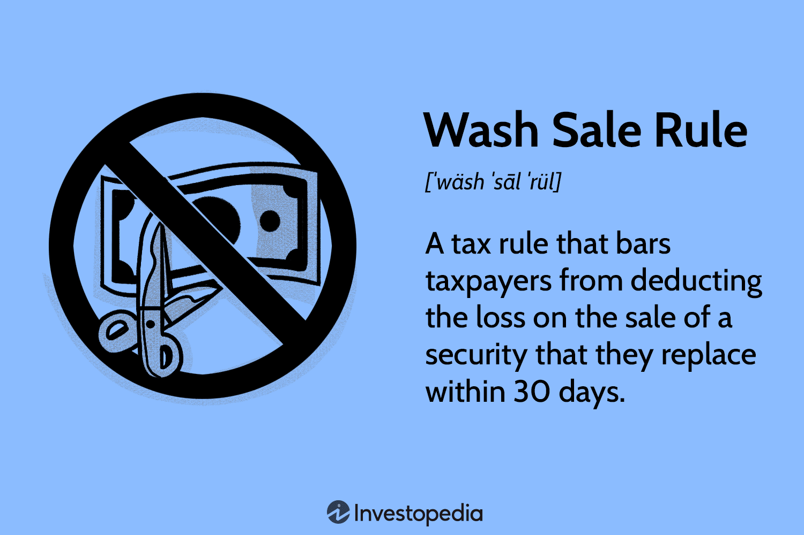

## Table of Contents

## What is a wash sale?

A wash sale happens when you sell a stock or security at a loss and then buy the same or a very similar stock or security within 30 days before or after the sale. The IRS has this rule to stop people from claiming a tax loss on a security while still keeping their investment in it. If you do a wash sale, you can't claim the loss on your taxes right away.

Instead, the loss gets added to the cost of the new stock or security you bought. This means your cost basis goes up. When you sell that new stock or security later, the increased cost basis will affect how much gain or loss you report. It's important to keep track of your transactions to make sure you follow the wash sale rule correctly.

## How does a wash sale occur?

A wash sale happens when you sell a stock or security at a loss and then buy the same or a very similar one within 30 days before or after the sale. The IRS made this rule to stop people from claiming a tax loss on a security while still keeping their investment in it. If you do a wash sale, you can't claim the loss on your taxes right away.

Instead, the loss gets added to the cost of the new stock or security you bought. This means your cost basis goes up. When you sell that new stock or security later, the increased cost basis will affect how much gain or loss you report. It's important to keep track of your transactions to make sure you follow the wash sale rule correctly.

## What is the purpose of the wash sale rule?

The wash sale rule is there to stop people from playing tricks with their taxes. If someone sells a stock at a loss just to get a tax break, but then buys the same stock back right away, they are not really losing their investment. The IRS made the wash sale rule to make sure people can't do this.

When you do a wash sale, you can't claim the loss on your taxes right away. Instead, the loss gets added to the cost of the new stock you bought. This means when you sell that new stock later, the amount you report as a gain or loss will be different. It's important to keep track of your buying and selling to follow this rule correctly.

## Which securities are affected by the wash sale rule?

The wash sale rule applies to stocks, bonds, and other securities like options and futures. If you sell any of these at a loss and buy the same or a very similar one within 30 days before or after the sale, it's considered a wash sale.

This rule also covers securities that are "substantially identical." This means if you sell a stock and then buy a different stock that is very similar, it might still count as a wash sale. It's important to know what counts as "substantially identical" to follow the rule correctly.

## What is the 30-day rule in wash sales?

The 30-day rule in wash sales means you can't sell a stock or security at a loss and then buy the same or a very similar one within 30 days before or after the sale. If you do this, it's called a wash sale. The IRS made this rule to stop people from claiming a tax loss on a security while still keeping their investment in it.

If you do a wash sale, you can't claim the loss on your taxes right away. Instead, the loss gets added to the cost of the new stock or security you bought. This means your cost basis goes up. When you sell that new stock or security later, the increased cost basis will affect how much gain or loss you report. It's important to keep track of your buying and selling to follow this rule correctly.

## How does a wash sale affect tax deductions?

When you do a wash sale, you can't take the loss as a tax deduction right away. The IRS has a rule that says if you sell a stock at a loss and buy the same or a very similar one within 30 days before or after the sale, you can't claim that loss on your taxes yet.

Instead, the loss gets added to the cost of the new stock you bought. This means when you sell that new stock later, the amount you report as a gain or loss will be different. It's important to keep track of your buying and selling to follow this rule correctly and know how it affects your taxes.

## Can you provide an example of a wash sale?

Imagine you bought 100 shares of XYZ Company for $10 each, so you spent $1,000. Later, the price drops to $8 per share, and you sell all your shares for $800. You lost $200 on this sale. But, if you buy 100 shares of XYZ Company again within 30 days before or after you sold them, that's a wash sale.

Because of the wash sale rule, you can't claim that $200 loss on your taxes right away. Instead, the $200 loss gets added to the cost of the new shares you bought. So, if you bought the new shares at $8 each, your new cost basis would be $10 per share ($8 + $2 from the loss). When you sell these new shares later, the higher cost basis will change how much gain or loss you report on your taxes.

## What are the consequences of violating the wash sale rule?

If you break the wash sale rule, you can't claim the loss on your taxes right away. The IRS made this rule to stop people from selling a stock at a loss just to get a tax break and then buying it back right away. If you do a wash sale, the loss you made gets added to the cost of the new stock you bought. This means when you sell that new stock later, the amount you report as a gain or loss will be different.

It's important to keep track of your buying and selling to follow this rule correctly. If you don't, you might end up reporting the wrong amount on your taxes. This could lead to problems with the IRS, like having to pay more taxes or even getting penalties. So, always make sure you know the rules and keep good records of your transactions.

## How can investors avoid triggering a wash sale?

Investors can avoid triggering a wash sale by waiting more than 30 days before buying back the same or a very similar stock after selling it at a loss. If you sell a stock and want to keep your investment in that company, you can wait over a month before buying it again. This way, you can claim the loss on your taxes right away without having to worry about the wash sale rule.

Another way to avoid a wash sale is to buy a different stock that is not considered "substantially identical" to the one you sold. For example, if you sell shares of one tech company, you could buy shares in a different tech company. This way, you can still invest in the same industry but avoid the wash sale rule. It's important to understand what counts as "substantially identical" to make sure you follow the rule correctly.

## Are there any exceptions to the wash sale rule?

There are a few exceptions to the wash sale rule that investors should know about. One big exception is if you sell a stock at a loss and then buy it back after more than 30 days have passed. This way, you can claim the loss on your taxes right away without worrying about the wash sale rule. Another exception is if you buy a different stock that is not considered "substantially identical" to the one you sold. For example, if you sell shares of one tech company, you could buy shares in a different tech company to avoid a wash sale.

Another important exception is for retirement accounts like IRAs and 401(k)s. If you sell a stock at a loss in a regular investment account and then buy the same stock in your IRA within 30 days, it does not count as a wash sale. This is because the IRS treats these accounts differently for tax purposes. However, you still need to be careful because buying the same stock in your IRA might affect how you can use the loss in your regular account. Always keep good records and understand the rules to make sure you follow them correctly.

## How do wash sales impact investment strategies?

Wash sales can change how investors plan their moves. If an investor wants to sell a stock at a loss to get a tax break, they need to wait more than 30 days before buying it back. This can mess up their plans if they want to keep their money in that stock. They might have to find other stocks to invest in during that time, which can be hard if they really believe in the first stock.

Another way wash sales affect strategies is by making investors think about what stocks are "substantially identical." If an investor sells a stock at a loss, they can't buy the same or a very similar one right away. This means they might need to look for different stocks in the same industry to keep their investment going. It's important for investors to know these rules so they can plan their moves without breaking the wash sale rule and messing up their taxes.

## What are the differences in wash sale rules between different countries?

Wash sale rules can be different in different countries. In the United States, the IRS says you can't sell a stock at a loss and buy the same or a very similar one within 30 days before or after the sale. If you do this, you can't claim the loss on your taxes right away. Instead, the loss gets added to the cost of the new stock you bought. This rule is to stop people from playing tricks with their taxes.

In Canada, they have a similar rule called the "superficial loss" rule. If you sell a stock at a loss and buy it back within 30 days, you can't claim the loss on your taxes. But in Canada, this rule also applies if someone else in your family or a company you control buys the stock back. This makes the rule a bit stricter than in the U.S. It's important for investors to know these rules in their country so they can plan their investments without breaking the law.

## References & Further Reading

[1]: ["IRS Publication 550: Investment Income and Expenses"](https://www.irs.gov/publications/p550) - This document provides guidelines on the IRS's wash sale rules, essential for understanding tax reporting requirements.

[2]: Mankoff, C. (2010). ["Algorithmic Trading: A Primer"](https://www.researchgate.net/publication/247907569_Algorithmic_Trading_A_Primer) - A comprehensive book discussing the complexities and strategies in algorithmic trading.

[3]: Pardo, R. (2008). ["The Evaluation and Optimization of Trading Strategies, 2nd Edition"](https://onlinelibrary.wiley.com/doi/book/10.1002/9781119196969) - This book provides insights into creating and testing algorithmic trading strategies.

[4]: ["Taxation of Securities Transactions"](https://support.lexisnexis.com/printandcd/downloads/00729_91_september24.pdf) - An academic article that investigates into the taxation of securities, providing context to the wash sale rule.

[5]: Aldridge, I. (2013). ["High-Frequency Trading: A Practical Guide to Algorithmic Strategies and Trading Systems"](https://books.google.com/books/about/High_Frequency_Trading.html?id=8QpIsVUMhmEC) - This guide offers a comprehensive overview of the role of algorithmic strategies in high-frequency trading.

[6]: Kissell, R. & Glantz, M. (2013). ["Optimal Trading Strategies: Quantitative Approaches for Managing Market Impact and Trading Risk."](https://www.amazon.com/Optimal-Trading-Strategies-Quantitative-Approaches/dp/0814407242) - Provides quantitative methods that can be incorporated into algorithmic trading to manage risk, including compliance with regulations like wash sale rules.