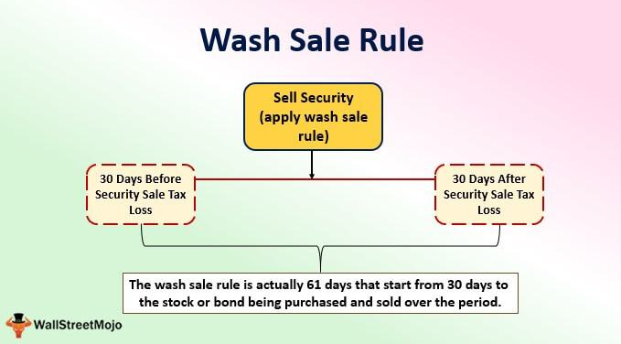

Investment strategies have evolved significantly over the years, influenced by market dynamics, technological advancements, and regulatory frameworks. Among these, tax considerations have consistently played a crucial role in shaping the decisions of investors. An essential component of tax strategies involves understanding the wash sale rules, a set of regulations established by the Internal Revenue Service (IRS) to prevent taxpayers from claiming artificial losses on the sale of securities.

The wash sale rule disallows a tax deduction for a security sold in a wash sale. A wash sale occurs when an investor sells a security at a loss and, within 30 days before or after this sale, purchases a substantially identical security. Understanding this rule is vital for investors seeking to optimize their tax strategies and ensure compliance. Navigating these regulations effectively can prevent unforeseen tax liabilities and improve the overall efficiency of tax planning.



The advent of algorithmic trading has further transformed investment strategies. Algorithmic trading, which utilizes complex algorithms to execute trades at high speeds and volumes, introduces new opportunities and challenges for investors. It influences investment strategies by enabling rapid decision-making and the execution of high-frequency trades, often beyond human capabilities. However, in this fast-paced environment, adherence to the wash sale rules becomes more challenging, necessitating a careful integration of compliance mechanisms within trading algorithms.

This article explores the intricate relationship between wash sale rules and investment strategies, focusing on both traditional and algorithmic trading environments. It begins with a comprehensive analysis of the wash sale rules, including their definition, purpose, and impact on tax deductions. Subsequently, it examines the implications of these rules on algorithmic trading, addressing how traders and automated systems can navigate compliance effectively. Further sections provide detailed insights into tax strategy considerations, practical tips to avoid wash sales, and the effective use of algorithmic trading in managing wash sale compliance. Throughout the article, real-world examples and strategic guidance are provided to enhance understanding and application in complex trading scenarios.

## Table of Contents

## Understanding Wash Sale Rules

Wash sales refer to transactions where an investor sells a security at a loss and subsequently reacquires the same or a substantially identical security within a 30-day window before or after the sale. This rule is established by the U.S. Internal Revenue Service (IRS) to prevent taxpayers from claiming tax deductions for losses on securities that they almost immediately repurchase, thus maintaining their investment position without genuinely realizing a financial loss.

The primary intent behind the wash sale rule is to prohibit investors from receiving undue tax benefits by creating artificial losses. By deterring these strategic repurchases, the IRS ensures that tax deductions accurately reflect the investor’s financial situation rather than being a product of manipulative trading practices.

Key components of the wash sale rule include the identification of "substantially identical" securities, the 61-day window framed by the 30 days before and after the loss sale, and the adjustment of the cost basis. If a wash sale is identified, the disallowed loss is added to the cost basis of the newly acquired securities, thus deferring the benefit of the loss until the replacement securities are eventually sold.

### Timeline of the Wash Sale Rule

The wash sale rule applies within a 61-day timeframe centered on the sale of the security at a loss:
- **Day -30 to Day 0**: Any purchase of a substantially identical security during this pre-sale period triggers the wash sale provision.
- **Day 0**: Sale of the security at a realized loss.
- **Day 1 to Day 30**: Any acquisition of a substantially identical security maintains the wash sale status.

### Effects on Tax Deductions and Investment Strategies

When a wash sale occurs, the investor cannot claim the realized loss on their current tax return as a deduction. Instead, the loss is added to the cost basis of the purchased security, impacting future capital gains taxes. This deferral mechanism encourages careful planning in both selling and buying actions, especially around year-end when tax loss harvesting is common.

An effective investment strategy must incorporate a clear understanding of wash sale rules to optimize tax implications. For instance, investors should consider diversification to avoid repurchasing identical positions or use different securities that have similar market exposure but are not substantially identical.

### Real-world Examples

Example 1: An investor sells 100 shares of XYZ Corporation on December 15th at a loss. If they purchase 100 shares of XYZ Corporation on January 3rd, this transaction falls within the 61-day wash sale window, and the loss cannot be deducted for that tax year.

Example 2: If an investor sells 50 shares of Company A at a loss and within 30 days purchases 50 shares of Company B, where Company A and Company B are substantially identical due to a merger announcement, the wash sale rule applies.

Understanding and navigating wash sale rules is critical for investors to avoid unintended tax consequences while maintaining compliance with IRS regulations. These rules influence trading decisions and portfolio management, particularly for those engaged in frequent trading activities.

## Navigating Wash Sale Rules in Algorithmic Trading

Algorithmic trading, characterized by its use of complex algorithms to execute and manage trading activities at high speed, must carefully navigate wash sale rules to maintain tax compliance. Wash sale rules, implemented by the Internal Revenue Service (IRS) in the United States, disallow the claiming of tax deductions on a security sold at a loss if an identical or substantially identical security is repurchased within 30 days before or after the sale date. These regulations introduce particular complexities for algorithmic traders, who often operate in high-frequency environments.

### Implications of Wash Sale Rules on Algorithmic Trading

In high-frequency trading ([HFT](/wiki/high-frequency-trading-strategies)), where decisions are made and executed in fractions of a second, the potential for wash sales is inherently higher due to the [volume](/wiki/volume-trading-strategy) and speed of transactions. Automatic algorithms often trigger trades based on market signals without manually considering the tax implications of each transaction. Consequently, algorithms not designed to account for wash sale constraints may inadvertently execute trades that fall afoul of these rules, leading to denied deductions and unexpected tax obligations.

### Managing Compliance in Algorithmic Trading

To manage compliance effectively, traders and automated systems must integrate wash sale awareness directly into their trading algorithms. One approach is to create an additional layer of checks that examines the recent transaction history and identifies if a potential trade may trigger a wash sale.

For example, traders can implement a logic module that delays or modifies trades predicted to violate wash sale rules. In Python, such a system might involve checking recent trade history prior to executing a trade:

```python
def is_wash_sale(transaction_list, new_trade, threshold_days=30):
    # Assume transaction_list is a list of past trades with 'date' and 'security'
    security = new_trade['security']
    trade_date = new_trade['date']

    for transaction in transaction_list:
        if transaction['security'] == security:
            # Check the time difference
            delta_days = abs((trade_date - transaction['date']).days)
            if delta_days <= threshold_days:
                return True
    return False
```

This script illustrates the concept of comparing the newly intended trade against past trades to determine if it would cause a wash sale.

### Challenges in a Fast-Paced Trading Environment

Algorithmic trades, especially those executed by HFT systems, produce an enormous quantity of transactions often involving the same or similar securities. Identifying, managing, and documenting potential wash sales in near-real time becomes increasingly challenging. The challenges are compounded by the need to align trading strategies with rapidly changing market conditions, often leaving little room to manually assess each potential wash sale.

Moreover, even sophisticated algorithms might struggle with gray areas, such as what constitutes a "substantially identical" security, adding more complexity to compliance. Traders often face a risk-versus-reward assessment wherein they must balance maximizing trading opportunities with the potential downstream tax implications.

Effectively navigating these challenges requires a combination of advanced algorithmic strategies and robust record-keeping practices. Compliance systems must continuously adapt to not only the evolving market conditions but also to regulatory requirements and interpretations of tax laws, including wash sale rules.

## Tax Strategy Considerations

Incorporating wash sale rules into broader tax planning requires careful consideration and strategic maneuvering. The wash sale rule, regulated by the IRS, disallows the claim of a tax deduction for a security sold in a wash sale. This rule mandates that any loss from the sale of securities is not deductible if a similar or identical security is purchased within 30 days before or after the sale. To effectively integrate these rules into tax strategy, several approaches can be considered.

One technique for minimizing taxable income through compliant transactions is to time the sale of securities such that the wash sale rule does not apply. By ensuring that there is no repurchase of the substantially identical security within the 61-day window—30 days before the sale, the sale day, and 30 days post-sale—investors can secure their eligibility to claim a tax deduction on capital losses. This timing strategy necessitates precise record-keeping and trading discipline but can effectively mitigate tax liabilities.

Exploring tax loss harvesting is another effective strategy for offsetting gains and adhering to wash sale rules. Tax loss harvesting involves selling securities at a loss to offset capital gains realized during the same tax year, thus reducing taxable income. The key is to reinvest in different but economically similar securities, maintaining the portfolio’s risk and return characteristics without triggering the wash sale rule. For instance, an investor might sell shares of an index fund based on one index and purchase shares of a fund based on a similar, but not identical, index.

### Example of Tax Loss Harvesting Strategy

Here's a simple Python code snippet demonstrating a scenario for tax loss harvesting:

```python
from datetime import datetime, timedelta

class Investment:
    def __init__(self, name, purchase_date, purchase_price, current_price):
        self.name = name
        self.purchase_date = purchase_date
        self.purchase_price = purchase_price
        self.current_price = current_price

    def calculate_loss(self):
        return self.purchase_price - self.current_price

    def days_held(self):
        return (datetime.now() - self.purchase_date).days

# Example investment
stock_a = Investment('Stock A', datetime(2023, 1, 1), 150, 100)

# Sell decision
loss = stock_a.calculate_loss()
if loss > 0 and stock_a.days_held() > 30:
    print(f"Consider selling {stock_a.name} to realize a loss of ${loss} for tax loss harvesting.")
else:
    print(f"Holding {stock_a.name} is preferable to avoid wash sales.")

```

The code calculates potential losses and suggests a sale if the holding period is appropriate, emphasizing compliance with wash sale rules.

Additionally, to enhance tax efficiency, investors can strategically pair capital losses with capital gains, offsetting them to reduce their overall taxable income. For instance, realized gains from the sale of appreciated stocks can be counterbalanced against losses from other investments, optimizing the tax liability over a fiscal period.

Ultimately, integrating wash sale rules into tax planning demands a nuanced understanding of the regulations and timely transaction execution. Investors should maintain comprehensive records and consider using tax reporting and trading software to streamline compliance and ensure optimal outcomes.

## Effective Use of Algorithmic Trading in Wash Sale Compliance

Algorithmic trading has become an indispensable tool in managing complex trading scenarios and ensuring compliance with regulatory frameworks, such as the wash sale rules. By leveraging sophisticated algorithms, traders can navigate the intricacies of financial markets, optimizing investment strategies while minimizing tax liabilities.

One of the primary advantages of [algorithmic trading](/wiki/algorithmic-trading) in this context is its ability to process vast amounts of data at high speed, executing trades based on predefined criteria without human intervention. This capability is particularly useful when attempting to avoid wash sales, which prohibit claiming tax losses on sales of securities if the same or substantially identical securities are purchased within 30 days before or after the sale.

Algorithmic systems can be designed to track these timelines meticulously, ensuring compliance by scheduling trades to avoid triggering wash sales. For instance, an algorithm could be set to identify potential wash sales situations and automatically postpone any buy orders that would infringe on the rules. By incorporating such constraints within the trading logic, algorithmic systems help maintain compliance effortlessly.

A practical algorithm example could involve a simple check for wash sales within the system's trading logic. The algorithm might include a function to review past transactions to identify potential wash sales and adjust the trade execution timing accordingly. Below is a Python pseudo-code to illustrate this approach:

```python
class TradingAlgorithm:
    def __init__(self):
        self.transactions = []  # Stores historical transactions

    def record_transaction(self, date, symbol, action, quantity):
        self.transactions.append({'date': date, 'symbol': symbol, 'action': action, 'quantity': quantity})

    def check_wash_sale(self, current_date, symbol):
        for t in self.transactions:
            if t['symbol'] == symbol and self.is_within_wash_sale_period(t['date'], current_date):
                if t['action'] == 'sell':
                    return True
        return False

    def is_within_wash_sale_period(self, transaction_date, current_date):
        delta = abs((current_date - transaction_date).days)
        return delta <= 30

    def execute_trade(self, date, symbol, action, quantity):
        if action == 'buy' and self.check_wash_sale(date, symbol):
            print(f"Wash sale potential detected. Postponing buy of {symbol}.")
            return False
        self.record_transaction(date, symbol, action, quantity)
        print(f"Executed {action} of {quantity} shares of {symbol}.")
        return True
```

The benefits of such implementations include reduced human error and enhanced efficiency in trading operations. Through automation, traders can ensure their transactions adhere to relevant tax rules without continuous manual oversight. Additionally, algorithms can assess market conditions in real-time, making informed decisions that optimize both investment returns and tax outcomes by strategically harvesting tax losses while adhering to legal requirements.

However, the use of algorithms is not without limitations. Despite their efficiency, they rely heavily on accurate data and pre-set conditions, which means they may not adapt well to unforeseen changes in market conditions or regulatory updates. Furthermore, the complexity of developing and maintaining such systems demands a high level of technical expertise, which may not be readily accessible to all investors.

In summary, while algorithmic trading offers significant advantages in managing wash sale compliance and optimizing tax scenarios, it requires careful design and constant evaluation to function effectively. By balancing automation with professional oversight, investors can benefit from both compliance and strategic advantages inherent in algorithmic trading.

## Practical Tips to Avoid Wash Sales

Investors looking to navigate the complexities of wash sale rules can adopt several practical strategies to ensure compliance and optimize their tax efficiency. Here are key approaches to consider:

### Stay Compliant with Wash Sale Rules

Maintaining compliance with wash sale rules requires a clear understanding of these regulations and disciplined trading habits. The wash sale rule disallows tax deductions on losses if the investor repurchases the same or a "substantially identical" security within 30 days before or after the sale date. To avoid inadvertently triggering this rule, consider spacing out trades beyond the 30-day window when planning to realize tax losses.

### Alternative Investments and Portfolio Diversification

A diversified investment portfolio can be an effective strategy to minimize the risk of wash sales. By incorporating a wide array of asset classes and securities, investors can reduce the likelihood of repurchasing identical or substantially similar securities. Consider investing in:

- **Exchange-Traded Funds (ETFs):** These provide exposure to numerous assets and sectors, offering diversity and flexibility. For example, if you sell a stock for a loss, purchasing an ETF with broader exposure to the market sector might avoid triggering the wash sale rule.

- **Different Classes of Securities:** Diversifying by adding fixed-income securities, commodities, or real estate investment trusts (REITs) can help maintain portfolio balance while avoiding the pitfalls of repurchasing similar equities.

### Maintain Accurate Records and Use Financial Software

Good record-keeping is crucial in managing wash sale rule compliance. Here are ways to ensure accuracy:

1. **Detailed Transaction Logs:** Keep comprehensive records of all trades, including dates, amounts, and purchasing prices. This helps identify and rectify any transactions that might trigger the wash sale rule.

2. **Leverage Financial Software:** Utilize financial software solutions like Quicken, TurboTax, or other specialized tax preparation tools to automate the tracking of trades. These programs can flag potential wash sales and assist in adjusting trading strategies accordingly.

3. **Regular Audits:** Periodically review and audit investment transactions to detect any inadvertent wash sales, particularly during tax season or before making significant portfolio changes.

Investors should consider these strategies to maintain compliance and maximize tax efficiency. While these tips provide a solid foundation, consulting with a financial advisor or tax professional can offer tailored guidance that aligns with individual financial goals and circumstances.

## Conclusion

The completion of our examination of wash sale rules and associated tax planning strategies reveals several essential insights for investors seeking to optimize their financial outcomes. A thorough understanding of wash sale regulations is pivotal in constructing effective tax strategies. These rules prevent investors from claiming a tax deduction on the loss from the sale of securities if they repurchase the same or substantially identical securities within a 30-day window before or after the sale.

The integration of algorithmic trading into investment portfolios presents both opportunities and complexities, particularly concerning compliance with wash sale rules. Algorithmic trading can expedite transactions and optimize tax positions, yet it necessitates robust systems to monitor and ensure adherence to regulatory frameworks.

Incorporating algorithms that are designed to circumvent potential wash sales can significantly benefit investors. These algorithms should be capable of real-time analysis and decision-making to maintain compliance while pursuing advantageous tax situations. However, the limitations inherent in pre-programmed systems underscore the need for continuous oversight and potential human intervention.

As investors employ these sophisticated strategies, it is crucial to reiterate the importance of personalized financial advice. Professional consultation can tailor strategies to individual circumstances, balancing the desire for optimized returns with the necessity of regulatory compliance. Financial advisors can provide bespoke solutions, ensuring that investment strategies not only align with legal standards but also support long-term financial objectives.

## References & Further Reading

[1]: ["IRS Publication 550: Investment Income and Expenses"](https://www.irs.gov/publications/p550) - This document provides guidelines on the IRS's wash sale rules, essential for understanding tax reporting requirements.

[2]: Mankoff, C. (2010). ["Algorithmic Trading: A Primer"](https://www.researchgate.net/publication/247907569_Algorithmic_Trading_A_Primer) - A comprehensive book discussing the complexities and strategies in algorithmic trading.

[3]: Pardo, R. (2008). ["The Evaluation and Optimization of Trading Strategies, 2nd Edition"](https://onlinelibrary.wiley.com/doi/book/10.1002/9781119196969) - This book provides insights into creating and testing algorithmic trading strategies.

[4]: ["Taxation of Securities Transactions"](https://support.lexisnexis.com/printandcd/downloads/00729_91_september24.pdf) - An academic article that investigates into the taxation of securities, providing context to the wash sale rule.

[5]: Aldridge, I. (2013). ["High-Frequency Trading: A Practical Guide to Algorithmic Strategies and Trading Systems"](https://books.google.com/books/about/High_Frequency_Trading.html?id=8QpIsVUMhmEC) - This guide offers a comprehensive overview of the role of algorithmic strategies in high-frequency trading.

[6]: Kissell, R. & Glantz, M. (2013). ["Optimal Trading Strategies: Quantitative Approaches for Managing Market Impact and Trading Risk."](https://www.amazon.com/Optimal-Trading-Strategies-Quantitative-Approaches/dp/0814407242) - Provides quantitative methods that can be incorporated into algorithmic trading to manage risk, including compliance with regulations like wash sale rules.