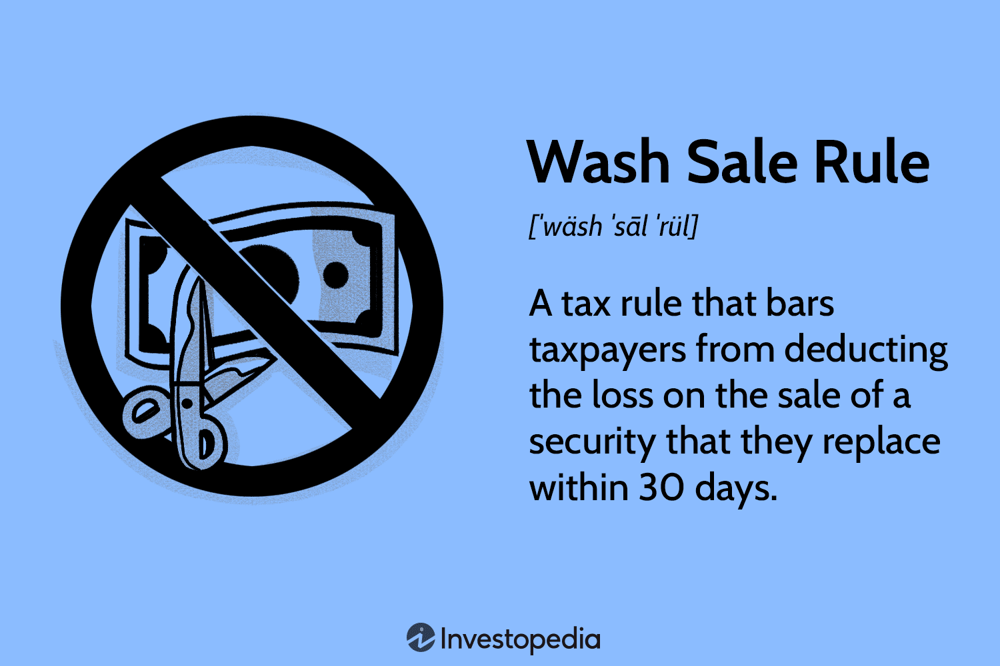

## Table of Contents

## What is a wash sale?

A wash sale happens when you sell a stock or security at a loss and then buy the same or a very similar security within 30 days before or after the sale. The idea behind this rule is to stop people from claiming a tax loss on a security while still keeping their investment in it. If you do a wash sale, you can't claim the loss on your taxes right away. Instead, the loss gets added to the cost of the new security you bought.

For example, if you bought a stock for $100 and it dropped to $70, you might sell it to claim a $30 loss. But if you buy the same stock again within 30 days, it's a wash sale. The $30 loss doesn't count for your taxes this year. Instead, it gets added to the cost of the new stock. So, if you buy the stock again for $70, your new cost basis becomes $100 ($70 purchase price + $30 disallowed loss). This rule can be tricky, so it's good to know about it when planning your investments and taxes.

## Why were wash sale rules created?

The wash sale rules were created to stop people from playing tricks with their taxes. Before these rules, someone could sell a stock at a loss to get a tax break and then quickly buy the same stock back. This let them keep their investment but also lower their taxes, which wasn't fair.

The government made the wash sale rules to make sure that if you want to claim a loss on your taxes, you really have to give up the investment. If you sell a stock and buy it back within 30 days, you can't claim the loss right away. Instead, the loss gets added to the cost of the new stock you bought. This way, the tax system stays fair and people can't use tricks to lower their taxes.

## How does the IRS define a wash sale?

The IRS says a wash sale happens when you sell a stock or security at a loss and then buy the same or a very similar security within 30 days before or after the sale. The rule is there to stop people from claiming a tax loss while still keeping their investment.

If you do a wash sale, you can't claim the loss on your taxes right away. Instead, the loss gets added to the cost of the new security you bought. This means you have to wait to use the loss on your taxes until you sell the new security and don't buy it back within 30 days.

## What transactions are considered wash sales?

A wash sale happens when you sell a stock or security at a loss and then buy the same or a very similar one within 30 days before or after the sale. The IRS says this rule stops people from getting a tax break while still keeping their investment. So, if you sell a stock at a loss and buy it back within 30 days, it's a wash sale.

This rule also applies if you buy a security that is almost the same as the one you sold. For example, if you sell shares of one tech company and buy shares of a different but very similar tech company within 30 days, it could still be a wash sale. The idea is to make sure you really give up your investment before you can claim a tax loss.

## What are the consequences of a wash sale?

When you do a wash sale, you can't claim the loss on your taxes right away. Instead, the loss gets added to the cost of the new stock or security you bought. This means you have to wait to use the loss on your taxes until you sell the new stock and don't buy it back within 30 days. It's like the loss is put on hold until you really give up your investment.

This rule can affect how you plan your taxes and investments. If you're not careful, you might end up with a higher tax bill than you expected because you can't claim the loss when you want to. It's important to keep track of when you buy and sell stocks to avoid wash sales if you're trying to use losses to lower your taxes.

## How long is the wash sale period?

The wash sale period lasts for 61 days in total. It starts 30 days before you sell a stock at a loss and ends 30 days after you sell it. So if you want to buy the same or a very similar stock again, you have to wait until after this 61-day period is over.

If you buy the stock back within these 61 days, it's called a wash sale. This means you can't claim the loss on your taxes right away. Instead, the loss gets added to the cost of the new stock you bought. You'll have to wait until you sell the new stock and don't buy it back within another 61 days to use that loss on your taxes.

## Can wash sales occur in different accounts?

Yes, wash sales can happen even if you use different accounts. The IRS looks at all your accounts together, not just one at a time. So if you sell a stock at a loss in one account and buy the same or a very similar stock in another account within 30 days before or after the sale, it's still a wash sale.

This rule applies to all your accounts, like your personal account, your retirement account, or any other investment account you have. It doesn't matter if the accounts are with different brokers or banks. The IRS wants to make sure you really give up your investment before you can claim a tax loss, so they check all your accounts to see if you're playing by the rules.

## How do wash sale rules affect tax deductions?

Wash sale rules stop you from taking a tax deduction right away when you sell a stock at a loss and buy it back within 30 days before or after the sale. If you do a wash sale, you can't claim the loss on your taxes immediately. Instead, the loss gets added to the cost of the new stock you bought. This means you have to wait until you sell the new stock and don't buy it back within another 30 days to use that loss on your taxes.

This rule can change how you plan your taxes and investments. If you're not careful, you might end up with a higher tax bill because you can't use the loss when you want to. It's important to keep track of when you buy and sell stocks to avoid wash sales if you're trying to use losses to lower your taxes.

## What are the penalties for violating wash sale rules?

There are no direct fines or penalties for breaking the wash sale rules. The main thing that happens is you can't take the tax loss right away. If you sell a stock at a loss and buy it back within 30 days, you can't claim that loss on your taxes immediately. Instead, the loss gets added to the cost of the new stock you bought.

This means you have to wait until you sell the new stock and don't buy it back within another 30 days to use that loss on your taxes. If you don't follow the rules, you might end up with a higher tax bill because you can't use the loss when you want to. It's important to keep track of when you buy and sell stocks to avoid wash sales if you're trying to use losses to lower your taxes.

## How can investors avoid triggering a wash sale?

To avoid a wash sale, investors should wait at least 31 days before buying back the same or a very similar stock after selling it at a loss. This means if you sell a stock on January 1st, you should not buy it back until after January 31st. By waiting this long, you can claim the loss on your taxes right away because you've really given up your investment.

Another way to avoid a wash sale is to buy a different stock that is not very similar to the one you sold. For example, if you sold shares of a tech company, you could buy shares of a company in a different industry. This way, even if you buy a new stock within 30 days, it won't be considered a wash sale because the stocks are not similar enough.

## Are there any exceptions to the wash sale rule?

There are some exceptions to the wash sale rule. One big exception is for professional traders who use the mark-to-market accounting method. This method lets them treat their investments as if they were sold at the end of the year, so they don't have to worry about wash sales. Another exception is if you sell a stock at a loss and your spouse or a company you control buys the same stock within 30 days. The IRS might see this as a way to get around the rules, so they could still call it a wash sale.

Another exception is for certain types of investments. For example, if you sell a stock at a loss and then buy options or futures on the same stock, it might not be considered a wash sale. But, if you buy the actual stock back within 30 days, it would still count as a wash sale. It's important to know these exceptions and talk to a tax professional to make sure you're following the rules correctly.

## How should investors report wash sales on their tax returns?

When you do a wash sale, you can't claim the loss on your taxes right away. Instead, you need to fill out Form 8949 when you file your taxes. On this form, you'll list the sale of the stock that caused the wash sale, but you won't be able to claim the loss. You'll also need to report the new purchase that triggered the wash sale. The loss from the wash sale gets added to the cost of the new stock you bought, which is called the adjusted cost basis.

When you eventually sell the new stock and don't buy it back within 30 days, you can then use the loss to lower your taxes. You'll report this on your tax return in the year you sell the new stock. It's a good idea to keep good records of all your stock sales and purchases, so you can show the IRS how you figured out your adjusted cost basis and when you can finally claim the loss. If you're not sure how to do this, talking to a tax professional can help make sure you're doing it right.

## What is Understanding Wash Sales?

A wash sale represents a scenario in which an investor sells a security at a loss, only to repurchase the same or a substantially identical security within a 30-day period before or after the sale. This practice is significant in the context of U.S. tax legislation, as defined by the Internal Revenue Service (IRS) under the Wash Sale Rule.

The IRS instituted the Wash Sale Rule to curtail the potential for investors to exploit the system by realizing artificial losses purely for tax benefits. By selling securities at a loss and promptly repurchasing identical or nearly identical securities, investors could otherwise reduce their taxable income without substantively altering their investment portfolios. This rule seeks to maintain the integrity of tax reporting by ensuring that losses deducted reflect genuine, economic setbacks rather than manipulative trading practices.

In essence, when a wash sale occurs, the IRS disallows the claimed loss for tax reduction in that particular tax year. Instead, the disallowed loss is added to the cost basis of the repurchased security. The formula for adjusting the cost basis can be represented as follows:

$$
\text{New Cost Basis} = \text{Purchase Price} + \text{Disallowed Loss}
$$

This adjustment in cost basis postpones the recognition of the loss until the repurchased securities are eventually sold in a manner that does not trigger another wash sale. Investors must be mindful that the wash sale rule applies to transactions within individual brokerage accounts or across multiple accounts, including retirement accounts such as IRAs.

Understanding the mechanics of a wash sale is crucial for precise tax reporting and compliance. By recognizing how the IRS computes the adjusted cost basis and the disallowance of losses, investors can avoid unexpected tax consequences and optimize their financial planning strategies effectively. This comprehension assists in maintaining an accurate reflection of investment performance and aligning with tax obligations.

## References & Further Reading

[1]: ["IRS Publication 550: Investment Income and Expenses"](https://www.irs.gov/publications/p550) - Provides detailed information on the tax implications of various investment activities, including the wash sale rule.

[2]: "Internal Revenue Code § 1091: Loss from wash sales of stock or securities" - The legislative basis for the wash sale rule as enforced by the IRS.

[3]: ["Algorithmic Trading: Winning Strategies and Their Rationale"](https://www.amazon.com/Algorithmic-Trading-Winning-Strategies-Rationale-ebook/dp/B00CY5HC0U) by Ernest P. Chan - Discusses algorithmic trading strategies and the importance of complying with tax rules.

[4]: ["Technical Analysis of the Financial Markets: A Comprehensive Guide to Trading Methods and Applications"](https://www.amazon.com/Technical-Analysis-Financial-Markets-Comprehensive/dp/0735200661) by John J. Murphy - Offers insights into trading methods, including considerations for tax efficiency.

[5]: ["Trading and Exchanges: Market Microstructure for Practitioners"](https://www.amazon.com/Trading-Exchanges-Market-Microstructure-Practitioners/dp/0195144708) by Larry Harris - Discusses market microstructure, trading practices, and regulatory considerations.