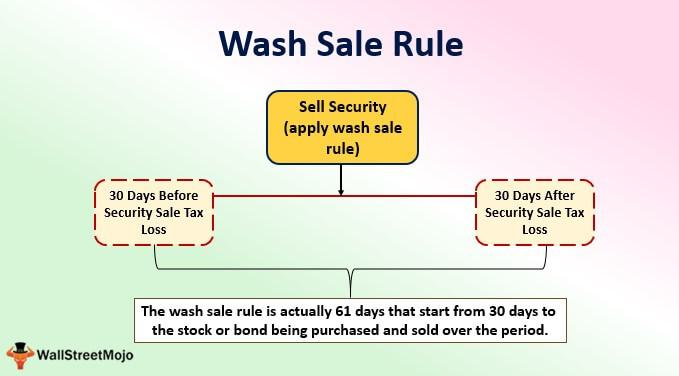

In the complex world of investment, understanding tax implications is crucial for maximizing gains and minimizing losses. Navigating the financial landscape requires not only an awareness of market dynamics but also a keen understanding of the tax regulations that govern investment activities. Among these regulations, the wash sale rule stands out as an important concept that investors need to master. This rule, designed by the Internal Revenue Service (IRS), prevents investors from claiming artificial losses on their taxes by selling a security at a loss and repurchasing the same or a substantially identical security within a short timeframe.

This article explores the nuances of wash sale investment penalties, tax regulations, and the impact of algorithmic trading. It aims to equip investors with the knowledge necessary to navigate these challenges effectively. Understanding these aspects is critical, as failure to comply with tax rules can lead to unintended financial consequences, including disallowed losses and altered cost bases for securities.



Whether you're a seasoned trader seeking to refine your strategies or a newcomer eager to optimize your investment decisions, comprehending the intricacies of wash sales can significantly influence your overall investment strategy. By gaining insights into these regulations and leveraging technology for compliance, investors can manage their portfolios in a tax-efficient manner, thereby enhancing their potential for financial success.

## Table of Contents

## Understanding Wash Sales

A wash sale represents a scenario in which an investor sells a security at a loss, only to repurchase the same or a substantially identical security within a 30-day period before or after the sale. This practice is significant in the context of U.S. tax legislation, as defined by the Internal Revenue Service (IRS) under the Wash Sale Rule.

The IRS instituted the Wash Sale Rule to curtail the potential for investors to exploit the system by realizing artificial losses purely for tax benefits. By selling securities at a loss and promptly repurchasing identical or nearly identical securities, investors could otherwise reduce their taxable income without substantively altering their investment portfolios. This rule seeks to maintain the integrity of tax reporting by ensuring that losses deducted reflect genuine, economic setbacks rather than manipulative trading practices.

In essence, when a wash sale occurs, the IRS disallows the claimed loss for tax reduction in that particular tax year. Instead, the disallowed loss is added to the cost basis of the repurchased security. The formula for adjusting the cost basis can be represented as follows:

$$
\text{New Cost Basis} = \text{Purchase Price} + \text{Disallowed Loss}
$$

This adjustment in cost basis postpones the recognition of the loss until the repurchased securities are eventually sold in a manner that does not trigger another wash sale. Investors must be mindful that the wash sale rule applies to transactions within individual brokerage accounts or across multiple accounts, including retirement accounts such as IRAs.

Understanding the mechanics of a wash sale is crucial for precise tax reporting and compliance. By recognizing how the IRS computes the adjusted cost basis and the disallowance of losses, investors can avoid unexpected tax consequences and optimize their financial planning strategies effectively. This comprehension assists in maintaining an accurate reflection of investment performance and aligning with tax obligations.

## Tax Penalties and Regulations for Wash Sales

The Internal Revenue Service (IRS) has specific regulations in place to address wash sales and prevent taxpayers from exploiting artificial losses for the purpose of tax reduction. Under the IRS Wash Sale Rule, if an investor sells a security at a loss and repurchases the same or a substantially identical security within a 30-day window before or after the sale, the loss is disallowed for tax deduction purposes. Instead of allowing the investor to claim a capital loss, the disallowed loss is added to the cost basis of the repurchased security. This increases the adjusted cost basis of the new security, thereby potentially reducing the taxable gain (or increasing the taxable loss) upon its eventual sale.

Consider the following example to illustrate how this adjustment works:

1. An investor sells Stock A at a loss of $1,000.
2. Within 30 days, they repurchase Stock A or a substantially identical stock.
3. The $1,000 loss is disallowed but is added to the repurchase price to form a new cost basis for the stock.

Mathematically, if the original purchase price $P_0$ of the security was $10,000, the sale price $S$ was $9,000 (representing a $1,000 loss), and the repurchase price $P_1$ is $9,500, then the new cost basis $P_{\text{new}}$ of the security becomes:  
$$
P_{\text{new}} = P_1 + \text{Disallowed Loss} = 9,500 + 1,000 = 10,500
$$

This recalculation affects the short-term and long-term capital gains taxes, which are determined by the difference between the sale price and the cost basis. By increasing the cost basis, future potential gains are reduced, thereby mitigating taxable income. However, should the asset be held long term (over one year), it may qualify for a lower long-term capital gains rate, which underscores the importance of timing and strategy in avoiding potential penalties associated with wash sales.

Additionally, the IRS imposes penalties on investors who violate the Wash Sale Rule, primarily through the disallowance of losses. The burden of compliance essentially falls on the investor to meticulously track transactions and adhere to these regulations. Violations, intentional or unintended, result in added administrative complexity, as the incorrect reporting of capital gains and losses can trigger further scrutiny by the IRS.

Given these tax implications and regulatory considerations, investors need to be particularly cautious when conducting transactions. Implementing careful tracking systems, possibly leveraging software tools, can ensure that investors remain compliant and optimize their tax outcomes when managing their portfolios.

## Strategies to Avoid Wash Sales

Investors aiming to avoid wash sales and maintain tax efficiency should adopt strategic approaches that comply with tax regulations. Understanding the nuances of timing, alternative investment options, and portfolio management is crucial in circumventing the wash sale rule.

#### Timing Techniques

One of the primary strategies to avoid wash sales is careful timing of trades. The wash sale rule defines a 61-day period surrounding the sale of a security (30 days before and 30 days after the sale date). To comply, investors can ensure that they do not repurchase the same or a substantially identical security within this window. Utilizing a calendar or financial software to track purchase and sale dates can help investors avoid unintentional violations.

#### Alternative Investment Options

Diversifying investment options can also help prevent wash sales. Investors may consider the following approaches:
- **Substitute Securities**: Instead of repurchasing the same security, investors can buy securities in a related but not "substantially identical" industry or sector. For instance, if a wash sale involves a specific technology stock, purchasing a related technology exchange-traded fund (ETF) may be a viable alternative.
- **Index Funds and ETFs**: Investing in index funds or sector-specific ETFs can provide exposure to a desired market segment without triggering the wash sale rule. These investment vehicles are diversified by design, reducing the likelihood of substantial identity with individual stocks previously sold.

#### Waiting Periods

Investors have the option to leverage waiting periods to comply with wash sale regulations effectively. By simply waiting for the 30-day period to elapse before repurchasing the same or a substantially identical security, an investor eliminates the risk of a wash sale. This technique, while straightforward, requires discipline and careful portfolio monitoring to avoid missing potential opportunities due to waiting.

#### Portfolio Management Techniques

Proactive portfolio management is essential for maintaining tax efficiency. Here are some techniques:
- **Tax Loss Harvesting Strategy**: Implementing a strategic tax loss harvesting process can help minimize tax liabilities without triggering a wash sale. This strategy involves selling securities that have experienced a decline to offset gains from other investments.
- **Balanced Portfolio Adjustments**: Regularly reviewing and adjusting a portfolio to ensure balance without recurrently involving the same securities can mitigate the risk of wash sales. Rebalancing should consider the 30-day rule, particularly when substituting investments or reinvesting proceeds.

#### Leveraging Technology

Advanced software tools and financial management programs can automate many aspects of managing investments and ensure compliance with tax rules. By integrating these technologies, traders can:
- Track holding periods accurately and receive alerts when approaching the wash sale 30-day window.
- Generate reports highlighting potential wash sales, helping investors take corrective action before executing trades.
- Optimize tax-loss harvesting strategies through algorithmically driven decision-making processes.

By employing these strategies and techniques, investors can effectively navigate the complexities of wash sales, optimize their portfolios, and uphold tax efficacy.

## The Role of Algorithmic Trading in Wash Sales

Algorithmic and high-frequency trading ([HFT](/wiki/high-frequency-trading-strategies)) have significantly changed how traders operate in financial markets, introducing both advantages and challenges regarding wash sales and related tax regulations. These trading strategies rely heavily on algorithms to execute trades at speeds and volumes far beyond what can be achieved manually, leading to unintentional violations of the Wash Sale Rule due to sheer [volume](/wiki/volume-trading-strategy) and complexity.

Algorithmic trading uses computer algorithms to determine the optimal timing, price, and quantity of trades based on pre-set criteria. These algorithms can execute thousands of transactions per second, sometimes resulting in trades that unintentionally fall within the 30-day wash sale window. For instance, if an algorithm sells a security at a loss and then repurchases a similar security within this window, it could inadvertently trigger a wash sale. The primary issue lies in the speed and frequency at which these transactions occur, making comprehensive human oversight challenging.

The challenges associated with adhering to tax regulations with [algorithmic trading](/wiki/algorithmic-trading) are compounded by the intricate nature of these algorithms. Programmers and traders must ensure that their algorithms account for tax considerations like the wash sale rule, a task often overlooked in the pursuit of trading efficiency and speed. This oversight can lead to significant tax penalties or disallowed tax benefits, affecting an investment's overall financial performance.

The use of technology and advanced software solutions can mitigate these challenges. Many trading platforms now offer features designed to help traders avoid wash sales. For instance, they can be programmed to recognize when a sale occurs at a loss and prevent the repurchase of the same or substantially identical security within the wash sale window. Python-based tools and libraries, such as Pandas for data analysis, can assist in identifying trades that might lead to wash sales, providing crucial insights and alerts.

Here is a simple Python example using Pandas to track potential wash sales:

```python
import pandas as pd
from datetime import timedelta

# Sample transaction data
data = {'Date': ['2023-01-01', '2023-01-15', '2023-01-20'],
        'Action': ['Sell', 'Buy', 'Buy'],
        'Symbol': ['AAPL', 'AAPL', 'AAPL'],
        'Price': [150, 155, 152],
        'Quantity': [100, 100, 100]}

df = pd.DataFrame(data)
df['Date'] = pd.to_datetime(df['Date'])

# Identify potential wash sales
for i, sell in df[df['Action'] == 'Sell'].iterrows():
    sell_date = sell['Date']
    symbol = sell['Symbol']
    wash_window_start = sell_date
    wash_window_end = sell_date + timedelta(days=30)

    potential_wash_sales = df[(df['Action'] == 'Buy') &
                              (df['Symbol'] == symbol) &
                              (df['Date'] > wash_window_start) &
                              (df['Date'] <= wash_window_end)]

    if not potential_wash_sales.empty:
        print(f"Potential wash sale detected for {symbol} on {sell_date.date()}")
```

This code identifies buy transactions that occur within 30 days after a sale of the same stock, helping traders and programmers locate instances that may violate the Wash Sale Rule.

Furthermore, dedicated compliance software can automatically adjust the tax impact of trades, ensuring that disallowed losses are properly added to the cost basis of repurchased securities. This automation is essential in maintaining regulatory compliance at the rapid pace of modern trading.

As algorithmic trading continues to grow, the financial industry faces increased scrutiny to ensure compliance not only with the Wash Sale Rule but also broader regulatory frameworks. Regulatory bodies are adapting by developing more advanced analytics to monitor and assess trading patterns, highlighting the necessity for ongoing innovation in compliance technologies within the trading ecosystem.

## Conclusion

In conclusion, understanding the complexities of wash sales and associated tax penalties is crucial for investors seeking to optimize their financial strategies. Wash sales occur when investors attempt to realize a tax-deductible loss while maintaining a position in the same or a similar security, triggering specific IRS regulations designed to prevent tax evasion. The penalties for violating the Wash Sale Rule can be significant, including disallowed losses that are added to the cost basis of repurchased securities, affecting future taxable events.

Investors can employ strategic measures to avoid wash sales, such as adhering to the 30-day rule for repurchasing securities, exploring alternative investment options, or utilizing wait-out periods. These strategies not only help maintain compliance with tax regulations but also optimize portfolio performance.

The advent of algorithmic and high-frequency trading has added complexity to complying with wash sale regulations due to their rapid and automated nature. It is essential for investors using these technologies to ensure robust systems are in place to monitor and adhere to tax laws, thereby minimizing unintentional violations.

Staying informed about current tax regulations and leveraging technology can significantly contribute to effective investment management. Investors are encouraged to seek professional advice for navigating intricate tax scenarios, ensuring compliance and strategic financial planning. By engaging with knowledgeable professionals and employing appropriate technologies, investors can better navigate the financial markets and mitigate the risks associated with wash sales.

## References & Further Reading

[1]: ["IRS Publication 550: Investment Income and Expenses"](https://www.irs.gov/publications/p550) - Provides detailed information on the tax implications of various investment activities, including the wash sale rule.

[2]: "Internal Revenue Code § 1091: Loss from wash sales of stock or securities" - The legislative basis for the wash sale rule as enforced by the IRS.

[3]: ["Algorithmic Trading: Winning Strategies and Their Rationale"](https://www.amazon.com/Algorithmic-Trading-Winning-Strategies-Rationale-ebook/dp/B00CY5HC0U) by Ernest P. Chan - Discusses algorithmic trading strategies and the importance of complying with tax rules.

[4]: ["Technical Analysis of the Financial Markets: A Comprehensive Guide to Trading Methods and Applications"](https://www.amazon.com/Technical-Analysis-Financial-Markets-Comprehensive/dp/0735200661) by John J. Murphy - Offers insights into trading methods, including considerations for tax efficiency.

[5]: ["Trading and Exchanges: Market Microstructure for Practitioners"](https://www.amazon.com/Trading-Exchanges-Market-Microstructure-Practitioners/dp/0195144708) by Larry Harris - Discusses market microstructure, trading practices, and regulatory considerations.