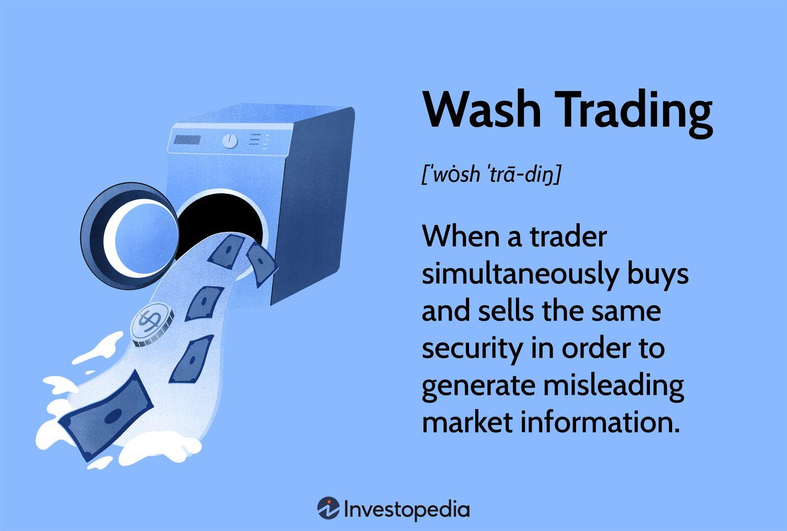

## Table of Contents

## What is wash trading?

Wash trading is when someone buys and sells the same thing over and over again to trick people. They do this to make it look like there is a lot of trading happening, but really, it's just the same person or group doing it. This can make other people think that the thing being traded is more popular or valuable than it really is.

This kind of trading is not allowed because it's dishonest. It can happen in many places, like stock markets or cryptocurrency markets. People who do wash trading might want to push the price up or down to make money from other traders who don't know what's going on. It's important for markets to be fair, so rules are made to stop wash trading.

## Why is wash trading considered illegal or unethical?

Wash trading is considered illegal and unethical because it creates a false picture of how much trading is really happening. When someone does wash trading, they trick other people into thinking that a stock or cryptocurrency is more popular or valuable than it actually is. This can lead to people making bad decisions about buying or selling, based on the fake information they see. It's like cheating in a game to make it look like you're winning when you're not.

This kind of trading is unfair because it hurts other people who are trying to trade honestly. It goes against the rules that are meant to keep markets fair for everyone. When wash trading happens, it can mess up the whole market and make people lose trust in it. That's why there are laws and rules to stop wash trading and to punish those who do it, to protect everyone who uses the market.

## How does wash trading manipulate market prices?

Wash trading can make the price of something go up or down by making it look like there is a lot of buying and selling happening. When someone does wash trading, they keep buying and selling the same thing to themselves. This makes it look like there are many people interested in it, which can trick other people into thinking it's popular or valuable. If more people start buying because they see all this activity, the price can go up.

On the other hand, if the person doing wash trading wants the price to go down, they can sell the same thing to themselves over and over. This makes it look like a lot of people are trying to get rid of it, which can scare other people into selling too. When many people start selling, the price can go down. This is how wash trading can trick the market and change prices in a way that's not fair.

## What are the common signs of wash trading?

One common sign of wash trading is when you see a lot of trading happening for the same thing, but the price doesn't change much. This can happen because the same person or group is buying and selling to themselves, so the price stays the same even though it looks like there's a lot of activity. Another sign is if the trading volume, which means how much is being bought and sold, is much higher than usual for no clear reason. This can make people think that something is more popular than it really is.

Another thing to watch out for is if the same amounts of the thing are being bought and sold over and over again. For example, if you see the same number of shares or the same amount of [cryptocurrency](/wiki/cryptocurrency) being traded back and forth, it might be a sign of wash trading. It's also suspicious if the trading happens at times when not many people are usually trading, like late at night or very early in the morning. These patterns can help you spot when someone might be trying to trick the market.

## Can you explain the basic mechanism of wash trading?

Wash trading is when someone trades the same thing back and forth with themselves to make it look like there is a lot of buying and selling. They do this to trick other people into thinking that the thing, like a stock or cryptocurrency, is more popular or valuable than it really is. By making it seem like there's a lot of activity, they hope to get more people to start trading it too.

The person doing wash trading might buy and sell the same amount of the thing over and over again. This can make the trading volume, which is how much is being bought and sold, look very high. But since they are just trading with themselves, the price might not change much, even though it looks busy. This can fool other people into thinking the price should go up because of all the activity, or down if they see a lot of selling.

## What are some historical examples of wash trading?

One famous example of wash trading happened in the 1920s with a man named Richard Whitney. He was the president of the New York Stock Exchange and got caught doing wash trading. He and his brother used their own money to buy and sell stocks to each other to make it look like there was a lot of trading happening. This made other people think the stocks were more popular than they really were. When people found out, Whitney went to jail, and it helped lead to new rules to stop wash trading.

Another example happened more recently with cryptocurrencies. In 2019, a company called Bitfinex was accused of wash trading. They were said to have traded their own cryptocurrency back and forth to make it look like there was a lot of interest in it. This was to trick other people into buying it and make the price go up. Even though Bitfinex said they didn't do it, the case showed how wash trading can still happen today and why people need to be careful.

## How do regulatory bodies detect wash trading?

Regulatory bodies use special tools and methods to find wash trading. They watch trading patterns very closely. If they see the same amount of something being bought and sold over and over again, it might be a sign of wash trading. They also look at the times when trading happens. If a lot of trading is happening at weird times, like late at night, it could be someone trying to trick the market. By keeping an eye on these patterns, regulatory bodies can spot when someone might be doing wash trading.

Another way regulatory bodies detect wash trading is by using computer programs that can find strange trading behavior. These programs can look at a lot of data very quickly and find things that don't seem right. For example, if the trading volume is much higher than usual but the price doesn't change much, the program can flag it as possible wash trading. By using these tools, regulatory bodies can catch people who are trying to cheat and keep the market fair for everyone.

## What penalties can individuals or entities face for engaging in wash trading?

People or companies caught doing wash trading can face big penalties. In many places, it's against the law, so they might have to pay a lot of money as a fine. The fine can be many thousands or even millions of dollars, depending on how bad the wash trading was and how much it hurt other people. They might also have to give back any money they made from the wash trading. This is called disgorgement, and it's meant to take away any profit they got from cheating.

Besides fines and disgorgement, those caught doing wash trading can face other punishments. They might be banned from working in the financial industry, which means they can't trade stocks or work at a stock exchange anymore. Sometimes, they can even go to jail. The length of time they spend in jail can depend on how serious the wash trading was. All these penalties are meant to stop people from doing wash trading and to keep the market fair for everyone.

## How does wash trading affect genuine investors?

Wash trading can really hurt genuine investors. When someone does wash trading, they make it look like a lot of people are buying and selling a stock or cryptocurrency. This can trick real investors into thinking that the thing is more popular or valuable than it really is. They might then buy it, thinking it's a good investment, but the price might go up only because of the fake trading. If the price goes down later, these investors could lose money because they were tricked by the wash trading.

This kind of trading also makes it hard for real investors to trust the market. When they see strange trading patterns, they might get worried and not want to invest at all. This can make the whole market less fair and less safe. Genuine investors need to know that the prices they see are real and not just the result of someone trying to cheat. When wash trading happens, it can shake their confidence and make them less likely to invest in the future.

## What are the technological methods used to carry out wash trading?

People who do wash trading often use computer programs called bots to make it happen. These bots can buy and sell the same thing over and over again very quickly. They can do this without anyone noticing because they work automatically. The bots can be set up to trade at times when not many people are watching, like late at night, to make it harder to spot the fake trading. By using these bots, the people doing wash trading can make it look like there's a lot of activity happening in the market.

Sometimes, people use special software to hide their wash trading. This software can make it look like different people are trading when it's really just the same person or group. They might use fake accounts or trade through different computers to make it seem like more people are involved. This can trick others into thinking there's a lot of interest in something when there isn't. By using these technological tricks, people doing wash trading try to fool the market and other investors.

## How can exchanges and platforms prevent wash trading?

Exchanges and platforms can stop wash trading by watching the market closely. They use special computer programs that can spot strange trading patterns. These programs look for things like the same amount of something being bought and sold over and over again, or a lot of trading happening at weird times. If they see these signs, they can stop the trading and check if it's wash trading. By keeping a close eye on everything, exchanges can catch people who are trying to cheat and keep the market fair for everyone.

Another way exchanges and platforms can prevent wash trading is by making strict rules and checking traders carefully. They can ask traders to prove who they are and where their money comes from. This makes it harder for people to use fake accounts to do wash trading. Exchanges can also set limits on how much someone can trade in a short time, which can stop bots from doing a lot of fake trading. By having these rules and checks, exchanges can make it much harder for wash trading to happen.

## What are the latest trends and techniques in wash trading detection?

The latest trends in wash trading detection focus a lot on using smart computer programs called algorithms. These programs can look at huge amounts of trading data really fast and find patterns that might mean someone is doing wash trading. They watch for things like the same amount of a stock or cryptocurrency being bought and sold over and over again, or a lot of trading happening at strange times. These algorithms are getting better at spotting wash trading because they can learn from past data and get smarter over time.

Another technique that's becoming more popular is using something called blockchain analytics. This is especially important for detecting wash trading in cryptocurrency markets. Blockchain is like a big, public record book that keeps track of all the trades. By looking at this record, people can see if the same person or group is trading with themselves a lot. This can help find wash trading and stop it before it tricks other people. Both of these methods are helping to make markets safer and fairer for everyone.

## What are the Mechanics of Wash Trading?

Wash trading is a practice that involves creating artificial trading activity to manipulate market perceptions and conditions. At its core, wash trading is executed through simultaneous buy and sell orders, which give the appearance of genuine market interest without any actual change in ownership or market supply.

Sophisticated traders often use multiple trading accounts or work in coordination with brokers to mask the true nature of these trades. For instance, a trader might control several accounts to conduct self-dealing trades or engage in reciprocal arrangements with other traders or brokers. By layering trades across these accounts, they obscure the origin and intent of the trades, making it challenging for outsiders to detect manipulation.

The primary goal of wash trading is to inflate trading volumes artificially. Volume data is a critical metric for investors as it is often interpreted as an indicator of market [liquidity](/wiki/liquidity-risk-premium) and interest. By manipulating this data, wash traders can influence the perception of an asset's market activity and value. This false [volume](/wiki/volume-trading-strategy) can lead to several market distortions. Firstly, it can create the illusion of liquidity, making an asset appear more active or desirable than it truly is. Secondly, it can attract genuine investors based on fabricated data, leading to misguided investment decisions.

The formula for the manipulation of trading volume through wash trading can be mathematically represented as follows:

$$
V_{\text{fake}} = V_{\text{real}} + V_{\text{wash}}
$$

where $V_{\text{fake}}$ is the total perceived trading volume including wash trades, $V_{\text{real}}$ is the actual trading volume without wash trades, and $V_{\text{wash}}$ represents the volume added by wash trading activities.

This artificial activity impacts the decision-making process of genuine investors who rely on volume as a key indicator of market health and direction. By skewing volume data, wash trading introduces misinformation into the market, potentially leading to flawed analyses and investment strategies based on inaccurate assumptions of market dynamics.

## What are Algorithmic and High-Frequency Trading Strategies?

Algorithmic trading and high-frequency trading ([HFT](/wiki/high-frequency-trading-strategies)) are pivotal components of modern financial markets, allowing traders to execute orders at millisecond speeds. While these technologies offer efficiencies and potential for greater market liquidity, they also present opportunities for exploitative practices such as wash trading to occur undetected.

Algorithmic trading involves the use of computer algorithms to automate trading processes. These algorithms analyze market data and can initiate trades based on predetermined criteria with little to no human intervention. Similarly, high-frequency trading employs algorithms but focuses on executing a large number of orders in extremely short time frames, leveraging speed to capitalize on small price discrepancies.

Both [algorithmic trading](/wiki/algorithmic-trading) and HFT can be exploited for wash trading due to their capacity to rapidly execute and cancel large volumes of trades, thus creating a façade of market activity and liquidity. This manipulation occurs as the algorithm cycles trade orders through various accounts to simulate demand or trading interest, deceiving other market participants by distorting volume and price data.

Consider a simple mathematical model where an algorithm rapidly trades an asset by executing a buy order of quantity $Q$ at price $P$ and simultaneously or subsequently pushing a sell order for the same quantity $Q$. If repeated swiftly enough, this can simulate heightened activity without any net change in the trader’s position:

$$
\text{Net Position} = (Q_{buy} \times P_{buy}) - (Q_{sell} \times P_{sell}) = 0
$$

In Python, a basic algorithm that could theoretically facilitate such behavior might look like this:

```python
def execute_wash_trade(symbol, quantity, price, trade_function):
    for _ in range(iterations):  # assuming `iterations` dictates the number of trade cycles
        trade_function(symbol, 'buy', quantity, price)
        trade_function(symbol, 'sell', quantity, price)

execute_wash_trade('XYZ', 1000, 50.0, market_trade)
```

Despite the potential for misuse, algorithmic systems also offer opportunities to bolster compliance and market integrity. By embedding compliance protocols within trading algorithms, firms can automatically screen trades for legality and legitimacy, ensuring that only valid trades are executed. Additionally, these systems can log extensive trade data, providing transparency and facilitating regulatory audits.

The dual potential of algorithmic and high-frequency trading—for both deception and enforcement—underscores the need for robust regulatory frameworks and technological oversight to prevent the erosion of market trust. Enhancements in detection algorithms and stricter compliance mechanisms are essential for ensuring that these sophisticated trading strategies are used ethically and transparently.

## References & Further Reading

[1]: Pardo, R. (2008). ["The Evaluation and Optimization of Trading Strategies."](https://onlinelibrary.wiley.com/doi/book/10.1002/9781119196969) John Wiley & Sons.

[2]: Rusu, F., & Dobra, A. (2012). ["Statistical Detection of Market Manipulation Patterns."](https://scholar.google.com/citations?user=8PfpzuEAAAAJ&hl=en) Theoretical Computer Science, 443, 104-120.

[3]: Narang, R. K. (2013). ["Inside the Black Box: A Simple Guide to Quantitative and High-Frequency Trading."](https://onlinelibrary.wiley.com/doi/book/10.1002/9781118662717) John Wiley & Sons.

[4]: Gomber, P., Sagade, S., Theissen, E., Weber, M. C., & Zimmermann, K. (2016). ["Competition between Equity Markets: A Review of the Consolidation Versus Fragmentation Debate."](https://www.semanticscholar.org/paper/Competition-between-Equity-Markets%3A-A-Review-of-the-Gomber-Sagade/100f95091bffcb63d9c4ff39b841df34e05a3dba) Journal of Economic Surveys, 30(3), 512-551.

[5]: Easley, D., López de Prado, M. M., & O'Hara, M. (2012). ["The Volume Clock: Insights into the High Frequency Paradigm."](https://www.semanticscholar.org/paper/The-Volume-Clock%3A-Insights-into-the-High-Frequency-Easley-Prado/c56c19929ea91468852ff183b677b8f1169b5ca8) The Journal of Portfolio Management, 22(1), 31-32.