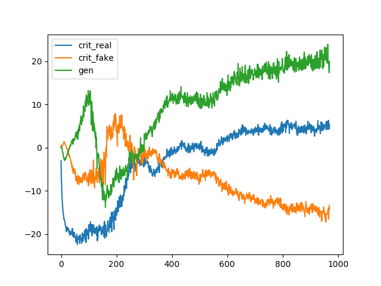

## Table of Contents

## What is Wasserstein Loss in machine learning?

Wasserstein Loss, also known as Earth Mover's Distance, is a way to measure how different two probability distributions are. In machine learning, especially in generative models like GANs (Generative Adversarial Networks), it helps the model learn better by giving a smoother path to improve. Imagine you have two piles of sand, and you want to move one pile to match the other. The Wasserstein Loss tells you the least amount of work needed to do that. This is different from other losses like the Kullback-Leibler divergence, which might not work well when the distributions are very different.

Using Wasserstein Loss in GANs can make training more stable. When training a GAN, the generator tries to create data that looks real, and the discriminator tries to tell real data from fake data. If the generator is far from making good data, other losses might give up or jump around a lot. But Wasserstein Loss keeps pushing the generator to get better, even if it's far from perfect. This makes the whole training process smoother and helps the model learn to create better data over time.

## How does Wasserstein Loss differ from other loss functions like Mean Squared Error?

Wasserstein Loss and Mean Squared Error (MSE) are used to measure how well a model is doing, but they work in different ways. MSE is simple and common. It looks at the difference between what the model predicts and what the actual answer is, then squares those differences and averages them. It's great for problems where you want to minimize the average error, like predicting house prices. But, MSE can be sensitive to outliers because squaring the errors makes big mistakes even bigger.

Wasserstein Loss, on the other hand, is about comparing how different two sets of data are, like two piles of sand. Imagine you need to move one pile to match the other. Wasserstein Loss measures the least amount of work needed to do that. This is useful in [machine learning](/wiki/machine-learning) models like GANs, where you want the generated data to look as close as possible to real data. Unlike MSE, Wasserstein Loss can handle cases where the two sets of data are very different, making it better for training models that need to learn from scratch.

In summary, while MSE focuses on minimizing the average squared error between predictions and actual values, Wasserstein Loss is about finding the most efficient way to make two distributions match. This difference makes Wasserstein Loss particularly valuable in scenarios where the model's output needs to gradually improve from being very different to being very similar to the target distribution.

## What are the mathematical foundations of Wasserstein Loss?

Wasserstein Loss, also known as Earth Mover's Distance, comes from the idea of moving "earth" or mass from one place to another. Imagine you have two piles of sand, and you want to move one pile to look exactly like the other. The Wasserstein Loss measures the least amount of work needed to do this. Mathematically, if you have two probability distributions $P$ and $Q$, the Wasserstein distance between them can be described as the solution to an optimization problem. It's about finding the best way to transport mass from $P$ to $Q$ with the least cost. The formula for the Wasserstein distance $W(P, Q)$ between two distributions is given by:

$$W(P, Q) = \inf_{\gamma \in \Pi(P, Q)} \mathbb{E}_{(x, y) \sim \gamma}[\|x - y\|]$$

Here, $\Pi(P, Q)$ is the set of all joint distributions $\gamma(x, y)$ whose marginals are $P$ and $Q$, and $\|x - y\|$ is the cost of moving a unit of mass from $x$ to $y$. The $\inf$ means we're looking for the smallest possible value, which represents the minimum amount of work needed. This approach is different from other loss functions like Mean Squared Error, which directly measure the difference between predicted and actual values. Wasserstein Loss is useful in machine learning because it provides a smooth and continuous measure of how different two distributions are, even when they are far apart. This makes it particularly valuable in training generative models like GANs, where the goal is to make the generated data look as close as possible to real data.

## Why is Wasserstein Loss particularly useful in Generative Adversarial Networks (GANs)?

Wasserstein Loss is particularly useful in Generative Adversarial Networks (GANs) because it helps the training process be more stable and smooth. In GANs, the generator tries to create data that looks real, and the discriminator tries to tell real data from fake data. Sometimes, if the generator is far from making good data, other loss functions might give up or jump around a lot. But Wasserstein Loss keeps pushing the generator to get better, even if it's far from perfect. This is because Wasserstein Loss measures the least amount of work needed to move one set of data to look like another. It's like moving sand from one pile to another until they match. This makes the whole training process smoother and helps the model learn to create better data over time.

In more technical terms, the Wasserstein Loss, also known as Earth Mover's Distance, is defined as the solution to an optimization problem. If you have two probability distributions $P$ and $Q$, the Wasserstein distance $W(P, Q)$ between them is given by:

$$W(P, Q) = \inf_{\gamma \in \Pi(P, Q)} \mathbb{E}_{(x, y) \sim \gamma}[\|x - y\|]$$

Here, $\Pi(P, Q)$ is the set of all joint distributions $\gamma(x, y)$ whose marginals are $P$ and $Q$, and $\|x - y\|$ is the cost of moving a unit of mass from $x$ to $y$. The $\inf$ means we're looking for the smallest possible value, which represents the minimum amount of work needed. This continuous and smooth measure of distance between distributions is what makes Wasserstein Loss so valuable in GANs. It allows the generator to gradually improve its output, even when it starts far from the target distribution, leading to more stable and effective training.

## How can Wasserstein Loss help in training more stable GANs?

Wasserstein Loss helps in training more stable GANs because it gives a smoother path for the generator to improve. Imagine you're trying to make a pile of sand look like another pile. The Wasserstein Loss measures the least amount of work needed to move the sand from one pile to the other. In GANs, the generator tries to create data that looks real, and the discriminator tries to tell real data from fake data. If the generator is far from making good data, other loss functions might give up or jump around a lot. But Wasserstein Loss keeps pushing the generator to get better, even if it's far from perfect. This makes the whole training process smoother and helps the model learn to create better data over time.

In more technical terms, the Wasserstein Loss, also known as Earth Mover's Distance, is defined as the solution to an optimization problem. If you have two probability distributions $P$ and $Q$, the Wasserstein distance $W(P, Q)$ between them is given by:

$$W(P, Q) = \inf_{\gamma \in \Pi(P, Q)} \mathbb{E}_{(x, y) \sim \gamma}[\|x - y\|]$$

This formula means we're looking for the smallest possible value of the work needed to move one distribution to match the other. This continuous and smooth measure of distance between distributions is what makes Wasserstein Loss so valuable in GANs. It allows the generator to gradually improve its output, even when it starts far from the target distribution, leading to more stable and effective training.

## What is the Wasserstein distance and how is it calculated?

The Wasserstein distance, also known as Earth Mover's Distance, is a way to measure how different two sets of data are. Imagine you have two piles of sand, and you want to move one pile to look exactly like the other. The Wasserstein distance tells you the least amount of work you need to do to make the two piles match. In math terms, if you have two probability distributions $P$ and $Q$, the Wasserstein distance $W(P, Q)$ between them is calculated by looking for the smallest amount of work needed to move one distribution to match the other. This is shown by the formula:

$$W(P, Q) = \inf_{\gamma \in \Pi(P, Q)} \mathbb{E}_{(x, y) \sim \gamma}[\|x - y\|]$$

This formula might look complicated, but it's just saying that you're trying to find the best way to move "earth" or mass from one place to another with the least cost. Here, $\Pi(P, Q)$ is all the ways you can move the mass, and $\|x - y\|$ is how much it costs to move a bit of mass from one spot to another. The $\inf$ means you're looking for the smallest possible value, which is the least amount of work needed. This makes the Wasserstein distance very useful in machine learning because it helps models improve smoothly, even when the data they're working with is very different.

## What are the practical challenges in implementing Wasserstein Loss?

Implementing Wasserstein Loss can be tricky because it's more complex than simpler loss functions like Mean Squared Error. One big challenge is calculating the Wasserstein distance, which involves solving an optimization problem. This means you need to find the best way to move "earth" or mass from one distribution to another with the least cost. This process can be slow and might need a lot of computing power. The formula for the Wasserstein distance between two distributions $P$ and $Q$ is $$W(P, Q) = \inf_{\gamma \in \Pi(P, Q)} \mathbb{E}_{(x, y) \sim \gamma}[\|x - y\|]$$, and solving this equation can be tough.

Another practical challenge is making sure the discriminator in a GAN stays in the right spot. When using Wasserstein Loss, you need to keep the discriminator's weights from getting too big or too small. This is called enforcing the Lipschitz constraint. If you don't do this right, the training can become unstable. One way to handle this is by using a technique called weight clipping, where you limit how big or small the weights can get. Another way is using gradient penalty, which adds an extra term to the loss function to keep the gradients in check. Both methods need careful tuning to work well, which can be hard to get right.

## How does the use of Wasserstein Loss affect the training dynamics of a neural network?

Using Wasserstein Loss changes how a [neural network](/wiki/neural-network) learns, especially in GANs. When a neural network tries to learn, it's like moving sand from one pile to another to make them match. Wasserstein Loss helps by showing the least amount of work needed to move the sand. This makes the learning smoother because even if the network's guesses are far from the right answer, it keeps trying to get better. Other loss functions might give up or jump around a lot if the guesses are too far off, but Wasserstein Loss keeps pushing the network in the right direction.

In more technical terms, the Wasserstein distance between two distributions $P$ and $Q$ is given by $$W(P, Q) = \inf_{\gamma \in \Pi(P, Q)} \mathbb{E}_{(x, y) \sim \gamma}[\|x - y\|]$$. This formula means the network is always trying to find the smallest amount of work needed to make its guesses match the real data. This helps keep the training stable and makes it easier for the network to improve over time. But, using Wasserstein Loss can be tricky because it needs more computing power and special tricks like weight clipping or gradient penalty to keep the training on track.

## Can you explain the concept of gradient penalty in the context of Wasserstein Loss?

Gradient penalty is a way to make sure the training of a GAN using Wasserstein Loss stays smooth and stable. When you use Wasserstein Loss, you want the discriminator to help the generator improve its guesses gradually. But sometimes, the discriminator's weights can get too big or too small, which can mess up the training. To fix this, you add a little extra term to the loss function called the gradient penalty. This term keeps the gradients, which are like the slopes telling the network which way to move, from getting too steep or too flat.

The gradient penalty works by making sure the gradients of the discriminator stay in a good range. If you imagine the gradients as the slope of a hill, you want them to be gentle enough so the generator can climb them easily. The formula for the gradient penalty is $$ \lambda \cdot (\| \nabla_{\hat{x}} D(\hat{x}) \|_2 - 1)^2 $$, where $\lambda$ is a number that controls how strong the penalty is, $\nabla_{\hat{x}} D(\hat{x})$ is the gradient of the discriminator's output with respect to the input, and $\hat{x}$ is a random point between real and fake data. By adding this penalty, the training becomes more stable, helping the generator make better guesses over time.

## What are some common pitfalls or misconceptions about using Wasserstein Loss?

A common misconception about Wasserstein Loss is that it's a magic solution for all GAN training problems. While it can make training more stable by providing a smoother path for the generator to improve, it doesn't solve everything. You still need to carefully tune the model and use techniques like gradient penalty to keep the training on track. If you think Wasserstein Loss will fix all your GAN issues without any effort, you might be disappointed.

Another pitfall is thinking that calculating the Wasserstein distance is easy. The formula for the Wasserstein distance between two distributions $P$ and $Q$ is $$W(P, Q) = \inf_{\gamma \in \Pi(P, Q)} \mathbb{E}_{(x, y) \sim \gamma}[\|x - y\|]$$, which means you need to solve a complex optimization problem. This can be slow and might need a lot of computing power. So, if you're not ready to deal with these challenges, using Wasserstein Loss might be harder than you expect.

## How can Wasserstein Loss be adapted for different types of data distributions?

Wasserstein Loss can be adapted for different types of data distributions by changing how you measure the "cost" of moving mass from one distribution to another. For example, if you're working with images, you might want to use a different distance measure than if you're working with text data. The key is to pick a cost function that makes sense for your data. If your data is in a high-dimensional space, you might use the Euclidean distance, but for other types of data, like time series, you might use a different metric that better captures the differences between the data points.

In practice, adapting Wasserstein Loss for different data distributions often involves tweaking the formula for the Wasserstein distance. The basic formula is $$W(P, Q) = \inf_{\gamma \in \Pi(P, Q)} \mathbb{E}_{(x, y) \sim \gamma}[\|x - y\|]$$, where $\|x - y\|$ is the cost of moving a unit of mass from $x$ to $y$. By changing what $\|x - y\|$ means, you can make the Wasserstein Loss work better for your specific data. For example, if you're dealing with categorical data, you might use a different distance metric that accounts for the categories rather than just numerical differences. This flexibility makes Wasserstein Loss a powerful tool for a wide range of machine learning tasks.

## What are the latest research developments and future directions for Wasserstein Loss in machine learning?

Recent research on Wasserstein Loss has focused on improving its application in various machine learning tasks, particularly in GANs. One significant development is the introduction of Wasserstein GANs with Gradient Penalty (WGAN-GP), which addresses the challenge of enforcing the Lipschitz constraint more effectively. Instead of using weight clipping, WGAN-GP adds a gradient penalty term to the loss function, which helps stabilize training and improve the quality of generated samples. This approach has shown promising results in generating high-quality images and has been extended to other domains like text generation and time series data.

Future directions for Wasserstein Loss include exploring its use in other types of generative models beyond GANs, such as Variational Autoencoders (VAEs). Researchers are also looking into ways to make the computation of Wasserstein distance more efficient, as the current methods can be computationally intensive. For example, new algorithms and approximations are being developed to speed up the calculation of $$W(P, Q) = \inf_{\gamma \in \Pi(P, Q)} \mathbb{E}_{(x, y) \sim \gamma}[\|x - y\|]$$. Additionally, there is interest in applying Wasserstein Loss to domains like [reinforcement learning](/wiki/reinforcement-learning) and natural language processing, where the ability to measure the difference between distributions could lead to more robust and effective models.