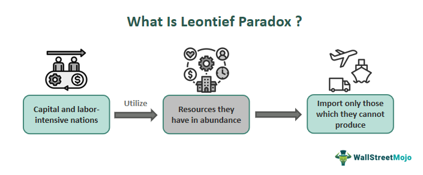

## Table of Contents

## Who was Wassily Leontief?

Wassily Leontief was an economist born in Russia in 1906. He is famous for creating something called the input-output model. This model helps us understand how different parts of an economy work together. For example, it shows how industries depend on each other to produce goods and services. Leontief used this model to study the economy of the United States and other countries.

Leontief won the Nobel Prize in Economics in 1973 for his work on the input-output model. He taught at Harvard University and later at New York University. He was known for his belief that economics should be based on real data, not just theories. His work has been very important for understanding how economies function and for making economic policies.

## What is the Leontief Paradox?

The Leontief Paradox is a surprising finding that Wassily Leontief discovered when he used his input-output model to study the U.S. economy. In the 1950s, people believed that countries with a lot of capital, like the United States, would export goods that needed a lot of capital to make and import goods that needed a lot of labor. But when Leontief looked at the data, he found the opposite was true. The U.S. was exporting goods that needed more labor and importing goods that needed more capital. This was unexpected and became known as the Leontief Paradox.

This paradox challenged the Heckscher-Ohlin theory, which said that countries would export products made from their abundant resources. The U.S. had a lot of capital, so it should have been exporting capital-intensive goods. But Leontief's findings showed that the U.S. was actually using more labor to produce its exports. This led economists to rethink their theories about trade and how countries use their resources. The Leontief Paradox sparked a lot of new research and discussions in the field of international economics.

## What is the Input-Output Model and how did Leontief develop it?

The Input-Output Model is a way to understand how different parts of an economy work together. It shows how industries depend on each other by using numbers to track what each industry buys and sells. For example, if a car factory needs steel, the model shows how much steel the car factory buys from the steel industry. This helps us see the whole economy as a big system where every part affects the others.

Wassily Leontief developed the Input-Output Model in the 1930s. He wanted to find a better way to study the economy using real data, not just theories. Leontief collected a lot of information about what different industries in the U.S. were buying and selling. He then used this data to create a big table that showed all the connections between industries. This table helped him see how changes in one part of the economy could affect other parts. His work was groundbreaking and helped economists understand economies in a new way.

## How did Leontief's work contribute to economics?

Wassily Leontief's work changed how economists study economies. He made the Input-Output Model, which shows how different parts of an economy work together. This model uses real numbers to track what industries buy and sell from each other. It helps economists see the whole economy as one big system. Before Leontief, economists often used theories without much real data. Leontief's model made it possible to use real data to understand how economies work. This was a big step forward and helped economists make better predictions and policies.

Leontief also found something surprising called the Leontief Paradox. He used his model to study the U.S. economy and found that the U.S. was exporting goods that needed a lot of labor, not capital, which was the opposite of what people expected. This challenged the Heckscher-Ohlin theory, which said countries should export goods made from their most abundant resources. The U.S. had a lot of capital, so it should have been exporting capital-intensive goods. But Leontief's findings showed the opposite. This paradox made economists rethink their ideas about trade and how countries use their resources. It led to a lot of new research and helped improve economic theories.

## What were the key findings of Leontief's empirical studies that led to the paradox?

Wassily Leontief used his input-output model to study the U.S. economy in the 1950s. He wanted to see if the U.S. was exporting goods that needed a lot of capital, like machines, because the U.S. had a lot of capital. But when he looked at the data, he found something surprising. The U.S. was actually exporting goods that needed more labor, like farming products, and importing goods that needed more capital, like cars. This was the opposite of what people thought should happen.

This surprising finding became known as the Leontief Paradox. It challenged the Heckscher-Ohlin theory, which said that countries should export goods made from their most abundant resources. The U.S. had a lot of capital, so it should have been exporting capital-intensive goods. But Leontief's data showed that the U.S. was using more labor to produce its exports. This made economists rethink their ideas about trade and how countries use their resources.

## How does the Leontief Paradox challenge the Heckscher-Ohlin theory?

The Leontief Paradox challenges the Heckscher-Ohlin theory by showing that the U.S. was not behaving as the theory predicted. The Heckscher-Ohlin theory says that countries should export goods made from their most abundant resources. For the U.S., which had a lot of capital, this meant it should have been exporting goods that needed a lot of capital to make, like machines. But when Wassily Leontief looked at the real data, he found that the U.S. was actually exporting goods that needed more labor, like farming products. This was the opposite of what the theory said should happen.

This surprising finding made economists question the Heckscher-Ohlin theory. If a country with a lot of capital like the U.S. was exporting labor-intensive goods and importing capital-intensive goods, then the theory might not be right. The Leontief Paradox led to a lot of new research and discussions. Economists started to think about other factors that might affect trade, like technology and skills, not just the amount of capital or labor a country has.

## What are the possible explanations for the Leontief Paradox?

One possible explanation for the Leontief Paradox is that the U.S. had more skilled labor than people thought. Even though the U.S. had a lot of capital, it might have had even more skilled workers. These skilled workers could make goods that needed a lot of labor but were also high quality. So, the U.S. could export these labor-intensive goods and still make a lot of money from them.

Another explanation is that the U.S. had better technology. This technology could make it easier for the U.S. to produce goods that needed a lot of labor. With better machines and ways of working, the U.S. could make labor-intensive goods more efficiently than other countries. This would make it make sense for the U.S. to export these goods, even though it had a lot of capital.

A third explanation is that trade rules and costs might have played a role. Maybe it was cheaper for the U.S. to import capital-intensive goods from other countries. Or maybe other countries had rules that made it hard for the U.S. to sell its capital-intensive goods there. So, the U.S. ended up exporting more labor-intensive goods because it was easier and cheaper.

## How have economists responded to the Leontief Paradox over time?

Economists have been trying to understand the Leontief Paradox since it was discovered. They have come up with different ideas to explain why the U.S. was exporting labor-intensive goods instead of capital-intensive goods. Some economists think that the U.S. had more skilled workers than people thought. These skilled workers could make high-quality goods that needed a lot of labor. So, it made sense for the U.S. to export these goods. Other economists believe that the U.S. had better technology. This technology could help the U.S. make labor-intensive goods more efficiently than other countries. So, even though the U.S. had a lot of capital, it was better at making and exporting labor-intensive goods.

Over time, economists have also looked at other factors that might explain the paradox. Some think that trade rules and costs could have played a role. Maybe it was cheaper for the U.S. to import capital-intensive goods from other countries. Or maybe other countries had rules that made it hard for the U.S. to sell its capital-intensive goods there. So, the U.S. ended up exporting more labor-intensive goods because it was easier and cheaper. These different ideas have helped economists learn more about trade and how countries use their resources. The Leontief Paradox has led to a lot of new research and has changed how economists think about international trade.

## What are the implications of the Leontief Paradox for international trade policy?

The Leontief Paradox has big implications for international trade policy. It shows that countries might not always export what people think they should. For example, a country with a lot of capital might still export goods that need a lot of labor. This means that trade policies should not just focus on what resources a country has. They should also look at other things, like how skilled the workers are or what kind of technology the country uses. This can help countries make better trade deals and policies that fit their real strengths.

Because of the Leontief Paradox, countries might need to rethink their trade strategies. If a country finds out it is good at making labor-intensive goods, even if it has a lot of capital, it might want to focus on those goods. This could mean changing laws to help those industries grow or making trade deals that help sell those goods to other countries. The paradox also shows that trade is more complicated than just having a lot of one resource. So, trade policies need to be flexible and based on real data, not just theories.

## How has the Leontief Paradox influenced subsequent economic research and models?

The Leontief Paradox has had a big impact on economic research and models. It made economists question the Heckscher-Ohlin theory, which said countries should export goods made from their most abundant resources. When Leontief found that the U.S. was exporting labor-intensive goods instead of capital-intensive goods, it showed that the theory might not always be right. This led economists to look for other factors that could affect trade, like the skills of workers or the technology a country uses. They started to create new models that took these things into account, making their research more accurate and useful.

Because of the Leontief Paradox, economists have been doing a lot of new research to understand trade better. They have been studying how different countries use their resources and how trade rules and costs can change what countries export and import. This has helped them make better models that can predict trade patterns more accurately. The paradox has also encouraged economists to use more real data in their work, just like Leontief did. This has made economic research more reliable and has helped countries make better trade policies.

## What are the criticisms and limitations of the Leontief Paradox?

Some people have criticized the Leontief Paradox because they think the data Leontief used might not have been perfect. They say that the numbers he used to measure how much capital and labor were used to make goods might not have been very accurate. This could mean that his findings were not completely right. Also, some critics think that Leontief did not look at all the factors that could affect trade. For example, he did not consider how skilled the workers were or how good the technology was in different countries. These things can change what goods a country decides to export or import.

Another limitation of the Leontief Paradox is that it only looked at the U.S. economy. This means it might not tell us much about other countries. Different countries have different resources and ways of doing things, so what was true for the U.S. might not be true for other places. Also, the paradox was based on data from the 1950s, and things have changed a lot since then. Today, trade is more complicated, and there are more factors to think about. So, while the Leontief Paradox was important, it might not explain everything about trade today.

## How can the Leontief Paradox be tested and validated in modern economic contexts?

To test and validate the Leontief Paradox in modern economic contexts, economists can use updated data and new methods. They can collect information about what different countries are exporting and importing today. This data should include details about how much capital and labor are used to make these goods, as well as information about the skills of workers and the technology used. By using this data, economists can see if the Leontief Paradox still holds true. They can also use computer models to simulate how changes in trade rules or costs might affect what countries export and import. This can help them understand if the paradox is still relevant or if other factors are now more important.

Another way to test the Leontief Paradox is to look at different countries and industries. The original study focused on the U.S., but today's global economy is much more connected. Economists can study other countries to see if they also export goods that use more labor than expected. They can also look at specific industries to see if the paradox applies to them. By doing this, economists can get a better picture of how trade works around the world. This can help them see if the Leontief Paradox is a general rule or if it only applies in certain situations.

## References & Further Reading

[1]: Leontief, W. (1953). ["Domestic Production and Foreign Trade: The American Capital Position Re-Examined."](https://www.jstor.org/stable/3149288) Proceedings of the American Philosophical Society, 97(4), 332-349.

[2]: Krugman, P., & Obstfeld, M. (2006). ["International Economics: Theory and Policy,"](https://www.pearson.com/se/Nordics-Higher-Education/subject-catalogue/economics/International-Economics-Theory-and-Policy-Krugman.html) 8th Edition. Pearson Addison Wesley.

[3]: Feenstra, R. C. (2004). ["Advanced International Trade: Theory and Evidence."](https://books.google.com/books/about/Advanced_International_Trade.html?id=gmqYDwAAQBAJ) Princeton University Press.

[4]: Jones, R. W. (1965). ["The Structure of Simple General Equilibrium Models."](https://www.jstor.org/stable/1829883) Journal of Political Economy, 73(6), 557-572.

[5]: Samuelson, P. A. (1966). ["Theoretical Issues of Trade Reciprocity."](https://en.wikipedia.org/wiki/Paul_Samuelson) American Economic Review, 56(2), 95-105.

[6]: Malkiel, B. G. (1973). ["A Random Walk Down Wall Street: The Time-tested Strategy for Successful Investing."](https://yourknowledgedigest.org/wp-content/uploads/2020/04/a-random-walk-down-wall-street.pdf) W. W. Norton & Company.

[7]: Hull, J. C. (2017). ["Options, Futures, and Other Derivatives,"](https://www.semanticscholar.org/paper/Options%2C-Futures%2C-and-Other-Derivatives-Hull/89bdee500c8623864fc9eb7a471546aa713acc44) 9th Edition. Pearson.