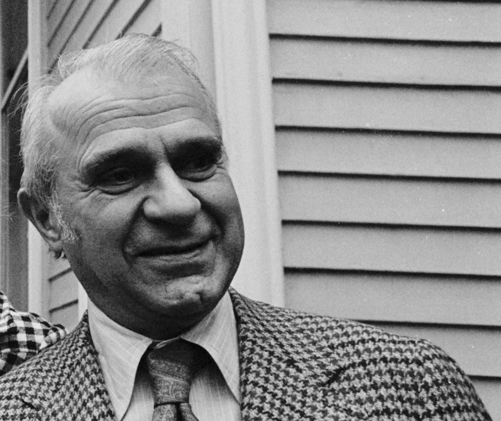

Wassily Leontief, a renowned economist whose theoretical advancements continue to influence economic discourse, was awarded the Nobel Prize in Economics in 1973. His contributions significantly impacted the field, particularly his development of the Leontief Paradox, which fundamentally challenged existing theories of international trade. Traditionally, the Heckscher-Ohlin Theorem suggested that countries would export goods requiring factors of production that were abundantly available locally. However, Leontief's analysis contradicted this expectation by demonstrating that the United States, a capital-abundant nation, exported labor-intensive goods while importing capital-intensive ones.

This article examines the Leontief Paradox within its broader theoretical context and discusses its relevance to today's economic landscape, particularly in algorithmic trading. As technology has evolved, the integration of algorithmic trading has transformed the financial sector, underscoring the importance of understanding foundational economic theories and paradoxes. Algorithmic trading—reliant on complex computer algorithms for trading decisions—demands a robust grasp of economic principles to model and predict market behaviors effectively.

Given these developments, comprehending theories like the Leontief Paradox is not merely an academic exercise but a practical necessity. Traders and policymakers must be equipped to navigate these complex dynamics, making it imperative to appreciate how historical economic insights apply to modern markets. This introduction sets the stage for a comprehensive exploration of these themes, highlighting how Leontief’s foundational work continues to shape economic thought and practice in a rapidly evolving financial environment.

## Table of Contents

## Who Was Wassily Leontief?

Wassily Leontief was a pioneering Russian-American economist renowned for his development of input-output analysis—a method that revolutionized the way economists study interdependencies between different sectors of an economy. This analytical tool enabled a detailed understanding of how changes in one sector could affect others and laid the groundwork for modern macroeconomic analysis. Input-output analysis employs complex matrices to describe the relationships between industries, providing a quantitative framework that can be applied to various economic models.

Leontief's contributions to economic science were formally recognized in 1973 when he was awarded the Nobel Prize in Economic Sciences. His work fundamentally altered the empirical study of economics by introducing a systematic approach to quantifying economic activities and interactions, thereby bridging the gap between theory and practical application. This method allowed economists to derive detailed sectoral data, which has become indispensable for national economic planning and policy-making.

Leontief's career as an academic was marked by influential teaching stints at two of the United States' preeminent institutions: Harvard University and New York University. During this time, he mentored numerous students who would go on to become leading figures in the field of economics, further extending the impact of his ideas. His focus on empirical evidence and quantitative analysis encouraged a generation of economists to adopt a more scientific approach to economic research, fostering a greater understanding of complex economic dynamics.

His work continues to influence contemporary economic analysis, underscoring the importance of empirical data in understanding and managing economic systems. By aligning theoretical insights with practical data, Leontief's legacy endures as a cornerstone of economic science, emphasizing the critical role of methodological rigor and interdisciplinary perspectives in advancing economic knowledge.

## Understanding the Leontief Paradox

The Leontief Paradox emerged from a groundbreaking study conducted by Wassily Leontief in the 1950s. Through his innovative input-output analysis, Leontief examined the structure of the U.S. economy, particularly focusing on its international trade patterns. The paradoxical findings revealed that the United States, an economy abundant in capital relative to labor, was exporting labor-intensive goods and importing capital-intensive goods. This observation was contrary to the Heckscher-Ohlin Theorem, a cornerstone of international trade theory, which posited that countries would specialize in exporting goods that intensively use their abundant production factors. For the United States, this would theoretically mean exporting capital-intensive goods.

Leontief's analysis involved assessing the [factor](/wiki/factor-investing) intensity of U.S. trade, calculating the capital-to-labor ratio for both exports and imports. The results showed a ratio of 13.99 for U.S. exports and 18.48 for imports; indicating that exports were less capital-intensive than imports. This anomaly, termed the Leontief Paradox, challenged the conventional wisdom of the time and led to widespread discussions among economists. 

The Paradox sparked numerous hypotheses aimed at reconciling its findings with existing trade theories. One major line of reasoning considered the role of human capital, proposing that the U.S.'s advantage lay not in sheer physical capital but in a workforce with higher educational attainment and skills. Thus, U.S. labor, although labeled as 'labor-intensive,' was not indicative of low skill but rather of a high level of human capital, a dimension not adequately captured in the original Heckscher-Ohlin framework.

Further research explored concepts such as technological advancements, productivity differences, and the presence of tariffs and trade barriers, which might account for the observed trade patterns. The paradox thus exemplified the complexity of global trade, suggesting that multiple factors, beyond just capital and labor endowments, influence a country's trade dynamics. This complexity has continued to inspire economists to refine trade models and incorporate broader aspects like technological edge and human capital, ensuring a more comprehensive understanding of global economic interactions.

## The Leontief Paradox in Modern Economic Theory

The Leontief Paradox, originating from Wassily Leontief's analysis of U.S. trade patterns, continues to hold significance in modern economic theory. This paradox challenges the conventional expectations set by the Heckscher-Ohlin Theorem, which predicts that countries will export goods that intensively use their abundant production factors, such as capital or labor. However, Leontief's findings that the U.S., a capital-abundant country, exported more labor-intensive goods suggest that economic analysis requires consideration of factors beyond simple endowments.

In contemporary economic theory, the Leontief Paradox underscores the necessity of including multiple dimensions, such as technological advancement and variations in labor skills, when analyzing trade patterns. Technological factors can alter the production capabilities of a country, thus affecting its export profiles in ways that traditional factor endowment theories might not predict. For instance, innovations in technology can make certain labor-intensive processes more efficient, reclassifying them as capital-intensive.

Moreover, international trade complexities are further compounded by the mobility of capital and labor, changes in consumer preferences, and geopolitical shifts. These factors necessitate a nuanced understanding that extends beyond static models. Policymakers and economists must therefore appreciate these complexities to formulate effective trade policies and economic forecasts. 

Addressing and exploring such paradoxes can enhance theoretical frameworks by integrating elements of economic geography, institutional dynamics, and human capital considerations. This enriched perspective is crucial for developing a comprehensive understanding of global economic dynamics, offering insights into the adaptability and resilience of economies facing globalization challenges. Consequently, examining the Leontief Paradox in modern economic contexts not only provides a platform for theoretical advancement but also aids in devising strategies that align with the multifaceted nature of international trade and economic interaction.

## Algorithmic Trading and Economic Theories

Algorithmic trading represents a shift in how financial markets operate, integrating sophisticated computer algorithms to automate trading decisions. This approach requires a comprehensive understanding of economic principles as these algorithms are designed to mimic and predict market behavior based on historical and real-time data. Economic theories provide the crucial framework for modeling these market behaviors, making them indispensable to algorithmic traders.

Integrating these theories into [algorithmic trading](/wiki/algorithmic-trading) involves using them to develop models that can predict market movements. An essential insight from economic theory is understanding paradoxes like the Leontief Paradox. This awareness is critical as it highlights the discrepancies that can occur in expected trade patterns, emphasizing the necessity of developing algorithms that can account for unexpected shifts and anomalies in the market. For instance, if an algorithm is modeled under the assumption of the Heckscher-Ohlin framework, which the Leontief Paradox challenges, it might neglect essential variables like human capital and technological advancements, leading to suboptimal trading strategies.

Algorithmic traders harness economic data, including input-output analysis, to enhance market strategies. Input-output analysis, a method developed by Wassily Leontief, is used to understand how different sectors of an economy interact with each other. By incorporating this analytical approach, algorithmic trading can optimize strategies based on how certain economic sectors influence market prices. This is particularly relevant in sectors with high interdependencies, where changes in one sector can lead to significant ripple effects across others.

The convergence of economic theory and algorithmic trading technology has revolutionized the trading landscape. This intersection allows for the application of well-established economic insights to be transformed into actionable trading algorithms. Algorithmic traders can implement strategies that are informed by past economic theories, allowing them to anticipate market shifts with greater accuracy and implement trades with precision. The ability to efficiently process and analyze vast quantities of data in milliseconds offers a competitive edge, aligning well with high-frequency trading demands.

In conclusion, algorithmic trading's success is intrinsically linked to the rigorous application of economic theories. Understanding these theories allows traders to develop algorithms capable of navigating complex and volatile markets, ensuring that past insights continue to resonate in contemporary trading strategies.

## Conclusion

The Leontief Paradox prompts ongoing re-evaluation of international trade and market dynamics. The paradoxical findings of Wassily Leontief challenge traditional economic theories by demonstrating that real-world trade patterns may not always align with theoretical predictions. In particular, the Leontief Paradox underscores the limitations of the Heckscher-Ohlin Theorem, which suggests that countries will export goods that intensively use their abundant factors of production. Instead, the paradox highlights that factors such as technology, human capital, and policy interventions can play significant roles in shaping trade patterns.

In the context of algorithmic trading, the implications of the Leontief Paradox extend beyond theoretical considerations to practical applications. Algorithmic trading relies heavily on the integration of complex economic insights and data analysis to anticipate market movements. Understanding anomalies and paradoxes in economic theories, such as those presented by Leontief, helps traders develop algorithms that are robust to unexpected shifts in market dynamics. By integrating these insights, traders and policymakers can optimize strategies, making informed decisions that account for both expected and unexpected market behaviors.

Leontief's work remains a crucial reference point for those studying the intersection of economics and technology. His empirical approach to economics laid the groundwork for advancing quantitative methods within the discipline. For contemporary economists and traders, comprehending the intricacies of such theories is vital in navigating today's complex financial landscape. This understanding allows for a more nuanced approach to addressing global economic challenges, reinforcing the importance of adapting traditional economic models to account for evolving market conditions.

## References & Further Reading

[1]: Leontief, W. (1953). ["Domestic Production and Foreign Trade: The American Capital Position Re-Examined."](https://www.jstor.org/stable/3149288) Proceedings of the American Philosophical Society, 97(4), 332-349.

[2]: Krugman, P., & Obstfeld, M. (2006). ["International Economics: Theory and Policy,"](https://www.pearson.com/se/Nordics-Higher-Education/subject-catalogue/economics/International-Economics-Theory-and-Policy-Krugman.html) 8th Edition. Pearson Addison Wesley.

[3]: Feenstra, R. C. (2004). ["Advanced International Trade: Theory and Evidence."](https://books.google.com/books/about/Advanced_International_Trade.html?id=gmqYDwAAQBAJ) Princeton University Press.

[4]: Jones, R. W. (1965). ["The Structure of Simple General Equilibrium Models."](https://www.jstor.org/stable/1829883) Journal of Political Economy, 73(6), 557-572.

[5]: Samuelson, P. A. (1966). ["Theoretical Issues of Trade Reciprocity."](https://en.wikipedia.org/wiki/Paul_Samuelson) American Economic Review, 56(2), 95-105.

[6]: Malkiel, B. G. (1973). ["A Random Walk Down Wall Street: The Time-tested Strategy for Successful Investing."](https://yourknowledgedigest.org/wp-content/uploads/2020/04/a-random-walk-down-wall-street.pdf) W. W. Norton & Company.

[7]: Hull, J. C. (2017). ["Options, Futures, and Other Derivatives,"](https://www.semanticscholar.org/paper/Options%2C-Futures%2C-and-Other-Derivatives-Hull/89bdee500c8623864fc9eb7a471546aa713acc44) 9th Edition. Pearson.