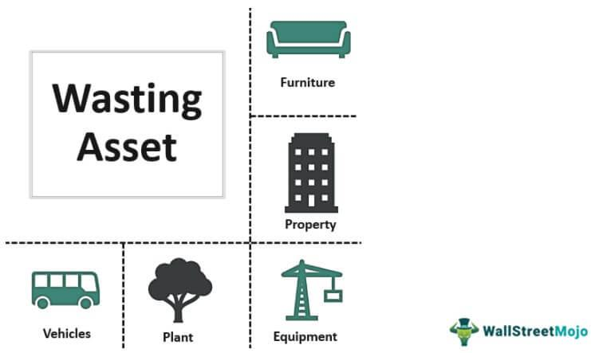

Understanding key terminology in finance is essential for making informed decisions. Investors and financial professionals often encounter terms such as wasting asset, depreciating asset, and algo trading, which are integral to discussions about investments and asset management. This article is designed to demystify these concepts and examine their implications within the financial sector.

Wasting assets are items or investments that reduce in value over time, often becoming obsolete or depleted. This is a crucial consideration for investors, as managing such assets requires strategic planning to maximize returns before their value declines. On the other hand, depreciating assets lose value due to wear and tear over their useful lives, a concept embedded in accounting practices to spread out an asset's cost. Understanding depreciation helps in calculating net income and assessing tax liabilities, ultimately impacting the financial health of a business.



Algorithmic trading, or algo trading, represents a technological evolution in trading processes, leveraging algorithms to automate decision-making and execution in the financial markets. This innovation facilitates faster, more accurate transactions and is harnessed by hedge funds and institutional investors to process vast amounts of data efficiently.

By the end of this article, readers will have a clearer understanding of how these terms influence investment strategies and portfolio management. The interplay between traditional financial concepts and modern technology is reshaping the investment landscape, emphasizing the need for both foundational knowledge and technological acumen. Let's explore these terms further to grasp their meanings and significance in today's dynamic financial environment.

## Table of Contents

## Understanding Wasting Assets

Wasting assets are items or investments that inherently decrease in value as they are utilized or become obsolete. These assets often include natural resources such as oil and gas, as well as tangible assets like vehicles. Unlike other forms of investments whose value may appreciate over time, wasting assets face inevitable reduction in value. This depreciation stems from the consumption of the asset's value through use, extraction, or technological obsolescence.

Effective management and strategic planning are crucial when dealing with wasting assets to maximize their returns before their value diminishes significantly. For example, oil reserves can only be extracted once, and their value decreases as extraction occurs. Similarly, vehicles lose value due to wear and tear as they are used over time.

Investors need to be proactive in accounting for this decline in value within their financial planning to mitigate risks. They often employ techniques such as depreciation schedules or salvage value assessments to estimate the future worth of these assets. These methods help in aligning investment strategies with the expected lifespan and utility of the assets.

Understanding the various factors that contribute to the depreciation of wasting assets can be pivotal. Technological advancements may render certain assets obsolete faster, while regulatory changes can impact resource extraction industries. Recognizing these influences allows investors to make more informed decisions.

For example, in managing an investment in a fleet of delivery vehicles, the investor must consider maintenance costs, the rate of depreciation, and eventual replacement needs. This requires a comprehensive analysis that can include mathematical modeling of depreciation curves or using software tools to project asset value over time. In Python, one might use NumPy or Pandas to analyze depreciation:

```python
import numpy as np
years = np.arange(0, 10)
initial_value = 30000
depreciation_rate = 0.15
values = initial_value * (1 - depreciation_rate) ** years
```

This script demonstrates a simple linear depreciation model where a vehicle worth $30,000 depreciates at a rate of 15% per year.

Ultimately, by recognizing and effectively managing wasting assets, investors can better prepare for their future financial health and stability within investment portfolios.

## Exploring Depreciating Assets

Depreciating assets are a fundamental concept in financial and managerial accounting, which deals with the systematic allocation of the cost of a tangible asset over its useful life. The depreciation of an asset is primarily due to wear and tear, obsolescence, or the passage of time, and it has significant implications for financial reporting and tax calculations.

When businesses acquire assets like machinery, vehicles, or buildings, these assets typically provide utility beyond the year of their acquisition. Instead of expensing the entire cost upfront, depreciation allows businesses to spread out the expense over the asset's useful life. This allocation aligns the cost of the asset with the revenues generated from its use, following the matching principle in accounting.

**Methods of Depreciation**

Several methods exist to calculate depreciation, each with its own application and financial implications. The most common methods include:

1. **Straight-Line Depreciation:** This method is the simplest and most widely used, where the asset's cost is evenly distributed over its useful life.
$$
   \text{Annual Depreciation Expense} = \frac{\text{Cost of the Asset} - \text{Residual Value}}{\text{Useful Life of the Asset}}

$$

2. **Declining Balance Method:** An accelerated depreciation method that writes off a larger portion of the asset’s cost in the early years of its useful life. A common variant is the Double Declining Balance Method.
$$
   \text{Depreciation Expense} = \text{Book Value at Beginning of Year} \times \frac{2}{\text{Useful Life}}

$$

3. **Units of Production Method:** This method ties the expense to the actual usage of the asset, making it suitable for machinery that wears out not only with time but with use.
$$
   \text{Depreciation Expense} = \left(\frac{\text{Cost} - \text{Residual Value}}{\text{Total Estimated Production}}\right) \times \text{Units Produced}

$$

**Implications for Businesses**

Depreciation affects a company's financial statements, reducing the book value of assets on the balance sheet and impacting net income through depreciation expense on the income statement. Furthermore, the choice of depreciation method can influence tax liabilities due to varying deductions allowed in different accounting periods. For instance, accelerated depreciation methods offer higher initial deductions, providing tax benefits by reducing taxable income in the early years of asset life.

**Strategic Management of Depreciating Assets**

Efficiently managing depreciating assets not only ensures accurate financial reporting but can also aid in achieving tax efficiency. Businesses can leverage depreciation to maintain optimal levels of capital expenditure, ensuring that assets are maintained, replaced, or upgraded as needed. This strategic approach contributes to sustaining operational efficiency and financial health, aligning asset management with broader business objectives.

Understanding and managing depreciating assets are essential for businesses to ensure accurate financial portrayal and capitalize on any fiscal advantages, ultimately aiding in achieving sustainable long-term growth.

## The Rise of Algo Trading

Algo trading, or [algorithmic trading](/wiki/algorithmic-trading), refers to the use of predefined instructions, typically in the form of algorithms, to execute trading orders. These algorithms can make trading decisions based on various inputs and conditions, ranging from timing and pricing to trading [volume](/wiki/volume-trading-strategy). By leveraging computer algorithms, algo trading enhances the speed and precision of trade execution, an essential [factor](/wiki/factor-investing) in the fast-paced world of financial markets.

One of the key advantages of algo trading is its ability to handle large volumes of data at remarkable speeds. This feature is particularly beneficial for hedge funds and institutional investors who engage in high-frequency trading ([HFT](/wiki/high-frequency-trading-strategies)), where milliseconds can be the difference between profit and loss. Algorithms can rapidly analyze vast datasets, identifying patterns and trends that might not be visible to human traders, and act accordingly by placing trades at optimal times.

The impact of algo trading extends beyond speed and volume. It minimizes human errors and ensures that trades are executed at the best possible prices, adhering strictly to the defined rules without hesitation or emotional interference. For example, algorithms can react to market conditions during volatile periods more efficiently than a human, capitalizing on opportunities that arise from rapid fluctuations.

In the modern finance sector, the role of technology, epitomized by algo trading, is increasingly significant. The continuous development of more sophisticated algorithms and [machine learning](/wiki/machine-learning) models enhances the ability of investors to predict market movements and optimize their strategies. This has made algo trading an integral part of financial markets, changing how trades are executed globally.

Moreover, the growth of algo trading has sparked interest in regulatory frameworks to ensure that these automated systems do not disrupt markets when unexpected events occur. The reliance on algorithms in trading operations necessitates robust risk management systems to prevent market manipulation or flash crashes.

In conclusion, the rise of algo trading is a testament to the profound impact technological advancements have on finance. Its ability to facilitate complex trading strategies with speed and accuracy makes it a vital component for modern investors seeking to optimize their performance within increasingly competitive markets. As technology continues to advance, the importance of balancing innovation with regulation will be crucial in ensuring that algo trading supports healthy and transparent financial systems.

## Interconnections and Implications

Understanding the nuances of wasting and depreciating assets is crucial for optimizing portfolio and investment strategies. These assets, each with their unique characteristics, can significantly impact financial outcomes if managed adeptly. Integrating algorithmic trading, or algo trading, with the principles of these asset categories offers a data-driven approach to enhance management and forecast performance accurately.

Algo trading employs advanced algorithms to analyze vast datasets, identifying trends and making rapid decisions with precision unattainable through manual processes. By utilising algorithms, investors can develop models to predict the depreciation rate of certain assets or assess the timeline for a wasting asset's value reduction. For instance, algorithms can run regression models to estimate depreciation over time:

```python
import numpy as np
from sklearn.linear_model import LinearRegression

# Sample data: years of usage vs. asset value
years = np.array([1, 2, 3, 4, 5]).reshape(-1, 1)
values = np.array([100, 80, 65, 50, 30])

# Creating a linear regression model
model = LinearRegression()
model.fit(years, values)

# Predicting future value
predicted_value = model.predict(np.array([[6]]))
print(predicted_value)
```

This predictive capability ensures that investments in depreciating and wasting assets are more strategically allocated, optimizing the balance between risk and reward. Algorithmic insights allow investors to dynamically adjust their portfolios, minimizing exposure to assets nearing obsolescence or significant loss in value.

To remain competitive within an evolving financial landscape, investors and financial analysts must adeptly navigate these complex terms. Using technology, they can simulate various asset performance scenarios under different market conditions, providing a robust framework for decision-making.

The integration of technology with traditional asset management concepts is critical in future-proofing financial strategies. Advanced algorithms can incorporate variables such as market [volatility](/wiki/volatility-trading-strategies), [interest rate](/wiki/interest-rate-trading-strategies) changes, and economic indicators, offering comprehensive insights into potential asset performance. This fusion of algorithmic tools with foundational financial principles positions investors to harness both efficiency and innovation.

In conclusion, leveraging the capabilities of algo trading alongside a profound understanding of wasting and depreciating assets can yield substantial financial advantages. This strategic integration fosters resilience and adaptability, ensuring continued success in an ever-transforming market.

## Conclusion

The intersection of traditional financial concepts and modern technology is reshaping the investment landscape. In today's financial markets, the understanding and management of wasting and depreciating assets, complemented by the strategic deployment of algorithmic trading, are integral to navigating complex investment scenarios. These elements are not just isolated concepts but interrelated components that collectively influence investment strategies and outcomes.

Wasting and depreciating assets pose challenges due to their inherent reduction in value over time. However, when these assets are effectively managed, they can contribute significantly to a diversified investment portfolio. By acknowledging the concept of depreciation, investors can better forecast cash flows and allocate resources efficiently, ultimately strengthening their financial standing.

Algo trading, on the other hand, introduces a technological edge, allowing investors to automate trading strategies and capitalize on market inefficiencies. This method leverages large-scale data processing to identify trends and execute trades with precision and speed, enhancing the potential for substantial returns. The rise of such technology underscores the necessity for investors to continuously integrate technological advancements to maintain competitive superiority.

As technology progresses, staying informed about these financial concepts remains vital. A well-rounded investment approach that harmoniously combines traditional asset management principles with modern algorithmic techniques is indispensable. Harnessing the power of both realms ensures resilience and adaptability, laying the groundwork for achieving long-term financial goals in an ever-evolving market environment.

## References & Further Reading

[1]: Bergstra, J., Bardenet, R., Bengio, Y., & Kégl, B. (2011). ["Algorithms for Hyper-Parameter Optimization."](https://dl.acm.org/doi/10.5555/2986459.2986743) Advances in Neural Information Processing Systems 24.

[2]: ["Advances in Financial Machine Learning"](https://www.amazon.com/Advances-Financial-Machine-Learning-Marcos/dp/1119482089) by Marcos Lopez de Prado

[3]: ["Evidence-Based Technical Analysis: Applying the Scientific Method and Statistical Inference to Trading Signals"](https://www.amazon.com/Evidence-Based-Technical-Analysis-Scientific-Statistical/dp/0470008741) by David Aronson

[4]: ["Machine Learning for Algorithmic Trading"](https://github.com/stefan-jansen/machine-learning-for-trading) by Stefan Jansen

[5]: ["Quantitative Trading: How to Build Your Own Algorithmic Trading Business"](https://www.amazon.com/Quantitative-Trading-Build-Algorithmic-Business/dp/1119800064) by Ernest P. Chan